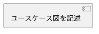
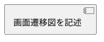
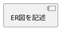

# 外部仕様書テンプレート

## 📋 ドキュメント情報

| 項目 | 内容 |
|------|------|
| 文書名 | [機能名] 外部仕様書 |
| バージョン | 1.0.0 |
| 作成日 | YYYY-MM-DD |
| 作成者 | [作成者名] |
| 承認者 | [承認者名] |
| 最終更新日 | YYYY-MM-DD |

---

## 1. 概要

### 1.1 目的
この文書は、[機能名]の外部仕様を定義します。紙ベースのプロセスをWeb化するにあたり、現状の紙ベースのプロセスと新規Web版の機能を比較しながら仕様を明確化します。

### 1.2 対象読者
- プロダクトマネージャー
- 開発者
- デザイナー
- QA担当者
- ステークホルダー

### 1.3 用語定義

| 用語 | 定義 |
|------|------|
| [用語1] | [定義] |
| [用語2] | [定義] |

---

## 2. 現状分析（紙ベース）

### 2.1 現状のプロセス概要

#### 2.1.1 使用ツール
- **テキスト**: [テキストの種類・用途]
- **ワークシート**: [ワークシートの種類・用途]
- **チェックリスト**: [チェックリストの種類・用途]

#### 2.1.2 プロセスフロー
```
[紙ベースのプロセスフローを記述]
例：
1. クライアントがテキストを読む
2. ワークシートに記入
3. 毎日チェックリストを確認・記入
4. セッションで振り返り
```

### 2.2 現状の各ツールの詳細

#### 2.2.1 テキスト（紙レベル）

| 項目 | 内容 |
|------|------|
| **名称** | [テキストの名称] |
| **目的** | [テキストの目的] |
| **内容** | [テキストの内容概要] |
| **使用タイミング** | [いつ使用するか] |
| **対象者** | [誰が使用するか] |
| **形式** | [A4、冊子など] |
| **ページ数** | [ページ数] |
| **特徴** | [紙ベースならではの特徴] |

**内容の詳細**:
- [セクション1]: [内容]
- [セクション2]: [内容]
- [セクション3]: [内容]

**課題・改善点**:
- [課題1]: [説明]
- [課題2]: [説明]

#### 2.2.2 ワークシート（フォームへの記入）

| 項目 | 内容 |
|------|------|
| **名称** | [ワークシートの名称] |
| **目的** | [ワークシートの目的] |
| **記入項目** | [記入する項目一覧] |
| **使用タイミング** | [いつ使用するか] |
| **対象者** | [誰が使用するか] |
| **形式** | [A4、PDFなど] |
| **記入時間の目安** | [所要時間] |
| **特徴** | [紙ベースならではの特徴] |

**記入項目の詳細**:

| No. | 項目名 | 項目タイプ | 必須/任意 | 説明 | 例 |
|-----|--------|-----------|----------|------|-----|
| 1 | [項目1] | [テキスト/選択/数値など] | [必須/任意] | [説明] | [例] |
| 2 | [項目2] | [テキスト/選択/数値など] | [必須/任意] | [説明] | [例] |
| 3 | [項目3] | [テキスト/選択/数値など] | [必須/任意] | [説明] | [例] |

**記入フロー**:
1. [ステップ1]
2. [ステップ2]
3. [ステップ3]

**課題・改善点**:
- [課題1]: [説明]
- [課題2]: [説明]

#### 2.2.3 毎日のチェックリスト

| 項目 | 内容 |
|------|------|
| **名称** | [チェックリストの名称] |
| **目的** | [チェックリストの目的] |
| **チェック項目** | [チェックする項目一覧] |
| **使用頻度** | [毎日/週1回など] |
| **対象者** | [誰が使用するか] |
| **形式** | [A4、カードなど] |
| **所要時間** | [1日あたりの所要時間] |
| **特徴** | [紙ベースならではの特徴] |

**チェック項目の詳細**:

| No. | 項目名 | チェック方法 | 必須/任意 | 説明 |
|-----|--------|-------------|----------|------|
| 1 | [項目1] | [チェックボックス/数値入力など] | [必須/任意] | [説明] |
| 2 | [項目2] | [チェックボックス/数値入力など] | [必須/任意] | [説明] |
| 3 | [項目3] | [チェックボックス/数値入力など] | [必須/任意] | [説明] |

**チェックフロー**:
1. [ステップ1]
2. [ステップ2]
3. [ステップ3]

**課題・改善点**:
- [課題1]: [説明]
- [課題2]: [説明]

### 2.3 現状のプロセスの課題まとめ

| 課題カテゴリ | 課題 | 影響度 | 優先度 |
|------------|------|--------|--------|
| [カテゴリ1] | [課題] | [高/中/低] | [高/中/低] |
| [カテゴリ2] | [課題] | [高/中/低] | [高/中/低] |

---

## 3. Web化の要件定義

### 3.1 Web化の目的

- [目的1]
- [目的2]
- [目的3]

### 3.2 機能要件

#### 3.2.1 必須機能（Must Have）

| 機能ID | 機能名 | 説明 | 優先度 | 現状との対応 |
|--------|--------|------|--------|------------|
| F-001 | [機能名] | [説明] | 高 | [紙ベースのどの部分に対応] |
| F-002 | [機能名] | [説明] | 高 | [紙ベースのどの部分に対応] |

#### 3.2.2 推奨機能（Should Have）

| 機能ID | 機能名 | 説明 | 優先度 | 現状との対応 |
|--------|--------|------|--------|------------|
| F-101 | [機能名] | [説明] | 中 | [紙ベースのどの部分に対応] |

#### 3.2.3 将来機能（Could Have）

| 機能ID | 機能名 | 説明 | 優先度 | 現状との対応 |
|--------|--------|------|--------|------------|
| F-201 | [機能名] | [説明] | 低 | [紙ベースのどの部分に対応] |

### 3.3 非機能要件

| 要件カテゴリ | 要件 | 目標値 | 測定方法 |
|------------|------|--------|----------|
| パフォーマンス | [要件] | [目標値] | [測定方法] |
| セキュリティ | [要件] | [目標値] | [測定方法] |
| 可用性 | [要件] | [目標値] | [測定方法] |
| ユーザビリティ | [要件] | [目標値] | [測定方法] |

---

## 4. 現状 vs Web版 比較表

### 4.1 テキスト機能の比較

| 項目 | 現状（紙ベース） | Web版 | 改善点 | 備考 |
|------|----------------|-------|--------|------|
| **表示方法** | 紙のテキスト | [Webでの表示方法] | [改善点] | [備考] |
| **読みやすさ** | [現状] | [Web版] | [改善点] | [備考] |
| **検索機能** | なし | [Web版の検索機能] | [改善点] | [備考] |
| **更新** | 再印刷が必要 | [Web版の更新方法] | [改善点] | [備考] |
| **アクセシビリティ** | [現状] | [Web版] | [改善点] | [備考] |

### 4.2 ワークシート機能の比較

| 項目 | 現状（紙ベース） | Web版 | 改善点 | 備考 |
|------|----------------|-------|--------|------|
| **記入方法** | 手書き | [Web版の記入方法] | [改善点] | [備考] |
| **保存** | 紙で保管 | [Web版の保存方法] | [改善点] | [備考] |
| **編集** | 修正が困難 | [Web版の編集方法] | [改善点] | [備考] |
| **バリデーション** | なし | [Web版のバリデーション] | [改善点] | [備考] |
| **自動計算** | 手計算 | [Web版の自動計算] | [改善点] | [備考] |
| **データ分析** | 手作業 | [Web版のデータ分析] | [改善点] | [備考] |

### 4.3 チェックリスト機能の比較

| 項目 | 現状（紙ベース） | Web版 | 改善点 | 備考 |
|------|----------------|-------|--------|------|
| **記録方法** | 手書きチェック | [Web版の記録方法] | [改善点] | [備考] |
| **履歴管理** | 紙で保管 | [Web版の履歴管理] | [改善点] | [備考] |
| **集計・分析** | 手作業 | [Web版の集計・分析] | [改善点] | [備考] |
| **リマインダー** | なし | [Web版のリマインダー] | [改善点] | [備考] |
| **可視化** | なし | [Web版の可視化] | [改善点] | [備考] |

---

## 5. 機能仕様（詳細）

### 5.1 テキスト機能のWeb化

#### 5.1.1 機能概要
[機能の概要を記述]

#### 5.1.2 画面設計

**画面名**: [画面名]

**画面レイアウト**:
```
[画面のレイアウトを説明]
例：
- ヘッダー: タイトル、ナビゲーション
- メインコンテンツ: テキスト表示エリア
- サイドバー: 目次、検索
- フッター: ページネーション
```

**画面遷移**:
```
[画面遷移図を記述]
例：
ホーム → テキスト一覧 → テキスト詳細 → セクション詳細
```

#### 5.1.3 機能詳細

| 機能 | 説明 | 入力 | 処理 | 出力 |
|------|------|------|------|------|
| [機能1] | [説明] | [入力] | [処理] | [出力] |
| [機能2] | [説明] | [入力] | [処理] | [出力] |

#### 5.1.4 データ項目

| 項目名 | データ型 | 必須 | 説明 | 制約 |
|--------|---------|------|------|------|
| [項目1] | [型] | [必須/任意] | [説明] | [制約] |
| [項目2] | [型] | [必須/任意] | [説明] | [制約] |

### 5.2 ワークシート機能のWeb化

#### 5.2.1 機能概要
[機能の概要を記述]

#### 5.2.2 画面設計

**画面名**: [画面名]

**画面レイアウト**:
```
[画面のレイアウトを説明]
```

**画面遷移**:
```
[画面遷移図を記述]
```

#### 5.2.3 フォーム項目定義

| No. | 項目名 | 項目タイプ | 必須 | バリデーション | 説明 | デフォルト値 |
|-----|--------|-----------|------|--------------|------|------------|
| 1 | [項目1] | [テキスト/選択/数値など] | [必須/任意] | [バリデーション] | [説明] | [デフォルト値] |
| 2 | [項目2] | [テキスト/選択/数値など] | [必須/任意] | [バリデーション] | [説明] | [デフォルト値] |

#### 5.2.4 機能詳細

| 機能 | 説明 | 入力 | 処理 | 出力 |
|------|------|------|------|------|
| [機能1] | [説明] | [入力] | [処理] | [出力] |
| [機能2] | [説明] | [入力] | [処理] | [出力] |

### 5.3 チェックリスト機能のWeb化

#### 5.3.1 機能概要
[機能の概要を記述]

#### 5.3.2 画面設計

**画面名**: [画面名]

**画面レイアウト**:
```
[画面のレイアウトを説明]
```

**画面遷移**:
```
[画面遷移図を記述]
```

#### 5.3.3 チェック項目定義

| No. | 項目名 | チェック方法 | 必須 | 説明 | デフォルト値 |
|-----|--------|-------------|------|------|------------|
| 1 | [項目1] | [チェックボックス/数値入力など] | [必須/任意] | [説明] | [デフォルト値] |
| 2 | [項目2] | [チェックボックス/数値入力など] | [必須/任意] | [説明] | [デフォルト値] |

#### 5.3.4 機能詳細

| 機能 | 説明 | 入力 | 処理 | 出力 |
|------|------|------|------|------|
| [機能1] | [説明] | [入力] | [処理] | [出力] |
| [機能2] | [説明] | [入力] | [処理] | [出力] |

---

## 6. ユーザーストーリー

### 6.1 テキスト機能のユーザーストーリー

| ID | ストーリー | 受け入れ基準 | 優先度 |
|----|-----------|------------|--------|
| US-001 | **As a** [ユーザー役割]<br>**I want to** [やりたいこと]<br>**So that** [目的] | - [基準1]<br>- [基準2] | 高 |
| US-002 | **As a** [ユーザー役割]<br>**I want to** [やりたいこと]<br>**So that** [目的] | - [基準1]<br>- [基準2] | 高 |

### 6.2 ワークシート機能のユーザーストーリー

| ID | ストーリー | 受け入れ基準 | 優先度 |
|----|-----------|------------|--------|
| US-101 | **As a** [ユーザー役割]<br>**I want to** [やりたいこと]<br>**So that** [目的] | - [基準1]<br>- [基準2] | 高 |
| US-102 | **As a** [ユーザー役割]<br>**I want to** [やりたいこと]<br>**So that** [目的] | - [基準1]<br>- [基準2] | 高 |

### 6.3 チェックリスト機能のユーザーストーリー

| ID | ストーリー | 受け入れ基準 | 優先度 |
|----|-----------|------------|--------|
| US-201 | **As a** [ユーザー役割]<br>**I want to** [やりたいこと]<br>**So that** [目的] | - [基準1]<br>- [基準2] | 高 |
| US-202 | **As a** [ユーザー役割]<br>**I want to** [やりたいこと]<br>**So that** [目的] | - [基準1]<br>- [基準2] | 高 |

---

## 7. ユースケース

### 7.1 ユースケース図


### 7.2 主要ユースケースの詳細

#### UC-001: [ユースケース名]

| 項目 | 内容 |
|------|------|
| **ユースケースID** | UC-001 |
| **ユースケース名** | [名称] |
| **アクター** | [アクター] |
| **前提条件** | [前提条件] |
| **基本フロー** | 1. [ステップ1]<br>2. [ステップ2]<br>3. [ステップ3] |
| **代替フロー** | 3a. [代替フロー] |
| **例外フロー** | 2a. [例外フロー] |
| **事後条件** | [事後条件] |

---

## 8. 画面遷移図



---

## 9. データモデル

### 9.1 エンティティ一覧

| エンティティ名 | 説明 |
|--------------|------|
| [エンティティ1] | [説明] |
| [エンティティ2] | [説明] |

### 9.2 ER図


---

## 10. 制約事項・前提条件

### 10.1 技術的制約
- [制約1]
- [制約2]

### 10.2 ビジネス制約
- [制約1]
- [制約2]

### 10.3 前提条件
- [前提条件1]
- [前提条件2]

---

## 11. 移行計画

### 11.1 段階的移行の計画

| フェーズ | 期間 | 内容 | 成果物 |
|---------|------|------|--------|
| フェーズ1 | [期間] | [内容] | [成果物] |
| フェーズ2 | [期間] | [内容] | [成果物] |
| フェーズ3 | [期間] | [内容] | [成果物] |

### 11.2 紙ベースからの移行方法

| 項目 | 移行方法 | 注意点 |
|------|---------|--------|
| [項目1] | [移行方法] | [注意点] |
| [項目2] | [移行方法] | [注意点] |

---

## 12. テスト計画

### 12.1 テスト項目

| テストID | テスト項目 | テスト内容 | 期待結果 | 優先度 |
|---------|-----------|-----------|---------|--------|
| T-001 | [テスト項目] | [テスト内容] | [期待結果] | 高 |
| T-002 | [テスト項目] | [テスト内容] | [期待結果] | 高 |

### 12.2 受け入れ基準

- [基準1]
- [基準2]
- [基準3]

---

## 13. 変更履歴

| バージョン | 日付 | 変更内容 | 変更者 |
|-----------|------|---------|--------|
| 1.0.0 | YYYY-MM-DD | 初版作成 | [作成者] |

---

## 14. 承認

| 役割 | 名前 | 承認日 | 署名 |
|------|------|--------|------|
| プロダクトマネージャー | [名前] | YYYY-MM-DD | |
| 開発リーダー | [名前] | YYYY-MM-DD | |
| ステークホルダー | [名前] | YYYY-MM-DD | |

