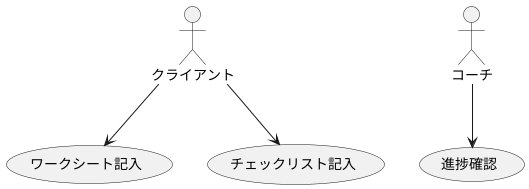

# 外部仕様書作成でのビジュアルエディター活用ガイド

外部仕様書作成の各フェーズで、どのビジュアルエディターをどのように使うかを具体的に説明します。

## 🎯 ツール選択の判断基準

### 用途別の推奨ツール

| 用途 | 推奨ツール | 理由 |
|------|-----------|------|
| **画面設計（ワイヤーフレーム）** | Figma / Balsamiq | 画面レイアウトの設計に最適 |
| **画面設計（モックアップ）** | Figma | 実際の見た目に近いデザイン |
| **プロセスフロー** | Draw.io / Miro | フローチャート作成に最適 |
| **画面遷移図** | Draw.io / Figma | 画面間の遷移を可視化 |
| **ユーザージャーニー** | Miro | ユーザー体験の可視化 |
| **現状分析の可視化** | Miro / Draw.io | ブレインストーミングに最適 |
| **ER図・データモデル** | Draw.io / PlantUML | データ構造の可視化 |

## 📋 外部仕様書の各セクションでの活用

### セクション2: 現状分析（紙ベース）

#### 2.1 プロセスフローの可視化

**使用ツール**: Draw.io または Miro

**作成手順**:
1. Draw.ioを開く
2. 「フローチャート」テンプレートを選択
3. 紙ベースのプロセスを図で表現

**例**:
```
[クライアント] 
  ↓
[テキストを読む]
  ↓
[ワークシートに記入]
  ↓
[毎日チェックリストを記入]
  ↓
[セッションで振り返り]
```

**コツ**:
- 各ステップを明確に分ける
- 所要時間を記載
- 課題がある箇所を色分け

#### 2.2 ツール間の関係図

**使用ツール**: Draw.io または Miro

**作成手順**:
1. 各ツールを図形で表現
2. 関係性を矢印で結ぶ
3. データの流れを表現

**例**:
```
[テキスト] → [ワークシート] → [チェックリスト]
     ↓              ↓                ↓
  [知識]        [記録]          [進捗]
```

### セクション4: 現状 vs Web版 比較表

#### 4.1 機能比較の可視化

**使用ツール**: Miro または Draw.io

**作成手順**:
1. 2列の表を作成（現状 / Web版）
2. 各機能を比較
3. 改善点を色分け

**例**:
```
┌─────────────┬─────────────┐
│  現状       │  Web版      │
├─────────────┼─────────────┤
│ 手書き      │ タイピング  │
│ 紙で保管    │ クラウド保存│
│ 修正困難    │ 簡単編集    │
└─────────────┴─────────────┘
```

### セクション5: 機能仕様（詳細）

#### 5.1 画面設計

**使用ツール**: Figma（推奨）または Balsamiq

**作成手順**:
1. Figmaで新しいファイルを作成
2. フレームを追加（画面サイズを選択）
3. ワイヤーフレームを作成
4. 必要に応じてモックアップに発展

**ワークシート画面の例**:
```
┌─────────────────────────────┐
│  ヘッダー: ワークシート名    │
├─────────────────────────────┤
│                             │
│  [項目1] [入力フィールド]   │
│  [項目2] [入力フィールド]   │
│  [項目3] [入力フィールド]   │
│                             │
│  [保存ボタン] [キャンセル]  │
└─────────────────────────────┘
```

**チェックリスト画面の例**:
```
┌─────────────────────────────┐
│  ヘッダー: 日付選択          │
├─────────────────────────────┤
│  ☐ 項目1                    │
│  ☐ 項目2                    │
│  ☑ 項目3                    │
│  ☐ 項目4                    │
│                             │
│  [保存] [リセット]          │
└─────────────────────────────┘
```

**コツ**:
- まずはワイヤーフレームで構造を決める
- 後からモックアップで見た目を整える
- 複数の画面を同じファイルで管理

#### 5.2 画面遷移図

**使用ツール**: Draw.io または Figma

**作成手順**:
1. 各画面を図形で表現
2. 遷移を矢印で結ぶ
3. 条件分岐を明確に

**例**:
```
[ホーム画面]
    ↓
[ワークシート一覧]
    ↓
[ワークシート入力]
    ↓
[保存確認]
    ↓
[完了画面]
```

**コツ**:
- 画面名を明確に
- 遷移条件を記載
- エラー時の遷移も記載

#### 5.3 データフロー図

**使用ツール**: Draw.io

**作成手順**:
1. データの流れを図で表現
2. 各処理を明確に
3. データの形式を記載

**例**:
```
[ユーザー入力] → [バリデーション] → [データ保存] → [Firestore]
```

### セクション6: ユーザーストーリー

#### 6.1 ユーザージャーニーマップ

**使用ツール**: Miro（推奨）

**作成手順**:
1. Miroのユーザージャーニーテンプレートを使用
2. 各ステップを記入
3. 感情の変化を可視化

**テンプレート構造**:
```
ステップ | 行動 | 思考 | 感情 | 課題 | 機会
---------|------|------|------|------|------
1.       |      |      |      |      |
2.       |      |      |      |      |
```

### セクション7: ユースケース

#### 7.1 ユースケース図

**使用ツール**: PlantUML（推奨）または Draw.io

**理由**: 既にPlantUMLを使用しているため、統一性を保つ

**作成手順**:
1. PlantUMLでユースケース図を作成
2. アクターとユースケースを定義
3. 関係性を表現

**例**:


## 🛠️ 実践的なワークフロー

### フェーズ1: 現状分析

**使用ツール**: Miro + Draw.io

**作業内容**:
1. **Miroでブレインストーミング**
   - 紙ベースのツールを付箋で整理
   - 課題を洗い出し
   - 関係性を可視化

2. **Draw.ioでプロセスフロー作成**
   - Miroで整理した内容を基に
   - プロセスフロー図を作成
   - 外部仕様書に貼り付け

### フェーズ2: 要件定義

**使用ツール**: Miro + Draw.io

**作業内容**:
1. **Miroで要件の整理**
   - 機能要件を付箋で整理
   - 優先順位を可視化
   - 関係性を明確化

2. **Draw.ioで比較図作成**
   - 現状 vs Web版の比較図
   - 改善点を可視化

### フェーズ3: 詳細設計

**使用ツール**: Figma + Draw.io

**作業内容**:
1. **Figmaで画面設計**
   - ワイヤーフレーム作成
   - モックアップ作成
   - プロトタイプ作成

2. **Draw.ioで画面遷移図**
   - Figmaの画面を基に
   - 画面遷移図を作成

## 📐 テンプレート例

### Figmaテンプレート

**ワークシート画面のワイヤーフレーム**:
```
要素:
- ヘッダー（タイトル、ナビゲーション）
- メインコンテンツ（フォーム項目）
- フッター（保存ボタン、キャンセルボタン）

レイアウト:
- 最大幅: 800px
- パディング: 24px
- グリッド: 12カラム
```

**チェックリスト画面のワイヤーフレーム**:
```
要素:
- ヘッダー（日付選択）
- メインコンテンツ（チェック項目リスト）
- フッター（保存ボタン）

レイアウト:
- 最大幅: 600px
- パディング: 16px
- グリッド: 8カラム
```

### Draw.ioテンプレート

**プロセスフローのテンプレート**:
```
開始 → 処理1 → 判断 → [Yes] → 処理2
                    ↓ [No]
                  終了
```

**画面遷移図のテンプレート**:
```
[画面A] → [画面B] → [画面C]
   ↓         ↓
[画面D]   [画面E]
```

## 💡 実践のコツ

### 1. 段階的に詳細化
- 最初は簡単なスケッチ
- 次にワイヤーフレーム
- 最後にモックアップ

### 2. フィードバックを反映
- ステークホルダーからのフィードバックを反映
- 繰り返し改善

### 3. バージョン管理
- 各バージョンを保存
- 変更履歴を記録

### 4. 再利用可能なコンポーネント
- よく使う要素をコンポーネント化
- デザインシステムを構築

## ✅ チェックリスト

### 現状分析
- [ ] プロセスフロー図を作成
- [ ] ツール間の関係図を作成
- [ ] 課題を可視化

### 要件定義
- [ ] 機能要件を整理
- [ ] 比較図を作成
- [ ] 改善点を可視化

### 詳細設計
- [ ] ワイヤーフレームを作成
- [ ] モックアップを作成
- [ ] 画面遷移図を作成
- [ ] データフロー図を作成

### ユーザーストーリー
- [ ] ユーザージャーニーを作成
- [ ] ユースケース図を作成

---

**次のステップ**: 実際の外部仕様書作成で、これらのツールを活用してみましょう！

