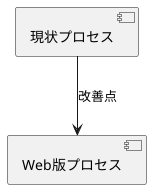

# ビジュアルエディター学習ガイド

外部仕様書作成に有効なビジュアルエディターの学習方法をまとめます。

## 🎯 ビジュアルエディターの種類と用途

### 1. UI/UXデザインツール（画面設計用）

#### Figma（推奨）
- **用途**: ワイヤーフレーム、モックアップ、プロトタイプ
- **特徴**: 
  - 無料プランあり
  - ブラウザで動作
  - コラボレーション機能が充実
  - コンポーネント機能が強力
- **外部仕様での活用**:
  - 画面設計の可視化
  - インタラクションデザインの検証
  - ステークホルダーとの共有

#### Adobe XD
- **用途**: ワイヤーフレーム、モックアップ、プロトタイプ
- **特徴**: Adobe製品との連携が強い
- **外部仕様での活用**: Figmaと同様

#### Sketch
- **用途**: ワイヤーフレーム、モックアップ
- **特徴**: Mac専用、プラグインが豊富
- **外部仕様での活用**: Figmaと同様

### 2. ダイアグラム・フローチャートツール

#### Draw.io / diagrams.net（推奨）
- **用途**: フローチャート、ER図、システム構成図
- **特徴**: 
  - 完全無料
  - ブラウザで動作
  - オフライン使用可能
  - PlantUMLとの併用が可能
- **外部仕様での活用**:
  - プロセスフロー図
  - 画面遷移図
  - システム構成図

#### Lucidchart
- **用途**: フローチャート、ER図、組織図
- **特徴**: コラボレーション機能が充実
- **外部仕様での活用**: Draw.ioと同様

#### Whimsical
- **用途**: フローチャート、ワイヤーフレーム、マインドマップ
- **特徴**: シンプルで使いやすい
- **外部仕様での活用**: プロセス設計、画面設計

### 3. ブレインストーミング・プロセス設計ツール

#### Miro（推奨）
- **用途**: ブレインストーミング、プロセス設計、ユーザージャーニー
- **特徴**: 
  - 無料プランあり
  - コラボレーション機能が充実
  - テンプレートが豊富
- **外部仕様での活用**:
  - 現状分析の可視化
  - プロセスフローの設計
  - ユーザージャーニーの作成

#### Mural
- **用途**: Miroと同様
- **特徴**: エンタープライズ向け機能が充実

### 4. ワイヤーフレーム専用ツール

#### Balsamiq
- **用途**: ワイヤーフレーム（手描き風）
- **特徴**: シンプルで素早く作成可能
- **外部仕様での活用**: 初期の画面設計

## 📚 学習方法（ツール別）

### Figma の学習方法

#### ステップ1: 基礎を学ぶ（1-2週間）

**無料リソース**:
1. **Figma公式チュートリアル**
   - URL: https://help.figma.com/hc/en-us/articles/360041003114
   - 内容: 基本的な操作から学べる
   - 所要時間: 2-3時間

2. **Figma公式YouTubeチャンネル**
   - URL: https://www.youtube.com/c/figmadesign
   - 内容: ビデオチュートリアル
   - 所要時間: 各動画10-30分

3. **Figma Community**
   - URL: https://www.figma.com/community
   - 内容: 他のデザイナーの作品を参考にできる
   - 活用方法: テンプレートをダウンロードして学習

**学習内容**:
- [ ] 基本的な操作（選択、移動、リサイズ）
- [ ] フレームの作成
- [ ] テキスト、図形の追加
- [ ] レイヤーの理解
- [ ] コンポーネントの作成
- [ ] スタイルの適用

#### ステップ2: 実践的なプロジェクト（2-3週間）

**プロジェクト例**:
1. **簡単なランディングページ**
   - 目的: 基本的なレイアウトを学ぶ
   - 所要時間: 3-5時間

2. **フォーム画面のデザイン**
   - 目的: 入力フォームの設計を学ぶ
   - 所要時間: 2-3時間

3. **ダッシュボード画面**
   - 目的: 複雑なレイアウトを学ぶ
   - 所要時間: 5-8時間

**外部仕様での実践**:
- ワークシートの画面デザイン
- チェックリストの画面デザイン
- テキスト表示画面のデザイン

#### ステップ3: 高度な機能（1-2週間）

**学習内容**:
- [ ] プロトタイプ機能（画面遷移の作成）
- [ ] コンポーネントのバリアント
- [ ] デザインシステムの構築
- [ ] プラグインの活用
- [ ] コラボレーション機能

**推奨コース**:
- **Figma公式コース**: https://www.figma.com/education/
- **Udemy**: "Figma UI/UX Design Essentials"
- **YouTube**: "Figma Tutorial" で検索

### Draw.io / diagrams.net の学習方法

#### ステップ1: 基礎を学ぶ（1週間）

**無料リソース**:
1. **Draw.io公式ドキュメント**
   - URL: https://www.diagrams.net/doc/
   - 内容: 基本的な使い方から高度な機能まで
   - 所要時間: 2-3時間

2. **Draw.io公式YouTubeチャンネル**
   - URL: https://www.youtube.com/c/drawioapp
   - 内容: ビデオチュートリアル
   - 所要時間: 各動画5-15分

**学習内容**:
- [ ] 基本的な図形の追加
- [ ] 接続線の作成
- [ ] テキストの編集
- [ ] スタイルの適用
- [ ] レイアウト機能
- [ ] テンプレートの使用

#### ステップ2: 実践的なプロジェクト（1-2週間）

**プロジェクト例**:
1. **プロセスフロー図**
   - 目的: 紙ベースのプロセスを可視化
   - 所要時間: 2-3時間

2. **画面遷移図**
   - 目的: Webアプリの画面遷移を可視化
   - 所要時間: 3-5時間

3. **ER図**
   - 目的: データベース設計を可視化
   - 所要時間: 2-4時間

**外部仕様での実践**:
- 現状のプロセスフロー図
- Web版のプロセスフロー図
- 画面遷移図

### Miro の学習方法

#### ステップ1: 基礎を学ぶ（1週間）

**無料リソース**:
1. **Miro公式アカデミー**
   - URL: https://academy.miro.com/
   - 内容: 無料のコースとチュートリアル
   - 所要時間: 3-5時間

2. **Miro公式YouTubeチャンネル**
   - URL: https://www.youtube.com/c/Miro
   - 内容: ビデオチュートリアル
   - 所要時間: 各動画5-20分

**学習内容**:
- [ ] 基本的な操作
- [ ] テンプレートの使用
- [ ] 図形、線の追加
- [ ] 付箋の活用
- [ ] コラボレーション機能

#### ステップ2: 実践的なプロジェクト（1-2週間）

**プロジェクト例**:
1. **ユーザージャーニーマップ**
   - 目的: ユーザーの体験を可視化
   - 所要時間: 3-5時間

2. **プロセスフローの設計**
   - 目的: 業務プロセスを可視化
   - 所要時間: 2-4時間

**外部仕様での実践**:
- 現状分析の可視化
- ユーザージャーニーの作成
- プロセスフローの設計

## 🎓 学習プラン（推奨）

### 初心者向け（1ヶ月プラン）

**週1: Figma基礎**
- Day 1-2: Figma公式チュートリアル
- Day 3-4: 簡単な画面デザインを作成
- Day 5-7: ワークシートの画面デザインを作成

**週2: Draw.io基礎**
- Day 1-2: Draw.io公式ドキュメント
- Day 3-4: プロセスフロー図を作成
- Day 5-7: 画面遷移図を作成

**週3: Miro基礎**
- Day 1-2: Miro公式アカデミー
- Day 3-4: ユーザージャーニーを作成
- Day 5-7: 現状分析の可視化

**週4: 実践プロジェクト**
- Day 1-3: 外部仕様書用の図表を作成
- Day 4-5: レビュー・改善
- Day 6-7: まとめ・次のステップ

### 中級者向け（2週間プラン）

**週1: 高度な機能**
- Figma: プロトタイプ機能、コンポーネント
- Draw.io: 高度なレイアウト、テンプレート作成
- Miro: 高度なコラボレーション機能

**週2: 実践プロジェクト**
- 外部仕様書用の包括的な図表を作成
- デザインシステムの構築

## 📖 学習リソース一覧

### 無料リソース

| ツール | リソース | URL | 内容 |
|--------|---------|-----|------|
| Figma | 公式チュートリアル | https://help.figma.com/ | 基礎から応用まで |
| Figma | YouTube | https://www.youtube.com/c/figmadesign | ビデオチュートリアル |
| Draw.io | 公式ドキュメント | https://www.diagrams.net/doc/ | 完全ガイド |
| Draw.io | YouTube | https://www.youtube.com/c/drawioapp | ビデオチュートリアル |
| Miro | 公式アカデミー | https://academy.miro.com/ | 無料コース |
| Miro | YouTube | https://www.youtube.com/c/Miro | ビデオチュートリアル |

### 有料リソース（オプション）

| プラットフォーム | コース名 | 価格 | 内容 |
|----------------|---------|------|------|
| Udemy | Figma UI/UX Design Essentials | $10-20 | 包括的なFigmaコース |
| Coursera | UI/UX Design | 月額 | UI/UXデザインの基礎 |
| Skillshare | Figma for Beginners | 月額 | 初心者向けFigma |

## 🛠️ 外部仕様書作成での活用例

### 1. 現状分析の可視化

**使用ツール**: Miro または Draw.io

**作成する図**:
- 現状のプロセスフロー図
- ツール間の関係図
- 課題の可視化

**例**:
```
[クライアント] → [テキストを読む] → [ワークシート記入] → [チェックリスト] → [セッション]
```

### 2. 画面設計

**使用ツール**: Figma または Balsamiq

**作成する図**:
- ワイヤーフレーム
- モックアップ
- プロトタイプ

**例**:
- ワークシート入力画面のワイヤーフレーム
- チェックリスト画面のモックアップ
- 画面遷移のプロトタイプ

### 3. プロセスフロー

**使用ツール**: Draw.io または Miro

**作成する図**:
- 現状のプロセスフロー
- Web版のプロセスフロー
- 比較図

**例**:


### 4. ユーザージャーニー

**使用ツール**: Miro

**作成する図**:
- 紙ベースのユーザージャーニー
- Web版のユーザージャーニー
- 比較分析

## 💡 学習のコツ

### 1. 実践しながら学ぶ
- チュートリアルを見るだけでなく、実際に作成する
- 外部仕様書作成と並行して学習する

### 2. テンプレートを活用
- 各ツールのテンプレートをダウンロード
- 既存のデザインを参考にする

### 3. コミュニティに参加
- Figma Community
- Draw.ioフォーラム
- Miroコミュニティ

### 4. 定期的に練習
- 週に1-2回、簡単な図表を作成
- スキルを維持・向上

## ✅ 学習チェックリスト

### Figma
- [ ] 基本的な操作をマスター
- [ ] ワイヤーフレームを作成できる
- [ ] モックアップを作成できる
- [ ] プロトタイプを作成できる
- [ ] コンポーネントを作成できる

### Draw.io
- [ ] 基本的な操作をマスター
- [ ] フローチャートを作成できる
- [ ] 画面遷移図を作成できる
- [ ] ER図を作成できる
- [ ] テンプレートを作成できる

### Miro
- [ ] 基本的な操作をマスター
- [ ] ユーザージャーニーを作成できる
- [ ] プロセスフローを作成できる
- [ ] ブレインストーミングができる
- [ ] コラボレーション機能を使える

## 🎯 次のステップ

1. **ツールを選ぶ**: 用途に応じて1-2つのツールを選ぶ
2. **基礎を学ぶ**: 公式チュートリアルで基礎を学ぶ
3. **実践する**: 外部仕様書作成で実際に使う
4. **改善する**: フィードバックをもらって改善

---

**推奨**: まずは**Figma**と**Draw.io**から始めることをお勧めします。これらは無料で使え、外部仕様書作成に最も有効です。

