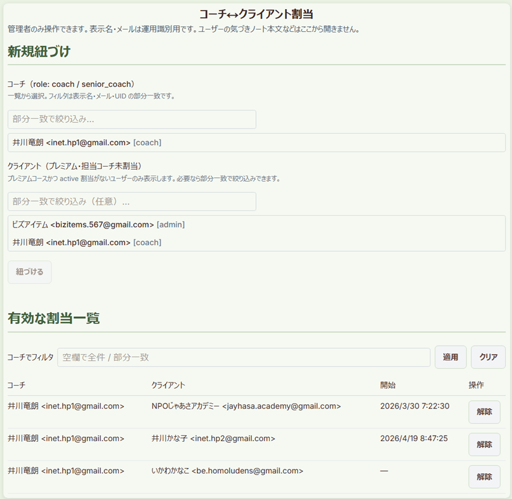

# 管理者向けコーチ↔クライアント割当 UI（確定仕様）

## 目的

Firebase コンソールでの手動作成をやめ、**管理者モードの画面**から `coach_client_assignments` の **紐づけ（active）／解除（ended）** を行う。

- 正本データ・権限の根拠: [03_A11_COACH_SHARING_SCHEMA_DRAFT.md](./03_A11_COACH_SHARING_SCHEMA_DRAFT.md)
- ロール方針: [01_ROLES_AND_SUBSCRIPTION_DESIGN.md](./01_ROLES_AND_SUBSCRIPTION_DESIGN.md)（admin はユーザー本文を IF から見ない）
- 現状の未実装記載: A11 §12.3 / [04_TRIAL_28_IMPLEMENTATION_DECISIONS.md](./04_TRIAL_28_IMPLEMENTATION_DECISIONS.md) §5.1

---

## 1. スコープ

### 1.1 やる（フェーズ1）

| 項目 | 内容 |
|------|------|
| 画面 | `/admin/assignments` |
| 権限 | `users/{uid}.role === 'admin'` のみ。入口は **管理者モード**時に表示 |
| 操作 | active 割当の一覧・新規紐づけ・解除（ended）・同一ペアの再開 |
| 表示 | コーチ／クライアントの表示名とメール（運用識別用）。**アファメーション・日誌・メッセージ本文は出さない** |

### 1.2 やらない（フェーズ1外）

- ロール付与（`role` を `coach` にする UI）— 従来どおりコンソール／別タスク
- 監査ログ専用コレクション
- コーチ本人による自己割当
- クライアントによるコーチ申請・招待フロー
- メッセージボードスレッドの自動作成（初回送信時の既存挙動のまま）

---

## 2. 画面・導線

### 2.1 URL

| パス | 内容 |
|------|------|
| `/admin/assignments` | 割当管理の単一画面（一覧＋新規フォーム） |

クエリは当面不要。将来 `?coachUid=` でフィルタしてもよい。

### 2.2 入口

1. **ヘッダー表示モード**を「管理者」にしたとき、ホームまたはサイドバーに **「コーチ割当」** リンクを出す（`mode === 'admin' && role === 'admin'`）。
2. サイドバー（`LeftSidebar`）: 管理者モード時のみ追加項目。非管理者・他モードでは非表示。
3. 直接 URL アクセス時: 未ログイン → `/login`、admin 以外 → 権限なし表示（既存 `RoleGuard` 相当）。

ホームのコンテンツ編集（動画・記事モーダル）とは **別ルート**。割当は一覧操作が多くモーダルに載せない。

### 2.3 レイアウト（1画面・2ブロック）



```
[コーチ↔クライアント割当]

■ 新規紐づけ
  コーチ: role=coach/senior_coach の一覧 → 部分一致フィルタ → 行クリックで選択
  クライアント: プレミアムかつ active 割当なしの一覧 →（任意）部分一致 → 行クリックで選択
  [紐づける]  （確認ダイアログあり）

■ 有効な割当一覧（status == active）
  | コーチ | クライアント | 開始日 | 操作 |
  | …     | …           | …     | [解除] |
  フィルタ: コーチ名の部分一致（任意）
```

ended 履歴一覧はフェーズ1では出さない（再開は「新規」で同一ペアを再 active 化）。

### 2.4 新規紐づけの候補一覧（追加仕様・2026-07-31）

| 対象 | データソース | 選択 UI |
|------|--------------|---------|
| **コーチ** | `users` で `role in ['coach','senior_coach']` | 一覧表示。表示名・メール・UID の **部分一致** で絞り込み、行クリックで選択 |
| **クライアント** | `subscription.plan == 'premium'` かつ entitlement 上プレミアム有効（`communication.message_board`）かつ **active 割当なし** | 一覧表示。任意で部分一致絞り込み、行クリックで選択 |

メール／UID の完全一致検索ボタンは廃止（一覧＋部分一致に統合）。

---

## 3. 業務ルール（確定）

| # | ルール |
|---|--------|
| R1 | 担当は **コーチ 1 : クライアント 多**（既存 A-11）。 |
| R2 | クライアントの **active 割当は同時に高々1件**。別コーチへ付け替えるときは、既存 active を **先に ended** してから新規 create／または **トランザクションで end＋set**。 |
| R3 | ドキュメント ID は常に `{coachUid}_{clientUid}`。同一ペアの再開は **同一 ID を `status: active` に戻す**（A11 §1）。 |
| R4 | コーチ候補は `role` が `coach` または `senior_coach` のみ。不一致ならエラー。 |
| R5 | クライアント候補は `role === 'user'` を推奨表示。`coach` / `admin` を選んだ場合は警告を出し、明示確認後のみ許可（テスト用）。 |
| R6 | 解除は **delete しない**。`status: 'ended'`, `endedAt` / `updatedAt` を更新。 |
| R7 | 管理者は相手の **気づきノート本文等を閲覧する導線を置かない**（既存 1.5 方針）。 |

### 3.1 新規紐づけ時の分岐

| 現状 | 挙動 |
|------|------|
| 同一ペアが active | 何もしない。「すでに有効です」 |
| 同一ペアが ended | 確認後、`status: active`、`assignedAt` 更新、`endedAt` クリア |
| クライアントに別コーチの active あり | 確認ダイアログ「既存の担当を解除して付け替えますか？」→ OK なら end 旧＋set 新（`writeBatch` / `runTransaction`） |
| コーチ UID とクライアント UID が同一 | 拒否 |

---

## 4. データ・権限

### 4.1 書き込みフィールド（変更なし）

`coach_client_assignments/{coachUid}_{clientUid}`

| フィールド | 新規時 | 解除時 | 再開時 |
|------------|--------|--------|--------|
| coachUid / clientUid | 必須 | — | 維持 |
| status | `active` | `ended` | `active` |
| assignedAt | `serverTimestamp()` | — | `serverTimestamp()` |
| endedAt | 省略 or null | `serverTimestamp()` | `null` |
| createdAt | 初回のみ `serverTimestamp()` | — | 維持 |
| updatedAt | `serverTimestamp()` | 同左 | 同左 |

### 4.2 Firestore ルール（必要な変更）

**現状の問題**: `users/{userId}` の read に **admin が含まれない**。そのためクライアント SDK だけでは、割当一覧の表示名・メール解決とユーザー検索ができない。

**フェーズ1の方針（A案・推奨）**:


```
// users/{userId}
allow read: if isOwner(userId) ||
  hasActiveCoachAssignmentForClient(userId) ||
  hasActiveCoachAssignmentAsClient(userId) ||
  isAdminUser();  // ← 追加（プロファイル識別用。サブコレクションは既存どおり本人/担当のみ）
```

- サブコレクション（`affirmations` / `journal_*` 等）の read は **変更しない**（admin でも本文は読めないまま）。
- `coach_client_assignments` の create/update/delete は **既存どおり admin のみ**（追加変更なし）。

**B案（採用しない）**: 割当もユーザー検索もすべて Admin SDK API。メッセージボードと同型だが、フェーズ1はルール1行の方が小さい。将来メール横断検索や大量一覧が必要なら API 化を検討。

### 4.3 ユーザー検索・一覧

| 用途 | 方法 |
|------|------|
| コーチ一覧 | `where('role','in',['coach','senior_coach'])` → クライアント側で部分一致フィルタ |
| 未割当プレミアム | `where('subscription.plan','==','premium')` → 有効権限フィルタ → active 割当の `clientUid` を除外 |
| 部分一致 | `displayName` / `email` / `uid`（大小無視の `includes`） |
| UID 1件 | `getDoc(users/{uid})`（一覧補助・割当テーブル表示用） |

全件の無条件 `users` スキャンはしない（ロール／プランで絞り込む）。

---

## 5. 実装モジュール

### 5.1 ライブラリ（`src/lib/coachAffirmationShare.ts` に追加）

| 関数 | 処理 |
|------|------|
| `adminSetCoachClientAssignment({ coachUid, clientUid })` | ID一致検証 → クライアントの他 active があれば end → `setDoc` merge で active。呼び出し前に UI で role 検証 |
| `adminEndCoachClientAssignment(coachUid, clientUid)` | `status: ended`, `endedAt`, `updatedAt` |
| `listActiveCoachClientAssignments(opts?)` | `where('status','==','active')`。任意で `coachUid` フィルタ。admin 専用想定 |
| （既存）`getCoachClientAssignment` / `getActiveCoachAssignmentForClient` | 分岐判定に再利用 |

クライアント SDK から実行。失敗時は permission / 検証エラーをメッセージ化。

### 5.2 ユーザー検索ヘルパ（`src/lib/adminUserLookup.ts` 新設想定）

| 関数 | 処理 |
|------|------|
| `adminLookupUserByUid(uid)` | `getUserProfile` |
| `adminLookupUserByEmail(email)` | `where('email','==', …)` → 0/1 件 |

### 5.3 UI

| パス | 役割 |
|------|------|
| `src/app/admin/assignments/page.tsx` | ページシェル・ガード |
| `src/components/admin/CoachClientAssignmentAdmin.tsx` | フォーム＋一覧 |
| `src/components/proto/LeftSidebar.tsx` | 管理者モード時リンク追加 |

スタイルは既存管理編集・トライアルメニューに合わせ、新規デザインシステムを増やさない。

### 5.4 確認ダイアログ文言（例）

- 新規: 「コーチ（表示名）とクライアント（表示名）を紐づけます。よろしいですか？」
- 付け替え: 「このクライアントには既に担当コーチ（旧）がいます。解除して（新）に付け替えますか？」
- 解除: 「この割当を終了します。コーチ側の共有ピッカーから消えます。よろしいですか？」

---

## 6. 受け入れ条件

1. admin＋管理者モードで `/admin/assignments` を開き、メールまたは UID でコーチ・クライアントを指定して紐づけできる。
2. 紐づけ後、当該コーチの `CoachClientPickerModal`（`/trial_4w`・`/communication`）にクライアントが現れる。
3. 解除後、ピッカーから消え、コーチ閲覧・ボード送信が割当なしエラーになる。
4. 同一クライアントへの二件目 active は付け替えフロー以外で作れない。
5. `user` / `coach` ロールでは画面に入れない・リンクが出ない。
6. 管理者画面からクライアントのアファメーション本文等へ遷移する導線がない。

---

## 7. 実装順

1. `firestore.rules`: `users` の admin read 追加 → デプロイ  
2. `adminSet` / `adminEnd` / `listActive…` / メール lookup  
3. `/admin/assignments` UI＋サイドバー入口  
4. 手動テスト（受け入れ §6）  
5. A11 §12.3・Trial28 §5.1 の「未実装」を「実装済み」に更新  

**実装状況（2026-07-31）**: 1〜3・5 完了。本番／開発 Firestore への **rules デプロイ**と受け入れ手動テストは運用側で実施。

### 実装ファイル

| パス | 役割 |
|------|------|
| `firestore.rules` | `users` に `isAdminUser()` read |
| `src/lib/coachAffirmationShare.ts` | `adminSetCoachClientAssignment` / `adminEndCoachClientAssignment` / `listActiveCoachClientAssignments` |
| `src/lib/adminUserLookup.ts` | コーチ一覧・未割当プレミアム一覧・部分一致フィルタ |
| `src/app/admin/assignments/page.tsx` | ページ・ガード |
| `src/components/admin/CoachClientAssignmentAdmin.tsx` | UI |
| `src/components/proto/LeftSidebar.tsx` | 管理者モード時「コーチ割当」 |

---

## 8. 変更履歴

| 日付 | 内容 |
|------|------|
| 2026-07-31 | 初版。入口・業務ルール・ルール変更 A案・モジュール・受け入れを確定 |
| 2026-07-31 | フェーズ1実装（rules・lib・`/admin/assignments`・サイドバー） |
| 2026-07-31 | 新規紐づけ: コーチ一覧＋部分一致、未割当プレミアムクライアント一覧 |
