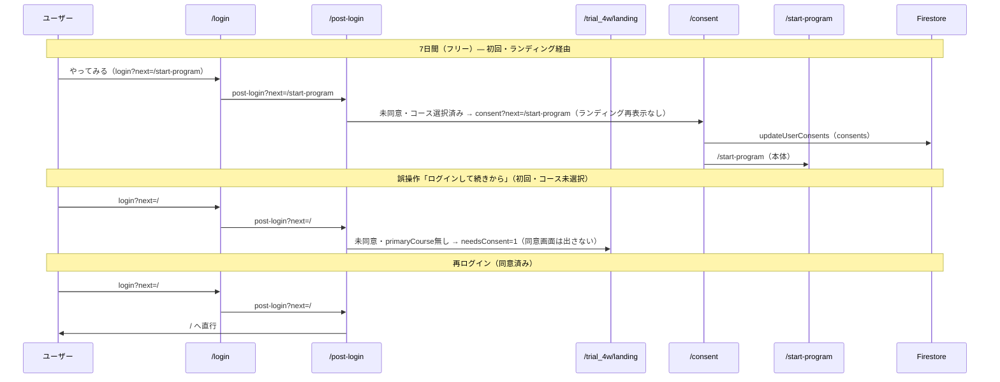

# ホーム画面 実装方針・確認事項・ステップ

## 📋 目的

ホーム画面のロール別表示と、管理者による編集（現段階では管理者のみ）を、ステップバイステップで実装するための方針・確認事項・手順をまとめる。

- 参照: [01_ROLES_AND_SUBSCRIPTION_DESIGN.md](./01_ROLES_AND_SUBSCRIPTION_DESIGN.md)（ロール・モード切替）
- 画像「ホーム画面: ロール別コンテナ表示内容」の内容を反映している。
- **コミュニケーション画面**（`/communication`）の仕様・実装は [04_COMMUNICATION_SCREEN_IMPLEMENTATION.md](./04_COMMUNICATION_SCREEN_IMPLEMENTATION.md) を参照。

---

## 0. レイアウト更新（2026-05）

- **セクションラッパー**: `HomePage.tsx` で `home-sections-stack` と `home-section-divider` を用い、バナー・道場新着・マネジメント・動画/記事/リンクの間の余白と区切りを統一した。
- **幅狭時の2カラム崩れ**: `home-trial.css` の `@media (max-width: 1024px)` にあった **`home-content-right { order: 1; }` を削除**し、DOM 順（動画 → 記事 → リンク）で縦積みになるよう修正した。
- **マネジメント**: `HomeDashboard.tsx`（`home-section-dashboard-management`）。**Aiコース・プレミアムのみマウント**（`homeSectionVisibility.ts`）。コーチ新着の「詳細」は `/communication`。

### 今週の実施状況（ホーム内プレビュー）

- 幅狭時も **4列優先**（極小幅で 3 列・2 列へ段階的に変更）。日付と曜日を **`5/4 月` 形式の1行**（`weekly-result-date-row`）にし、セル高さを抑えた。

### コーチからの新着情報（`home-coach-news`・2026-07 確定）

| 項目 | 内容 |
|------|------|
| **表示コース** | **プレミアムのみ**（28日お試しの Aiコース・フリー・ゲストは非表示） |
| **データ** | メッセージボードのコーチ発信**直近1件** |
| **本文** | 最大100文字。全文は「詳細」→ `/communication?tab=board` |

---

## 1. ホーム画面 コース別区分一覧（2026-07 確定）

ホームの各セクションは **サブスクコース列**で出し分ける。**管理者モード**は共通コンテンツ編集の別軸。**コーチ（ホスト）**のホームは本人の `subscription.plan` に従う（ロールモードはノート・コミュニケーションのみ影響。コーチは原則 `premium`）。

- **凡例**: `-` = 非表示 / `〇` = 表示 / `◎` = 編集可
- **ログイン前**は **ゲスト**列
- **フリー**: `plan === 'free'` かつ 28日お試し外（7日間スタートのみ等）
- **Aiコース**: `plan === 'standard'`、または `free` かつ `trialEndsAt` が未来（28日お試し中）
- **プレミアム**: `plan === 'premium'`
- 判定の正本: `src/lib/homeSectionVisibility.ts`（`resolveHomeCourseTier` / `shouldUseHomePersonalLists`）

| 部位 ID | ゲスト | フリー | Aiコース | プレミアム | 項目表記 |
| ------------------------------ | --- | --- | --- | --- | --- |
| `home-banner` | 〇 | 〇 | 〇 | 〇 | バナー（CTA 文言は §1.1 でコース別） |
| `home-section-whats-new-dojo` | 〇 | 〇 | 〇 | 〇 | 道場からの新着 |
| `home-section-dashboard-management` | - | - | 〇 | 〇 | マネジメント情報（右欄: コーチ新着は**プレミアム列のみ**・§0） |
| `home-section-latest-videos` | 〇※ | 〇※ | 〇個人◎ | 〇個人◎ | お気に入り動画 |
| `home-section-latest-articles` | 〇※ | 〇※ | 〇個人◎ | 〇個人◎ | 参考にしたい記事 |
| `home-section-reference-links` | 〇※ | 〇※ | 〇個人◎ | 〇個人◎ | 使えるサイト |
| `home-section-sns` | - | - | - | - | SNS（運用方針決定まで非表示） |
| `home-section-ad` | - | - | - | - | 広告（運用方針決定まで非表示） |

- **※ゲスト／フリー**: `site_content/home` の**サイト共通リスト**を表示（編集不可）。既存の管理者登録データを継続利用。
- **〇個人◎（Ai／プレミアム・お試し含む）**: `users/{uid}/home_content/lists` の**個人リストのみ**（初期は空。共通は出さない）。本人ホームでのみ編集可。各リスト最大 **25件**。見出し文言のユーザー変更は不可。

**管理者（別軸）**

| 部位 ID | 管理者（admin モード） |
| ------------------------------ | --- |
| `home-section-latest-videos` | ◎（サイト共通 `site_content/home`） |
| `home-section-latest-articles` | ◎（同上） |
| `home-section-reference-links` | ◎（同上） |
| `home-section-ad` | ◎（表示は運用方針までオフ） |

- 管理者が **クライアントモード**かつ Standard 以上のときは、他ユーザーと同様に**個人リスト**を表示・編集する（共通は出さない）。
- **フッター**: 利用規約・プライバシーポリシー・コピーライトを実装済み。`ProtoFooter`（全コース共通）。

### 旧ロール別表（廃止）

ゲスト／クライアント／ホスト／管理者の4列表は本表に置き換えた。`home-section-today-best`・`home-section-continuation` は未実装のためドキュメントから削除。

---

## 1.1 トライアル開始導線（最新）

- **ヘッダー（未ログイン）**: 「ログイン」ボタンは**なし**。人型アイコン（`person`）を**表示のみ**（`ProtoHeader`）。ログイン入口はホームへ集約。
- ホーム（未ログイン）:
  - 「**試してみる**」→ `GET /trial_4w/landing`（**初回・コース選択**）
  - 「**ログインして続きから**」→ `GET /login?next=/` → 同意済みなら `GET /`、**初回（コース未選択）**は `GET /trial_4w/landing?needsConsent=1`、コース選択済み・未同意のみ `GET /consent?next=/`（**再ログイン**）
- **初回入会・未同意ログイン直後**（表1）: `post-login` の `next` がコース先のとき **`/trial_4w/landing?needsConsent=1&next=...`** へ戻す。ランディングでコース再選択 → `GET /consent?next=...`（[04_SUBSCRIPTION_STATE_TRANSITIONS.md](./04_SUBSCRIPTION_STATE_TRANSITIONS.md) §2.1.1）
- ホーム（ログイン済み）:
  - **`enrollment.primaryCourse === 'start7d'`（7日間のみ）**: バナーボタン**なし**。案内文の **「スタート」** は `/start-program` へのリンク（スマホでメニュー非表示時の誘導）
  - **フリー（気づき未申込）**: 「**スタートから始める**」→ `/start-program`、「**気づきノートを試す**」→ `/trial_4w/landing`
  - **`kizuki` または有料／お試し相当**: 「**気づきノートを続ける**」→ `GET /trial_4w`
- ランディング（コース選択・`/trial_4w/landing`）: 用途に応じて CTA を出し分け
  - **`start7d` ユーザー**: 7日間＝**利用中**（`/start-program`）、AIコーチ／プライベートコーチ＝**申し込む**
  - **AIコーチ申し込み**: `/trial_4w?apply=ai_coach` → `enrollment.primaryCourse = kizuki` に昇格
  - **プレミアム申し込み**: `/trial_4w/landing?apply=premium`（**申込フローは準備中**の案内表示。完了処理は別途）
  - **ゲスト／従来**: 7日間・AIコーチは **やってみる**（従来導線）。ゲストは **ホームに7日間行は出さず**、ランディングでのみ7日間を選択可（[04_SUBSCRIPTION_STATE_TRANSITIONS.md](./04_SUBSCRIPTION_STATE_TRANSITIONS.md) §2.3）
- **`/trial_4w` 直アクセス**: AIコーチ／プレミアム相当の申し込みが無い（`start7d` のみ）場合は **`/trial_4w/landing` へリダイレクト**
- **スタート画面**: `start7d` 時のみ「気づきノートへアップグレード」→ ランディング

### 1.2 グローバルナビ（左サイドバー・中央ヘッダー表記）（2026-05-23 更新）

| 左サイドバー | 遷移先 | 備考 |
|--------------|--------|------|
| **ホーム** | `/` | — |
| **スタート** | `/start-program` | **7日間スタートプログラム**（現状ダミー本体）。**ゲスト時は非活性**（グレー表示）。 |
| **ノート** | `/trial_4w` | **気づきノート**。7日間のみ（`start7d`）または**ゲスト**のときは**非活性**（クリック不可）。 |
| **コミュニケーション** | `/communication` | — |
| **気づきノート設定** | `/trial_4w/settings` | 気づきノート表示時のみ（`start7d` では非表示）。 |
| **マイページ** | `/mypage` | **サイドバーからは非表示**（全コース）。`/mypage` **直アクセスは可**（ヘッダーメニュー「アカウント設定」からも可） |

**中央ヘッダー（`ProtoHeader` の見出し）**

| パス（代表） | 表示文言 |
|--------------|----------|
| `/start-program` | **7日間スタートプログラム** |
| `/trial_4w` および `/trial_4w/*` で **`/trial_4w/landing` を除く** | 気づきノート |
| 上記以外（`/`、`/trial_4w/landing`、利用規約・プライバシー・特商法等） | 人生学び場　こころ道場 + ®（登録商標） |

- 実装: `src/components/proto/LeftSidebar.tsx`、`src/components/proto/ProtoHeader.tsx`、`src/lib/enrollmentCourse.ts`。
- 気づきノートのデータモデル・Firestore パスは従来どおり（`trial_4w` 名の履歴はドキュメント上はそのまま）。

### 1.2.1 コース選択の記録（`users/{uid}.enrollment`）

| フィールド | 値 | 設定タイミング |
|------------|-----|----------------|
| `enrollment.primaryCourse` | `start7d` | `/start-program` 到達時（`ensureUserEnrollmentPrimaryCourse`） |
| 同上 | `kizuki` | `/trial_4w` 到達時（昇格のみ。`kizuki` → `start7d` への降格はしない） |
| 未設定 | — | 従来ユーザー。気づきノート導線は従来どおり有効 |

### 1.3 会員同意（利用規約・プライバシー）— 1回のみ（2026-05-20 確定）

**方針（A案）**: フリー会員・有料プランを問わず、**会員登録時に利用規約とプライバシーポリシーを1回**確認・同意する（`users.{uid}.consents`）。7日間プログラム専用の二重同意（`startProgram7dConsents`）は**採用しない**。

**利用規約の読み分け**: 同意画面のスクロール枠内では、利用規約を**章立て**で表示する（例: 共通／7日間スタートプログラム／気づきノート）。利用者は利用予定のプログラムに該当する章を読み、**プライバシーポリシーはサービス全体で1本**として同一画面で確認する。条文の正本は **`public/legal/terms.json`・`privacy.json`**（[04_LEGAL_DOCUMENTS.md](./04_LEGAL_DOCUMENTS.md) 参照）。`/consent`・`/terms`・`/privacy` は同一 JSON を読み込む。

**分岐の正本・フローチャート**: [04_SUBSCRIPTION_STATE_TRANSITIONS.md](./04_SUBSCRIPTION_STATE_TRANSITIONS.md) §2.1.2



| ルート | 役割 |
|--------|------|
| `/consent?next=...` | 利用規約（章立て）＋プライバシー。**1回**の同意 |
| `/start-program` | `consents` 済みなら7日間ダミー本体 |
| `/trial_4w` | `consents` 済みなら気づきノート本体 |

## 2. 編集 UI（サイト共通／個人）

- **サイト共通**（`site_content/home`）: **管理者モード**時のみ編集。ゲスト／フリー向けの表示データ。
- **個人リスト**（`users/{uid}/home_content/lists`）: **Aiコース／プレミアム**（お試し含む）が本人ホームで編集。共通リストは表示しない。
- **編集対象セクション**: お気に入り動画・参考にしたい記事・使えるサイト（広告エリアは運用方針後）。各最大 25 件。

### 2.1 カード上の操作

- 編集可能な **content-section** の**カード右上**に、次を表示する。
  - **編集アイコン**（例: 鉛筆アイコン）
  - **「編集」ボタン**（またはアイコンのみでクリックで編集を開く）
- クリックで**編集画面をモーダル**で開く。

### 2.2 モーダル編集画面

- 各セクションの内容に応じた編集フォームをモーダル内に表示する。
- **実装済み**:
  - **お気に入り動画**: `LatestVideosEditModal`。`saveTarget` が `site` / `personal`。保存は `updateHomeLatestVideos` または `updateUserHomeLatestVideos`。YouTube oEmbed 対応。
  - **参考にしたい記事**: `LatestArticlesEditModal`。OGP（`/api/article-ogp`）。`updateHomeLatestArticles` / `updateUserHomeLatestArticles`。
  - **使えるサイト**: `ReferenceLinksEditModal`。OGP 流用。`updateHomeReferenceLinks` / `updateUserHomeReferenceLinks`。
- **未実装**:
  - **広告エリア**: 項目・フォームは運用方針決定後に設計。

---


モーダル内に、次のような**テーブル**を置くイメージ。

```
[参考リンクの編集]

カテゴリ名: [入力欄 or 既存カテゴリ選択]

| タイトル     | URL                    | 並び | 操作   |
|--------------|------------------------|------|--------|
| 〇〇の使い方  | https://example.com/…  | 1    | 削除   |
| △△公式      | https://example.com/…  | 2    | 削除   |
| （空行）      | （空）                 | 3    | 削除   |

[行を追加]  [保存]  [キャンセル]
```

- **行**: 1行 = 1リンク。タイトル・URL を入力。並び順は数値またはドラッグで変更。
- **行を追加**: 新しい行を追加し、タイトル・URL を入力できるようにする。
- **削除**: その行（リンク）を削除。
- **カテゴリ**: 既存のカテゴリを選択するか、新規のカテゴリ名を入力。カテゴリごとにテーブルを分けるか、1テーブルで「カテゴリ」列を持ってグループ表示するかは設計で決める。

### 3.3 表示側（ホームの参考リンクエリア）との対応

- 保存した「カテゴリ・タイトル・URL・並び順」を、現在の `home-section-reference-links` の「カテゴリA / リンク1, リンク2」「カテゴリB / リンク3」のような表示に反映する。
- 編集は管理者モード時のみ。表示はロールに応じて上記一覧のとおり（ゲスト・クライアント・ホストは表示のみ、管理者は◎で編集可）。

---

## 4. 実装前に確認しておく事項

以下を実装着手前に決めておくと、手戻りが少ない。

### 4.1 DB（Firestore）の準備


| 確認項目               | 内容                                             | 現段階の案                                                                                                                                                                       |
| ------------------ | ---------------------------------------------- | --------------------------------------------------------------------------------------------------------------------------------------------------------------------------- |
| **ホーム用データの保存先**    | 最新動画・最新記事・参考リンク・広告の「編集結果」をどこに保存するか             | サイト全体で1ドキュメントとする場合: `site_content/home` のようなコレクション＋ドキュメント（例: `home_sections`）                                                                                               |
| **参考リンクのスキーマ**     | 1リンクのフィールド（カテゴリ・タイトル・URL・並び順）と、配列で持つかサブコレクションか | 例: `reference_links: [{ category, title, url, order }, ...]` を1ドキュメントのフィールドに持つ                                                                                              |
| **最新動画・最新記事のスキーマ** | 1件あたりの項目（タイトル・URL・サムネイル・日付等）                   | 後で定義する場合も、「配列で持つ」「日付で並べる」などを決めておく                                                                                                                                           |
| **広告エリアのスキーマ**     | テキスト・画像URL・リンク等、何を編集可能にするか                     | 現段階は「1つのかたまり」として1フィールドでも可。後で項目を増やせるようにする                                                                                                                                    |
| **読み取り権限**         | 誰が読めるか                                         | 全員（未認証含む）がホーム表示用に読める必要あり → `site_content` は読み取りを公開 or 認証不要で読めるルール                                                                                                           |
| **書き込み権限**         | 誰が書けるか                                         | **管理者（admin）のみ**。`request.auth != null` かつ ユーザーの role が admin であることを、セキュリティルールまたは Cloud Functions で検証する必要あり（Firestore だけでは「admin」判定が難しい場合は、カスタムクレームや別テーブルの role を参照する設計を検討） |


### 4.2 認証・ロール・モード


| 確認項目              | 内容                                                                                                       |
| ----------------- | -------------------------------------------------------------------------------------------------------- |
| **ロールの取得**        | ホーム表示時・編集ボタン表示時に、現在ユーザーが `admin` かどうかを判定できるか（`useAuth().userProfile?.role === 'admin'` など）。              |
| **モードの切り替え**      | 管理者モードに切り替えたときだけ編集 UI を出すか、`role === 'admin'` なら常に編集 UI を出すか。画像の意図に合わせて「管理者モード時のみ」とするかどうか。               |
| **ゲスト・ログイン済みの区別** | `home-section-today-best` / `home-section-continuation` をゲストに非表示にするため、`useAuth()` の `user` の有無で出し分けできるか。 |


### 4.3 編集画面の範囲


| 確認項目             | 内容                                                                            |
| ---------------- | ----------------------------------------------------------------------------- |
| **現段階で実装する編集**   | 参考リンクのテーブル形式のみ先に実装するか、最新動画・最新記事・広告の編集も同時に含めるか。ステップでは「参考リンクのみ」を Step 1 にすると安全。 |
| **モーダル or 別ページ** | 編集はすべてモーダルで開くか、一部は別ルート（例: `/admin/home/reference-links`）で開くか。                 |


### 4.4 セキュリティルール（Firestore）


| 確認項目                   | 内容                                                                                                                                                                                                               |
| ---------------------- | ---------------------------------------------------------------------------------------------------------------------------------------------------------------------------------------------------------------- |
| **site_content 等のルール** | 新規コレクション（例: `site_content`）に対する `read`: 全員可 / `write`: admin のみ、をどう書くか。Firestore のルール内で「admin かどうか」は `get(/databases/$(database)/documents/users/$(request.auth.uid)).data.role == 'admin'` のように別ドキュメントを読む必要がある。 |


---

## 5. ステップバイステップの実装順序

一度に全部やらず、次の順で進めることを推奨する。


| Step       | 内容                        | 成果物・実装状況                                                                                                                                 |
| ---------- | ------------------------- | --------------------------------------------------------------------------------------------------------------------------------------- |
| **Step 0** | **確認事項の決定**               | 上記 4.1〜4.4 について方針を決定。済。                                                                                                                       |
| **Step 1** | **ロール別の表示切替（編集なし）**       | ゲストで「本日の一番」「昨日までの積重ね」非表示。クライアント・ホストで「広告エリア」非表示。**実装済み**（useAuth, ViewModeContext）。                                                |
| **Step 2** | **管理者モードの編集 UI の配置**      | 最新動画・最新記事のカード右上に「編集」ボタン（管理者かつ管理者モード時のみ）。**実装済み**。参考リンク・広告の編集ボタンは未実装。                                                          |
| **Step 3** | **DB と Firestore ルールの準備** | `site_content/home` を用意。`latestVideos`・`latestArticles`・`referenceLinks`・`ad` のスキーマを定義。read 全員・write は isAdminUser()。**実装済み**（firestore.rules, firebase.json, .firebaserc）。 |
| **Step 4** | **いちおしサイト（参考リンク）の編集画面**    | モーダル内にテーブル UI。**実装済み**（ReferenceLinksEditModal・article-ogp 流用・updateHomeReferenceLinks）。                                                                  |
| **Step 5** | **最新動画・最新記事・広告の編集**       | **おすすめ動画・注目記事・いちおしサイトは実装済み**。広告の編集は未実装（運用方針決定後）。                                                                                    |

### 5.1 実装ファイル一覧（ホーム・管理者編集・フッター）

| 種別 | パス |
|------|------|
| ホーム | `src/components/HomePage.tsx` |
| コース別表示 | `src/lib/homeSectionVisibility.ts` |
| 道場新着 | `src/components/home/HomeWhatsNewDojo.tsx` |
| マネジメント（ダッシュボード） | `src/components/home/HomeDashboard.tsx` |
| おすすめ動画編集モーダル | `src/components/home/LatestVideosEditModal.tsx` |
| 注目記事編集モーダル | `src/components/home/LatestArticlesEditModal.tsx` |
| いちおしサイト編集モーダル | `src/components/home/ReferenceLinksEditModal.tsx` |
| フッター | `src/components/proto/ProtoFooter.tsx` |
| 利用規約ページ | `src/app/terms/page.tsx` |
| プライバシーポリシーページ | `src/app/privacy/page.tsx` |
| 動画メタ取得 API | `src/app/api/youtube-oembed/route.ts` |
| 記事・サイト OGP 取得 API | `src/app/api/article-ogp/route.ts`（記事・いちおしサイトで流用） |
| YouTube ユーティリティ | `src/lib/youtube.ts`（videoId 抽出・Shorts 対応・サムネイル URL） |
| Firestore 型・関数 | `src/lib/firestore.ts`（HomeContent, getHomeContent, updateHomeLatestVideos, updateHomeLatestArticles, updateHomeReferenceLinks, HomeReferenceLinkEntry） |
| スタイル | `src/styles/home-trial.css`（.video-item, .article-item-card, .reference-link-card, .home-footer, .legal-page-*, #home-section-sns 非表示） |


- **画像の「リンクのURLを入力するテーブル形式の編集画面」** は、**Step 4** の「いちおしサイトの編集」として実装済み。広告エリアは Step 5 で運用方針決定後に実装する。

---

## 6. 参照

- [01_ROLES_AND_SUBSCRIPTION_DESIGN.md](./01_ROLES_AND_SUBSCRIPTION_DESIGN.md) — ロール・モード・ホーム section ID
- [04_COMMUNICATION_SCREEN_IMPLEMENTATION.md](./04_COMMUNICATION_SCREEN_IMPLEMENTATION.md) — `/communication`（ホームからの導線含む）
- [04_IMPLEMENTATION_STEPS_DB_AND_AUTH.md](./04_IMPLEMENTATION_STEPS_DB_AND_AUTH.md) — Phase 2 全体
- 画像: ホーム画面 ロール別コンテナ表示内容

