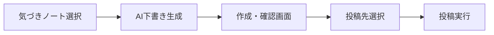

# 気づきノート → SNS 投稿（構想）

**ステータス**: 構想・未確定（実装着手前）  
最終更新: 2026-09-20

気づきノートの内容を AI で投稿用文章に整え、確認画面を経て Facebook / X 等へ共有する機能の構想メモです。  
本ドキュメントは要件の確定・実装仕様ではなく、**可否・制約・段階案・未決事項**を揃えるためのものです。

関連:

- 気づきノート実行面: `/trial_4w`（サブスクスコープ上の「実行」）
- AI 基盤: [04_VERTEX_AI_TRIAL_IMPROVEMENT.md](./04_VERTEX_AI_TRIAL_IMPROVEMENT.md)
- プロダクト境界: [04_SUBSCRIPTION_PRODUCT_SCOPE.md](./04_SUBSCRIPTION_PRODUCT_SCOPE.md)
- 日誌×コーチ/AI: [03_JOURNAL_COACH_AI_PLANS_AND_CAPABILITIES.md](./03_JOURNAL_COACH_AI_PLANS_AND_CAPABILITIES.md)

---

## 1. やりたいこと（ユーザー視点）

1. 気づきノート（日／晩／週など）の内容を選ぶ  
2. AI が SNS 向けの文章を下書きする  
3. **SNS投稿みたいな画面**で文言・写真を編集・確認する  
4. 「投稿」を押すと Facebook（および将来 X 等）に載る  
5. 任意で写真（端末／Google フォト／ノート添付）を添える  

価値のイメージ:

- 「学びの記録」を外に出すハードルを下げる  
- 自分の言葉のままではなく、読みやすい短文に整えてから共有できる  
- 投稿前に必ず人が確認する（誤投稿・過度な開示を防ぐ）

---

## 2. 結論サマリ（現時点）

| 項目 | 可否 | 備考 |
|------|------|------|
| AI で気づきノート → 投稿用文章 | **可能** | 既存 Vertex AI 系の延長で構想可 |
| 作成・確認・投稿の UI | **可能** | アプリ内コンポーズ画面として設計 |
| Facebook **個人**タイムラインへの API 直投稿 | **ほぼ不可** | Meta の制限。共有シート or Page 投稿が現実解 |
| Facebook **Page** への API 投稿 | **可能** | 審査・権限・ユーザーが Page 管理者であることが前提 |
| X（旧 Twitter）への API 投稿 | **可能** | API プラン・審査・コストあり |
| Google フォトから「選んで添付」 | **可能** | OS／ピッカー経由が現実的 |
| Google フォトライブラリの自動巡回・一括投稿 | **非推奨／重い** | OAuth・審査・UX いずれも負担大 |

---

## 3. 対象データ（入力）

構想上の入力候補（どれを使うかは未決）:

| 入力 | 例 | メモ |
|------|----|------|
| 日の晩の気づき | その日の振り返りテキスト | 暗号化フィールドはサーバー復号後に AI へ |
| 週のまとめ／週レポート | 既存 AI 週レポート成果物 | 再要約して SNS 向けに短くする案もあり |
| 朝の意図（任意） | 行動宣言など | 投稿トーンに合う場合のみ |
| 添付画像 | ノートに紐づく写真 | 自前 Storage なら候補表示しやすい |
| ユーザーが追加で選ぶ写真 | 端末／Google フォト | 投稿直前のピッカー |

**原則（案）**: AI に渡す範囲はユーザーが明示選択したエントリのみ。全履歴の自動スキャンはしない。

---

## 4. 画面フロー（構想）

### 4.1 作成・確認画面（コンポーズ）の想定要素

- 本文（編集可・文字数カウンタ。X 向けは上限意識）
- トーン選択（例: 学び共有／短く／ハッシュタグなし）※任意
- 画像スロット（0〜N。追加／削除）
- 投稿先トグル（Facebook / X / テキストコピーのみ 等）
- 「再生成」「下書きを捨てる」
- 注意書き: **公開範囲は各 SNS の設定に従う**／個人情報・他者の話に注意

### 4.2 「投稿」押下後の振る舞い（案）

| 投稿先 | Phase1（現実的） | Phase2（本格連携） |
|--------|------------------|---------------------|
| Facebook | Web Share API / 共有シートで Facebook アプリへ渡す。最終送信はユーザー | Page 連携済みなら Graph API で Page 投稿 |
| X | 共有シート or「コピーして X を開く」 | X API で直接投稿 |
| その他 | クリップボードコピー | — |

Phase1 でも「SNS投稿みたいな画面で作って確認する」体験は満たせる。  
「アプリが勝手に個人ウォールへ載せる」体験は Meta 制約上、約束しない。

---

## 5. プラットフォーム制約（構想時の前提）

### 5.1 Facebook / Meta

- 個人フィードへの第三者アプリからの自動投稿は、現行ポリシー上ほぼ期待できない。  
- 現実的な選択肢:
  1. **共有シート**（ユーザーが Facebook 側で最終確定）  
  2. **Facebook Page** への投稿（ビジネス／コミュニティ用途。審査・`pages_manage_posts` 等）  
- Meta アプリ審査・プライバシーポリシー URL・データ削除フローが必要になる可能性が高い（API 利用時）。

### 5.2 X

- 投稿 API 自体は存在するが、**有料プラン・審査・レート制限**が前提になりやすい。  
- Phase1 は共有／コピー、Phase2 で API 直投稿、と分離するのが安全。

### 5.3 Google フォト

| やり方 | 評価 |
|--------|------|
| 端末のファイルピッカー／共有でユーザーが写真を選ぶ | **推奨（Phase1）** |
| 気づきノートに既にある添付画像を候補にする | **推奨** |
| Google Photos Library API でライブラリ閲覧 | 可能だが OAuth・スコープ・審査が重い。構想の後半候補 |
| ライブラリ全体を自動で投稿素材化 | **やらない**（方針案） |

---

## 6. AI 下書き（構想）

- 既存の朝／晩／週 AI と同じく **サーバー側**で生成（クライアントに生プロンプトや鍵を載せない）。  
- 入力: 選択された気づきテキスト（＋任意で領域名・日付）  
- 出力: SNS 向け短文（プラットフォーム別の文字数目安をプロンプトで指示可能）  
- 必須: **ユーザー編集ゲート**（生成結果をそのまま自動投稿しない）  
- プライバシー: 投稿用生成は「共有意図がある操作」のあとでのみ実行。ログに本文を残すかは別途決定。

プロンプト方針（案）:

- 事実の捏造をしない（ノートにない成果・数値を足さない）  
- 他者の氏名・センシティブ情報はぼかす／含めないよう指示  
- トーンは「学びの共有」。煽り・過度な自己啓発コピーは避ける  

詳細プロンプトは実装決定時に [04_VERTEX_AI_TRIAL_IMPROVEMENT.md](./04_VERTEX_AI_TRIAL_IMPROVEMENT.md) 系へ追記する想定。

---

## 7. 段階案（フェーズ）

### Phase 0 — 合意のみ（現在）

- 本ドキュメントで可否・制約・未決を共有  
- 「個人 FB 直投稿は約束しない」ことをプロダクト側で合意  

### Phase 1 — 最小体験（推奨の最初の実装単位）

- 気づき選択 → AI 下書き → コンポーズ画面（編集・画像追加）  
- 投稿アクション = **共有シート／コピー**（Facebook・X アプリへ渡す）  
- 画像 = ノート添付 or 端末ピッカー  
- Meta / X の開発者審査は不要〜最小  

### Phase 2 — 直接投稿（必要になったら）

- X API 投稿（契約・審査後）  
- Facebook Page 投稿（Page 管理者連携後）  
- 投稿履歴の軽い記録（いつ・どのノートから・成功/失敗）  

### Phase 3 — 写真連携の拡張（任意）

- Google Photos 連携（選んだアルバム／最近の写真からのピッカー UX）  
- 自動巡回は引き続き対象外  

---

## 8. 非機能・法務・プロダクト境界（構想）

| 観点 | 方針案 |
|------|--------|
| 同意 | 初回利用時に「外部 SNS へ公開される」旨を明示。投稿のたびに確認画面必須 |
| 暗号化日誌 | AI 生成・投稿用にサーバーへ送る範囲を最小化。復号は既存 AI 経路に揃える |
| 対象プラン | トライアル実行会員のみか、有料継続会員も含むか → **未決** |
| コーチ共有との関係 | コーチ共有とは別機能。公開 SNS ≠ コーチ閲覧 |
| 利用規約／プライバシー | 外部 SNS 連携・AI での文章生成・写真の取り扱いを条文側に追記が必要になる想定 |
| 失敗時 | 共有シートが使えない端末ではコピー＋案内にフォールバック |

---

## 9. 未決事項（決定が必要な問い）

1. **主ターゲットは個人の Facebook か、Page（コミュニティ）か？**  
   → 前者なら Phase1（共有シート）が本線。後者なら Phase2 API を早めに検討。  
2. **X は必須か、後回しか？**  
3. **入力単位**は「1日の晩」固定か、「週まとめ」も対象か？  
4. **画像は必須体験か、テキストのみでよいか？**  
5. **Google フォト連携**をロードマップに入れるか、端末ピッカーで十分とするか？  
6. **無料／トライアル／有料**のどれで開放するか？  
7. 生成文の **保存**（下書き履歴）はするか？  
8. ブランド上、投稿末尾に「人生学び場」などの導線を付けるか？  

---

## 10. 意図的にやらないこと（現構想）

- Facebook 個人ウォールへの「完全自動・確認なし投稿」  
- Google フォト全件の自動スキャン・自動投稿  
- 気づきノート全文の SNS への無編集転載（必ず要約・編集ゲート）  
- 他ユーザーの気づきやコーチコメントの代理投稿  

---

## 11. 次のアクション（ドキュメント以降）

構想のまま凍結してもよい。進める場合の例:

1. §9 の未決事項をプロダクト判断で埋める  
2. Phase1 の画面ワイヤー（コンポーズ1画面）を決める  
3. AI 入出力の API 案を Vertex ドキュメントに草案追加  
4. 利用規約・プライバシーの追記要否を法務側と確認  

---

## 変更履歴

| 日付 | 内容 |
|------|------|
| 2026-09-20 | 初版（構想）。Facebook/X/Google フォトの可否と Phase 案を記載 |
