# Stripe 課金仕様（確定）

最終更新: 2026-07-23

## 1. 確定マトリクス

| 項目 | 初回申込 | アップグレード (STD→PRE) | ダウングレード (PRE→STD) | 解約（フリー） | 再申し込み |
|------|----------|--------------------------|--------------------------|----------------|------------|
| **28日トライアル** | **あり**（初回のみ） | なし | なし | — | なし（`trialConsumedAt` あり） |
| **課金タイミング** | トライアル終了後に自動課金 | **即時**・日割り相殺 | **現請求期間の終了後**に切替 | **現請求期間の終了まで**利用可→解約 | **即時課金**（トライアルなし） |
| **期間限定（オープン）価格** | 期間内なら **あり** | 期間内なら **あり** | 期間内なら **あり** | — | 期間内なら **あり** |

補足:

- 「一月消化後」は厳密には **`currentPeriodEnd`（現請求期間の終わり）まで**。
- アップグレード時のトライアル再付与はしない（A案）。
- **期間内であれば**、初回・アップ・ダウン・再申し込みのいずれもオープン価格。

## 2. オープン価格の実現方式

**Coupon 方式**（通常 Price ＋ 期間限定 Coupon）。

| 環境変数 | 役割 |
|----------|------|
| `STRIPE_PRICE_STANDARD_MONTHLY` / `STRIPE_PRICE_PREMIUM_MONTHLY` | **通常価格**の Price ID（税込・Inclusive） |
| `STRIPE_COUPON_OPEN_STANDARD` / `STRIPE_COUPON_OPEN_PREMIUM` | オープン期間用 Coupon ID |
| `OPEN_PRICING_ENDS_AT` または `NEXT_PUBLIC_OPEN_PRICING_ENDS_AT` | 終了日時（ISO）。未設定時は `2026-12-31T23:59:59+09:00` |
| `STRIPE_PRICE_*_OPEN_MONTHLY`（任意） | 旧オープン専用 Price の Webhook 解決用 |

期間判定: `src/lib/stripe/openPricing.ts` の `isOpenPricingPeriodActive()`。

- 期間中かつ Coupon ID が設定されている → Checkout / プラン変更 API が Coupon を付与。
- Coupon 未設定のあいだは Price 金額がそのまま請求される（移行中は Price 側をオープン金額にしてよい。**通常 Price へ切り替えたら必ず Coupon を設定**すること。二重値引きに注意）。

期間延長: Coupon の `redeem_by` を延ばす、および／または `OPEN_PRICING_ENDS_AT` を更新。

## 3. 実装経路

| 操作 | 経路 |
|------|------|
| 初回・再申し込み | `POST /api/stripe/checkout-session`（期間内なら `discounts: [{ coupon }]`。トライアルは初回のみ） |
| STD↔PRE | `POST /api/stripe/change-plan`（アップ: `proration_behavior=always_invoice`、ダウン: Subscription Schedule で期間末切替＋Coupon） |
| 解約・支払い方法 | Stripe Customer Portal（「サブスクリプションをキャンセル」） |
| 契約反映 | Webhook → `syncUserSubscriptionFromStripe` → `users/{uid}.subscription` ＋ `enrollment.primaryCourse=kizuki` |
| 反映フォールバック | `/apply/complete` が `POST /api/stripe/sync-checkout-session`（`session_id`）を呼び、Webhook 未達でも同期 |

UI: `/courses/change`（`CourseChangePanel`）。

## 4. Stripe 全体設定作業

以下は **Test mode と Live mode で別設定**である。最初に Test mode で完了・検証し、本番公開前に Live mode でも同じ方針で設定する。

### 4.1 アカウント・公開情報

Stripe Dashboard の公開事業者情報と Branding に次を設定する。

- 事業者名、所在地、問い合わせ先、サポートメール
- Web サイト URL
- 利用規約 URL、プライバシーポリシー URL、特商法ページ URL
- 明細書表記（顧客のカード明細で識別できる名称）
- ロゴ、アイコン、ブランドカラー

アプリ側の正本:

- 特商法: `src/app/legal/tokushoho/page.tsx`
- Customer Portal の戻り先: `/courses/change`

キーの設定手順：トライアル・本番ともにAPIのシークレットキーを設定する。

- 「設定」-「開発者」-「APIキーの管理」でAPIキー作成画面を表示
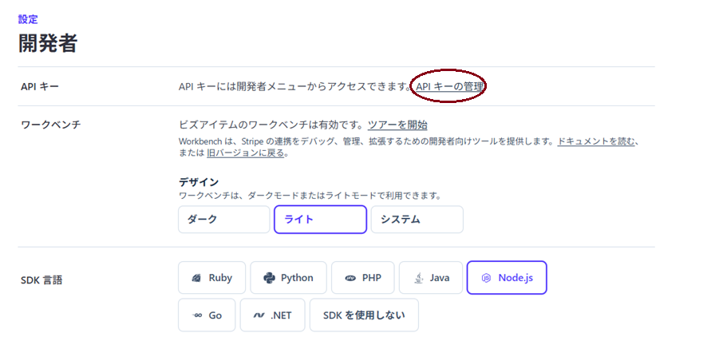

- 標準キーとして公開可能キーは既に表示されている。
- 「シークレットキーを作成」からキーを追加する。

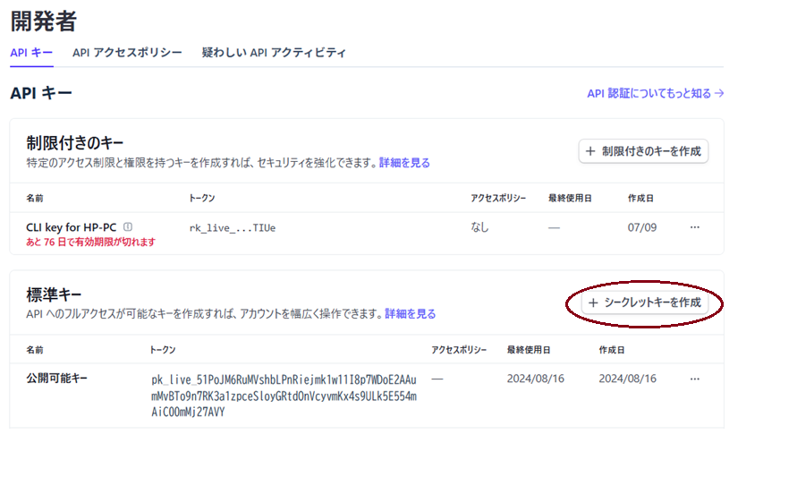

- 使用方法の画面（以下）から、「構築した連携を強化」を選択し、右下の「シークレットキーを作成する」を押す
- 参考
| 選択肢 | 使う場面 |
|--------|----------|
| **構築した連携を強化** ← これ | 自社サイト／アプリのコードに載せる |
| サードパーティーに提供 | 外部 SaaS・プラグイン向け |
| AI エージェントのオーソリ | Cursor 等に Stripe を直接触らせる用途（本番アプリ用ではない） |

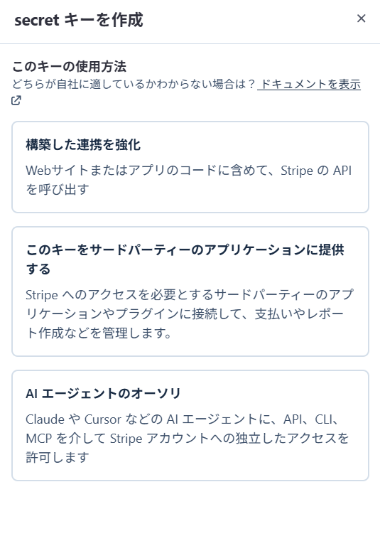
- キーの名称を入力してOKでキーが作成される
- 以下のように表示される。
- 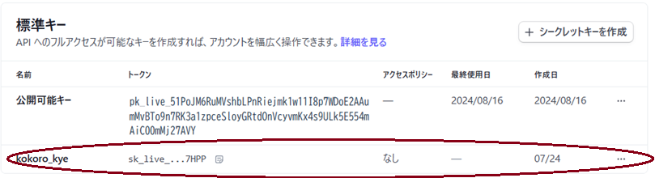

### 4.2 Product / Price

Product は Standard と Premium の2商品を作る。

| Product | 通常月額（税込） | Price 設定 |
|---------|------------------|------------|
| Standard | 1,650円 | JPY、月次 recurring、`tax_behavior=inclusive` |
| Premium | 6,600円 | JPY、月次 recurring、`tax_behavior=inclusive` |

作成手順：

- 商品カタログの「商品を作成」を押して追加する。
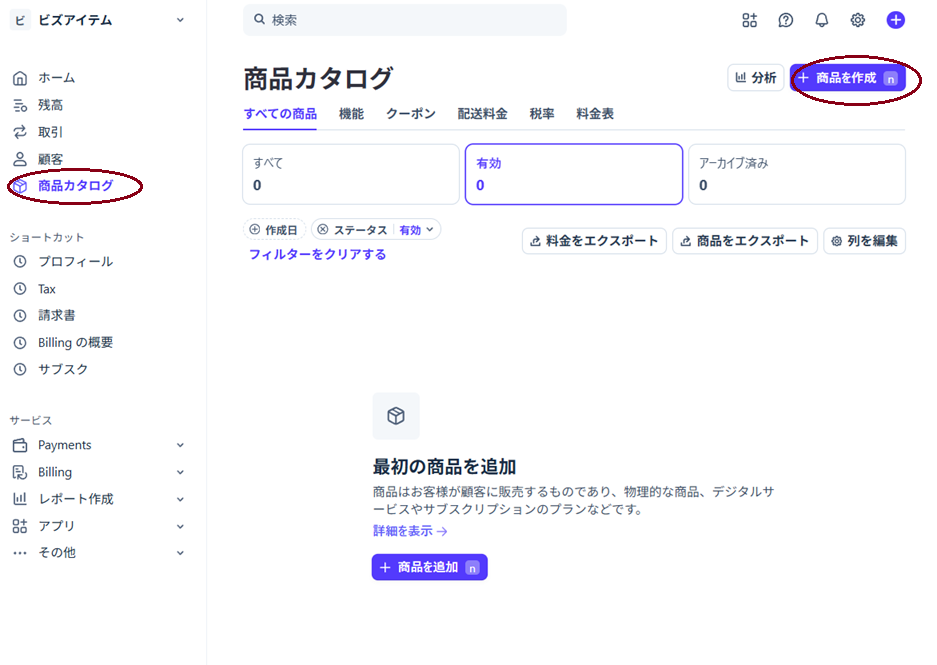
- 商品を作成したあと価格IDを価格の設定から取得
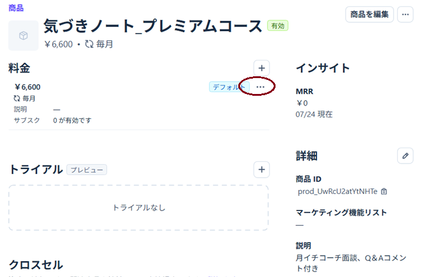


設定上の注意:

- Price ID は必ず `price_...`。Product ID（`prod_...`）を環境変数へ入れない。
- Price の金額や確定済みの税処理は原則変更せず、変更時は新しい Price を作る。
- Standard / Premium の税処理は両方 **Inclusive（内税）**で揃える。
- 商品カタログ画面で税率を選択
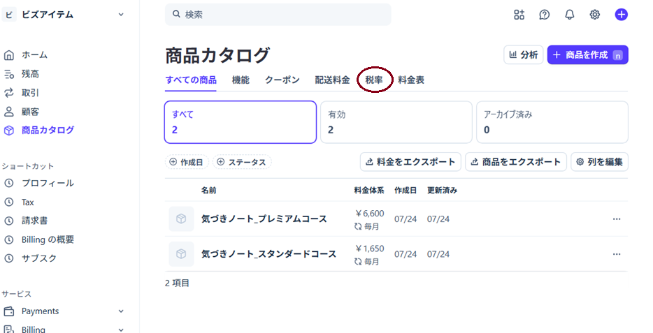
- 税率に対して一つ作成する
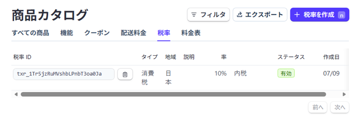

- Checkout の `automatic_tax` は現状未使用。Stripe Tax による自動税計算・税額明細が必要になった場合は別途コード対応する。
- 28日トライアルは Product / Price には設定しない。初回 Checkout の `trial_period_days: 28` で付与する。


### 4.3 オープン価格 Coupon

通常 Price に対して、Product ごとに Coupon を作る。

| 対象 | 通常価格 | オープン価格 | 推奨 Coupon |
|------|----------|----------------|-------------|
| Standard | 1,650円 | 1,320円 | **20% off** |
| Premium | 6,600円 | 3,300円 | **50% off** |

Coupon の設定:

- 対象 Product を限定する。
- 適用後の契約では割引を継続するため、Duration は **Forever**。
- Redeem by は **2026-12-31 23:59 JST**（延長時は更新）。
- Promotion code は作成不要。顧客にコード入力させず、サーバーが Coupon ID を自動適用する。
- Customer Portal の Promotion codes も **OFF**にし、再申込者が任意のコードを使う経路を作らない。
- どの商品で使用するのかを特定する。
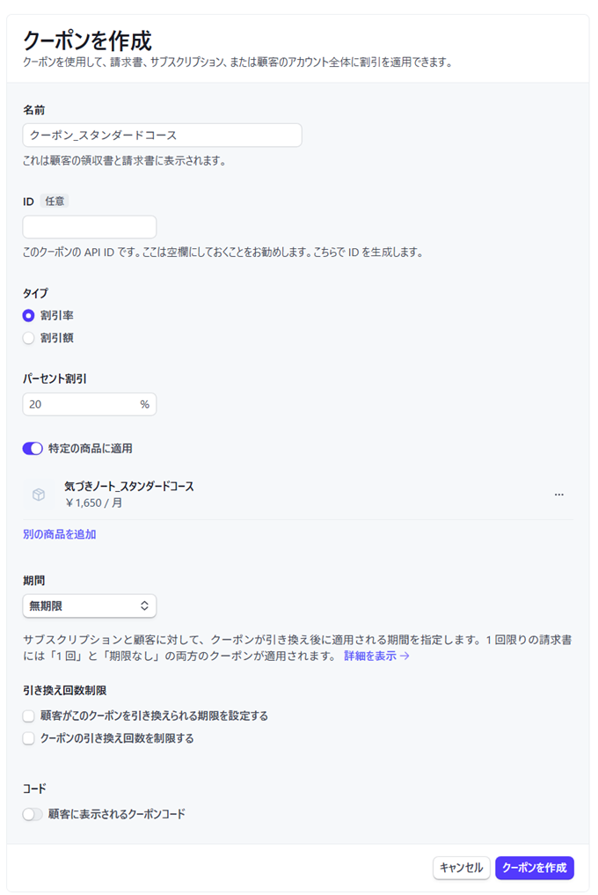


判定基準は「サーバーが申込・変更を受け付けた日時」。期間内に受け付けた初回・再申込・アップ・ダウンが対象となる。ダウンは期間内に予約した場合、実際の切替が期間終了後でも予約時に対象 Coupon を次フェーズへ設定する。

#### Coupon 方式への移行手順

1. 通常 Price（STD 1,650円 / PRE 6,600円・税込 Inclusive）を作成する。
2. 上記 Coupon を作成する。
3. `STRIPE_PRICE_*` を通常 Price ID、`STRIPE_COUPON_OPEN_*` を Coupon IDへ更新する。
4. Test mode で Checkout、再申込、アップ、ダウンを確認する。
5. 旧オープン専用 Price を Archive する。
6. 旧 Price の契約を Webhook で解決する必要がある間は、任意の `STRIPE_PRICE_*_OPEN_MONTHLY` に旧 Price ID を残す。

**二重値引き禁止**: オープン金額の旧 Price に Coupon を付けない。通常 Price への切替と Coupon ID の設定は同じリリースで行う。

### 4.4 Customer Portal

Dashboard の **Settings → Billing → Customer portal** を次のとおり設定する。

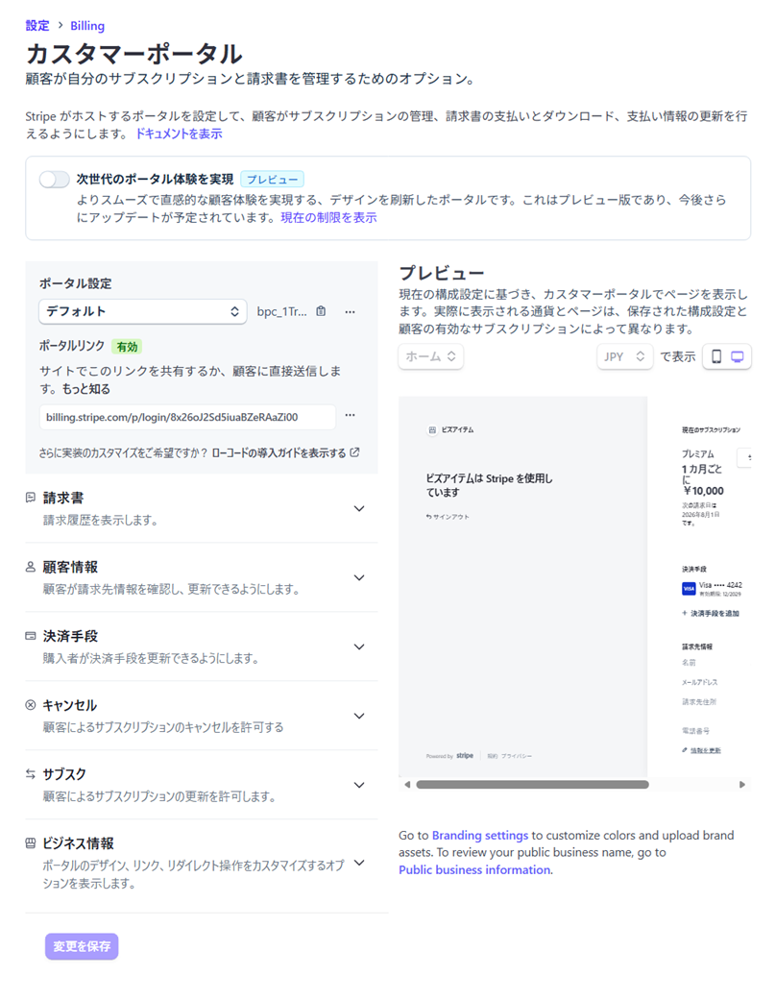

**対応表（画面 ↔ ドキュメント）**

| 画面の見出し | 推奨設定 | 英文表記の項目 |
|--------------|----------|----------------------|
| **サブスク** | プラン切替・数量変更は **OFF**。プロモーションコード **OFF** | Switch plan **OFF** / Update quantities **OFF** / Promotion codes **OFF** |
| **キャンセル** | キャンセル **ON**、タイミングは **請求期間の終了時**、理由収集は任意 ON、引き止め Coupon は **OFF** | Cancel subscription **ON** / Cancellation timing **At end of billing period** / Cancellation reason ON（任意）/ Retention coupon **OFF** |
| **決済手段** | カード等の更新を **ON** | Payment method update **ON** |
| **請求書** | 請求履歴の表示を **ON** | Invoice history **ON** |
| **顧客情報** | 氏名・住所・電話など請求先の編集を **ON**（メールは Stripe 顧客と連動） | Billing information **ON** |
| **ビジネス情報** | 事業者名・サポートメール・ロゴ・Headline・利用規約 URL など（表には無いが §4.1 / Portal Headline で推奨） | （表外・Branding／事業者表示） |

---

**各項目の設定内容**
【請求書】:
- **請求書・請求履歴の表示**: **ON**  
  過去の請求・領収書確認用。

【顧客情報】:

| | 会員登録・申込（アプリ） | Portal の顧客情報（Stripe） |
|--|--------------------------|------------------------------|
| いつ | 申込前に `applyBilling` 等で保存 | 契約後、Portal で訂正 |
| 何のため | 自社 Firestore の請求先・連絡用 | Stripe Customer の請求・明細書用 |
| 同期 | Checkout 前後でアプリ側に保存。Portal 変更は **自動では Firestore に戻らない**（現状） | Stripe 側の氏名・住所・電話など |

会員登録の入力と「同じ画面」ではなく、**Stripe 上の請求先を顧客自身が直すための項目**です。  
ON にして問題なし。
オフにすると、カード更新はできても住所などの訂正が Portal からできなくなります。

【決済手段】:
- **支払い方法の更新**: **ON**（カード期限切れ・差し替え用）

 
【キャンセル】:
- **サブスクリプションのキャンセル**: **ON**（フリーへ落とす経路）
- **タイミング**: **請求期間の終了時（At end of billing period）**
- **解約理由**: **ON** でよい（任意）
- **引き止め用 Coupon（Retention）**: **OFF**


【サブスク】:
- **サブスクリプションの更新（プラン変更）**: **OFF**  
  STD↔PRE はアプリの `/courses/change` → `change-plan` で行うため。
- **数量の更新**: **OFF**
- **プロモーションコード**: **OFF**  
  オープン価格 Coupon はサーバーが付けるため。


【ビジネス情報】:
ドキュメント表には無いが、次を入れる想定です。

- 表示名（例: ビズアイテム／人生学び場）
- サポートメール、Web サイト
- Headline（ドキュメント推奨文）
- ロゴ・色、利用規約・プライバシー・特商法のリンク
　色等については、「設定」「ビジネス」「その他」「ブランディング」から設定可能
　下表参照。
| Stripe の項目 | 推奨 HEX | デザイン上の名前 |
|---------------|----------|------------------|
| **ブランドカラー／ボタン色** | `#42613B` | プライマリ（ダークグリーン） |
| **アクセントカラー** | `#558B2F` | プライマリライト（チェック・強調） |
| （代替のアクセント） | `#D9B44A` | アクセントゴールド（バッジ用） |
| **背景**（指定できる場合） | `#FFFFFF` または `#EAF2E4` | 白／セカンダリ背景 |

アプリの戻り先は実装どおり `/courses/change` 付近です。
 `https://www.jinsei-manabiba.com/courses/change`を入力

推奨 Headline:

> コース変更は「サブスクリプションを更新」を、フリーの場合は「サブスクリプションをキャンセル」
を選んでください。

Portal の定型ボタン文言自体は変更できない。事業者名、Headline、ロゴ、色、利用規約リンク、戻り先 URL を設定し、アプリとのつながりを明示する。

### 4.5 Webhook

#### Dashboard での登録場所

**Webhook の目的**
Stripe 側で起きた課金・契約の変化を、アプリ側のサーバーに自動で知らせ、Firestore の契約状態を正として更新すること。

このアプリでは、特に次のためです。

| Stripe で起きたこと | Webhook がやること |
|---------------------|-------------------|
| Checkout 完了 | `users/{uid}.subscription` を更新し、`primaryCourse` を `kizuki` にする |
| プラン変更・解約予約・再請求（`past_due`）など | 同じ `subscription` を同期 |
| サブスク終了 | free / expired などへ反映 |

---

**なぜ必要か**

- 決済の成功は **ブラウザではなく Stripe が確定**する  
- クライアントから `subscription` を書き換えさせない（セキュリティ）  
- ユーザーが画面を閉じても、サーバー同士で確実に反映できる  

アプリが Checkout を「作った」だけでは契約完了にはならず、**Webhook（または完了画面のフォールバック同期）で Firestore に書いて初めて、有料機能が使える状態**になる。
Webhook は **テスト環境（Sandbox / Test）でも登録できる**。Stripe の「設定 → 開発者」画面は API キーや Workbench の表示設定を変更する画面であり、**Webhook の登録画面ではない**。

次の Workbench を直接開く。

- [Stripe Workbench → Webhooks](https://dashboard.stripe.com/workbench/webhooks)

画面上部で対象環境（**サンドボックス／Test** または **Live**）を確認する。Test と Live の Webhook は別設定であり、それぞれ作成が必要。

UI 上の名称対応:

| 案内で言う場所 | Workbench 上のタブ |
|----------------|--------------------|
| 開発者 → Webhooks | **ワークベンチ → Webhook** |
| 配信のステータス | 送信先詳細の **イベントの配信（Event delivery）** |
| API リクエストログ | **ワークベンチ → ログ**（こちらは Webhook 配信ではない） |

#### 登録手順

1. Workbench の **Webhook** タブを開く。
2. **Add destination（宛先を追加／新しい宛先を作成）**を選択する。
3. Connect ではなく **Events on your account（このアカウントのイベント）**を選択する。
4. API version はアカウントの現在値（既定値）を選択する。
5. **必ず下記3イベントを選択**して続行する（抜け漏れが本番不具合の主因になった）。
6. Destination type は **Webhook** を選択する。
7. Endpoint URL と説明を入力して作成する。

本番エンドポイント（**www 付きを正**とする）:

```text
https://www.jinsei-manabiba.com/api/stripe/webhook
```

（apex `https://jinsei-manabiba.com/...` はリダイレクト等で不安定になり得るため、**www に統一**する。）

購読するイベント（必須）:

- `checkout.session.completed`
- `customer.subscription.updated`
- `customer.subscription.deleted`

各イベントの用途:

| イベント | Firestore への反映 |
|----------|---------------------|
| `checkout.session.completed` | 初回・再申込の Customer / Subscription / plan / trial を保存し、`enrollment.primaryCourse=kizuki` |
| `customer.subscription.updated` | プラン変更、解約予約、`past_due`、トライアル終了などを同期 |
| `customer.subscription.deleted` | `plan=free`、`status=expired`、`primaryCourse=start7d` へ移行 |

##### 購読イベントの追加・確認（作成後の編集）

送信先を作ったあとにイベントを足す場合:

1. **ワークベンチ → Webhook**
2. 対象送信先（例: 「人生学び場　こころ道場」）を開く
3. **送信先を編集**
4. イベント一覧で `checkout.session.completed` 等にチェックして保存

**重要（2026-07 運用知見）**: Checkout 自体は成功しイベント JSON も存在するのに、Firestore の `primaryCourse` が `start7d` のままになる場合、原因の第一候補は **この送信先に `checkout.session.completed` が購読されていない**ことである。そのとき送信先の **イベントの配信** は空（「イベント配信は見つかりません」）になる。

イベントデータの JSON 内の `success_url` / `cancel_url` は **アプリへの戻り先**であり、Webhook の配信先 URL ではない。

#### Signing secret の登録

Webhook 作成後、対象 Destination の詳細画面から **Signing secret（署名シークレット）**を表示し、`whsec_...` をコピーする。

- Vercel: Project → Settings → Environment Variables の **`STRIPE_WEBHOOK_SECRET`**（変数名の typo `SEACRET` は無効）
- ローカル: `.env.local` の `STRIPE_WEBHOOK_SECRET`

注意:

- Signing secret は **エンドポイントごと・Test/Live ごと**に異なる。
- **Dashboard の www 用送信先の `whsec_...`** を Vercel Production に入れる。
- `stripe listen` が表示する `whsec_...` は **ローカル転送専用**で、本番用とは別物。混同すると配信が **400（署名検証失敗）** になる。
- 値を変更した後は **必ず再デプロイ**する。

#### ローカル開発

Stripe Dashboard から `localhost` へ直接送信することはできない。Stripe CLI で転送する。

```powershell
stripe listen --forward-to localhost:3000/api/stripe/webhook
```

コマンドに表示された `whsec_...` を `.env.local` の `STRIPE_WEBHOOK_SECRET` に設定し、Next.js 開発サーバーを再起動する。

**本番検証では Dashboard に `localhost` 送信先を残さない**（以前、本番イベントが `http://localhost:3000/api/stripe/webhook` に飛び 400 になった事例あり）。ローカル確認は CLI の `listen` のみを使う。

Workbench の「テストイベントを送信する」が **Stripe CLI 案内**だけを出す場合がある。**本番 URL への配信確認に CLI は必須ではない**。購読イベントを直したうえでサイトから再申込するか、イベント詳細から該当送信先へ再送すればよい。

#### 登録後の確認（画面の見分け）

| 画面 | 分かること | Webhook 成否？ |
|------|------------|----------------|
| **ログ**（`POST /v1/checkout/sessions` など） | アプリ → Stripe の API 成功 | **いいえ**（Checkout 作成成功のみ） |
| **イベント**（`checkout.session.completed` の JSON） | Stripe 上でイベントが発生した | **いいえ**（発生 ≠ 自サーバーへ配信） |
| **Webhook → イベントの配信** | Stripe → Vercel への HTTP 結果（200/400/500） | **はい** |

確認手順:

1. Test / Sandbox でスタンダード等を申し込む。
2. **Webhook → 対象送信先 → イベントの配信** で `checkout.session.completed` の行を開き、HTTP **200** を確認する。
3. 失敗時は Response body と **Vercel → Runtime / Functions Logs** の `POST /api/stripe/webhook` を確認する。
4. Firestore の `users/{uid}` で次を確認する。
   - `subscription.plan` = `standard` または `premium`
   - `subscription.stripeSubscriptionId` / `stripeCustomerId`
   - `enrollment.primaryCourse` = `kizuki`
5. Live 公開時も同じ3イベント・www URL・Live 用 secret を Production に設定する。

#### 配信ステータスの意味

| HTTP | 典型原因 |
|------|----------|
| **200** | 署名 OK・ハンドラ成功。Firestore 更新を確認 |
| **400** | `STRIPE_WEBHOOK_SECRET` 不一致、または署名ヘッダ欠如 |
| **500** | 処理中例外。多いのは **Firebase Admin 未設定**（下記 4.8） |
| **配信一覧が空** | 当該送信先にイベントが購読されていない／送信先作成前のイベント／別送信先（localhost 等）へ配信 |

#### 反映フォールバック（`/apply/complete`）

Webhook 遅延・未達時の保険として、完了画面が `session_id` 付きで戻ってきたとき:

1. クライアントが `POST /api/stripe/sync-checkout-session` を呼ぶ（Bearer 認証）。
2. サーバーが Checkout Session を Stripe から取得し、UID 一致・`status=complete` を検証。
3. `syncUserSubscriptionFromStripe` で Firestore を更新（Webhook と同ロジック）。

コード:

- `src/app/api/stripe/sync-checkout-session/route.ts`
- `src/lib/client/syncCheckoutSession.ts`
- `src/app/apply/complete/page.tsx`

**正本はあくまで Webhook**。フォールバックは初回申込の取りこぼし救済であり、プラン変更・解約は引き続き Webhook（および change-plan / Portal）に依存する。

### 4.6 支払い失敗・再請求（顧客請求メール含む）

Dashboard の **Billing → サブスクリプションとメールの通知**:
現在の仕様での選択内容を示す。

#### 4.6.1 メール通知と顧客管理
**【画面イメージ】**
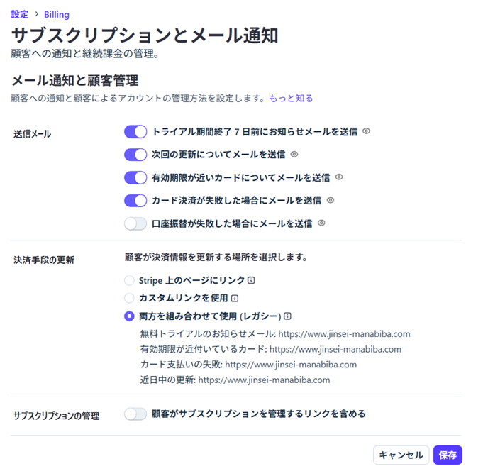

**①送信メール**
| 項目 | 推奨 | 理由 |
|------|------|------|
| トライアル期間終了 **7日前**のお知らせ | **ON** | 28日トライアル後の初回課金前に案内できる（§4.7） |
| 次回の更新についてのメール | **ON** | 更新前の通知（利用できるなら推奨） |
| 有効期限が近いカードについてのメール | **ON** | 期限切れによる決済失敗を予防 |
| カード決済が失敗した場合のメール | **ON** | 特商法・猶予方針どおり、カード更新を促す（§4.6 / §4.7） |
| 口座振替が失敗した場合のメール | **OFFで可** | 現状はカード決済中心。口座振替を使わないなら不要 |


**②決済手段の更新**

【推奨】
1. 選択肢に **Customer Portal（カスタマーポータル）** があれば、**それを選ぶ**（最優先）  
   → Stripe がカード更新用の Portal リンクをメールに付けます。
2. カスタム URL しか選べない／レガシーを使う場合は、すべて次に統一:

```text
https://www.jinsei-manabiba.com/courses/change
```

（トップではなく、Portal へ進める画面）

「レガシー＋トップのみ」は避けた方がよい。
- **両方を組み合わせて使用（レガシー）**
- 各リンク先がすべて `https://www.jinsei-manabiba.com`（トップ）
この場合であれば、メールの「カードを更新」からトップに飛ぶだけで、**Portal やコース変更画面に直結しません。**

決済手段はカードのみにする。

**③サブスクリプションの管理（任意だが推奨）**

| 添付 | 推奨 |
|------|------|
| 管理リンクを含める **OFF** | **ON** にして、リンク先を Portal または `/courses/change` |

OFF でも決済失敗メール自体は送れますが、解約・カード更新への導線が弱くなります。  
コース変更はアプリ側、解約・カードは Portal、という運用なら **ON＋上記 URL／Portal** が合いやすいです。

#### 4.6.2 無料トライアルのお知らせを管理等
**【画面イメージ】**
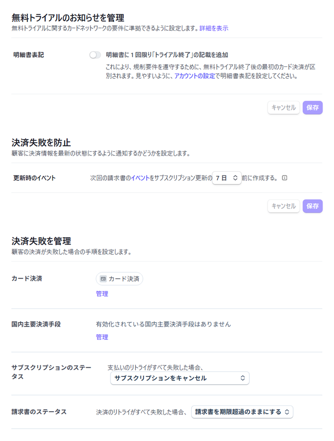

**④無料トライアルのお知らせを管理**

| 項目 |  推奨 |
|------|------|
| 明細書に1回限り「トライアル終了」を追加 |  **ON** |

28日トライアル後の初回課金を明細上で区別しやすくなります。  
併せて、案内どおり **アカウント設定の明細書表記**（事業者名など）も設定
が必要。
「設定」-「アカウント設定」-「ビジネス」-「ビジネスの詳細」
`https://dashboard.stripe.com/acct_1PoJM6RuMVshbLPn/settings`参照

**⑤ 決済失敗を防止**

| 項目 | 添付 | 推奨 |
|------|------|------|
| 次回請求書イベントを更新の何日前に作成 | **7日** | **7日のまま OK** |

カード期限メール・更新案内と揃いやすいので、変更不要です。


**⑥ 決済失敗を管理**

| 項目 | 添付 | 推奨 |
|------|------|------|
| カード決済 | 「管理」リンクあり | **管理**を開き、Smart Retries 等を確認（§4.6: Smart Retries **ON**、目安 2週間・最大8回） |
| 国内主要決済手段 | 未有効 | **カードのみならこのままで可**（口座振替等を使わないなら追加不要） |
| リトライすべて失敗後の **サブスク** | **キャンセル** | **OK**（回収不能時は解約 → Webhook で free / expired） |
| リトライすべて失敗後の **請求書** | **期限超過のまま** | **このままで可**（未払い記録を残す一般的な設定） |

「サブスクをキャンセル」は、猶予期間中の再請求が尽きた**最終結果**の設定。再請求中は `past_due` で利用継続、というアプリ側の方針と矛盾しない。

#### 4.6.3 確認が必要な決裁を管理等
**【画面イメージ】**
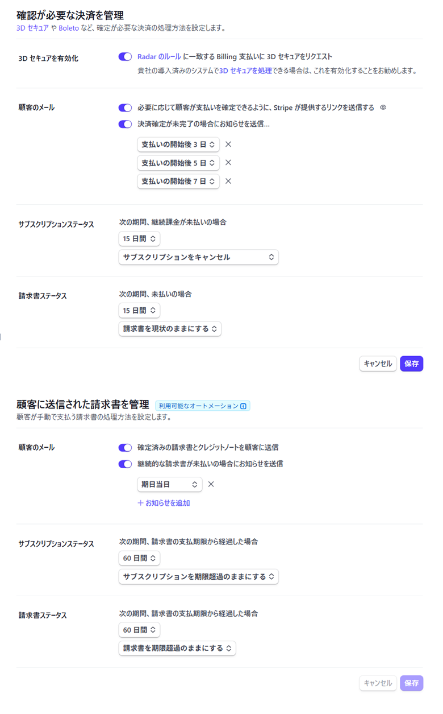

**⑦ 確認が必要な決済を管理**

| 項目 | 推奨 | 理由 |
|------|------|------|
| **3Dセキュアを有効化** | **ON** | Checkout / Portal は 3DS に対応。Radar 条件で追加認証でき、不正・規制面で有利。添付は OFF なので **ON に変更** |
| Stripe のリンクで支払い確定 | **ON**（現状どおり） | 顧客がメールから確定できる |
| 決済確定が未完了のお知らせ（3日・5日・7日） | **ON**（現状どおり） | 未完了の取りこぼし防止 |
| 未払い **15日** → サブスクを **キャンセル** | **このままで OK** | 確定できない決済の打ち切り。Webhook で free / expired へ寄せられる |
| 未払い **15日** → 請求書を **現状のまま** | **このままで OK** | 記録を残す一般的な設定 |


**⑧ 顧客に送信された請求書を管理**

こちらは **請求書メール送付（send_invoice 寄り）** の自動化です。通常のカード自動請求でも、領収・請求のメールには使えます。

| 項目 | 推奨 | 理由 |
|------|------|------|
| 確定済み請求書・クレジットノートを送信 | **ON**（現状どおり） | 領収・請求の控えを顧客へ |
| 継続請求が未払いのお知らせ | **ON 推奨**（添付は OFF） | カード失敗メールと併用してよい。未払い放置の抑止 |
| 期日超過 **60日** → サブスクを **期限超過のまま** | **このままで可** | 請求書送付フロー用。カードの Smart Retries 最終結果（キャンセル）とは別系統で、衝突しにくい |
| 期日超過 **60日** → 請求書を **期限超過のまま** | **このままで OK** | |

※ カードの「リトライ尽きたらキャンセル」は前画面／カード決済の管理側が正本です。この 60 日設定をキャンセルに無理に合わせる必要はありません。

#### 4.6.4 既存のすべてのサブスクリプションで支払い回収を一時停止等
画面イメージ
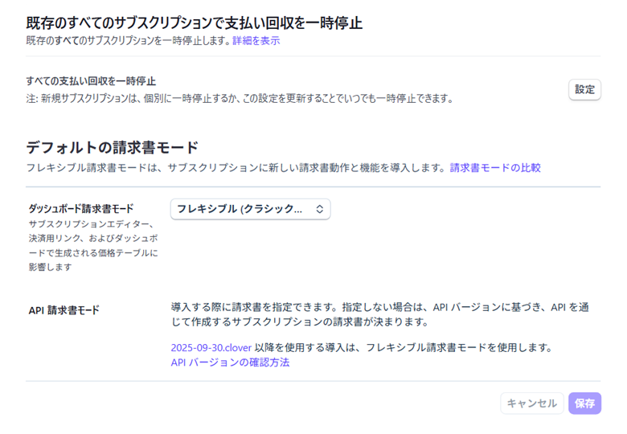

**⑨既存のすべてのサブスクリプションで支払い回収を一時停止**

| 操作 | 推奨 |
|------|------|
| 「すべての支払い回収を一時停止」 | **触らない／有効化しない** |

**意味**: 既存契約の自動請求をアカウント全体で止める非常用スイッチです。メンテナンスや障害対応のとき以外は使わない。

有効にすると、トライアル終了後の課金・月次更新が止まリ、売上・契約状態が意図せず止まる。  
ドキュメント §4.6 でも **有効化しない** と明記しています。
右側の「設定」も、通常運用では開いて一時停止をオンにしないでください。

**⑩デフォルトの請求書モード**

| 項目 | 推奨 |
|------|------|
| ダッシュボード請求書モード | 添付の **フレキシブル（クラシック…）のままで可** |
| API 請求書モード | **Dashboard で無理に変えなくてよい** |

**意味**: 請求書の内部的な扱い（Flexible / Classic）の既定値です。Customer Portal の ON/OFF や、Webhook の購読イベントとは別物。


- アプリは Checkout / Subscription API で動かしており、請求書モードをコードで明示指定していません。
- Stripe の案内どおり、新しい API バージョンでは Flexible 側に寄ります。添付の Flexible 表示は **そのままで問題ありません**。
- 「比較」を読んで切り替える必要は、今の段階ではない。

変更が必要になるのは、Stripe から移行案内が来たときや、請求書まわりで不整合が出たとき。


---


アプリの扱い:

- `past_due`: 再請求猶予中として有料機能を継続。
- `unpaid` / `incomplete` / `paused`: `inactive` として有料機能を停止。
- `canceled`: Webhook 後に `expired` / free へ移行。

「既存のすべてのサブスクリプションで支払い回収を一時停止」は **有効化しない**。通常の自動請求を継続する。Subscription の collection method は **Charge automatically（自動請求）**を使用する。

### 4.7 顧客メール

Dashboard の **Customer emails / Email settings** で少なくとも次を有効化する。

- 支払い失敗・カード更新依頼
- 支払い成功／領収書（運用方針に応じて ON）
- トライアル終了前通知（利用可能な場合）
- サブスクリプション解約・更新に関する通知（利用可能な場合）

送信元表示、サポートメール、ロゴ、公開事業者名を確認する。メール設定は Stripe アカウント全体へ影響するため、Test mode で文面とリンクを確認してから本番へ反映する。

### 4.8 環境変数

ローカル `.env.local` と Vercel に設定する。秘密値は Git にコミットしない。

#### Stripe

| 変数 | 必須 | 内容 |
|------|------|------|
| `STRIPE_SECRET_KEY` | 必須 | `sk_test_...` / `sk_live_...`（Checkout の `cs_test_` / `cs_live_` とモードを揃える） |
| `STRIPE_WEBHOOK_SECRET` | 必須 | **当該モード・当該送信先**の `whsec_...` |
| `STRIPE_PRICE_STANDARD_MONTHLY` | 必須 | Standard 通常 Price ID |
| `STRIPE_PRICE_PREMIUM_MONTHLY` | 必須 | Premium 通常 Price ID |
| `STRIPE_COUPON_OPEN_STANDARD` | Coupon移行後必須 | Standard オープン Coupon ID |
| `STRIPE_COUPON_OPEN_PREMIUM` | Coupon移行後必須 | Premium オープン Coupon ID |
| `NEXT_PUBLIC_OPEN_PRICING_ENDS_AT` | 推奨 | `2026-12-31T23:59:59+09:00`。UI・サーバー共通の終了日時 |
| `NEXT_PUBLIC_APP_URL` | 本番推奨 | 例: `https://www.jinsei-manabiba.com` |
| `STRIPE_PRICE_*_OPEN_MONTHLY` | 任意 | 旧オープン Price の Webhook 解決用 |

Hosted Checkout はサーバーで Session を作るため、現行実装では `NEXT_PUBLIC_STRIPE_PUBLISHABLE_KEY` は不要。

#### Firebase Admin（Webhook / sync-checkout-session 必須）

Webhook と `sync-checkout-session` は **Firebase Admin SDK** で `users/{uid}` を更新する（クライアントからの `subscription` 書き込みは rules で禁止）。Vercel に Admin 認証が無いと Webhook は **500** になり Firestore は変わらない。

| 変数 | 必須 | 内容 |
|------|------|------|
| `FIREBASE_SERVICE_ACCOUNT_JSON` | 推奨（どちらか一方） | サービスアカウント鍵 JSON の**全文**（1行文字列可。`private_key` の `\n` を保持） |
| `GCP_SA_KEY_JSON` | 代替可 | 同上。AI（Vertex）用に既にある場合は Webhook もこれで初期化できる |
| `NEXT_PUBLIC_FIREBASE_PROJECT_ID` | 推奨 | クライアント Firebase と同じプロジェクト ID |

取得手順（概要）:

1. Firebase Console → プロジェクトの設定 → **サービスアカウント**
2. **新しい秘密鍵の生成** → JSON をダウンロード
3. Vercel Production に `FIREBASE_SERVICE_ACCOUNT_JSON`（または `GCP_SA_KEY_JSON`）として全文を登録
4. **再デプロイ**

優先順位（コード: `src/lib/firebaseAdmin.ts`）:  
`FIREBASE_SERVICE_ACCOUNT_JSON` → `GCP_SA_KEY_JSON` → `GOOGLE_APPLICATION_CREDENTIALS`（ローカルのファイルパス）。

Vercel では Production / Preview / Development の対象環境を確認し、Live key を Preview やローカルへ入れない。変更後は再デプロイする。

### 4.9 オープン期間の延長

期限延長時は次を同時に更新する。

1. Stripe Coupon の Redeem by。
2. `NEXT_PUBLIC_OPEN_PRICING_ENDS_AT`（Vercel とローカル）。
3. 特商法ページ、ランディング、コース変更画面の表示期限。
4. 必要に応じて Customer Portal / メールの案内。

Coupon がすでに失効している場合は新しい Coupon を作り、`STRIPE_COUPON_OPEN_*` を差し替える。Stripe 側期限とアプリ側期限がずれると Checkout / プラン変更が失敗し得るため、**Coupon の Redeem by はアプリの終了日時以上**にする。

### 4.10 Test mode 検証

本番反映前に、別ユーザーまたは Test Clock を使って確認する。

- 初回 Standard: 28日 trial ＋ Standard Coupon。
- 初回 Premium: 28日 trial ＋ Premium Coupon。
- STD→PRE: trial なし、即時日割り、Premium Coupon。
- PRE→STD: 期間末切替予約、Standard Coupon。
- 解約: 期間末まで利用可、その後 free / expired。
- 再申込: trial なし、期間内なら Coupon、期間外なら通常価格。
- 支払い失敗: `past_due` 猶予、再請求、回収不能時の停止。
- Webhook 再送: 重複イベントでも二重処理しない。
- Firestore: `plan` / `status` / `currentPeriodEnd` / Stripe IDs が同期される。

### 4.11 本番公開チェックリスト

- [x] Live mode の Product / Price / Coupon を作成 → 7/24
- [x] すべての Price を税込 Inclusive に統一 → 7/24
- [x] Live Customer Portal を設定（Switch plan OFF、期間末解約 ON）
- [x] Live Webhook: URL は **`https://www.jinsei-manabiba.com/api/stripe/webhook`** →　7/24
- [x] Live Webhook: **`checkout.session.completed` / `customer.subscription.updated` / `customer.subscription.deleted` のパラメータ3つを購読**（送信先を編集で再確認）　→　7/24
- [ ] `localhost` や apex のみの旧 Webhook 送信先を無効化／削除
→無効化しない。環境変数はverelのローカル・プレビューをstripeのサンドボックス（テスト版）
　として残しておく。
- [x] Vercel Production: Stripe Live 値 ＋ **`STRIPE_WEBHOOK_SECRET`（www 送信先の Signing secret）**　→　7/24
- [x] Vercel Production: **`FIREBASE_SERVICE_ACCOUNT_JSON` または `GCP_SA_KEY_JSON`**　→　既得済み
- [x] Smart Retries と顧客メールを設定 → 7/27
- [x] 公開事業者情報・明細書表記・Branding を確認 → 7/23
- [x] Checkout → **イベントの配信 200** → Firestore（`plan` / `primaryCourse=kizuki`）を確認 → 7/23
- [ ] プラン変更 / 解約 / 再申込を本番相当で確認

**テスト方法：ユーザの状態遷移に対する課金状況例**
| タイプA | スタンダード | プレミアム | スタンダード | フリー | プレミアム | 
| --- | --- | --- | --- | --- | --- | 
| ストライプ内容 | 新規申し込み | アップグレード | ダウングレード | キャンセル | 再申し込み | 
| 課金 | 28日後課金 | 課金あり_日割り精算 | 満期後変更 | 満期後フリー | 即時課金 | 
タイプA:

| タイプB | プレミアム | スタンダード | フリー | スタンダード | 
| --- | --- | --- | --- | --- | 
| ストライプ内容 | 新規申し込み | ダウングレード | キャンセル | 再申し込み | 
| 課金 | 28日後課金 | 満期後変更 | 満期後フリー | 即時課金 | 
タイプB:

- [ ] Test key、旧 Price、秘密値が本番コードや公開ログに残っていないことを確認


### 4.12 トラブルシュート（Checkout 成功なのに Firestore が変わらない）

症状の例: Stripe では支払い完了・`checkout.session.completed` のイベントデータあり。一方 Firestore は `enrollment.primaryCourse=start7d` のまま。

切り分け順:

1. **ワークベンチ → Webhook → 対象送信先 → イベントの配信**  
   - **空** → 購読イベント不足（特に `checkout.session.completed`）、または別送信先／送信先作成前の決済。**送信先を編集**でイベントを追加し、再申込または再送。
   - **400** → Vercel の `STRIPE_WEBHOOK_SECRET` を当該送信先の Signing secret に合わせ再デプロイ。
   - **500** → Vercel Function Logs。`Firebase Admin が未設定` なら 4.8 の Admin JSON を設定。
2. **ログ**タブの `POST /v1/checkout/sessions` 200 だけでは不十分（Checkout 作成成功のみ）。
3. イベント JSON の `success_url` は Webhook 配信先ではない。
4. 救済: `/apply/complete?session_id=cs_...` のフォールバック同期（4.5 末尾）。未デプロイなら Webhook 修復が先。

関連コード（反映処理）:

- `src/app/api/stripe/webhook/route.ts`
- `src/lib/server/stripeSubscriptionSync.ts`
- `firestore.rules`（`users/{uid}.subscription` のクライアント更新禁止、`stripe_webhook_events` はクライアント不可）

## 5. 関連コード

- `src/lib/stripe/openPricing.ts`
- `src/lib/stripe/planPrices.ts`（`openCouponIdForPlan`）
- `src/app/api/stripe/checkout-session/route.ts`
- `src/app/api/stripe/change-plan/route.ts`
- `src/app/api/stripe/customer-portal/route.ts`
- `src/app/api/stripe/webhook/route.ts`
- `src/app/api/stripe/sync-checkout-session/route.ts`（完了画面フォールバック）
- `src/lib/server/stripeSubscriptionSync.ts`
- `src/lib/firebaseAdmin.ts`
- `src/lib/client/syncCheckoutSession.ts`
- `src/lib/client/openStripeCustomerPortal.ts`
- `src/lib/client/changeStripePlan.ts`
- `src/app/apply/complete/page.tsx`
- `src/components/subscription/CourseChangePanel.tsx`
- `firestore.rules`（subscription 保護・`stripe_webhook_events`）

## 6. 参照

- [04_SUBSCRIPTION_PRODUCT_SCOPE.md](./04_SUBSCRIPTION_PRODUCT_SCOPE.md)
- [04_VERTEX_AI_TRIAL_IMPROVEMENT.md](./04_VERTEX_AI_TRIAL_IMPROVEMENT.md)（`GCP_SA_KEY_JSON` の扱い。Webhook でも共用可）
- 特商法: `src/app/legal/tokushoho/page.tsx`
