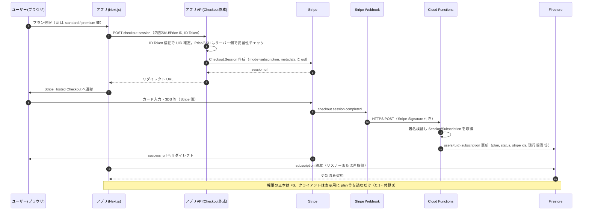
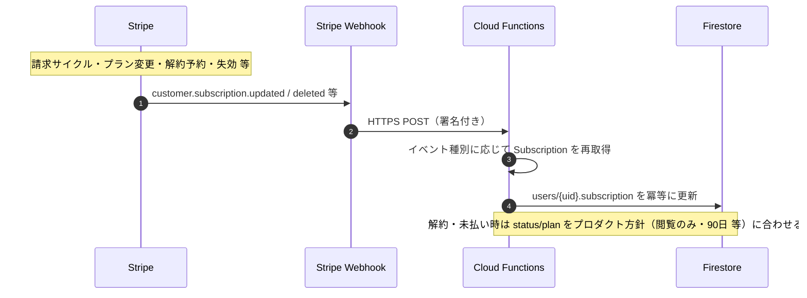
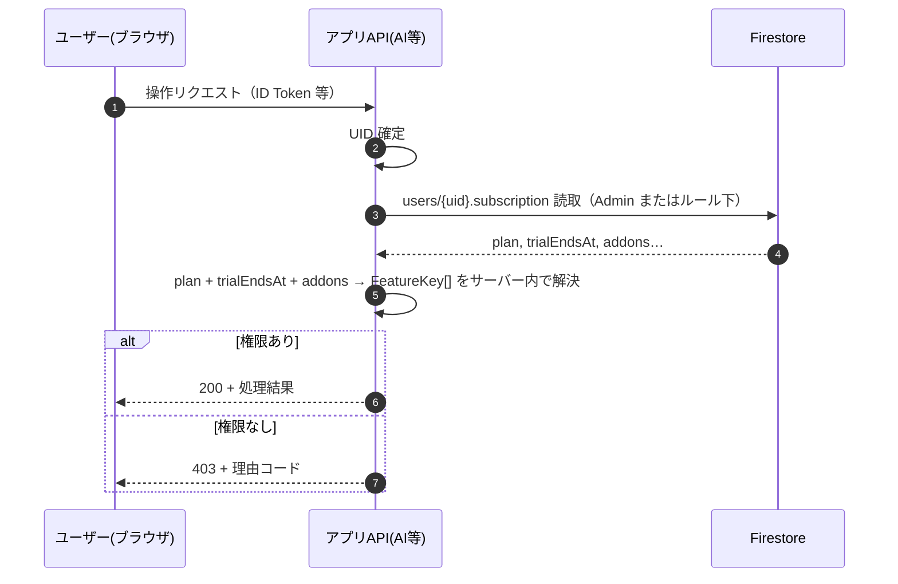

# サブスク・プロダクトスコープ（確定メモ／ロードマップ用）

## 目的

プラン対応表と実装スコープを揃え、**本バージョンでやる／やらない**と**用語**を固定する。実装の正本は [01_ROLES_AND_SUBSCRIPTION_DESIGN.md](./01_ROLES_AND_SUBSCRIPTION_DESIGN.md) §4 と連携する。

---

## 付録 A. 検討項目の「わかりやすい説明」（用語だけ先に）

設計書で出てくる次の4点は、**同じことを別の言い方**で整理しているだけです。

### A.1 「権威の所在」（誰の言う「プラン」が本当か）

- アプリはブラウザ上で動くため、**画面に表示している値だけ**では「本当に課金済みか」は証明できません（改ざんの理論上の余地）。
- **権威の所在**とは、「**サーバー側が信じる契約状態をどこに書くか**」のことです。
- 典型例:
  - **Firestore の `users/{uid}.subscription` を正**とし、クライアントは**読むだけ**。書き換えは **Cloud Functions や Admin SDK（サーバーだけが持つ鍵）**だけが行う。
  - もしくは、セキュリティルールで「本人はこのフィールドを書けない」とし、**表示は常に Firestore の値**に合わせる。
- 実装では「**ユーザーが自分で subscription を書き換えられない**」ようにし、**課金・失効・トライアル終了**は必ずサーバー経由で反映する、という方針に落ちます。

### A.2 `SubscriptionPlan`（free / standard / premium）と「28日トライアル」の持ち方

- **プラン**は「契約の段階」を表す **3段階**（例: `free` | `standard` | `premium`）に **1:1 で対応**させます（表の列と一致）。
- **28日トライアル**は「いつまでお試しが有効か」という **日付**の問題です。混ぜ方は2通りありますが、分かりやすいのは次です。
  - **`plan` は `free` のまま**、別フィールドに **`trialEndsAt`（終了日時）** を持つ。期間中だけ「standard 相当の機能を使える」かどうかは **別ロジック（entitlements）**で判定する。
  - 別案として `plan` を一時的に `trial` などに切り替える方法もありますが、**表の3段階とズレやすい**ので、本プロジェクトでは **「3段階の `plan` ＋ `trialEndsAt`」** を基本とする（最終フィールド名は実装フェーズで [01_ROLES_AND_SUBSCRIPTION_DESIGN.md](./01_ROLES_AND_SUBSCRIPTION_DESIGN.md) / Firestore 定義に合わせる）。**オプション課金**を導入する場合は **付録 C.1** のとおり **`addons`（任意）**を解決の入力に足す。

### A.3 AI 機能の「entitlement キー」を分けるとは

- **entitlement**＝「このユーザーはこの機能を使っていいか」の**スイッチ名**のことです。
- 表では「朝・晩＝AIコメント」「週・月＝レポート＋改善」と**塊が違う**ので、サーバー側の判定も **機能ごとにキーを分ける**と安全です（例: `kizuki.morning_evening.ai_comment`、`kizuki.weekly.ai_report` のような名前を付けるイメージ）。
- こうしておくと、「スタンダードでは週だけAI」「プレミアムでは全部」などを **1行ずつ ON/OFF**でき、API でも同じ名前で拒否理由を返しやすくなります。

### A.4 Q&A メッセージの「スレッド」

- **スレッド**＝「ひとまとまりの会話」の単位です。
- **パターンA（複数スレッド）**: 質問ごとに別の箱（フォーラムのトピックのように増える）。
- **パターンB（1スレッド固定）**: **コーチとクライアントのペアにつき、会話は1本のタイムライン**（LINE の1チャットのように時系列だけが伸びる）。
- 本アプリのメッセージボード UI は **1本のタイムライン**に近いため、データモデルも **パターンB（ペアあたり1会話）**を既定とし、必要になったらトピック分割を検討する、と [04_COMMUNICATION_SCREEN_IMPLEMENTATION.md](./04_COMMUNICATION_SCREEN_IMPLEMENTATION.md) と整合させる（既読・添付・編集履歴の詳細は同書）。

---

## 付録 B. 仕様確定メモ（レビュー合意）

次の方針で設計・実装に進める。

| # | 項目 | 確定内容 |
|---|------|----------|
| 1 | 権威の所在 | **`users/{uid}.subscription` を正**。クライアントは**読み取り中心**。書き換えは **Cloud Functions / Admin SDK（サーバー鍵）**のみ。 |
| 2 | プランとトライアル | **3段階の `plan` ＋ `trialEndsAt`**。 |
| 5 | AI | **機能ごとに entitlement キー**を分ける。 |
| 7 | Q&A / メッセージ | **コーチ–クライアント 1 ペア 1 スレッド**。 |

---

## 付録 C. アーキテクチャ案（概要）と「決済」と「entitlement」の関係

### C.1 Entitlement（権利）レイヤー（解決の入力）

サーバーは、少なくとも次を入力として **フラットな `FeatureKey[]`（またはビットマップ）**に解決する。

- **`plan`**（`free` | `standard` | `premium`）
- **`trialEndsAt`**（28 日お試しの終了日時。未使用なら未設定でよい）
- **`addons`**（任意）— 将来、プランに上乗せするオプションがある場合の **契約上の追加フラグ／SKU 一覧**。**現時点でオプションが無ければフィールド自体を持たない／空**でよい。

したがって、**アーキテクチャ案の式**は「`plan` + `trial`（日付）+ `addons`（任意）」であり、**必須は `plan` + `trialEndsAt` に相当する情報**、`addons` は **商品設計が必要になったときに足す拡張**と捉える（混同しないよう、`trialEndsAt` を `trial` と読み替えてよい）。

**任意案**: Cloud Functions の `onUserWrite` 等で、読み取りコスト削減のため `users/{uid}/entitlements/current` のような**キャッシュ用ドキュメント**を更新してもよい。キャッシュの正本は常に `subscription`（＋決済プロバイダの状態）と一致させる。

### C.2 決済フローと「選択機能のキー」— よくある誤解の整理

次のようなイメージは **半分正しく、半分は権威の所在と矛盾**しやすいので分ける。

- **誤りになりやすい考え方**: ユーザーが選んだ **entitlement の `FeatureKey` 一覧**をクライアントが API に送り、そのキーを信じて「注文確定・課金・権限付与」をする。
  - クライアントは改ざん可能なため、**送られてきた `FeatureKey[]` を「この人が課金済み」の証拠にはしない**。

**推奨する分離**

1. **課金（チェックアウト）**  
   - クライアントが送るのは **「どの商品／どの料金プランか」**の識別子（例: **Stripe の Price ID**、またはサーバーが定義した **内部 SKU**）と、必要なら **オプション行**。**ログイン済み UID**（Firebase Auth）で本人を特定する。  
   - サーバーは **Checkout Session / PaymentIntent** 等を決済プロバイダに依頼し、**3D Secure 等の本人確認**は **決済プロバイダ側**のフローに任せる（「UID に紐づいたカードから引き落とし」は、実際には **決済プロバイダが保持する顧客・支払手段**に対して実行し、成功結果を Webhook で受ける形が一般的）。

2. **契約状態の更新（権威）**  
   - **支払い成功**を **サーバーだけ**が受け取る経路（例: **Webhook → Cloud Function**）で `users/{uid}.subscription` を更新する（`plan`・`renewal`・`addons` 等）。ここまで来て初めて「何に課金したか」が正として確定する。

3. **通常の API / 画面**  
   - **課金のたびにクライアントが `FeatureKey` を送るのではなく**、API は **Firestore の `subscription`（＋必要ならキャッシュ）を読み**、サーバー内で **`plan` + `trialEndsAt` + `addons` → `FeatureKey[]` を再計算**してガードする。  
   - つまり **`FeatureKey` は「表示・判定用の派生物」**であり、**決済リクエストの主キーにはしない**（主キーは **商品／Price ID と UID**）。

### C.3 二重ガード・フロント（方針メモ）

- **Firestore Security Rules**: プランに応じた `read` / `write`（最低限）。  
- **API Route / Callable Functions**: 課金対象・AI 等の重要操作は **必ずサーバーで subscription を再検証**。  
- **フロント**: 既存の `FeatureGuard` や `COMMUNICATION_PREMIUM_BOARD_UNLOCKED` 等を、**`useSubscription()` ＋共有定数（マッピング）**へ置換していく（実装フェーズの作業）。

### C.4 Stripe 前提のシーケンス図（参考）

**前提**: Stripe **Billing（Subscription）** と **Checkout Session**（`mode: subscription`）を使う想定。実装では **Price ID はサーバー側の許可リストと照合**し、クライアントから任意の Price ID をそのまま信じないこと。

#### C.4.1 初回申込〜契約反映（Checkout）

#### C.4.2 継続課金・解約・カード更新（Subscription ライフサイクル）

初回以外は **Hosted Checkout を経由しない**イベントが中心になる。代表例は次のとおり（イベント名は Stripe ドキュメントに準拠）。

#### C.4.3 課金対象 API 呼び出し（毎リクエスト）

**補足**

- **Customer Portal**（ポータルでプラン変更・請求書・支払手段）を併用する場合も、**契約の正本は Webhook 経由で FS を更新する**流れは同じ。
- **Checkout `client_reference_id`** や **Subscription `metadata`** に Firebase UID を載せ、Webhook 側で **どの `users/{uid}` を更新するか**を一意に決めるのが一般的。

---

## 1. 利用区分（プロダクト）

| 区分 | ログイン | 課金 | メモ |
|------|----------|------|------|
| **ゲスト** | 不要 | — | 未認証。閲覧中心。 |
| **フリー** | **必須** | **なし** | **お試しクライアント**。気づきノート（28日間トライアル相当）が **4週間**利用可能。 |
| **スタンダード** | 必須 | あり | 気づきノート＋AI 等（対応表に準拠）。 |
| **プレミアム** | 必須 | あり | スタンダードに加えコミュニケーション等（対応表に準拠）。 |
| **個別** | 案件による | あり | **7日間プログラム等**。本バージョンでは **ドキュメントのみ**記載。実装・スキーマは **バージョンアップ**で扱う。別紙ロードマップ。 |

---

## 2. 気づきノート（名称）

- **プロダクト名**: **気づきノート**（旧称: マネジメント日誌／ジャーナリング日誌／学び帳での呼称）。
- **Firestore パス**: 既存の `journal_daily` / `journal_weekly` / `journal_monthly` は**変更しない**（移行コスト回避）。ドキュメント・UI 表記を気づきノートに統一していく。

---

## 3. 28日間トライアル（フリー期間中の挙動）

| 項目 | 内容 |
|------|------|
| **期間** | **28日**。開始した日を起点（**JST**）。 |
| **期間中** | **残り日数（または残り時間）**を画面に表示する。 |
| **失効直後（スタンダード未契約・誘導をキャンセルした場合を含む）** | **閲覧のみ**とし、**入力はロック**する。ホームの **マネジメント欄（マネジメント情報セクション）の上にオーバーレイ**し、例: **「有効期間は終了しました。○○日後にデータは消去されます」** の文言を表示する（日数は **90日ルール**に基づく残日数）。 |
| **データ保持** | 上記状態から **90日（3か月）**経過後にデータを**破棄**する。**外部出力（エクスポート）は本バージョンでは実装しない**（次ステップ）。**途中解約**した場合のデータ扱いも **同様の方針**とする（詳細は課金実装フェーズで契約文言と整合）。 |
| **失効後（課金導線）** | 「続けますか？」等のメッセージと **スタンダード申し込み**ボタンは、**未契約で入力可能に戻る前**の導線として表示する（文言・導線は UI 仕様で確定）。 |
| **entitlements** | 上記を `trialEndsAt`（等）とプラン列で解決し、API・ルールと一致させる（実装フェーズで詳細化）。 |

※「期間中は standard 相当」の能力は entitlements マトリクスで定義する（[03_JOURNAL_COACH_AI_PLANS_AND_CAPABILITIES.md](./03_JOURNAL_COACH_AI_PLANS_AND_CAPABILITIES.md) と整合）。

### 3.1 ホーム「マネジメント情報」とフリー期間中の「○*」（マネジメント情報の制限表示）

- **ゲスト**（未ログイン）には、当該ブロックおよび **フリー会員向けのマネジメント系の制限表示（○* 等）は出さない**。
- **ログイン済みフリー会員**で、**28日トライアル有効期間中**に限り、ホーム上のマネジメント情報として表示する（仕様上「お試し中だけ見える補足」という位置付け）。

---

## 4. 共有・コミュニケーション（確定メモ）

| 項目 | 内容 |
|------|------|
| **「学びノート共有」** | **既存のコーチ共有（✅）と同一**の意味とする。気づきノート全体を別スイッチで一括公開するモデルには**しない**（データモデルは既存のコーチ共有スキーマに合わせる）。 |
| **未提供機能の UI** | **表示しない**（「プレミアムだが近日」等のラベルは使わない）。API は **403 + 理由コード**（または設計で定めたコード）で統一する方針とする。 |

---

## 5. 本バージョンでは実施しない（バージョンアップで扱う）

| 領域 | 方針 |
|------|------|
| **外部データ入出力**（Google Doc / JSON 等） | **今回は実装しない**。バージョンアップで対応。 |
| **個別プログラム（7日間）** | **ドキュメントのみ**。スキーマ予約は行わない（必要になったらロードマップで定義）。 |

---

## 6. コミュニケーション（Zoom・既存組込み）

| 項目 | 方針 |
|------|------|
| **コーチ Zoom 面談** | **別アプリ**で実施（本システムへの Zoom 組込みは現段階では行わない）。 |
| **本アプリに既に組み込んでいる機能** | **運用を含めて再検討**する（仕様・担当・導線の見直し）。 |

アプリ内メッセージ（Q&A 相当）のプラン連動・スレッド単位の前提は [04_COMMUNICATION_SCREEN_IMPLEMENTATION.md](./04_COMMUNICATION_SCREEN_IMPLEMENTATION.md) を参照。

---

## 7. 参照

- [01_ROLES_AND_SUBSCRIPTION_DESIGN.md](./01_ROLES_AND_SUBSCRIPTION_DESIGN.md) §4・§6.1  
- [04_COMMUNICATION_SCREEN_IMPLEMENTATION.md](./04_COMMUNICATION_SCREEN_IMPLEMENTATION.md)  
- [03_JOURNAL_COACH_AI_PLANS_AND_CAPABILITIES.md](./03_JOURNAL_COACH_AI_PLANS_AND_CAPABILITIES.md)  

---

## 更新履歴

| 日付 | 内容 |
|------|------|
| 2026-05-12 | 初版: 利用区分、28日JST・失効UI、スコープ外、Zoom・個別の方針反映。 |
| 2026-05-12 | 付録A（権威の所在／plan+trial／entitlement キー／Q&A スレッドの平易説明）、失効後の閲覧のみ・90日破棄・ホームオーバーレイ、3.1（ゲスト非表示）、共有＝既存コーチ共有、未提供UI非表示を追記。 |
| 2026-05-12 | 付録B（1・2・5・7 確定）、付録C（entitlement 解決入力・決済と FeatureKey の分離・二重ガード／フロント方針）。A.2 に `addons` 任意の注記。 |
| 2026-05-12 | 付録 C.4: Stripe 前提の Mermaid シーケンス（初回 Checkout・Subscription ライフサイクル・API ガード）。 |
