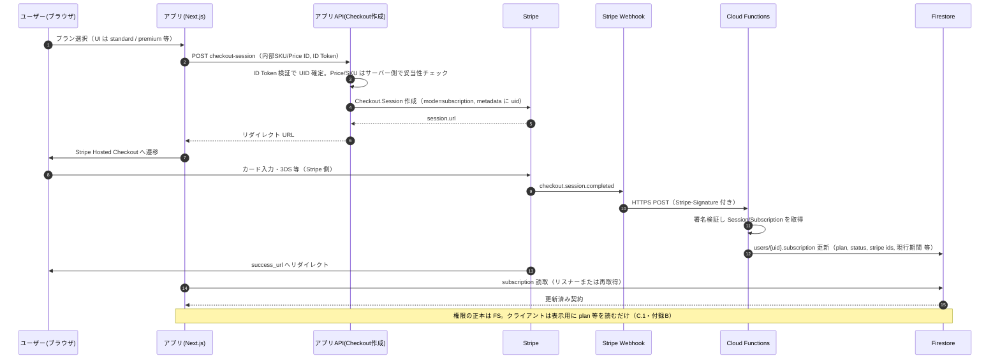
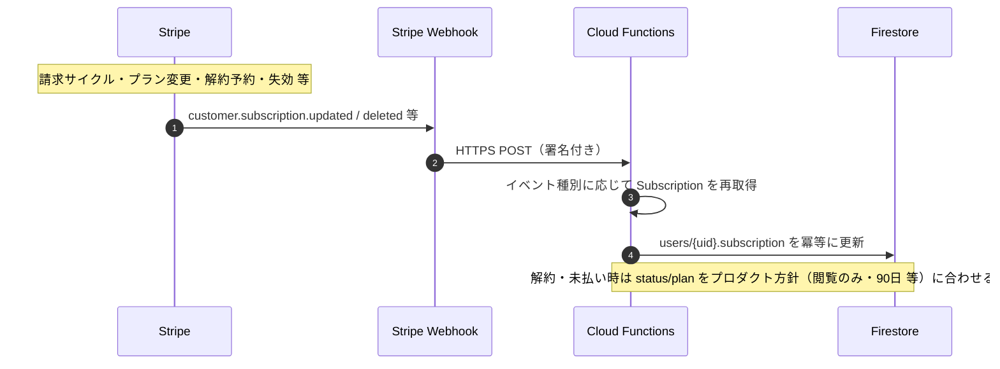
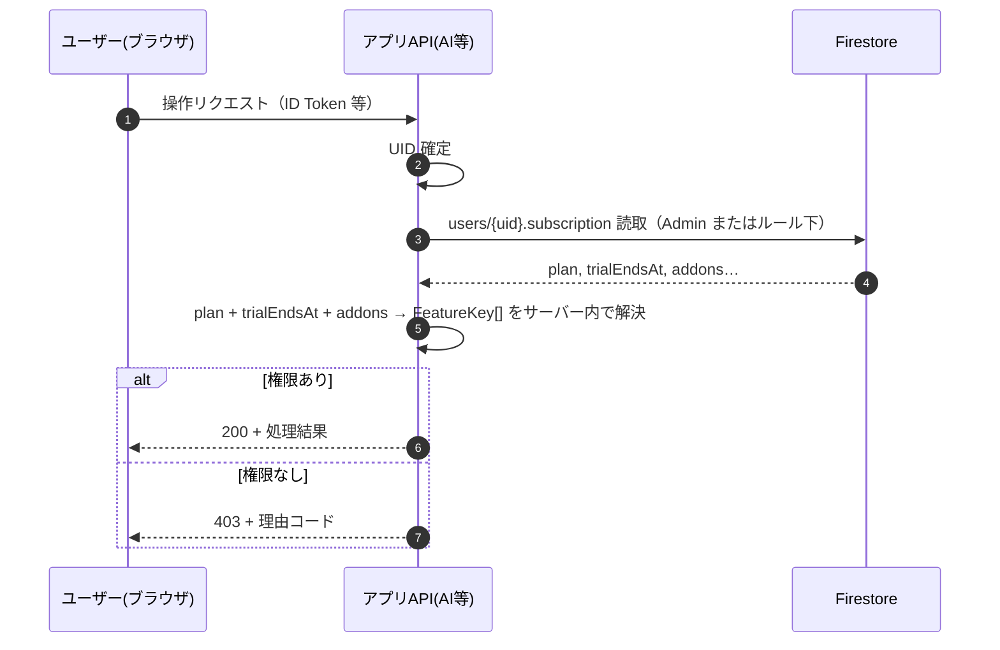

# サブスク・プロダクトスコープ（確定メモ／ロードマップ用）

## 目的

プラン対応表と実装スコープを揃え、**本バージョンでやる／やらない**と**用語**を固定する。実装の正本は [01_ROLES_AND_SUBSCRIPTION_DESIGN.md](./01_ROLES_AND_SUBSCRIPTION_DESIGN.md) §4 と連携する。

---

## 付録 A. 検討項目の「わかりやすい説明」（用語だけ先に）

設計書で出てくる次の4点は、**同じことを別の言い方**で整理しているだけです。

### A.1 「権威の所在」（誰の言う「プラン」が本当か）

- アプリはブラウザ上で動くため、**画面に表示している値だけ**では「本当に課金済みか」は証明できません（改ざんの理論上の余地）。
- **権威の所在**とは、「**サーバー側が信じる契約状態をどこに書くか**」のことです。
- 典型例:
  - **Firestore の `users/{uid}.subscription` を正**とし、クライアントは**読むだけ**。書き換えは **Cloud Functions や Admin SDK（サーバーだけが持つ鍵）**だけが行う。
  - もしくは、セキュリティルールで「本人はこのフィールドを書けない」とし、**表示は常に Firestore の値**に合わせる。
- 実装では「**ユーザーが自分で subscription を書き換えられない**」ようにし、**課金・失効・トライアル終了**は必ずサーバー経由で反映する、という方針に落ちます。

### A.2 `SubscriptionPlan`（free / standard / premium）と「28日お試し」の持ち方

- **プラン**は「契約の段階」を表す **3段階**（`free` | `standard` | `premium`）に **1:1 で対応**させます。
- **フリー会員**（`plan === 'free'` かつ気づきノートお試しなし）と **28日お試し**（スタンダード／プレミアム申込時の気づきノート試用）は **別概念**です（§1.1 参照）。フリー会員に 28日トライアルは付きません。
- **28日お試し**は **スタンダード／プレミアムへの初回申込時のみ**付与します（**再フリーなし**）。`trialEndsAt` と **`trialConsumedAt`（または同等フラグ）** で管理し、期間中は entitlement で **standard 相当の気づきノート**を許可します。
- **オプション課金**を導入する場合は **付録 C.1** のとおり **`addons`（任意）**を解決の入力に足します。

### A.3 AI 機能の「entitlement キー」を分けるとは

- **entitlement**＝「このユーザーはこの機能を使っていいか」の**スイッチ名**のことです。
- 表では「朝・晩＝AIコメント」「週・月＝レポート＋改善」と**塊が違う**ので、サーバー側の判定も **機能ごとにキーを分ける**と安全です（例: `kizuki.morning_evening.ai_comment`、`kizuki.weekly.ai_report` のような名前を付けるイメージ）。
- こうしておくと、「スタンダードでは週だけAI」「プレミアムでは全部」などを **1行ずつ ON/OFF**でき、API でも同じ名前で拒否理由を返しやすくなります。

### A.4 Q&A メッセージの「スレッド」

- **スレッド**＝「ひとまとまりの会話」の単位です。
- **パターンA（複数スレッド）**: 質問ごとに別の箱（フォーラムのトピックのように増える）。
- **パターンB（1スレッド固定）**: **コーチとクライアントのペアにつき、会話は1本のタイムライン**（LINE の1チャットのように時系列だけが伸びる）。
- 本アプリのメッセージボード UI は **1本のタイムライン**に近いため、データモデルも **パターンB（ペアあたり1会話）**を既定とし、必要になったらトピック分割を検討する、と [04_COMMUNICATION_SCREEN_IMPLEMENTATION.md](./04_COMMUNICATION_SCREEN_IMPLEMENTATION.md) と整合させる（既読・添付・編集履歴の詳細は同書）。

---

## 付録 B. 仕様確定メモ（レビュー合意）

次の方針で設計・実装に進める。

| # | 項目 | 確定内容 |
|---|------|----------|
| 1 | 権威の所在 | **`users/{uid}.subscription` を正**。クライアントは**読み取り中心**。書き換えは **Cloud Functions / Admin SDK（サーバー鍵）**のみ。 |
| 2 | プランとトライアル | **3段階の `plan` ＋ `trialEndsAt`（気づきノート28日・初回のみ）＋ `trialConsumedAt`**。フリー会員とは別。 |
| 3 | フリー会員 | **気づきノート不可・28日なし**。無償コンテンツ（7日間プログラム等）向け。 |
| 5 | AI | **機能ごとに entitlement キー**を分ける。 |
| 6 | プランと `courseId` | **standard**＝AI中心・メッセージボードなし。**premium**＝`ai_plus_personal` 相当＋Q&A。 |
| 7 | Q&A / メッセージ | **コーチ–クライアント 1 ペア 1 スレッド**。プレミアム→スタンダード時は **即時入力不可・履歴閲覧可**。 |
| 8 | データ保持 | **解約日またはプラン変更日**から **90日**。**`dataRetentionEndsAt`** に保存。 |

---

## 付録 C. アーキテクチャ案（概要）と「決済」と「entitlement」の関係

### C.1 Entitlement（権利）レイヤー（解決の入力）

サーバーは、少なくとも次を入力として **フラットな `FeatureKey[]`（またはビットマップ）**に解決する。

- **`plan`**（`free` | `standard` | `premium`）
- **`trialEndsAt`**（気づきノート **28日お試し**の終了日時。フリー会員には通常未設定）
- **`trialConsumedAt`**（任意）— 28日お試しを**一度でも消費した**日時。再付与判定用
- **`dataRetentionEndsAt`**（任意）— 解約・プラン変更起点から **90日後**の削除予定日
- **`addons`**（任意）— 将来、プランに上乗せするオプションがある場合の **契約上の追加フラグ／SKU 一覧**。**現時点でオプションが無ければフィールド自体を持たない／空**でよい。

したがって、**アーキテクチャ案の式**は「`plan` + `trial`（日付）+ `addons`（任意）」であり、**必須は `plan` + `trialEndsAt` に相当する情報**、`addons` は **商品設計が必要になったときに足す拡張**と捉える（混同しないよう、`trialEndsAt` を `trial` と読み替えてよい）。

**任意案**: Cloud Functions の `onUserWrite` 等で、読み取りコスト削減のため `users/{uid}/entitlements/current` のような**キャッシュ用ドキュメント**を更新してもよい。キャッシュの正本は常に `subscription`（＋決済プロバイダの状態）と一致させる。

### C.2 決済フローと「選択機能のキー」— よくある誤解の整理

次のようなイメージは **半分正しく、半分は権威の所在と矛盾**しやすいので分ける。

- **誤りになりやすい考え方**: ユーザーが選んだ **entitlement の `FeatureKey` 一覧**をクライアントが API に送り、そのキーを信じて「注文確定・課金・権限付与」をする。
  - クライアントは改ざん可能なため、**送られてきた `FeatureKey[]` を「この人が課金済み」の証拠にはしない**。

**推奨する分離**

1. **課金（チェックアウト）**  
   - クライアントが送るのは **「どの商品／どの料金プランか」**の識別子（例: **Stripe の Price ID**、またはサーバーが定義した **内部 SKU**）と、必要なら **オプション行**。**ログイン済み UID**（Firebase Auth）で本人を特定する。  
   - サーバーは **Checkout Session / PaymentIntent** 等を決済プロバイダに依頼し、**3D Secure 等の本人確認**は **決済プロバイダ側**のフローに任せる（「UID に紐づいたカードから引き落とし」は、実際には **決済プロバイダが保持する顧客・支払手段**に対して実行し、成功結果を Webhook で受ける形が一般的）。

2. **契約状態の更新（権威）**  
   - **支払い成功**を **サーバーだけ**が受け取る経路（例: **Webhook → Cloud Function**）で `users/{uid}.subscription` を更新する（`plan`・`renewal`・`addons` 等）。ここまで来て初めて「何に課金したか」が正として確定する。

3. **通常の API / 画面**  
   - **課金のたびにクライアントが `FeatureKey` を送るのではなく**、API は **Firestore の `subscription`（＋必要ならキャッシュ）を読み**、サーバー内で **`plan` + `trialEndsAt` + `addons` → `FeatureKey[]` を再計算**してガードする。  
   - つまり **`FeatureKey` は「表示・判定用の派生物」**であり、**決済リクエストの主キーにはしない**（主キーは **商品／Price ID と UID**）。

### C.3 二重ガード・フロント（方針メモ）

- **Firestore Security Rules**: プランに応じた `read` / `write`（最低限）。  
- **API Route / Callable Functions**: 課金対象・AI 等の重要操作は **必ずサーバーで subscription を再検証**。  
- **フロント**: 既存の `FeatureGuard` や `COMMUNICATION_PREMIUM_BOARD_UNLOCKED` 等を、**`useSubscription()` ＋共有定数（マッピング）**へ置換していく（実装フェーズの作業）。

### C.4 Stripe 前提のシーケンス図（参考）

**前提**: Stripe **Billing（Subscription）** と **Checkout Session**（`mode: subscription`）を使う想定。実装では **Price ID はサーバー側の許可リストと照合**し、クライアントから任意の Price ID をそのまま信じないこと。

#### C.4.1 初回申込〜契約反映（Checkout）

#### C.4.2 継続課金・解約・カード更新（Subscription ライフサイクル）

初回以外は **Hosted Checkout を経由しない**イベントが中心になる。代表例は次のとおり（イベント名は Stripe ドキュメントに準拠）。

#### C.4.3 課金対象 API 呼び出し（毎リクエスト）

**補足**

- **Customer Portal**（ポータルでプラン変更・請求書・支払手段）を併用する場合も、**契約の正本は Webhook 経由で FS を更新する**流れは同じ。
- **Checkout `client_reference_id`** や **Subscription `metadata`** に Firebase UID を載せ、Webhook 側で **どの `users/{uid}` を更新するか**を一意に決めるのが一般的。

---

## 1. 利用区分（プロダクト）

| 区分 | ログイン | 課金 | メモ |
|------|----------|------|------|
| **ゲスト** | 不要 | — | 未認証。公開コンテンツの閲覧中心。**ホームでは7日間導線非表示**。**ランディング**（「試してみる」経由）では7日間を選択可（§3.1・§5.1、[04_SUBSCRIPTION_STATE_TRANSITIONS.md](./04_SUBSCRIPTION_STATE_TRANSITIONS.md) §2.3）。 |
| **フリー会員** | **必須** | **なし** | 無償コンテンツ利用（将来・現版は **7日間プログラムのダミー**をホームに表示可）。**気づきノートは利用不可・28日お試しなし**（§1.1）。 |
| **スタンダード** | 必須 | あり | **AI 中心**（気づきノート＋AI）。**メッセージボードなし**（§1.2）。初回申込時のみ **28日お試し**可。 |
| **プレミアム** | 必須 | あり | **AI ＋ 月次面談コーチング ＋ Q&A**（`ai_plus_personal` 相当）。**メッセージボードあり**。初回申込時 **28日お試し**＋**初回面談セッション無料**（§6）。 |
| **個別** | 案件による | あり | 7日間プログラム本実装等。**次バージョン以降**。現版はフリー向けダミーのみ（§5.1）。 |

### 1.1 フリー会員と「28日お試し」の区別（確定）

| 概念 | 誰か | 気づきノート | 28日お試し |
|------|------|--------------|------------|
| **フリー会員** | `plan === 'free'` で登録し、有料未契約 | **利用不可** | **なし** |
| **28日お試し** | **スタンダード／プレミアム初回申込**の一環（フリー会員ではない） | 期間中 **standard 相当** | `trialEndsAt`（JST 28日）。**再付与なし**（`trialConsumedAt` 等） |

- ゲスト→フリー: **会員登録（Google）＋利用規約・プライバシー同意**のみ（スタンダード申込は不要）。
- ゲスト→スタンダード／プレミアム: 申込フォーム＋各コース規約。**気づきノート28日**はここで付与（クーリングオフ等の契約前試用を含む意味合い）。
- 有料→フリー／ゲスト（退会・ダウングレード）: **再フリー期間なし**（28日お試しは再付与しない）。

### 1.2 プランと `courseId`・機能の対応（確定）

| 表示コース | `plan` | `courseId`（論理） | 主な機能 | メッセージボード |
|------------|--------|-------------------|----------|------------------|
| スタンダード | `standard` | AI 中心（人コーチ月次面談・Q&A は含まない運用） | 気づきノート＋AI | **なし** |
| プレミアム | `premium` | **`ai_plus_personal` 相当** | 上記 ＋ **月1回面談コーチング** ＋ **Q&A** | **あり** |

- 人コーチの月次質問枠・ジャーナル共有の詳細は [03_JOURNAL_COACH_AI_PLANS_AND_CAPABILITIES.md](./03_JOURNAL_COACH_AI_PLANS_AND_CAPABILITIES.md) のマトリックスに従う。**プレミアム**が `ai_plus_personal` 相当とする。
- entitlement の正本は `resolveEntitlements`（`communication.message_board` は **premium かつ有効契約**時のみ true）。

### 1.3 コース選択の変化（外部仕様・UI）

コース遷移の一覧（前コース×後コース×UI 可否・導線・データ保持）は **[04_SUBSCRIPTION_STATE_TRANSITIONS.md](./04_SUBSCRIPTION_STATE_TRANSITIONS.md)**（草案）を正とする（定常状態一覧・遷移表1〜12・plan×`primaryCourse`）。実装フェーズでは **画面先行 → Firestore 手動／開発用切替で検証 → Stripe（Phase C）** の順とする（§9）。

| UI 文脈 | 用途 |
|---------|------|
| **ランディング／会員登録** | ゲストからの初回（フリー登録、スタンダード／プレミアム申込） |
| **コース変更ページ** | ログイン済み会員のプラン変更・退会 |
| **退会画面** | ゲスト化・データ保持案内 |

### 1.4 サービス選択ランディング（`/trial_4w/landing`）

ゲストがホームから「試してみる」等で最初に触れる**コース選択**画面。

| コース（表示） | CTA「やってみる」 | 導線（現行） |
|----------------|-------------------|--------------|
| **7日間・セルフコーチング（フリーコース）** | 有効 | 未ログイン: `/login` → `/post-login` → 未同意なら `/consent` → **`/start-program`**（7日間スタートプログラム・現状はダミー画面） |
| **7日間・プライベートコーチ** | **非表示**（検討中） | — |
| **気づきノート・AIコーチ（スタンダード）** | 有効 | 同上 → `/trial_4w`（28日お試し／将来は申込フォームへ差し替え） |
| **気づきノート・プライベートコーチ（プレミアム）** | 表示（CTA は申込実装まで無効可） | 将来: プレミアム申込フロー |

**グローバルナビ（左サイドバー・中央ヘッダー）**: 左「**スタート**」→ **`/start-program`**（7日間スタートプログラム）。左「**実行**」→ **`/trial_4w`**（気づきノート本編・`/trial_4w/settings` を含む。`/trial_4w/landing` はコース選択のため「実行」対象外）。中央ヘッダー表記は **`/`・`/trial_4w/landing`・利用規約等**: 「人生学び場　こころ道場」+®／**`/start-program`**: 「スタートプログラム」／**`/trial_4w`（`landing` 除く）**: 「気づきノート」。実装は `LeftSidebar`・`ProtoHeader`。詳細は [04_HOME_SCREEN_IMPLEMENTATION.md](./04_HOME_SCREEN_IMPLEMENTATION.md) §1.2。

**特商法表記**: ランディングに**全文を載せるだけでは不十分**なことが多い。有料価格（月額等）を掲示する以上、**常時参照できる専用ページ**（例: `/legal/tokushoho`）をフッター等からリンクし、**申込・決済の直前**でも再確認できるようにする（§8・§1.5）。

### 1.5 特定商取引法に基づく表記（掲載項目チェックリスト）

課金開始前・料金表示ページで、少なくとも次を**確定・掲載**する（法務確認必須）。

| # | 項目 |
|---|------|
| 1 | 販売事業者名（商号） |
| 2 | 代表者または運営責任者 |
| 3 | 所在地 |
| 4 | 電話番号（問い合わせ受付時間を含む場合あり） |
| 5 | メールアドレス等の連絡先 |
| 6 | 販売価格（税込／税別、月額・年額、オープン価格の条件と終了時期） |
| 7 | 代金の支払時期・方法（クレジットカード、Stripe 等） |
| 8 | サービス提供時期（申込後いつから利用可能か、28日お試しの終了後の扱い） |
| 9 | 解約・返品・キャンセル（解約の効力、クーリングオフ、返金の有無） |
| 10 | 定期購入である旨（サブスクリプションの更新サイクル） |
| 11 | 動作環境・その他販売条件（推奨ブラウザ等、任意だが推奨） |

**掲載場所の目安**

| 場所 | 内容 |
|------|------|
| **全ページフッター** | 利用規約・プライバシー・**特定商取引法に基づく表記**へのリンク |
| **ランディング** | 料金表示の近くに短い注記＋上記ページへのリンク（全文は専用ページ） |
| **有料申込画面** | 申込確認前に特商法リンク・重要事項（試用終了、自動更新等） |
| **Stripe Checkout 前** | 上記と整合した最終確認 |

**フリーコース（¥0）のみ**の申込では、特商法の「販売価格」は該当しにくいが、**事業者情報の掲示**と**利用規約・プライバシー同意**は引き続き必要。

---

## 2. 気づきノート（名称）

- **プロダクト名**: **気づきノート**（旧称: マネジメント日誌／ジャーナリング日誌／学び帳での呼称）。
- **Firestore パス**: 既存の `journal_daily` / `journal_weekly` / `journal_monthly` は**変更しない**（移行コスト回避）。ドキュメント・UI 表記を気づきノートに統一していく。

---

## 3. 28日お試し（気づきノート・スタンダード／プレミアム申込時）

**対象**: スタンダード／プレミアムへの**初回申込**時のみ。**フリー会員とは別**（§1.1）。

| 項目 | 内容 |
|------|------|
| **期間** | **28日**。申込（お試し開始）日を起点（**JST**）。 |
| **期間中** | **残り日数**を画面に表示。entitlement で **standard 相当の気づきノート**（AI 含む）を許可。 |
| **再付与** | **なし**。一度消費したら `trialConsumedAt`（等）を記録し、以降のダウングレード→再申込でも **28日は付けない**。 |
| **失効直後（有料未確定・誘導キャンセル含む）** | **閲覧のみ**、**入力ロック**。ホームマネジメント欄にオーバーレイ（有効期間終了・**データ消去までの残日数**）。 |
| **データ保持** | 失効・解約・プラン変更の起点日から **90日**後に破棄（§3.2）。**外部エクスポートは本バージョン未実装**。 |
| **失効後（課金導線）** | 「続けますか？」＋**スタンダード申し込み**等（UI 仕様で確定）。 |

※期間中の能力は [03_JOURNAL_COACH_AI_PLANS_AND_CAPABILITIES.md](./03_JOURNAL_COACH_AI_PLANS_AND_CAPABILITIES.md) と `resolveEntitlements` で一致させる。

### 3.1 ホーム表示（ゲスト／フリー会員／お試し中）

| 対象 | 7日間プログラム導線 | マネジメント情報・お試し系表示 |
|------|---------------------|--------------------------------|
| **ゲスト** | **ホーム非表示**（「試してみる」→ **ランディング**では7日間「やってみる」**有効**） | 非表示 |
| **フリー会員** | **表示可**（現版は **ダミープログラム**でテスト可） | 気づきノートお試し用の表示は **出さない** |
| **スタンダード／プレミアム** | **ホームに7日間行は出さない** | 有効 |
| **28日お試し中**（申込フロー内） | コースによる | **残り日数・制限の補足**を表示可 |

### 3.2 データ保持（90日）と `dataRetentionEndsAt`（確定）

| 項目 | 内容 |
|------|------|
| **起点** | **解約日** または **プラン変更日**（ダウングレード・退会を含む）。 |
| **保存** | `users/{uid}.subscription.dataRetentionEndsAt`（**起点＋90日**の Timestamp）。 |
| **画面** | 残日数は `dataRetentionEndsAt` から算出（例: オーバーレイ「○○日後にデータは消去されます」）。 |
| **物理削除** | `dataRetentionEndsAt` 経過後にバッチ等で削除（実装は Phase C 以降でも可。方針は先に固定）。 |
| **プレミアム→スタンダード** | メッセージボードデータも **90日後削除**（§4.1）。期間中は **履歴閲覧のみ**（§4.1）。 |

---

## 4. 共有・コミュニケーション（確定メモ）

| 項目 | 内容 |
|------|------|
| **「学びノート共有」** | **既存のコーチ共有（✅）と同一**の意味とする。気づきノート全体を別スイッチで一括公開するモデルには**しない**（データモデルは既存のコーチ共有スキーマに合わせる）。 |
| **未提供機能の UI** | **表示しない**（「プレミアムだが近日」等のラベルは使わない）。API は **403 + 理由コード**（または設計で定めたコード）で統一する方針とする。 |

### 4.1 プレミアム→スタンダード時のメッセージボード（Q&A）（確定）

| 項目 | 内容 |
|------|------|
| **効力** | プラン変更と**同時（即時）**にメッセージボードの **新規送信・編集を不可**とする。 |
| **履歴** | **閲覧は可**（入力欄・編集 UI は無効化または案内表示）。 |
| **データ** | スレッドデータは **`dataRetentionEndsAt` まで保持**し、**90日経過後に削除**（§3.2）。 |
| **entitlement** | `communication.message_board` は **false**（`resolveEntitlements`・API・UI で一致）。 |

---

## 5. 本バージョンでは実施しない（バージョンアップで扱う）

| 領域 | 方針 |
|------|------|
| **外部データ入出力**（Google Doc / JSON 等） | **今回は実装しない**。バージョンアップで対応。 |
| **7日間プログラム（本実装）** | **次バージョン**で本格提供。現版は **ダミープログラム**のみ（§5.1）。 |

### 5.1 7日間プログラム（現バージョン・確定）

| 項目 | 内容 |
|------|------|
| **目的** | フリー会員向け無償コンテンツの受け皿（将来の本実装に備える）。 |
| **現版** | **ダミープログラム**を用意し、**フリー会員のホームにのみ表示**する。 |
| **ゲスト** | **ホーム**では7日間導線・ブロックは **非表示**。**ランディング**（`/trial_4w/landing`）では7日間を選択可。 |
| **データ** | 本番スキーマの予約は行わない（必要時にロードマップで定義）。 |

---

## 6. コミュニケーション（Zoom・面談コーチング・既存組込み）

| 項目 | 方針 |
|------|------|
| **コーチ Zoom 面談** | **別アプリ**で実施（本システムへの Zoom 組込みは現段階では行わない）。 |
| **プレミアム「セッション」** | **月1回の面談コーチング**。実施は別アプリ Zoom。**初回1回は無料**（申込時特典）。 |
| **本アプリの役割** | 初回無料の**案内**、利用済みフラグ、予約・導線（詳細は UI 仕様）。Firestore 例: `coaching.firstSessionFreeAvailable` / `coaching.firstSessionUsedAt`（[03_FIRESTORE_DATABASE_STRUCTURE.md](./03_FIRESTORE_DATABASE_STRUCTURE.md)）。 |
| **本アプリに既に組み込んでいる機能** | **運用を含めて再検討**する（仕様・担当・導線の見直し）。 |

アプリ内メッセージ（Q&A 相当）のプラン連動・ダウングレード時の挙動は [04_COMMUNICATION_SCREEN_IMPLEMENTATION.md](./04_COMMUNICATION_SCREEN_IMPLEMENTATION.md) を参照。

---

## 7. Phase C（決済・Stripe）— 「Stripe 側の設計」かどうか

Phase C の C1〜C3 は **Stripe ダッシュボード上の設定だけ**では完結せず、**Stripe が提供するイベントとオブジェクト**を受け取り、**自社（Cloud Functions ＋ Firestore ＋ アプリ）で実装する統合設計**です。

| Step | Stripe 側で行うこと（主） | 自社側で行うこと（主） |
|------|---------------------------|-------------------------|
| **C1** | Products / Prices、Checkout・Customer Portal の有効化、**Webhook エンドポイント登録**、署名シークレット、顧客・Subscription のライフサイクル | **Webhook ハンドラ**（例: Cloud Functions）で署名検証、`customer.subscription.*` / `checkout.session.completed` 等を購読し、**`users/{uid}.subscription` を冪等に更新**（`stripeCustomerId` / `stripeSubscriptionId` / `currentPeriodEnd` / `plan` 相当のマッピング） |
| **C2** | （該当なし。entitlement は Stripe の概念ではない） | `subscription` 更新後に **`resolveEntitlements` と同値の状態**を保証する（必要なら `users/{uid}/entitlements/current` 更新）。**クライアント通知**（FCM、または Firestore `onSnapshot` のみ）も自社 |
| **C3** | Billing の **`past_due` / `unpaid` 等**のステータスを Subscription に付与し、**Webhook でイベント通知** | イベントを受けて **`users/{uid}.subscription.status`**（または専用フィールド）を更新し、**猶予の文言・API の拒否／許可**を [04_PHASE_B_API_INTERNAL_DECISIONS.md](./04_PHASE_B_API_INTERNAL_DECISIONS.md) と矛盾なく定義する（表示コピーはプロダクト／法務） |

**まとめ**: Phase C は **「Stripe Billing の設定」＋「自社の Webhook・データモデル・UI/API」**の合わせ技であり、**Stripe 側の設計に丸投げできるフェーズではありません**。

---

## 8. 運用前に決める外部仕様（チェックリスト）

「外部仕様」とは、**利用者・契約・法務・サポートが読む表現と約束**（画面・メール・Web・領収書周り）を指す。技術的な器（Firestore・API）は別ドキュメント。

| 領域 | 運用までに決めること（例） |
|------|------------------------------|
| **料金・プラン表示** | standard / premium の **税込／税別**、**年払い有無**、キャンペーン価格の **表示条件と終了日**（[要件定義の料金表記](./01_REQUIREMENTS_SPECIFICATION.md) と整合）。 |
| **契約・法務** | **利用規約・プライバシーポリシー**に、サブスク・解約・データ保持（**90 日**等）、AI 利用、コーチ共有の取り扱いを追記するか。**特定商取引法**に必要な表記（事業者情報・代金支払時期等）を **課金開始前**に用意。 |
| **無料トライアル** | 「いつからいつまで」「何ができるか」「終了後に何が起きるか（閲覧のみ・入力ロック・データ削除予告）」の **ユーザー向け文言**（本書 **§3** と矛盾しないこと）。 |
| **課金・解約・失敗** | **支払い失敗（猶予）**中にできること／できないこと、**解約の効力発生**（即時 vs 期間末）、**返金ポリシー**（原則不可など）を **ヘルプまたは特商法ページ**に明記。 |
| **Stripe 顧客向け** | Checkout / Customer Portal で表示される **事業者名・サポート連絡先**、**メールレシート**の有無、**請求書の言語**（日本語の要否）。 |
| **データ・エクスポート** | 外部出力は「次ステップ」としている間の **問い合わせ窓口**（手動対応可否）。 |
| **サポート** | 課金・ログイン・割当コーチ不整合の **問い合わせチャネル**と SLA（目安）。 |

---

## 9. Stripe のインストール・組込みタイミング（推奨）

| フェーズ | Stripe を触る範囲 |
|----------|-------------------|
| **Phase A（済／データのみ）** | **不要**。アカウント作成のみ先行してもよいが、アプリへの SDK 組込みは不要。 |
| **Phase B（API・entitlement）** | **本番課金は不要**。`GET /api/me/subscription` や AI ガードは **Firestore の `subscription` モック／手動更新**で検証可能。 |
| **Phase C 着手直前〜C1** | **ここから本格組込み**。**(1)** Stripe ダッシュボードで Products / Prices 作成、**(2)** テストモードの **API キー・Webhook 署名シークレット**を **開発環境（Cloud Functions / Vercel のサーバー環境変数）**に設定、**(3)** `checkout.session` 作成 API または Cloud Function、**(4)** **Webhook エンドポイント**をデプロイして **テストイベント**で `users/{uid}.subscription` 更新を検証。 |
| **本番リリース前** | **ライブモード**への切替、**Customer Portal** の有効化、**本番 Webhook URL**、**ドメイン・メール**の Stripe 側設定、**猶予（C3）文言**の確定。 |

**npm パッケージ**: サーバーで Checkout Session を作る場合は **`stripe` Node SDK** を Route Handler または Cloud Functions に追加するタイミングは **Phase C1 と同じ**。クライアントに **秘密鍵を置かない**こと。

**結論**: **Phase B 完了後、Phase C1 の実装開始と同じタイミング**で Stripe を「インストール（SDK・環境変数）＋ Webhook 組込み」するのが自然である。それより前はダッシュボード上の商品設計だけ先行可能。

---

## 10. 参照

- [01_ROLES_AND_SUBSCRIPTION_DESIGN.md](./01_ROLES_AND_SUBSCRIPTION_DESIGN.md) §4・§6.1  
- [04_COMMUNICATION_SCREEN_IMPLEMENTATION.md](./04_COMMUNICATION_SCREEN_IMPLEMENTATION.md)  
- [03_JOURNAL_COACH_AI_PLANS_AND_CAPABILITIES.md](./03_JOURNAL_COACH_AI_PLANS_AND_CAPABILITIES.md)  
- [04_PHASE_B_API_INTERNAL_DECISIONS.md](./04_PHASE_B_API_INTERNAL_DECISIONS.md)（API 層・エラー形式）

---

## 更新履歴

| 日付 | 内容 |
|------|------|
| 2026-05-12 | 初版: 利用区分、28日JST・失効UI、スコープ外、Zoom・個別の方針反映。 |
| 2026-05-12 | 付録A（権威の所在／plan+trial／entitlement キー／Q&A スレッドの平易説明）、失効後の閲覧のみ・90日破棄・ホームオーバーレイ、3.1（ゲスト非表示）、共有＝既存コーチ共有、未提供UI非表示を追記。 |
| 2026-05-12 | 付録B（1・2・5・7 確定）、付録C（entitlement 解決入力・決済と FeatureKey の分離・二重ガード／フロント方針）。A.2 に `addons` 任意の注記。 |
| 2026-05-12 | 付録 C.4: Stripe 前提の Mermaid シーケンス（初回 Checkout・Subscription ライフサイクル・API ガード）。 |
| 2026-05-12 | §7: Phase C と Stripe／自社の分担（C1〜C3）。§8 を参照索引に変更。 |
| 2026-05-12 | §8 運用前外部仕様チェックリスト、§9 Stripe 組込みタイミング。§10 を参照索引に変更。 |
| 2026-05-17 | §1.1〜1.3: フリー会員と28日お試しの分離、プラン×courseId、コース遷移UI。§3〜3.2: 再フリーなし、`dataRetentionEndsAt`。§4.1: プレミアム→スタンダードのQ&A。§5.1: 7日間ダミー（フリーのみ表示）。§6: 初回面談無料。付録A.2・B 更新。 |
| 2026-05-17 | §1.4〜1.5: ランディング導線・特商法チェックリスト。7日間プライベートコーチ非表示、セルフ＝フリー CTA。気づきノートプレミアム列は表示。 |
| 2026-05-20 | §1.4: 7日間フリー CTA の遷移先を **`/start-program`** に変更。グローバルナビ（スタート＝7日間、実行＝気づきノート）とヘッダー表記を追記。 |
