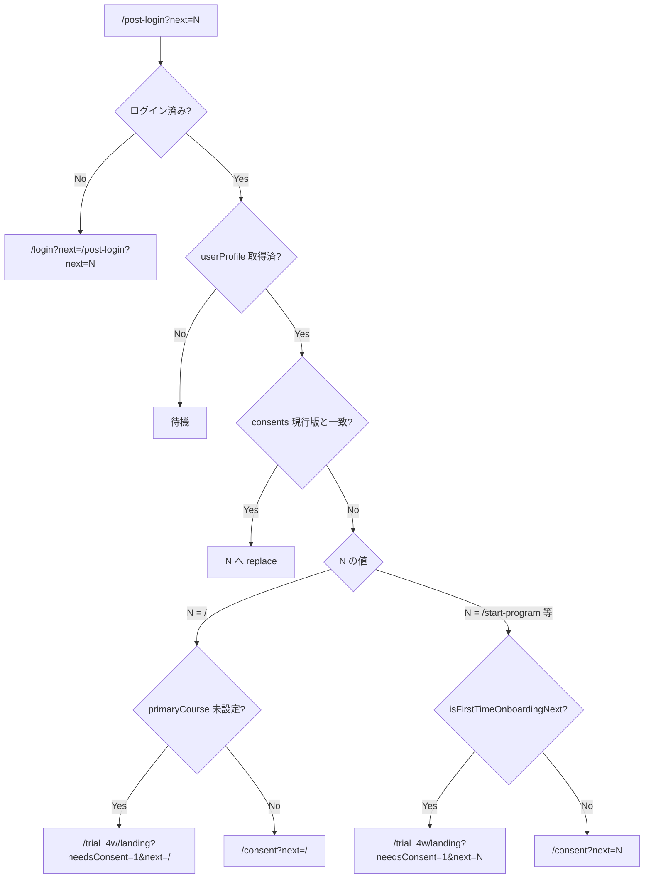
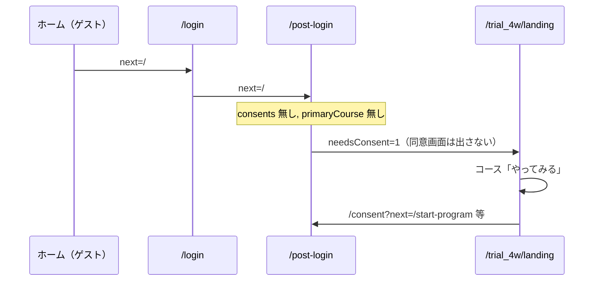
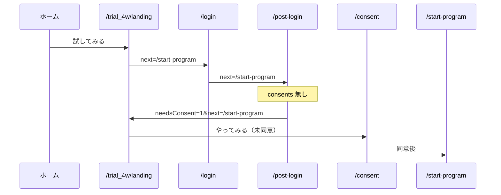
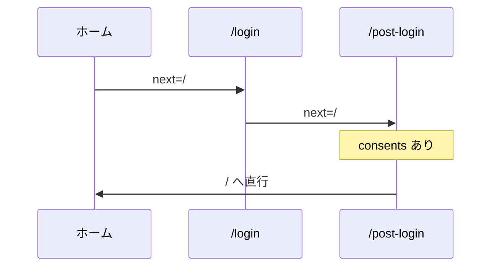

# サブスク状態遷移・外部仕様（草案）

## 📋 ドキュメント情報

| 項目 | 内容 |
|------|------|
| **目的** | 入会・コース選択・ログアウト・ダウングレード時の **UI／導線／機能可否** を一覧化する。実装・テストの正本とする。 |
| **ステータス** | **草案**（2026-05-25）。プロダクト表「サブスクコース選択の変化」12枚＋「コース別の使用可能機能一覧」＋ plan×primaryCourse マトリクスを反映。 |
| **参照** | [04_SUBSCRIPTION_PRODUCT_SCOPE.md](./04_SUBSCRIPTION_PRODUCT_SCOPE.md)、[04_HOME_SCREEN_IMPLEMENTATION.md](./04_HOME_SCREEN_IMPLEMENTATION.md)、[04_TEST_ONBOARDING_CHECKLIST.md](./04_TEST_ONBOARDING_CHECKLIST.md) |

---

## 1. 読み方

### 1.1 遷移表（表1〜12）の列

| 列 | 意味 |
|----|------|
| **左列** | **変化前**の会員種別 |
| **右列** | **変化後**の会員種別 |

表題の「A→B」と列見出し（A｜B）を一致させる。

### 1.2 記号

| 記号 | 意味 |
|------|------|
| **有効** | 表示・操作可能 |
| **無効** | 非表示、または操作不可（必要に応じて案内メッセージ） |
| **—** | 当該画面・文脈では該当なし |
| **選択中** | ランディング等で現在のコースとして表示 |
| **選択** | コース変更画面で他コースへ変更可能 |

### 1.3 会員種別と Firestore

| 表示 | `subscription.plan` | 備考 |
|------|---------------------|------|
| **ゲスト** | （未認証） | ロールなし |
| **フリー会員** | `free` | 7日間スタートプログラム（ダミー）向け。28日お試しなし |
| **スタンダード** | `standard` | 気づきノート＋AI。メッセージボードなし |
| **プレミアム** | `premium` | 上記＋メッセージボード（Q&A）等 |

**補足**: ノート導線の可否は `enrollment.primaryCourse`（`start7d` / `kizuki`）も参照する（§4）。


### 1.4 実装後チェック（OK欄）

| 項目 | 内容 |
|------|------|
| **用途** | §3（定常状態）・§5（遷移表）の **OK** 列は、実装後の画面確認・手動テスト記録用 |
| **記入例** | `OK`、`NG: 理由`、`2026-05-25 確認`、担当者イニシャル |
| **正本** | Excel 表と本 Markdown を **行番号（#列）** で突合 |
| **関連** | [04_TEST_ONBOARDING_CHECKLIST.md](./04_TEST_ONBOARDING_CHECKLIST.md)（導線テスト）、本書 §3・§5（UI可否） |

---

## 2. 全体方針（確定）

### 2.1 会員同意（A案）

| 場面 | 同意 |
|------|------|
| **初回入会**（ゲスト→フリー／STD／PRE） | `/consent` で **1回**（`users.{uid}.consents`）。7日間専用の二重同意は**廃止** |
| **既存会員のコースアップグレード**（例: フリー→STD、STD→PRE） | **再同意なし**（`consents` 済みなら申込・コース変更のみ） |
| **同意済み後の遷移** | `next` クエリ先へ直行（例: `/start-program`、`/trial_4w`） |

### 2.1.1 初回入会の導線（未同意ログイン直後）

表1（ゲスト→フリー）では、**ログイン直後にいきなり7日間へ進ませない**。コース一覧（ランディング）で意思決定してから同意へ進む。

| 場面 | 導線 |
|------|------|
| **ゲスト**がランディングでコース選択 → ログイン | `login?next=<最終行先>`（login が `post-login?next=...` にラップ） |
| **未同意**で `post-login` の `next` がコース先（`/start-program` 等） | **`/trial_4w/landing?needsConsent=1&next=...`** へ戻す（案内バナー表示） |
| ランディングで**再度**コース「やってみる」（ログイン済・未同意） | **`/consent?next=...`**（選択したコース先） |
| **初回の誤操作**（未同意・コース未選択で「ログインして続きから」、`next=/`） | **`/trial_4w/landing?needsConsent=1&next=/`**（同意画面は出さない） |
| **再ログイン**（同意済みで「ログインして続きから」、`next=/`） | **`/`** へ直行 |
| **再同意**（コース選択済み・未同意で `next=/`） | **`/consent?next=/`** → 同意後ホーム |
| **同意済み**でコース CTA | `post-login` または目的 URL へ直行 |

実装: `src/lib/onboardingFlow.ts`、`src/app/post-login/page.tsx`、`src/app/trial_4w/landing/page.tsx`

### 2.1.2 認証・同意の分岐フロー図（2026-06-05）

**URL の約束**: `/login?next=` には**最終行先のみ**を渡す。`/login` はログイン成功後に必ず `/post-login?next=<同じ行先>` へ遷移する。`next` に `/post-login?next=...` を入れると二重ラップになり分岐が壊れる（`normalizeAuthNext` で救済）。

#### 判定に使う値（Firestore `users/{uid}`）

| フィールド | 意味 | 未設定時 |
|------------|------|----------|
| `consents` | 利用規約・プライバシー同意（版一致で有効） | 未同意 |
| `enrollment.primaryCourse` | 初回選択コース（`start7d` / `kizuki`） | `null`＝コース未選択＝初回入会途中 |

#### `/post-login` 分岐（正本）



#### 入口別シーケンス

**① 初回・誤操作「ログインして続きから」**（NG_02）



**② 初回・正規「試してみる」→ 7日間**



**③ 再ログイン（同意済み）**



#### 実装ファイル対応

| 画面 | ファイル | 役割 |
|------|----------|------|
| `/login` | `src/app/login/page.tsx` | `next` を `normalizeAuthNext` → `/post-login?next=...` |
| `/post-login` | `src/app/post-login/page.tsx` | 上記フローチャートの分岐 |
| `/trial_4w/landing` | `src/app/trial_4w/landing/page.tsx` | `needsConsent=1` バナー、未同意 CTA→`/consent` |
| `/consent` | `src/app/consent/page.tsx` | 同意保存 → `next` へ |
| ホームバナー | `src/components/HomePage.tsx` | `RETURNING_LOGIN_HREF` = `/login?next=/` |
| 共通 | `src/lib/onboardingFlow.ts` | `normalizeAuthNext`, `isPreOnboardingUser`, `isFirstTimeOnboardingNext` |

### 2.2 同意後の導線（文言）

URL 直書きではなく、次の **目的ベース** の表現を仕様表に用いる。実装時は下表の `next` にマッピングする。

| 目的 | 仕様表の表現 | 実装 `next`（代表） |
|------|--------------|---------------------|
| 7日間スタートプログラム | 会員同意→**スタートプログラム**へ | `/consent?next=/start-program` |
| 気づきノート（AI／STD） | 会員同意→**気づきノート**へ | `/consent?next=/trial_4w`（または `?apply=ai_coach`） |
| 気づきノート・プレミアム | 会員同意→**気づきノートのプレミアムコース**へ | 申込フロー確定後に URL 固定（Stripe 前） |

### 2.3 7日間スタートプログラムの表示

| 場所 | ゲスト | フリー会員 | STD／PRE |
|------|--------|------------|----------|
| **ホーム** | 7日間導線**非表示**（「試してみる」→ランディングのみ） | スタート／案内あり | 7日間行は**表示しない** |
| **ランディング** | **やってみる 有効** | **選択中**（7日間を選んだ定常状態） | **—** |

ゲスト（新規）も **ホーム「試してみる」→ ランディング** 経由で 7日間を選択できる。

### 2.4 28日お試し（気づきノート）

| 項目 | 内容 |
|------|------|
| **対象** | **スタンダード／プレミアム初回申込時のみ** |
| **期間** | 28日（JST）。`trialEndsAt` |
| **再付与** | **なし**（`trialConsumedAt`） |
| **期間中** | standard 相当の気づきノート |
| **コース変更画面** | 選択中コースに **（お試し付き）** と表示可 |

### 2.5 メッセージボード（プレミアム→下位コース）

| 項目 | 内容 |
|------|------|
| **即時** | 新規投稿・編集**不可** |
| **履歴** | **閲覧可**（入力 UI は無効または案内） |
| **データ** | `dataRetentionEndsAt` まで保持し **90日後削除** |

表11（PRE→フリー）、表12（PRE→STD）の備考に明記。

### 2.6 マイページ（本バージョン）

| 項目 | 内容 |
|------|------|
| **サイドバー** | **リンクなし**（全コース **無効**） |
| **直アクセス** | `/mypage` は**許可**（仕様詰め前の既存画面） |

### 2.7 コース変更画面・申込フォーム

| 項目 | 内容 |
|------|------|
| **スコープ** | **新規画面**。Stripe 接続**前**に画面イメージを確定し実装 |
| **コース変更** | `/courses/change`（仮画面・デモ） |
| **申込フォーム** | `/apply?plan=standard\|premium`（仮画面・デモクラティック情報） |

---

## 3. コース別の使用可能機能一覧（定常状態）

ログイン状態・プランが安定しているときの UI。遷移表（§5）の「変化後」列と整合させる。

### 3.1 定常状態チェック一覧

実装後の画面確認用。**OK** 欄にチェック（`OK` / 日付 / 担当者など）を記入する。

※フリー会員で `enrollment.primaryCourse = start7d` のとき、サイドバー「ノート」は **無効**（§4）。

| # | UI（画面など） | コンポーネント | ゲスト | フリー | スタンダード | プレミアム | OK |
|---|----------------|----------------|--------|--------|--------------|------------|-----|
| 1 | ヘッダ | — | ゲストアイコンのみ | ログインユーザアイコン | 同左 | 同左 |  |
| 2 | サイドバー | ホーム | 有効 | 有効 | 有効 | 有効 |  |
| 3 | サイドバー | スタート | 無効 | 有効 | 有効 | 有効 |  |
| 4 | サイドバー | ノート | 無効 | 無効 | 有効 | 有効 |  |
| 5 | サイドバー | コミュニケーション | 有効 | 有効 | 有効 | 有効 |  |
| 6 | サイドバー | マイページ | 無効 | 無効 | 無効 | 無効 |  |
| 7 | ホーム | バナー① | 試してみる | スタートから始める→スタート | 同左 | 同左 |  |
| 8 | ホーム | バナー② | ログインして続ける | 気づきノートを試す→ランディング | 気づきノートを続ける→ノート | 同左 |  |
| 9 | ホーム | マネジメント情報 | 無効（メッセージ） | 無効（メッセージ） | 有効 | 有効 |  |
| 10 | スタート画面 | 「気づきノート」ボタン | — | 気づきノートを試す→ランディング | 気づきノートへ | 同左 |  |
| 11 | ノート画面 | 行動宣言 | 無効 | 無効 | 有効 | 有効（共有あり） |  |
| 12 | ノート画面 | 朝・晩 | 無効 | 無効 | 有効 | 有効 |  |
| 13 | ノート画面 | 週 | 無効 | 無効 | 有効 | 有効（共有あり） |  |
| 14 | ノート画面 | 月 | 無効 | 無効 | 有効 | 有効（共有あり） |  |
| 15 | コミュニケーション | 館長から | 有効 | 有効 | 有効 | 有効 |  |
| 16 | コミュニケーション | メッセージボード | 無効 | 無効 | 無効 | 有効 |  |
| 17 | ログインパネル | ユーザIDセレクト | 有効 | — | — | — |  |
| 18 | ランディング | 7日間スタートプログラム | やってみる 有効 | 選択中 | — | — |  |
| 19 | ランディング | 気づきノート AIコーチ | やってみる 有効 | やってみる 有効 | 選択中 | — |  |
| 20 | ランディング | 気づきノート パーソナルコーチ | やってみる 有効 | やってみる 有効 | やってみる 有効 | 選択中 |  |
| 21 | コース変更 | フリーコース | — | — | 選択（90日保存メッセージ） | 選択（同上） |  |
| 22 | コース変更 | スタンダードコース | — | — | 選択中（お試し付き） | 選択（同上） |  |
| 23 | コース変更 | プレミアムコース | — | — | 選択→会員同意→プレミアムコースへ | 選択中（お試し付き） |  |
| 24 | 会員同意 | 利用規約・プライバシー | ランディングの次に表示 | 同左 | 同左 | 同左 |  |
| 25 | 申込フォーム | 入力欄 | — | — | 同意画面の後 | 同意画面の後 |  |

- コミュニケーション（サイドバー）: ゲスト・フリーは **館長からのみ**（メッセージボードタブは出さない）。
- マネジメント無効時メッセージ例:「試してみる」から気づきノートを選択すると有効になります。
- 初回入会: ランディング → 会員同意 →（有料なら）申込フォーム（`/apply?plan=...`）。
- コース変更: `/courses/change`（ログイン済み STD/PRE）。

---

---

## 4. plan × `enrollment.primaryCourse` 補足

遷移表は `plan` 中心。実装（`src/lib/enrollmentCourse.ts`）では **`primaryCourse`** もノート可否に effect する。

| `plan` | `primaryCourse` | サイドバー「ノート」 | ホームバナー（代表） |
|--------|-----------------|----------------------|----------------------|
| `free` | `start7d` | **無効** | 7日間案内文（スタートへ）。「気づきノートを続ける」**出さない** |
| `free` | `kizuki` または未設定 | 有効（お試し／申込済み相当） | 「気づきノートを続ける」 |
| `standard` / `premium` | 任意 | 有効 | 「気づきノートを続ける」 |
| ゲスト | — | 無効 | 試してみる／ログインして続きから |

- `start7d` は `/start-program` 到達時に設定。`kizuki` へは**昇格のみ**（降格しない）。
- 7日間のみユーザーが AIコーチ「やってみる」→ `?apply=ai_coach` でノート導線を開く。

---

## 5. 状態遷移チェック一覧（表1〜12）

各表は Excel「サブスクコース選択の変化」と **1行ずつ突合** できるよう全24行を展開している。
**OK** 欄に実装確認結果を記入する（例: `OK` / `NG: 理由` / 確認日）。

**列見出し**: 左＝変化前、右＝変化後。

### 表1 — ゲスト → フリー（7日間スタートプログラム）

初期条件：users/{uid}削除：

| # | UI（画面など） | コンポーネント | ゲスト（変化前） | フリー（変化後） | 備考 | OK |
|---|----------------|----------------|-------------|-------------|------|-----|
| 1 | ヘッダ | — | ゲストアイコンのみ | ログインユーザアイコン |  | (OK,OK)  |
| 2 | サイドバー | ホーム | 有効 | 有効 |  |(OK,OK)  |
| 3 | サイドバー | スタート | 無効 | 有効 |  |(OK,OK)  |
| 4 | サイドバー | ノート | 無効 | 無効 |  |(OK,NG_01)  |
| 5 | サイドバー | コミュニケーション | 有効 | 有効 |  |(OK,OK)  |
| 6 | サイドバー | マイページ | 無効 | 無効 |  | (OK,OK)  |
| 7 | ホーム | バナー① | 試してみる | スタートから始める→スタート | *2 フリー化後に表示 | (OK,NG_04)  |
| 8 | ホーム | バナー② | ログインして続ける | 気づきノートを試す→ランディング | *2 |(NG_02,NG_04)  |
| 9 | ホーム | マネジメント情報 | 無効（メッセージ） | 無効（メッセージ） |  | (OK,NG_06)  |
| 10 | スタート画面 | 「気づきノート」ボタン | 無効 | 有効（試す→ランディング） |  | (OK,OK) |
| 11 | ノート画面 | 行動宣言 | 無効 | 無効 |  |(OK,NG_01)  |
| 12 | ノート画面 | 朝・晩 | 無効 | 無効 |  |(OK,NG_01)  |
| 13 | ノート画面 | 週 | 無効 | 無効 |  |(OK,NG_01)  |
| 14 | ノート画面 | 月 | 無効 | 無効 |  |(OK,NG_01)  |
| 15 | コミュニケーション | 館長から | 有効 | 有効 |  |(OK,OK)  |
| 16 | コミュニケーション | メッセージボード | 無効 | 無効 |  |(OK,NG_03)  |
| 17 | ランディング | 7日間スタートプログラム | やってみる 有効 | 選択中 | 会員同意→スタートプログラムへ |(OK,NG_05)  |
| 18 | ランディング | 気づきノート AIコーチ | やってみる 有効 | やってみる 有効 |  |(OK,NG_05)  |
| 19 | ランディング | 気づきノート パーソナルコーチ | やってみる 有効 | やってみる 有効 |  |(OK,OK)  |
| 20 | コース変更 | フリーコース | — | — |*1 |(OK,OK)  |
| 21 | コース変更 | スタンダードコース | — | — | 同上 |(OK,OK)  |
| 22 | コース変更 | プレミアムコース | — | — | 同上 |(OK,OK)  |
| 23 | 会員同意 | 利用規約・プライバシー | 最後まで読んで同意（初回のみ） | — | 備考: スタートプログラムへ |(OK,OK)  |
| 24 | 申込フォーム | 入力欄 | — | — |  |(OK,OK)  |


#### 表1テスト結果: 26/06/04実施
- NG_01:アイコンボタンが有効で画面遷移してしまう。
　　　　→グレイ表示で、選択不可にできないか
- NG_02:ログインすると、7日間OKになってしまうのか？
　　　　　初期条件の場合は、いきなり、ログインして7日間設定は
　　　　　迷ってしまう。
　　　　　まずは、ランディングページで、どんなメニューがあるかを
　　　　　明確にしめしてから、意思決定してもらう導線が必要。
　　　　　ですので、ここは、ログインして、同意をしていない時は
　　　　　一旦、ホームへ返し、試してみるから促すのが、正解では
　　　　　ないか。
　　　　　継続（ログオフからの再入）はそれぞれのコースでのホーム
　　　　　画面になります。
　　　　　現仕様に対して再検討が必要
- NG_03:コミュニケーション画面のメッセージボードのタブは、グレイ
　　　　　表示で選択不可にできないか
- NG_04:「気づきノートを続ける」のボタンになっている
　　　　　フリーの場合、バナーには以下2種類の選択ボタンを準備
　　　　　「スタートから始める」
　　　　　「気づきノートを試す」
- NG_05:フリー（7日間）のみなので、Aiコーチ有効で、利用中は間違い
- NG_06:フリー（7日間）では、気づきノート使用不可なのに、
　　　　データの表示がなされている

*1フリーコースの場合は、ログインユーザアイコンから選択可能とする 

#### 表1対応（実装）: 2026-06-05

上記 **26/06/04 テスト結果**（NG_01〜06）に対する修正。再テスト時は OK 欄を更新する。

| NG | 対応内容 | 主な変更ファイル |
|----|----------|------------------|
| NG_01 | ゲスト時サイドバー「スタート」「ノート」をグレー無効。`/trial_4w` 直アクセスはランディングへ | `LeftSidebar.tsx`、`trial_4w/page.tsx` |
| NG_02 | 未同意の初回ログイン後はランディングへ戻す（`needsConsent=1`）。「ログインして続きから」誤操作も同様。**原因**: `login?next=` に `/post-login?next=...` を二重指定していた → `login?next=<最終行先>` に統一 | `onboardingFlow.ts`、`login/page.tsx`、`post-login/page.tsx`、`HomePage.tsx`、`landing/page.tsx` |
| NG_03 | メッセージボードタブを `disabled`（グレー・選択不可） | `CommunicationPageClient.tsx` |
| NG_04 | フリー会員ホームに「スタートから始める」「気づきノートを試す」の2ボタン | `HomePage.tsx` |
| NG_05 | 新規 `plan:free` に `trialEndsAt` を付与しない（28日お試しは STD/PRE 初回のみ） | `firestore.ts`（`createDefaultUserProfile`） |
| NG_06 | 7日間のみフリーはマネジメント情報をメッセージ表示のみ（`journal_*` 非読取） | `HomeDashboard.tsx` |

**表1 想定導線（修正後）**: ゲスト → ランディング7日間「やってみる」→ ログイン → **ランディング（needsConsent）** → 7日間「やってみる」→ 同意 → `/start-program`


#### 表1再テスト結果: 26/06/06実施
- NG_01:良好。　→OK
- NG_02:	ログイン
		→ログイン選択画面
		→ランディングページ表示
		→気づきノートのAiモードが利用中になっている
		この段階では、初期段階なので「申し込む」に
		なる必要あり
		→NG

  - *画面の用語について
	・気づきと学びのマネジメント日誌「学び帳(仮)」
	　→気づきと学びのマネジメント日誌「気づきノート」に修正
	・同意のボタンの表示の文字を統一したい。
	　現在使用している文字列を教えてください。

- NG_03：良好		→OK
- NG_04: →NG
		7日間を選択するも、AIコーチになる。以下フロー
		ホーム・バナー①選択
		→ランディングページ
		→7日間プログラム「やってみる」ボタン押下
		→ログイン選択画面
		→ランディングページ表示
		→気づきノートのAIコーチが利用中になる。	
  - *試してみるを押すと
		→ランディングページ
		→ログイン選択画面
		→スタートページ
		になるはず
		→NG


### 表2 — ゲスト → スタンダード（気づきノート AIコーチ）

| # | UI（画面など） | コンポーネント | ゲスト（変化前） | スタンダード（変化後） | 備考 | OK |
|---|----------------|----------------|-------------|-------------|------|-----|
| 1 | ヘッダ | — | ゲストアイコンのみ | ログインユーザアイコン |  |  |
| 2 | サイドバー | ホーム | 有効 | 有効 |  |  |
| 3 | サイドバー | スタート | 無効 | 有効 |  |  |
| 4 | サイドバー | ノート | 無効 | 有効 |  |  |
| 5 | サイドバー | コミュニケーション | 有効 | 有効 |  |  |
| 6 | サイドバー | マイページ | 無効 | 無効 |  |  |
| 7 | ホーム | バナー① | 試してみる | 同左 |  |  |
| 8 | ホーム | バナー② | ログインして続ける | 気づきノートを続ける→ノート |  |  |
| 9 | ホーム | マネジメント情報 | 無効（メッセージ） | 有効 |  |  |
| 10 | スタート画面 | 「気づきノート」ボタン | 無効 | 有効（気づきへ） |  |  |
| 11 | ノート画面 | 行動宣言 | 無効 | 有効 |  |  |
| 12 | ノート画面 | 朝・晩 | 無効 | 有効 |  |  |
| 13 | ノート画面 | 週 | 無効 | 有効 |  |  |
| 14 | ノート画面 | 月 | 無効 | 有効 |  |  |
| 15 | コミュニケーション | 館長から | 有効 | 有効 |  |  |
| 16 | コミュニケーション | メッセージボード | 無効 | 無効 |  |  |
| 17 | ランディング | 7日間スタートプログラム | やってみる 有効 | — |  |  |
| 18 | ランディング | 気づきノート AIコーチ | やってみる 有効 | 選択中 | 会員同意→気づきノートへ。初回無料期間あり |  |
| 19 | ランディング | 気づきノート パーソナルコーチ | やってみる 有効 | やってみる 有効 |  |  |
| 20 | コース変更 | フリーコース | — | — |  |  |
| 21 | コース変更 | スタンダードコース | — | 選択中（お試し付き） |  |  |
| 22 | コース変更 | プレミアムコース | 選択 | 選択→会員同意→気づきノートのプレミアムコースへ | 会員同意→プレミアムコースへ |  |
| 23 | 会員同意 | 利用規約・プライバシー | 最後まで読んで同意（初回のみ） | — |  |  |
| 24 | 申込フォーム | 入力欄 | — | 同意画面の後 | 初回のみ |  |

### 表3 — ゲスト → プレミアム（気づきノート パーソナルコーチ）

| # | UI（画面など） | コンポーネント | ゲスト（変化前） | プレミアム（変化後） | 備考 | OK |
|---|----------------|----------------|-------------|-------------|------|-----|
| 1 | ヘッダ | — | ゲストアイコンのみ | ログインユーザアイコン |  |  |
| 2 | サイドバー | ホーム | 有効 | 有効 |  |  |
| 3 | サイドバー | スタート | 無効 | 有効 |  |  |
| 4 | サイドバー | ノート | 無効 | 有効 |  |  |
| 5 | サイドバー | コミュニケーション | 有効 | 有効 |  |  |
| 6 | サイドバー | マイページ | 無効 | 無効 |  |  |
| 7 | ホーム | バナー① | 試してみる | 同左 |  |  |
| 8 | ホーム | バナー② | ログインして続ける | 気づきノートを続ける→ノート |  |  |
| 9 | ホーム | マネジメント情報 | 無効（メッセージ） | 有効 |  |  |
| 10 | スタート画面 | 「気づきノート」ボタン | 無効 | 有効（気づきへ） |  |  |
| 11 | ノート画面 | 行動宣言 | 無効 | 有効（共有あり） |  |  |
| 12 | ノート画面 | 朝・晩 | 無効 | 有効 |  |  |
| 13 | ノート画面 | 週 | 無効 | 有効（共有あり） |  |  |
| 14 | ノート画面 | 月 | 無効 | 有効（共有あり） |  |  |
| 15 | コミュニケーション | 館長から | 有効 | 有効 |  |  |
| 16 | コミュニケーション | メッセージボード | 無効 | 有効 |  |  |
| 17 | ランディング | 7日間スタートプログラム | やってみる 有効 | — |  |  |
| 18 | ランディング | 気づきノート AIコーチ | やってみる 有効 | やってみる 有効 |  |  |
| 19 | ランディング | 気づきノート パーソナルコーチ | やってみる 有効 | 選択中 | 会員同意→プレミアムコースへ |  |
| 20 | コース変更 | フリーコース | — | — |  |  |
| 21 | コース変更 | スタンダードコース | — | 選択（90日データ保存メッセージ） |  |  |
| 22 | コース変更 | プレミアムコース | 選択 | 選択中（お試し付き） | 選択中（再選択不可） |  |
| 23 | 会員同意 | 利用規約・プライバシー | 最後まで読んで同意（初回のみ） | — |  |  |
| 24 | 申込フォーム | 入力欄 | — | 同意画面の後 | 初回のみ |  |

### 表4 — フリー → ゲスト（ログアウト）

| # | UI（画面など） | コンポーネント | フリー（変化前） | ゲスト（変化後） | 備考 | OK |
|---|----------------|----------------|-------------|-------------|------|-----|
| 1 | ヘッダ | — | ログインユーザアイコン | ゲストアイコンのみ | ログアウトでゲストへ |  |
| 2 | サイドバー | ホーム | 有効 | 有効 |  |  |
| 3 | サイドバー | スタート | 有効 | 無効 |  |  |
| 4 | サイドバー | ノート | 無効 | 無効 |  |  |
| 5 | サイドバー | コミュニケーション | 有効 | 有効 |  |  |
| 6 | サイドバー | マイページ | 無効 | 無効 |  |  |
| 7 | ホーム | バナー① | スタートから始める→スタート | 試してみる |  |  |
| 8 | ホーム | バナー② | 気づきノートを試す→ランディング | ログインして続ける |  |  |
| 9 | ホーム | マネジメント情報 | 無効（メッセージ） | 無効（メッセージ） |  |  |
| 10 | スタート画面 | 「気づきノート」ボタン | 有効（試す→ランディング） | 無効 |  |  |
| 11 | ノート画面 | 行動宣言 | 無効 | 無効 |  |  |
| 12 | ノート画面 | 朝・晩 | 無効 | 無効 |  |  |
| 13 | ノート画面 | 週 | 無効 | 無効 |  |  |
| 14 | ノート画面 | 月 | 無効 | 無効 |  |  |
| 15 | コミュニケーション | 館長から | 有効 | 有効 |  |  |
| 16 | コミュニケーション | メッセージボード | 無効 | 無効 |  |  |
| 17 | ランディング | 7日間スタートプログラム | 選択中 | やってみる 有効 |  |  |
| 18 | ランディング | 気づきノート AIコーチ | やってみる 有効 | やってみる 有効 |  |  |
| 19 | ランディング | 気づきノート パーソナルコーチ | やってみる 有効 | やってみる 有効 |  |  |
| 20 | コース変更 | フリーコース | — | — |  |  |
| 21 | コース変更 | スタンダードコース | — | — |  |  |
| 22 | コース変更 | プレミアムコース | — | — |  |  |
| 23 | 会員同意 | 利用規約・プライバシー | — | 最後まで読んで同意（初回のみ） | 初回のみ読了同意 |  |
| 24 | 申込フォーム | 入力欄 | — | — |  |  |

### 表5 — フリー → スタンダード（コースアップグレード）

| # | UI（画面など） | コンポーネント | フリー（変化前） | スタンダード（変化後） | 備考 | OK |
|---|----------------|----------------|-------------|-------------|------|-----|
| 1 | ヘッダ | — | ログインユーザアイコン | ログインユーザアイコン |  |  |
| 2 | サイドバー | ホーム | 有効 | 有効 |  |  |
| 3 | サイドバー | スタート | 有効 | 有効 |  |  |
| 4 | サイドバー | ノート | 無効 | 有効 |  |  |
| 5 | サイドバー | コミュニケーション | 有効 | 有効 |  |  |
| 6 | サイドバー | マイページ | 無効 | 無効 |  |  |
| 7 | ホーム | バナー① | スタートから始める→スタート | 同左 |  |  |
| 8 | ホーム | バナー② | 気づきノートを試す→ランディング | 気づきノートを続ける→ノート | *1 PREも同文言 |  |
| 9 | ホーム | マネジメント情報 | 無効（メッセージ） | 有効 |  |  |
| 10 | スタート画面 | 「気づきノート」ボタン | 有効（試す→ランディング） | 有効（気づきへ） |  |  |
| 11 | ノート画面 | 行動宣言 | 無効 | 有効 |  |  |
| 12 | ノート画面 | 朝・晩 | 無効 | 有効 |  |  |
| 13 | ノート画面 | 週 | 無効 | 有効 |  |  |
| 14 | ノート画面 | 月 | 無効 | 有効 |  |  |
| 15 | コミュニケーション | 館長から | 有効 | 有効 |  |  |
| 16 | コミュニケーション | メッセージボード | 無効 | 無効 |  |  |
| 17 | ランディング | 7日間スタートプログラム | 選択中 | — |  |  |
| 18 | ランディング | 気づきノート AIコーチ | やってみる 有効 | 選択中 |  |  |
| 19 | ランディング | 気づきノート パーソナルコーチ | やってみる 有効 | やってみる 有効 |  |  |
| 20 | コース変更 | フリーコース | — | — |  |  |
| 21 | コース変更 | スタンダードコース | — | 選択中（お試し付き） | 再選択不可 |  |
| 22 | コース変更 | プレミアムコース | 選択 | 選択→会員同意→気づきノートのプレミアムコースへ | 会員同意→プレミアムコースへ |  |
| 23 | 会員同意 | 利用規約・プライバシー | — | — |  |  |
| 24 | 申込フォーム | 入力欄 | — | 同意画面の後（アップグレード時は再同意なし） |  |  |

### 表6 — フリー → プレミアム（コースアップグレード）

| # | UI（画面など） | コンポーネント | フリー（変化前） | プレミアム（変化後） | 備考 | OK |
|---|----------------|----------------|-------------|-------------|------|-----|
| 1 | ヘッダ | — | ログインユーザアイコン | ログインユーザアイコン |  |  |
| 2 | サイドバー | ホーム | 有効 | 有効 |  |  |
| 3 | サイドバー | スタート | 有効 | 有効 |  |  |
| 4 | サイドバー | ノート | 無効 | 有効 |  |  |
| 5 | サイドバー | コミュニケーション | 有効 | 有効 |  |  |
| 6 | サイドバー | マイページ | 無効 | 無効 |  |  |
| 7 | ホーム | バナー① | スタートから始める→スタート | 同左 |  |  |
| 8 | ホーム | バナー② | 気づきノートを試す→ランディング | 気づきノートを続ける→ノート |  |  |
| 9 | ホーム | マネジメント情報 | 無効（メッセージ） | 有効 |  |  |
| 10 | スタート画面 | 「気づきノート」ボタン | 有効（試す→ランディング） | 有効（気づきへ） |  |  |
| 11 | ノート画面 | 行動宣言 | 無効 | 有効（共有あり） |  |  |
| 12 | ノート画面 | 朝・晩 | 無効 | 有効 |  |  |
| 13 | ノート画面 | 週 | 無効 | 有効（共有あり） |  |  |
| 14 | ノート画面 | 月 | 無効 | 有効（共有あり） |  |  |
| 15 | コミュニケーション | 館長から | 有効 | 有効 |  |  |
| 16 | コミュニケーション | メッセージボード | 無効 | 有効 |  |  |
| 17 | ランディング | 7日間スタートプログラム | 選択中 | — |  |  |
| 18 | ランディング | 気づきノート AIコーチ | やってみる 有効 | やってみる 有効 | 会員同意→プレミアムコースへ |  |
| 19 | ランディング | 気づきノート パーソナルコーチ | 申し込む | 選択中 |  |  |
| 20 | コース変更 | フリーコース | — | — |  |  |
| 21 | コース変更 | スタンダードコース | — | 選択（90日データ保存メッセージ） |  |  |
| 22 | コース変更 | プレミアムコース | 選択 | 選択中（お試し付き） |  |  |
| 23 | 会員同意 | 利用規約・プライバシー | — | — |  |  |
| 24 | 申込フォーム | 入力欄 | — | 同意画面の後（アップグレード時は再同意なし） |  |  |

### 表7 — スタンダード → フリー（ダウングレード）

| # | UI（画面など） | コンポーネント | スタンダード（変化前） | フリー（変化後） | 備考 | OK |
|---|----------------|----------------|-------------|-------------|------|-----|
| 1 | ヘッダ | — | ログインユーザアイコン | ログインユーザアイコン |  |  |
| 2 | サイドバー | ホーム | 有効 | 有効 |  |  |
| 3 | サイドバー | スタート | 有効 | 有効 |  |  |
| 4 | サイドバー | ノート | 有効 | 無効 |  |  |
| 5 | サイドバー | コミュニケーション | 有効 | 有効 |  |  |
| 6 | サイドバー | マイページ | 無効 | 無効 |  |  |
| 7 | ホーム | バナー① | 同左 | スタートから始める→スタート |  |  |
| 8 | ホーム | バナー② | 気づきノートを続ける→ノート | 気づきノートを試す→ランディング |  |  |
| 9 | ホーム | マネジメント情報 | 有効 | 無効（メッセージ） |  |  |
| 10 | スタート画面 | 「気づきノート」ボタン | 有効（気づきへ） | 有効（試す→ランディング） | ノート画面へは行かない |  |
| 11 | ノート画面 | 行動宣言 | 有効 | 無効 |  |  |
| 12 | ノート画面 | 朝・晩 | 有効 | 無効 |  |  |
| 13 | ノート画面 | 週 | 有効 | 無効 |  |  |
| 14 | ノート画面 | 月 | 有効 | 無効 |  |  |
| 15 | コミュニケーション | 館長から | 有効 | 有効 |  |  |
| 16 | コミュニケーション | メッセージボード | 無効 | 無効 |  |  |
| 17 | ランディング | 7日間スタートプログラム | — | 選択中 |  |  |
| 18 | ランディング | 気づきノート AIコーチ | 選択中 | やってみる 有効 |  |  |
| 19 | ランディング | 気づきノート パーソナルコーチ | やってみる 有効 | やってみる 有効 |  |  |
| 20 | コース変更 | フリーコース | 選択（90日データ保存メッセージ） | — |  |  |
| 21 | コース変更 | スタンダードコース | 選択中（お試し付き） | — | 会員同意へ |  |
| 22 | コース変更 | プレミアムコース | 選択→会員同意→気づきノートのプレミアムコースへ | — |  |  |
| 23 | 会員同意 | 利用規約・プライバシー | — | — |  |  |
| 24 | 申込フォーム | 入力欄 | 同意画面の後 | — |  |  |

### 表8 — スタンダード → プレミアム（アップグレード）

| # | UI（画面など） | コンポーネント | スタンダード（変化前） | プレミアム（変化後） | 備考 | OK |
|---|----------------|----------------|-------------|-------------|------|-----|
| 1 | ヘッダ | — | ログインユーザアイコン | ログインユーザアイコン |  |  |
| 2 | サイドバー | ホーム | 有効 | 有効 |  |  |
| 3 | サイドバー | スタート | 有効 | 有効 |  |  |
| 4 | サイドバー | ノート | 有効 | 有効 |  |  |
| 5 | サイドバー | コミュニケーション | 有効 | 有効 |  |  |
| 6 | サイドバー | マイページ | 無効 | 無効 |  |  |
| 7 | ホーム | バナー① | 同左 | 同左 |  |  |
| 8 | ホーム | バナー② | 気づきノートを続ける→ノート | 気づきノートを続ける→ノート |  |  |
| 9 | ホーム | マネジメント情報 | 有効 | 有効 |  |  |
| 10 | スタート画面 | 「気づきノート」ボタン | 有効（気づきへ） | 有効（気づきへ） |  |  |
| 11 | ノート画面 | 行動宣言 | 有効 | 有効（共有あり） |  |  |
| 12 | ノート画面 | 朝・晩 | 有効 | 有効 |  |  |
| 13 | ノート画面 | 週 | 有効 | 有効（共有あり） |  |  |
| 14 | ノート画面 | 月 | 有効 | 有効（共有あり） |  |  |
| 15 | コミュニケーション | 館長から | 有効 | 有効 | 主な差分: MB有効 |  |
| 16 | コミュニケーション | メッセージボード | 無効 | 有効 |  |  |
| 17 | ランディング | 7日間スタートプログラム | — | — |  |  |
| 18 | ランディング | 気づきノート AIコーチ | 選択中 | やってみる 有効 |  |  |
| 19 | ランディング | 気づきノート パーソナルコーチ | やってみる 有効 | 選択中 |  |  |
| 20 | コース変更 | フリーコース | 選択（90日データ保存メッセージ） | 選択（90日データ保存メッセージ） | 90日データ保存メッセージ |  |
| 21 | コース変更 | スタンダードコース | 選択中（お試し付き） | 選択 | 会員同意→プレミアムコースへ |  |
| 22 | コース変更 | プレミアムコース | 選択→会員同意→気づきノートのプレミアムコースへ | 選択中（お試し付き） |  |  |
| 23 | 会員同意 | 利用規約・プライバシー | — | — | 初回申込時 |  |
| 24 | 申込フォーム | 入力欄 | 同意画面の後 | 同意画面の後 |  |  |

### 表9 — スタンダード → ゲスト（ログアウト）

| # | UI（画面など） | コンポーネント | スタンダード（変化前） | ゲスト（変化後） | 備考 | OK |
|---|----------------|----------------|-------------|-------------|------|-----|
| 1 | ヘッダ | — | ログインユーザアイコン | ゲストアイコンのみ | 表4同型＋STD固有UIが無効化 |  |
| 2 | サイドバー | ホーム | 有効 | 有効 |  |  |
| 3 | サイドバー | スタート | 有効 | 無効 |  |  |
| 4 | サイドバー | ノート | 有効 | 無効 |  |  |
| 5 | サイドバー | コミュニケーション | 有効 | 有効 |  |  |
| 6 | サイドバー | マイページ | 無効 | 無効 |  |  |
| 7 | ホーム | バナー① | 同左 | 試してみる |  |  |
| 8 | ホーム | バナー② | 気づきノートを続ける→ノート | ログインして続ける |  |  |
| 9 | ホーム | マネジメント情報 | 有効 | 無効（メッセージ） |  |  |
| 10 | スタート画面 | 「気づきノート」ボタン | 有効（気づきへ） | 無効 |  |  |
| 11 | ノート画面 | 行動宣言 | 有効 | 無効 |  |  |
| 12 | ノート画面 | 朝・晩 | 有効 | 無効 |  |  |
| 13 | ノート画面 | 週 | 有効 | 無効 |  |  |
| 14 | ノート画面 | 月 | 有効 | 無効 |  |  |
| 15 | コミュニケーション | 館長から | 有効 | 有効 |  |  |
| 16 | コミュニケーション | メッセージボード | 無効 | 無効 |  |  |
| 17 | ランディング | 7日間スタートプログラム | — | やってみる 有効 |  |  |
| 18 | ランディング | 気づきノート AIコーチ | 選択中 | やってみる 有効 |  |  |
| 19 | ランディング | 気づきノート パーソナルコーチ | やってみる 有効 | やってみる 有効 |  |  |
| 20 | コース変更 | フリーコース | 選択（90日データ保存メッセージ） | — | PRE備考: 会員同意へ |  |
| 21 | コース変更 | スタンダードコース | 選択中（お試し付き） | — |  |  |
| 22 | コース変更 | プレミアムコース | 選択→会員同意→気づきノートのプレミアムコースへ | — |  |  |
| 23 | 会員同意 | 利用規約・プライバシー | — | 最後まで読んで同意（初回のみ） |  |  |
| 24 | 申込フォーム | 入力欄 | 同意画面の後 | — |  |  |

### 表10 — プレミアム → ゲスト（ログアウト）

| # | UI（画面など） | コンポーネント | プレミアム（変化前） | ゲスト（変化後） | 備考 | OK |
|---|----------------|----------------|-------------|-------------|------|-----|
| 1 | ヘッダ | — | ログインユーザアイコン | ゲストアイコンのみ |  |  |
| 2 | サイドバー | ホーム | 有効 | 有効 |  |  |
| 3 | サイドバー | スタート | 有効 | 無効 |  |  |
| 4 | サイドバー | ノート | 有効 | 無効 |  |  |
| 5 | サイドバー | コミュニケーション | 有効 | 有効 |  |  |
| 6 | サイドバー | マイページ | 無効 | 無効 |  |  |
| 7 | ホーム | バナー① | 同左 | 試してみる |  |  |
| 8 | ホーム | バナー② | 気づきノートを続ける→ノート | ログインして続ける |  |  |
| 9 | ホーム | マネジメント情報 | 有効 | 無効（メッセージ） |  |  |
| 10 | スタート画面 | 「気づきノート」ボタン | 有効（気づきへ） | 無効 |  |  |
| 11 | ノート画面 | 行動宣言 | 有効（共有あり） | 無効 |  |  |
| 12 | ノート画面 | 朝・晩 | 有効 | 無効 |  |  |
| 13 | ノート画面 | 週 | 有効（共有あり） | 無効 |  |  |
| 14 | ノート画面 | 月 | 有効（共有あり） | 無効 |  |  |
| 15 | コミュニケーション | 館長から | 有効 | 有効 |  |  |
| 16 | コミュニケーション | メッセージボード | 有効 | 無効 |  |  |
| 17 | ランディング | 7日間スタートプログラム | — | やってみる 有効 |  |  |
| 18 | ランディング | 気づきノート AIコーチ | やってみる 有効 | やってみる 有効 |  |  |
| 19 | ランディング | 気づきノート パーソナルコーチ | 選択中 | やってみる 有効 |  |  |
| 20 | コース変更 | フリーコース | 選択（90日データ保存メッセージ） | — |  |  |
| 21 | コース変更 | スタンダードコース | 選択 | — |  |  |
| 22 | コース変更 | プレミアムコース | 選択中（お試し付き） | — |  |  |
| 23 | 会員同意 | 利用規約・プライバシー | — | 最後まで読んで同意（初回のみ） |  |  |
| 24 | 申込フォーム | 入力欄 | 同意画面の後 | — |  |  |

### 表11 — プレミアム → フリー（ダウングレード）

| # | UI（画面など） | コンポーネント | プレミアム（変化前） | フリー（変化後） | 備考 | OK |
|---|----------------|----------------|-------------|-------------|------|-----|
| 1 | ヘッダ | — | ログインユーザアイコン | ログインユーザアイコン |  |  |
| 2 | サイドバー | ホーム | 有効 | 有効 |  |  |
| 3 | サイドバー | スタート | 有効 | 有効 |  |  |
| 4 | サイドバー | ノート | 有効 | 無効 |  |  |
| 5 | サイドバー | コミュニケーション | 有効 | 有効 |  |  |
| 6 | サイドバー | マイページ | 無効 | 無効 |  |  |
| 7 | ホーム | バナー① | 同左 | スタートから始める→スタート |  |  |
| 8 | ホーム | バナー② | 気づきノートを続ける→ノート | 気づきノートを試す→ランディング |  |  |
| 9 | ホーム | マネジメント情報 | 有効 | 無効（メッセージ） |  |  |
| 10 | スタート画面 | 「気づきノート」ボタン | 有効（気づきへ） | 有効（試す→ランディング） | 共有チェック無効化 |  |
| 11 | ノート画面 | 行動宣言 | 有効（共有あり） | 無効 |  |  |
| 12 | ノート画面 | 朝・晩 | 有効 | 無効 |  |  |
| 13 | ノート画面 | 週 | 有効（共有あり） | 無効 |  |  |
| 14 | ノート画面 | 月 | 有効（共有あり） | 無効 |  |  |
| 15 | コミュニケーション | 館長から | 有効 | 有効 | 新規投稿不可／履歴閲覧可／データ90日保存 |  |
| 16 | コミュニケーション | メッセージボード | 有効 | 無効 |  |  |
| 17 | ランディング | 7日間スタートプログラム | — | 選択中 |  |  |
| 18 | ランディング | 気づきノート AIコーチ | やってみる 有効 | やってみる 有効 |  |  |
| 19 | ランディング | 気づきノート パーソナルコーチ | 選択中 | やってみる 有効 |  |  |
| 20 | コース変更 | フリーコース | 選択（90日データ保存メッセージ） | — |  |  |
| 21 | コース変更 | スタンダードコース | 選択 | — |  |  |
| 22 | コース変更 | プレミアムコース | 選択中（お試し付き） | — |  |  |
| 23 | 会員同意 | 利用規約・プライバシー | — | — |  |  |
| 24 | 申込フォーム | 入力欄 | 同意画面の後 | — |  |  |

### 表12 — プレミアム → スタンダード（ダウングレード）

| # | UI（画面など） | コンポーネント | プレミアム（変化前） | スタンダード（変化後） | 備考 | OK |
|---|----------------|----------------|-------------|-------------|------|-----|
| 1 | ヘッダ | — | ログインユーザアイコン | ログインユーザアイコン |  |  |
| 2 | サイドバー | ホーム | 有効 | 有効 |  |  |
| 3 | サイドバー | スタート | 有効 | 有効 |  |  |
| 4 | サイドバー | ノート | 有効 | 有効 |  |  |
| 5 | サイドバー | コミュニケーション | 有効 | 有効 |  |  |
| 6 | サイドバー | マイページ | 無効 | 無効 |  |  |
| 7 | ホーム | バナー① | 同左 | 同左 |  |  |
| 8 | ホーム | バナー② | 気づきノートを続ける→ノート | 気づきノートを続ける→ノート |  |  |
| 9 | ホーム | マネジメント情報 | 有効 | 有効 |  |  |
| 10 | スタート画面 | 「気づきノート」ボタン | 有効（気づきへ） | 有効（気づきへ） |  |  |
| 11 | ノート画面 | 行動宣言 | 有効（共有あり） | 有効 |  |  |
| 12 | ノート画面 | 朝・晩 | 有効 | 有効 |  |  |
| 13 | ノート画面 | 週 | 有効（共有あり） | 有効 |  |  |
| 14 | ノート画面 | 月 | 有効（共有あり） | 有効 |  |  |
| 15 | コミュニケーション | 館長から | 有効 | 有効 | 新規投稿不可／履歴閲覧可／データ90日保存 |  |
| 16 | コミュニケーション | メッセージボード | 有効 | 無効 |  |  |
| 17 | ランディング | 7日間スタートプログラム | — | — |  |  |
| 18 | ランディング | 気づきノート AIコーチ | やってみる 有効 | 選択中 |  |  |
| 19 | ランディング | 気づきノート パーソナルコーチ | 選択中 | やってみる 有効 |  |  |
| 20 | コース変更 | フリーコース | 選択（90日データ保存メッセージ） | 選択（90日データ保存メッセージ） |  |  |
| 21 | コース変更 | スタンダードコース | 選択中（お試し付き） | 選択中（お試し付き） |  |  |
| 22 | コース変更 | プレミアムコース | 選択中（お試し付き） | 選択 |  |  |
| 23 | 会員同意 | 利用規約・プライバシー | — | — |  |  |
| 24 | 申込フォーム | 入力欄 | 同意画面の後 | 同意画面の後 |  |  |

---

---

## 6. 実装マッピング（メモ）

| 仕様 | コード／データ |
|------|----------------|
| メッセージボード | `resolveEntitlements` → `communication.message_board`（`plan === 'premium'` かつ有効契約） |
| ノート nav | `isKizukiNoteNavEnabled` / `hasAiCoachOrPremiumSignup`（`enrollmentCourse.ts`） |
| 7日間のみホーム | `shouldShowStart7dHomeHint` |
| 同意 | `users.consents`、`/consent?next=...` |
| コース変更（仮） | `/courses/change` — `CourseChangePanel` |
| 申込フォーム（仮） | `/apply?plan=standard\|premium` — `ApplyFormPanel`、`demoMerchantInfo.ts` |
| 28日お試し | `subscription.trialEndsAt`、`trialConsumedAt` |
| 90日保持 | `subscription.dataRetentionEndsAt` |

---

## 7. 実装フェーズ（案）

| 順 | 内容 | 状態 |
|----|------|------|
| 1 | 本ドキュメント確定 → 関連 doc の § 参照更新 | 進行中 |
| 2 | サイドバー（マイページ非表示）、バナー、entitlement 連動 | **マイページ非表示 実装済** |
| 3 | **コース変更画面** `/courses/change` UI 確定・実装（Stripe 前） | **仮画面 実装済** |
| 4 | 申込フォーム `/apply?plan=...`（STD／PRE 初回） | **仮画面 実装済** |
| 5 | Stripe Phase C 連携 | 未着手 | 未着手 |

---

## 8. 参照

- [04_SUBSCRIPTION_PRODUCT_SCOPE.md](./04_SUBSCRIPTION_PRODUCT_SCOPE.md)
- [04_HOME_SCREEN_IMPLEMENTATION.md](./04_HOME_SCREEN_IMPLEMENTATION.md) §1.1〜1.3
- [04_COMMUNICATION_SCREEN_IMPLEMENTATION.md](./04_COMMUNICATION_SCREEN_IMPLEMENTATION.md)
- [04_TEST_ONBOARDING_CHECKLIST.md](./04_TEST_ONBOARDING_CHECKLIST.md)（手動テスト・**§1 初期化**）
- [03_FIRESTORE_DATABASE_STRUCTURE.md](./03_FIRESTORE_DATABASE_STRUCTURE.md) §2.1
- `src/lib/enrollmentCourse.ts`、`src/lib/subscription/resolveEntitlements.ts`

---

## 9. テスト用データ（Firebase）と初期化

状態遷移表（§5）を手動テストするとき、**Firestore のどの値が UI を決めるか**と、**初期状態（ゲスト）への戻し方**をまとめる。手順の詳細・チェック項目は [04_TEST_ONBOARDING_CHECKLIST.md](./04_TEST_ONBOARDING_CHECKLIST.md) §1 も参照。

### 9.1 「ゲスト」とは何か

| 状態 | 条件 | Firebase で触る場所 |
|------|------|---------------------|
| **ゲスト（未ログイン）** | ブラウザに **Auth セッションが無い**（`useAuth().user === null`） | **Firestore は読まれない**（UI は未認証として表示） |
| **フリー会員など（ログイン済）** | Google ログイン済み | **`users/{uid}`** の各フィールド |

**ゲストから表1（ゲスト→フリー）を試すとき**

1. アプリで **ログアウト**（ヘッダーアバター → ログアウト）→ これだけで **ゲスト UI** になる。
2. 次にログインして **初回入会フローを最初から** やり直す場合は、§9.3 の Firestore リセットを **ログイン前またはログアウト中** に実施する。

シークレットウィンドウを使う場合も、Firestore のクリアは §9.3 が必要（同じ Google アカウントで再ログインすると既存プロファイルが残るため）。

### 9.2 状態遷移に関係するデータ一覧

| 保存場所 | フィールド | 役割（UI／導線への effect） | ゲスト時 | 新規プロファイル初期値（参考） |
|----------|------------|------------------------------|----------|--------------------------------|
| **Firebase Auth** | （セッション） | ログイン可否。**無ければゲスト** | なし | ログインで UID 発行 |
| `users/{uid}` | `consents` | **会員同意（A案・1回）**。未設定または版不一致 → `/consent?next=...` | ドキュメント自体なし | 未設定 |
| `consents.termsVersion` | 同意時の利用規約版（`terms.json` の `version` と一致要） | — | — |
| `consents.privacyVersion` | 同意時のプライバシー版 | — | — |
| `consents.acceptedAt` | 同意日時 | — | — |
| `users/{uid}` | `subscription.plan` | **会員種別の正本**（`free` / `standard` / `premium`）。サイドバー・MB・バナー等 | — | `free` |
| `subscription.status` | 契約状態（`active` 等） | entitlement 判定の補助 | — | `active` |
| `subscription.trialEndsAt` | **28日お試し**終了日時（STD/PRE 初回申込想定） | お試し中表示・コース変更「お試し付き」 | — | 新規作成時 +28日が入る実装あり※ |
| `subscription.trialConsumedAt` | お試し**消費済み**（再付与なし） | 再申込時のお試し可否 | — | 未設定 |
| `subscription.dataRetentionEndsAt` | 解約・ダウングレード後 **90日**でデータ削除予定 | オーバーレイ・MB履歴保持 | — | 未設定 |
| `subscription.courseId` | 論理コース（`ai_only` 等） | コーチ機能マトリクス（将来） | — | 未設定可 |
| `subscription.coaching.*` | 初回面談無料フラグ等 | プレミアム面談導線 | — | 未設定 |
| `users/{uid}` | `enrollment.primaryCourse` | **コース選択の記録**。`start7d` → 7日間のみ／ノート nav 無効、`kizuki` → 気づきノート導線 | — | 未設定 |
| `users/{uid}` | `role` | コーチ／管理者表示（状態遷移表の4列とは別軸） | — | `user` |

※ `createDefaultUserProfile` は `plan: free` でも `trialEndsAt` を +28日で入れる。**フリー会員に28日お試しは付与しない**仕様（§2.4）と実装がずれうる。テスト時は Console で `trialEndsAt` を削除してよい。

**本書の遷移表（plan 中心）に直接 effect しないが、テスト時に残るデータ**

| 保存場所 | 例 | 備考 |
|----------|-----|------|
| `users/{uid}/journal_*` 等 | 気づきノート本文 | ダウングレード・90日保持の**中身**確認用。UI 可否には `plan` / `enrollment` が優先 |
| `users/{uid}` | `weekStartsOn`, `trialAffirmationMeta` 等 | ノート UI 設定。コース遷移の可否には通常無関係 |
| 旧フィールド | `startProgram7dConsents` | **A案で廃止**。残っていてもアプリは参照しない |

**派生物（Firestore に保存しない）**

| 名称 | 入力 | 用途 |
|------|------|------|
| `resolveEntitlements(...)` | `UserProfile` | メッセージボード等の機能可否（`plan === 'premium'` 等） |

### 9.3 初期化パターン（何をクリアするか）

| 目的 | 操作 | 足りるか |
|------|------|----------|
| **画面をゲスト表示にする** | アプリ **ログアウト**（またはシークレット＋未ログイン） | ◎ **Firestore 変更不要** |
| **同じ UID で入会フロー（同意）だけやり直す** | Firestore: **`consents` フィールドを削除** → ログアウト → 再ログイン | ◎ 表1〜3 の「会員同意」行を再テスト |
| **コース選択・プランも含めて最初から** | Firestore: **`users/{uid}` ドキュメントごと削除** → ログアウト → 再ログイン | ◎ 次回 `createDefaultUserProfile` で `plan: free`・`consents` 無し |
| **完全に別人として試す** | 別 Google アカウント、または Auth ユーザ削除後に再登録 | ◎ |
| **プランだけ STD/PRE にしたい（Stripe 前）** | Console で `subscription.plan` を `standard` / `premium` に手動変更 | △ 表5以降の定常状態確認用 |

**ドキュメント削除時の注意**: `users/{uid}` を消すと **`journal_*` 等のサブコレクションも消える**（Console の削除範囲に注意）。

**推奨（表1 ゲスト→フリーから）**

```
1. ヘッダー → ログアウト（ゲスト UI を確認）
2. Firebase Console → Firestore → users → {テスト uid}
3. ドキュメントごと削除（または consents + enrollment + subscription を初期化）
4. ホーム「試してみる」→ ランディング → 7日間「やってみる」→ ログイン
```

**フィールド単位で戻す場合（ドキュメントは残す）**

| フィールド | 削除／初期値 | 効果 |
|------------|--------------|------|
| `consents` | **削除** | 再ログイン後 `/consent` が再表示 |
| `enrollment` または `enrollment.primaryCourse` | **削除** | 7日間／気づきノートの「選択中」がリセット |
| `subscription.plan` | `free` | フリー会員 UI に戻す |
| `subscription.trialEndsAt` | **削除** | お試し表示を消す（フリー想定テスト） |
| `subscription.trialConsumedAt` | **削除** | お試し消費フラグリセット |
| `subscription.dataRetentionEndsAt` | **削除** | 90日保持オーバーレイを消す |

### 9.4 関連ドキュメント（既存の記載場所）

| 内容 | 所在 |
|------|------|
| テストアカウント初期化手順（パターン A/B/C） | [04_TEST_ONBOARDING_CHECKLIST.md](./04_TEST_ONBOARDING_CHECKLIST.md) **§1** |
| `users/{uid}` フィールド定義（全般） | [03_FIRESTORE_DATABASE_STRUCTURE.md](./03_FIRESTORE_DATABASE_STRUCTURE.md) **§2.1** |
| 会員種別と `plan` の対応（概要） | 本書 **§1.3** |
| `plan` × `primaryCourse` | 本書 **§4** |
| コード ↔ データの対応（短いメモ） | 本書 **§6** |

---

## 更新履歴

| 日付 | 内容 |
|------|------|
| 2026-05-25 | 初版草案: 定常状態一覧、plan×primaryCourse、遷移表1〜12、全体方針、実装マッピング |
| 2026-05-25 | §3・§5 全行展開＋OK欄。コース変更・申込仮画面 |
| 2026-05-25 | §9 テスト用データ（Firebase）と初期化 |
