# サブスク状態遷移・外部仕様（草案）

## 📋 ドキュメント情報

| 項目 | 内容 |
|------|------|
| **目的** | 入会・コース選択・ログアウト・ダウングレード時の **UI／導線／機能可否** を一覧化する。実装・テストの正本とする。 |
| **ステータス** | **草案**（2026-05-25）。プロダクト表「サブスクコース選択の変化」12枚＋「コース別の使用可能機能一覧」＋ plan×primaryCourse マトリクスを反映。 |
| **参照** | [04_SUBSCRIPTION_PRODUCT_SCOPE.md](./04_SUBSCRIPTION_PRODUCT_SCOPE.md)、[04_HOME_SCREEN_IMPLEMENTATION.md](./04_HOME_SCREEN_IMPLEMENTATION.md)、[04_TEST_ONBOARDING_CHECKLIST.md](./04_TEST_ONBOARDING_CHECKLIST.md) |

---

## 1. 読み方

### 1.1 チェックの進め方（2026-06-14〜）

**ゲスト起点の入会（表1・表2 相当）** は、次の2段階で確認する。

| 段階 | 内容 | ドキュメント上の位置 |
|------|------|----------------------|
| **画面遷移（導線フロー）** | 外部仕様フローチャートを Mermaid 化。最終分岐に **導線No**（①〜⑧） | §5.0（フリー）、§5.1（スタンダード）、§5.2（プレミアム） |
| **導線チェックリスト** | 導線No ごとの E2E シーケンス・結果・備考 | 各 § の直下 |
| **申込手順（デモ）** | スタンダード／プレミアムの申込フォーム確認（A-1〜A-6） | §5.1・§5.2 のチェックリスト直下 |

**表6〜12**（会員種別間の UI 項目別チェック）は **導線フロー＋チェックリスト**（§5.5〜§5.11）へ差し替え済み。旧形式の参照用表は削除した（旧 **表6**→§5.5 … **表12**→§5.11）。

### 1.2 遷移表（旧形式・参考）

| 列 | 意味 |
|----|------|
| **左列** | **変化前**の会員種別 |
| **右列** | **変化後**の会員種別 |

表題の「A→B」と列見出し（A｜B）を一致させる。

### 1.3 記号

| 記号 | 意味 |
|------|------|
| **有効** | 表示・操作可能 |
| **無効** | 非表示、または操作不可（必要に応じて案内メッセージ） |
| **—** | 当該画面・文脈では該当なし |
| **選択中** | ランディング等で現在のコースとして表示 |
| **選択** | コース変更画面で他コースへ変更可能 |

### 1.4 会員種別と Firestore

| 表示 | `subscription.plan` | 備考 |
|------|---------------------|------|
| **ゲスト** | （未認証） | ロールなし |
| **フリー会員** | `free` | 7日間スタートプログラム（ダミー）向け。28日お試しなし |
| **スタンダード** | `standard` | 気づきノート＋AI。メッセージボードなし |
| **プレミアム** | `premium` | 上記＋メッセージボード（Q&A）等 |

**補足**: ノート導線の可否は `enrollment.primaryCourse`（`start7d` / `kizuki`）も参照する（§4）。


### 1.5 実装後チェック（OK欄）

| 項目 | 内容 |
|------|------|
| **用途** | §3（定常状態）・§5（遷移表）の **OK** 列は、実装後の画面確認・手動テスト記録用 |
| **記入例** | `OK`、`NG: 理由`、`2026-05-25 確認`、担当者イニシャル |
| **正本** | Excel 表と本 Markdown を **行番号（#列）** で突合 |
| **関連** | [04_TEST_ONBOARDING_CHECKLIST.md](./04_TEST_ONBOARDING_CHECKLIST.md)（導線テスト）、本書 §3・§5（UI可否） |

---

## 2. 全体方針（確定）

### 2.1 会員同意（A案）

| 場面 | 同意 |
|------|------|
| **初回入会**（ゲスト→フリー／STD／PRE） | `/consent` で **1回**（`users.{uid}.consents`）。7日間専用の二重同意は**廃止** |
| **既存会員のコースアップグレード**（例: フリー→STD、STD→PRE） | **再同意なし**（`consents` 済みなら申込・コース変更のみ） |
| **コース復帰**（ダウングレード後の再アップグレード） | 再同意なし。`applyBilling` 表示・更新。**28日お試し再付与なし**（`trialConsumedAt`）。データは90日以内保持。代表例: **STD→フリー→STD/PRE**（§5.7／§5.5）、**PRE→フリー→STD/PRE**（§5.10）、**PRE→STD→PRE**（§5.8／§5.12） |
| **同意済み後の遷移** | `next` クエリ先へ直行（例: `/start-program`、`/trial_4w`） |

### 2.1.1 初回入会の導線（未同意ログイン直後）

表1（ゲスト→フリー）・表2（ゲスト→スタンダード）・表3（ゲスト→プレミアム）では、**ランディングは1回**（コース一覧で意思決定）。**コース選択**＝ランディング上で7日間／AIコーチ「やってみる」／プレミアム「申し込む」を押すこと。ログイン後にランディングへ戻さない（2026-06-07 外部仕様明確化）。確認は §5.0・§5.1・§5.2 の導線フロー＋チェックリストで行う。

**導線番号**（最終分岐の通し番号）と §5「**導線チェックリスト_1**　ゲスト→フリー」を参照。スタンダードは §5.1「**導線チェックリスト_2**」。プレミアムは §5.2「**導線チェックリスト_3**」。

| 導線No | 入口 | 最終到達 |
|--------|------|----------|
| ① | 試してみる → 7日間 → 同意 | スタートページ |
| ② | 試してみる → ランディング → 戻る | ゲストホーム |
| ③ | 試してみる → 7日間 → 同意 → キャンセル | ログオフ → ランディング（ゲスト） |
| ④ | ログインして続ける → ランディング → 7日間 → 同意 | スタートページ |
| ⑤ | ログインして続ける → ランディング → 戻る | ログオフ → ゲストホーム |
| ⑥ | ログインして続ける → ランディング → 7日間 → 同意 → キャンセル | ログオフ → ランディング（ゲスト） |
| ⑦ | 試してみる → 7日間（**既会員・start7d**） | スタート画面 |
| ⑧ | ログインして続ける（**既会員・start7d**） | スタート画面 |

**ゲスト → スタンダード（AIコーチ）** — フリーと同型（§5.1）。初回入会は同意後に **申込フォーム**（`/apply?plan=standard`、デモ）を経由する。

| 導線No | 入口 | 最終到達 |
|--------|------|----------|
| ① | 試してみる → AIコーチ → 同意 → **申込（デモ）** | 気づきノートページ |
| ② | 試してみる → ランディング → 戻る | ゲストホーム |
| ③ | 試してみる → AIコーチ → 同意 → キャンセル | ログオフ → ランディング（ゲスト） |
| ④ | ログインして続ける → ランディング → AIコーチ → 同意 → **申込（デモ）** | 気づきノートページ |
| ⑤ | ログインして続ける → ランディング → 戻る | ログオフ → ゲストホーム |
| ⑥ | ログインして続ける → ランディング → AIコーチ → 同意 → キャンセル | ログオフ → ランディング（ゲスト） |
| ⑦ | 試してみる → AIコーチ（**既会員・kizuki/STD**） | 気づきノートページ |
| ⑧ | ログインして続ける（**既会員・kizuki/STD**） | 気づきノートページ |

**ゲスト → プレミアム（パーソナルコーチ）** — フリー・スタンダードと同型（§5.2）。到達先は **気づきノートページ（プレミアム）**（`/trial_4w`）。初回入会は同意後に **申込フォーム**（`/apply?plan=premium`、デモ）を経由する。

| 導線No | 入口 | 最終到達 |
|--------|------|----------|
| ① | 試してみる → プレミアム「申し込む」→ 同意 → **申込（デモ）** | 気づきノートページ |
| ② | 試してみる → ランディング → 戻る | ゲストホーム |
| ③ | 試してみる → プレミアム → 同意 → キャンセル | ログオフ → ランディング（ゲスト） |
| ④ | ログインして続ける → ランディング → プレミアム → 同意 → **申込（デモ）** | 気づきノートページ |
| ⑤ | ログインして続ける → ランディング → 戻る | ログオフ → ゲストホーム |
| ⑥ | ログインして続ける → ランディング → プレミアム → 同意 → キャンセル | ログオフ → ランディング（ゲスト） |
| ⑦ | 試してみる → プレミアム（**既会員・PRE**） | 気づきノートページ |
| ⑧ | ログインして続ける（**既会員・PRE**） | 気づきノートページ |

| 場面 | 導線 |
|------|------|
| **ゲスト**がランディングでコース選択（7日間「やってみる」）→ ログイン | `login?next=/start-program` → `post-login` → **`/consent?next=/start-program`**（ランディング再表示なし） |
| **ゲスト**がランディングで気づきノート（AIコーチ）選択 → ログイン | `login?next=/apply?plan=standard` → `post-login` → **`/consent?next=/apply?plan=standard`**（**導線①・スタンダード**）→ 申込フォーム → `/trial_4w` |
| **ゲスト**がランディングでプレミアム（パーソナルコーチ）「申し込む」→ ログイン | `login?next=/apply?plan=premium` → `post-login` → **`/consent?next=/apply?plan=premium`**（**導線①・プレミアム**）→ 申込フォーム → `/trial_4w` |
| **初回の誤操作**（未同意・コース未選択で「ログインして続きから」、`next=/`） | **`/trial_4w/landing?needsConsent=1&next=/`** のみ（ここだけランディング2回目相当） |
| 誤操作経由でランディング（needsConsent）→ コース「やってみる」 | **`/consent?next=...`** |
| **誤操作経由ランディングで「戻る」**（`needsConsent=1`） | **ログオフ** → **`/`**（ゲストホーム） |
| **再ログイン**（同意済みで「ログインして続きから」、`next=/`） | **`start7d` のみ** → **`/start-program`**（**導線⑧・フリー**）。**`kizuki` / STD / PRE** → **`/trial_4w`**（**導線⑧・スタンダード／プレミアム**）。その他 → **`/`** |
| **再同意**（コース選択済み・未同意で `next=/`） | **`/consent?next=/`** → 同意後ホーム |
| **同意済み**でコース CTA | `post-login` または目的 URL へ直行 |
| **既会員（同意済み・kizuki/STD）**がゲストから「試してみる」→ AIコーチ → ログイン | **`/trial_4w` 直行**（**導線⑦・スタンダード**）。`login?next=/apply?plan=standard` → `resolveOnboardingDestination` |
| **既会員（同意済み・PRE）**がゲストから「試してみる」→ プレミアム「申し込む」→ ログイン | **`/trial_4w` 直行**（**導線⑦・プレミアム**）。`login?next=/apply?plan=premium` → `resolveOnboardingDestination` |
| **既会員（同意済み・PRE）**「ログインして続きから」 | **`/trial_4w`**（**導線⑧・プレミアム**、`resolvePostLoginDestination`） |
| **既会員（同意済み・start7d）**がゲストから「試してみる」→ 7日間 → ログイン | **`/start-program` 直行**（**導線⑦・フリー**） |
| **会員同意画面でキャンセル** | **ログオフ** → **`/trial_4w/landing`**（**導線③**／**導線⑥**） |
| **ヘッダーからログアウト**（気づきノート等） | **`/`**（ゲストホーム）。`signOutAndRedirect` ＋ 保護ページのランディング誤リダイレクト抑止 |

実装: `src/lib/onboardingFlow.ts`、`src/app/post-login/page.tsx`、`src/app/trial_4w/landing/page.tsx`、`src/components/subscription/ApplyFormPanel.tsx`

### 2.1.2 認証・同意の分岐フロー図（2026-06-05）

**URL の約束**: `/login?next=` には**最終行先のみ**を渡す。`/login` はログイン成功後に必ず `/post-login?next=<同じ行先>` へ遷移する。`next` に `/post-login?next=...` を入れると二重ラップになり分岐が壊れる（`normalizeAuthNext` で救済）。

#### 判定に使う値（Firestore `users/{uid}`）

§2.1.3 に検証用の全フィールド一覧あり。

| フィールド | 意味 | 未設定時 |
|------------|------|----------|
| `consents` | 利用規約・プライバシー同意（版一致で有効） | 未同意 |
| `enrollment.primaryCourse` | 初回選択コース（`start7d` / `kizuki`） | `null`＝コース未選択＝初回入会途中 |

#### `/post-login` 分岐（正本）

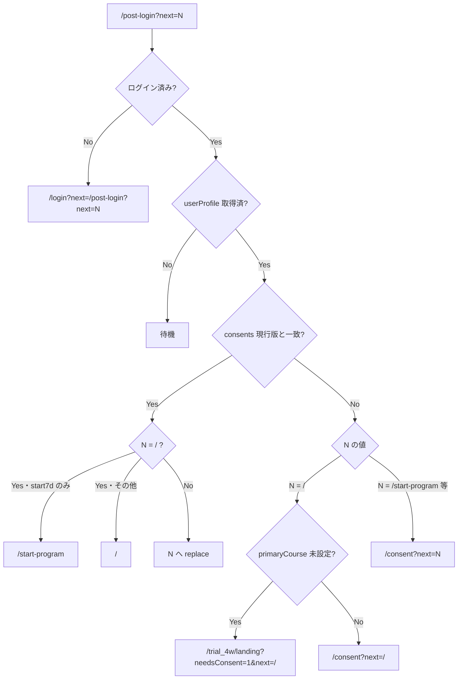

#### 入口別シーケンス

**① 初回・誤操作「ログインして続きから」**（NG_02）

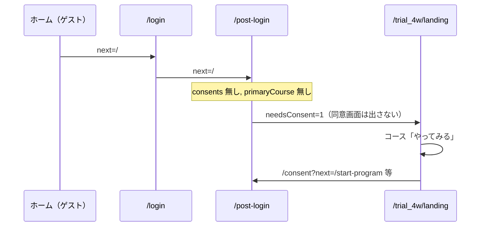

**② 初回・正規「試してみる」→ 7日間**（**導線①**）

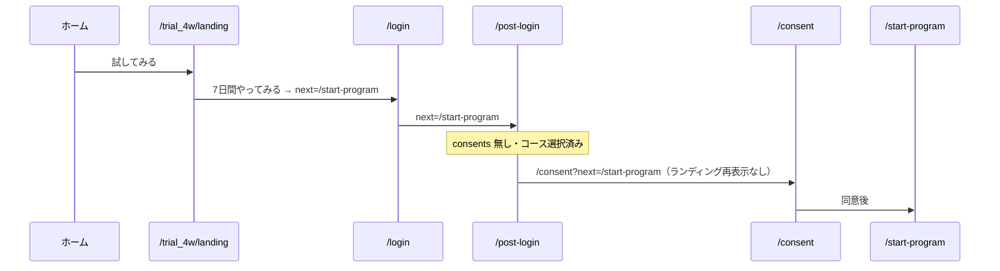

**②b 既会員（同意済み・フリー）の誤操作「試してみる」→ 7日間**（**導線⑦**）

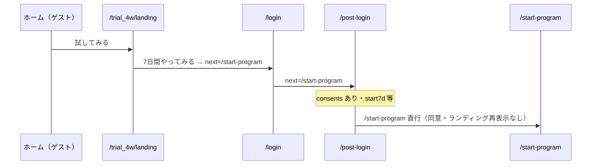

**②c 会員同意でキャンセル**（**導線③**／**導線⑥**）

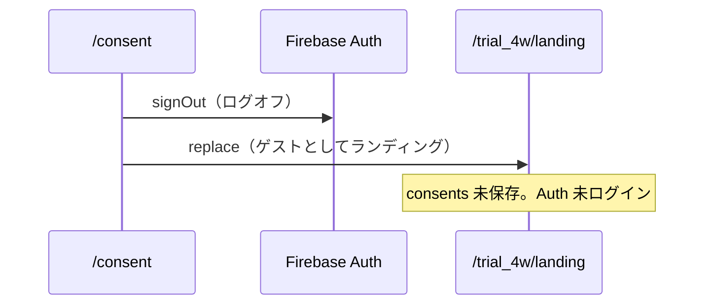

**②d 初回・正規「試してみる」→ スタンダード（AIコーチ）**（**導線①・スタンダード**）


**②e 初回・正規「試してみる」→ プレミアム**（**導線①・プレミアム**）

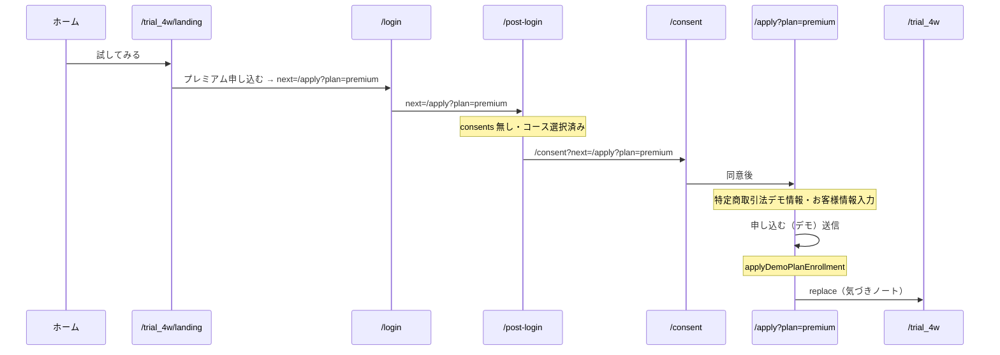

**③ 再ログイン（同意済み・7日間 start7d）**（**導線⑧**）

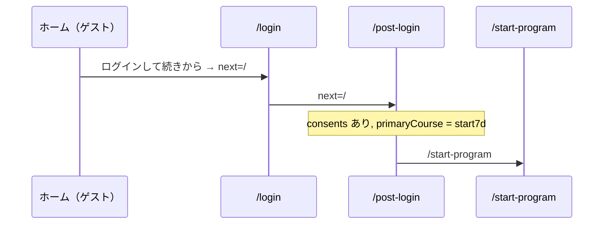

**③b 再ログイン（同意済み・気づきノート等）**

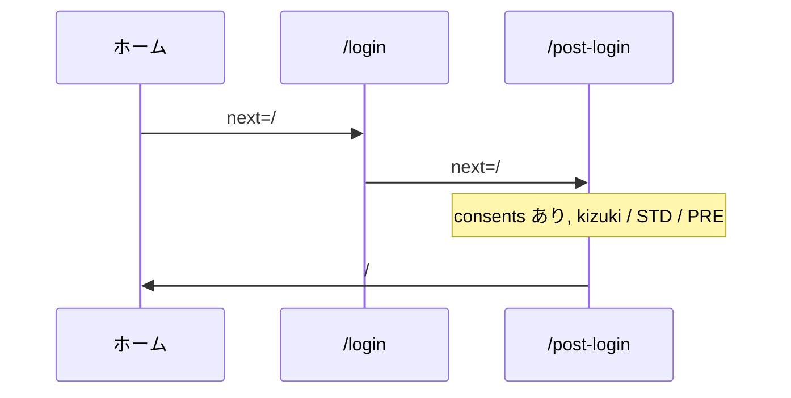

#### 実装ファイル対応

| 画面 | ファイル | 役割 |
|------|----------|------|
| `/login` | `src/app/login/page.tsx` | `next` を `normalizeAuthNext` → `/post-login?next=...` |
| `/post-login` | `src/app/post-login/page.tsx` | 上記フローチャートの分岐 |
| `/trial_4w/landing` | `src/app/trial_4w/landing/page.tsx` | `needsConsent=1` バナー、未同意 CTA→`/consent`。**戻る**（needsConsent 時）→ `signOut` → `/` |
| `/consent` | `src/app/consent/page.tsx` | 同意保存 → `next` へ。**キャンセル** → `signOut` → `/trial_4w/landing` |
| ホームバナー | `src/components/HomePage.tsx` | `RETURNING_LOGIN_HREF` = `/login?next=/` |
| 共通 | `src/lib/onboardingFlow.ts` | `normalizeAuthNext`, `isPreOnboardingUser`, `isFirstTimeOnboardingNext`, `CONSENT_CANCEL_LANDING`, `isLandingBackRequiresSignOut`, **`resolvePostLoginDestination`**, **`resolveOnboardingDestination`**（申込済み既会員の申込画面スキップ） |
| 意図的ログオフ | `src/lib/intentionalSignOut.ts` | `signOutAndRedirect`（先に画面遷移→signOut。ログオフ時の `/login` 誤リダイレクト防止） |
| コース判定 | `src/lib/enrollmentCourse.ts` | `hasAiCoachOrPremiumSignup`, `isStart7dOnly`, `consentNextImpliesKizuki` |
| 同意後 enrollment | `src/lib/firestore.ts` | `applyConsentCourseEnrollment`, `ensureKizukiTrialEndsAtIfNeeded` |

### 2.1.3 検証用フィールド一覧（表1・ランディング・同意）

手動テスト時に Firestore Console と画面表示を突合するための正本。**導線チェック前**は §2.1.3 D の初期化手順どおり `users/{uid}` 削除（または下表フィールドを個別クリア）すること。

#### A. Firestore `users/{uid}`

| フィールド | 型 | 取りうる値（例） | いつ設定される | 分岐・UI への effect |
|------------|-----|------------------|----------------|----------------------|
| `consents.termsVersion` | string | `2026-05-20` 等（`public/legal/terms.json` の `version`） | `/consent` で同意保存 | 現行版と一致 → 同意済み |
| `consents.privacyVersion` | string | 同上（`privacy.json`） | 同上 | 同上 |
| `consents.acceptedAt` | Timestamp | 同意日時 | 同上 | 同上 |
| `enrollment.primaryCourse` | string / 無し | **無し**＝未選択、`start7d`＝7日間、`kizuki`＝気づきノート | `start7d`: 同意 `next=/start-program` 保存時（**同意直後**）。`/start-program` 到達時も idempotent に再設定。`kizuki`: 同意 `next=/trial_4w` 時、または `?apply=ai_coach` | `start7d` → ランディング7日間「利用中」・AI「申し込む」・ノート nav 無効 |
| `subscription.plan` | string | `free` / `standard` / `premium` | 新規作成時 `free`（`createDefaultUserProfile`） | `standard`/`premium` → 気づきノート利用可 |
| `subscription.status` | string | `active`（テスト時はほぼこれ） | 新規作成時 | 有料プラン有効判定に使用 |
| `subscription.trialEndsAt` | Timestamp / 無し | **未来日**＝28日お試し中。**無し**＝お試しなし | 気づきノート同意（`next=/trial_4w`）または `?apply=ai_coach` 時に自動付与（+28日）。**7日間のみでは付与しない** | `free`＋`kizuki`＋未来日 → `hasAiCoachOrPremiumSignup` true → AI「利用中」 |
| `subscription.startDate` | Timestamp | 登録日 | 新規作成時 | 表示用 |
| `role` | string | `user` | 新規作成時 | 管理者以外 |

**表1（7日間）の望ましい中間状態**

| 段階 | `consents` | `primaryCourse` | `trialEndsAt` | ランディング AIコーチ CTA |
|------|------------|-----------------|---------------|---------------------------|
| ゲスト | 無し | 無し | 無し | やってみる |
| ログイン直後・未同意 | 無し | 無し | 無し | **やってみる**（利用中にしない） |
| 同意キャンセル後（ログオフ） | 無し | 無し | 無し | **やってみる**（ゲスト表示。`users/{uid}` は残る場合あり） |
| 7日間同意後・スタート到達前 | あり | `start7d` | 無し | 申し込む |
| 7日間利用中 | あり | `start7d` | 無し | 申し込む |
| AIコーチ利用中（別表） | あり | `kizuki` | 未来日 | 利用中 |

#### B. URL クエリ（画面遷移）

| パラメータ | 例 | 意味 |
|------------|-----|------|
| `login?next=` | `/`、`/start-program` | ログイン後の最終行先（`/login` が `post-login` にラップ） |
| `post-login?next=` | `/start-program` | 同意・ランディング戻しの分岐元 |
| `needsConsent` | `1` | ランディング案内バナー表示（ログイン済・未同意） |
| `consent?next=` | `/start-program`、`/trial_4w` | 同意後の遷移先＋**コース記録**（`start-program` なら `start7d`、`trial_4w` なら `kizuki`） |
| `apply` | `ai_coach` | 7日間利用中から AIコーチ申込（`/trial_4w?apply=ai_coach`） |

#### C. コード上の判定関数

| 関数 | true のとき（代表） |
|------|---------------------|
| `hasAcceptedCurrentConsents` | `consents` の版が `terms.json` / `privacy.json` と一致 |
| `isPreOnboardingUser` | `enrollment.primaryCourse` 未設定 |
| `isStart7dOnly` | `primaryCourse === 'start7d'` |
| `hasAiCoachOrPremiumSignup` | `plan` が STD/PRE、または `kizuki`＋`trialEndsAt` 未来 |
| `isKizukiNoteNavEnabled` | 上記と同じ（サイドバー「ノート」） |
| `shouldShowStart7dHomeHint` | `start7d` かつ気づき未申込 |

#### D. 導線チェック前の初期化（必須）

| 操作 | 理由 |
|------|------|
| `users/{uid}` ドキュメント削除 | クリーンな初回入会 |
| または `consents` 削除 ＋ `enrollment` 削除 ＋ `subscription.trialEndsAt` 削除 | AI 検証用 `trialEndsAt` が残ると AI「利用中」になる |
| ログアウト → ブラウザ再読込 | クライアントキャッシュクリア |

### 2.2 同意後の導線（文言）

URL 直書きではなく、次の **目的ベース** の表現を仕様表に用いる。実装時は下表の `next` にマッピングする。

| 目的 | 仕様表の表現 | 実装 `next`（代表） |
|------|--------------|---------------------|
| 7日間スタートプログラム | 会員同意→**スタートプログラム**へ | `/consent?next=/start-program` |
| 気づきノート（AI／STD） | 会員同意→**気づきノート**へ | `/consent?next=/trial_4w`（または `?apply=ai_coach`） |
| 気づきノート・プレミアム | 会員同意→**気づきノートのプレミアムコース**へ | 申込フロー確定後に URL 固定（Stripe 前） |

### 2.3 7日間スタートプログラムの表示

| 場所 | ゲスト | フリー会員 | STD／PRE |
|------|--------|------------|----------|
| **ホーム** | 7日間導線**非表示**（「試してみる」→ランディングのみ） | スタート／案内あり | 7日間行は**表示しない** |
| **ランディング** | **やってみる 有効** | **選択中**（7日間を選んだ定常状態） | **—** |

ゲスト（新規）も **ホーム「試してみる」→ ランディング** 経由で 7日間を選択できる。

### 2.4 28日お試し（気づきノート）

| 項目 | 内容 |
|------|------|
| **対象** | **スタンダード／プレミアム初回申込時のみ** |
| **期間** | 28日（JST）。`trialEndsAt` |
| **再付与** | **なし**（`trialConsumedAt`） |
| **期間中** | standard 相当の気づきノート |
| **コース変更画面** | 選択中コースに **（お試し付き）** と表示可 |

### 2.5 メッセージボード（プレミアム→下位コース）

| 項目 | 内容 |
|------|------|
| **即時** | 新規投稿・編集**不可** |
| **履歴** | **閲覧可**（入力 UI は無効または案内） |
| **データ** | `dataRetentionEndsAt` まで保持し **90日後削除** |

§5.10（PRE→フリー）、§5.11（PRE→STD）に明記。

### 2.6 マイページ（本バージョン）

| 項目 | 内容 |
|------|------|
| **サイドバー** | **リンクなし**（全コース **無効**） |
| **直アクセス** | `/mypage` は**許可**（仕様詰め前の既存画面） |

### 2.7 コース変更画面・申込フォーム

| 項目 | 内容 |
|------|------|
| **スコープ** | **新規画面**。Stripe 接続**前**に画面イメージを確定し実装 |
| **コース変更** | `/courses/change`（コース変更・選択画面・デモ） |
| **申込フォーム** | `/apply?plan=standard\|premium`（仮画面・デモクラティック情報） |

---

## 3. コース別の使用可能機能一覧（定常状態）

ログイン状態・プランが安定しているときの UI。遷移表（§5）の「変化後」列と整合させる。

### 3.1 定常状態チェック一覧

実装後の画面確認用。**OK** 欄にチェック（`OK` / 日付 / 担当者など）を記入する。

※フリー会員で `enrollment.primaryCourse = start7d` のとき、サイドバー「ノート」は **無効**（§4）。

| # | UI（画面など） | コンポーネント | ゲスト | フリー | スタンダード | プレミアム | OK |
|---|----------------|----------------|--------|--------|--------------|------------|-----|
| 1 | ヘッダ | — | ゲストアイコンのみ | ログインユーザアイコン | 同左 | 同左 |  |
| 2 | サイドバー | ホーム | 有効 | 有効 | 有効 | 有効 |  |
| 3 | サイドバー | スタート | 無効 | 有効 | 有効 | 有効 |  |
| 4 | サイドバー | ノート | 無効 | 無効 | 有効 | 有効 |  |
| 5 | サイドバー | コミュニケーション | 有効 | 有効 | 有効 | 有効 |  |
| 6 | サイドバー | マイページ | 無効 | 無効 | 無効 | 無効 |  |
| 7 | ホーム | バナー① | 試してみる | スタートから始める→スタート | 同左 | 同左 |  |
| 8 | ホーム | バナー② | ログインして続ける | 気づきノートを試す→ランディング | 気づきノートを続ける→ノート | 同左 |  |
| 9 | ホーム | マネジメント情報 | 無効（メッセージ） | 無効（メッセージ） | 有効 | 有効 |  |
| 10 | スタート画面 | 「気づきノート」ボタン | — | 気づきノートを試す→ランディング | 気づきノートへ | 同左 |  |
| 11 | ノート画面 | 行動宣言 | 無効 | 無効 | 有効 | 有効（共有あり） |  |
| 12 | ノート画面 | 朝・晩 | 無効 | 無効 | 有効 | 有効 |  |
| 13 | ノート画面 | 週 | 無効 | 無効 | 有効 | 有効（共有あり） |  |
| 14 | ノート画面 | 月 | 無効 | 無効 | 有効 | 有効（共有あり） |  |
| 15 | コミュニケーション | 館長から | 有効 | 有効 | 有効 | 有効 |  |
| 16 | コミュニケーション | メッセージボード | 無効 | 無効 | 無効 | 有効 |  |
| 17 | ログインパネル | ユーザIDセレクト | 有効 | — | — | — |  |
| 18 | ランディング | 7日間スタートプログラム | やってみる 有効 | 選択中 | — | — |  |
| 19 | ランディング | 気づきノート AIコーチ | やってみる 有効 | やってみる 有効 | 選択中 | — |  |
| 20 | ランディング | 気づきノート パーソナルコーチ | やってみる 有効 | やってみる 有効 | やってみる 有効 | 選択中 |  |
| 21 | コース変更 | フリーコース | — | — | 選択（90日保存メッセージ） | 選択（同上） |  |
| 22 | コース変更 | スタンダードコース | — | — | 選択中（お試し付き） | 選択（同上） |  |
| 23 | コース変更 | プレミアムコース | — | — | 選択→会員同意→プレミアムコースへ | 選択中（お試し付き） |  |
| 24 | 会員同意 | 利用規約・プライバシー | ランディングの次に表示 | 同左 | 同左 | 同左 |  |
| 25 | 申込フォーム | 入力欄 | — | — | 同意画面の後 | 同意画面の後 |  |

- コミュニケーション（サイドバー）: ゲスト・フリーは **館長からのみ**（メッセージボードタブは出さない）。
- マネジメント無効時メッセージ例:「試してみる」から気づきノートを選択すると有効になります。
- 初回入会: ランディング → 会員同意 →（有料なら）申込フォーム（`/apply?plan=...`）。
- コース変更: `/courses/change`（ログイン済み・全プラン。3列＋機能表）。

---

---

## 4. plan × `enrollment.primaryCourse` 補足

遷移表は `plan` 中心。実装（`src/lib/enrollmentCourse.ts`）では **`primaryCourse`** もノート可否に effect する。

| `plan` | `primaryCourse` | サイドバー「ノート」 | ホームバナー（代表） |
|--------|-----------------|----------------------|----------------------|
| `free` | `start7d` | **無効** | 7日間案内文（スタートへ）。「気づきノートを続ける」**出さない** |
| `free` | `kizuki` ＋ `trialEndsAt` 未来 | 有効 | 「気づきノートを続ける」 |
| `free` | 未設定 または `start7d` | **無効** | 7日間案内 or 「気づきノートを試す」 |
| `standard` / `premium` | 任意 | 有効 | 「気づきノートを続ける」 |
| ゲスト | — | 無効 | 試してみる／ログインして続きから |

- `start7d` は `/start-program` 到達時に設定。`kizuki` へは**昇格のみ**（降格しない）。
- 7日間のみユーザーが AIコーチ「やってみる」→ `?apply=ai_coach` でノート導線を開く。

---

## 5. 状態遷移チェック一覧

**2026-06-14 以降**: ゲスト起点の入会は **画面遷移（導線フロー）** ＋ **導線チェックリスト** で確認する（§1.1）。**会員種別間**（ログアウト・アップグレード等）は §5.3 以降を順次同形式へ移行する。

| § | 旧表 | 内容 | 状態 |
|---|------|------|------|
| §5.0 | 表1 | ゲスト → フリー（7日間） | **導線フローへ差し替え済** |
| §5.1 | 表2 | ゲスト → スタンダード（AIコーチ） | **導線フローへ差し替え済** |
| §5.2 | 表3 | ゲスト → プレミアム（パーソナルコーチ） | **導線フローへ差し替え済** |
| §5.3 | 表4 | フリー → ゲスト（ログアウト） | **導線フローへ差し替え済** |
| §5.4 | 表5 | フリー → スタンダード（アップグレード） | **導線フローへ差し替え済** |
| §5.5 | 表6 | フリー → プレミアム（アップグレード） | **導線フローへ差し替え済** |
| §5.6 | 表9 | スタンダード → ゲスト（ログアウト） | **導線フローへ差し替え済** |
| §5.7 | 表7 | スタンダード → フリー（ダウングレード） | **導線フローへ差し替え済** |
| §5.8 | 表8 | スタンダード → プレミアム（アップグレード） | **導線フローへ差し替え済** |
| §5.9 | 表10 | プレミアム → ゲスト（ログアウト） | **導線フローへ差し替え済** |
| §5.10 | 表11 | プレミアム → フリー（ダウングレード） | **導線フローへ差し替え済** |
| §5.11 | 表12 | プレミアム → スタンダード（ダウングレード） | **導線フローへ差し替え済** |
| §5.12 | — | コース復帰（横断・ダウングレード後の再アップグレード） | **追加** |

**OK** 欄は導線チェックリストの **結果** 列に記入する（例: `OK` / 空欄＝未実施 / `NG: 理由`）。

### 5.0 画面遷移（導線フロー）_1　ゲスト→フリー会員

外部仕様の「**状態変化フロー_1　ゲスト→フリー会員**」。各**最終分岐**に **導線No**（①〜⑧）。

**初期条件**: ホーム画面アクセス時に非ログインの場合、**未会員** または **ログオフした既会員（フリーコース選択済み）** のどちらか。

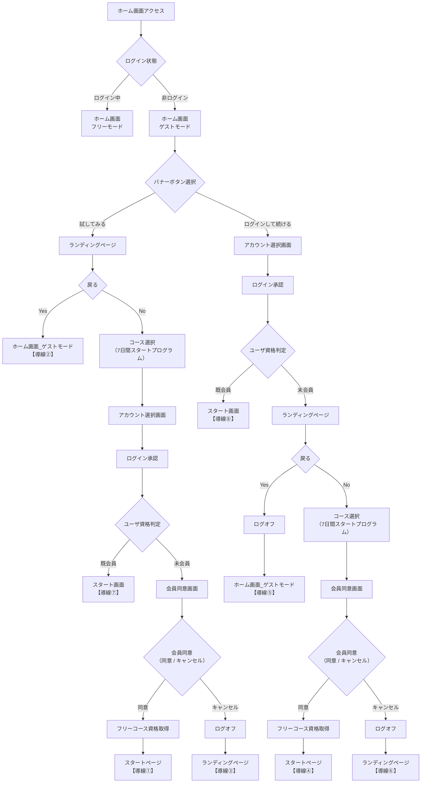

#### 導線チェックリスト_1　ゲスト→フリー

**テスト実施日: 2026年6月14日**

| 導線No | シーケンス | 結果 | 備考 |
|--------|------------|------|------|
| 導線① | 試してみる → 7日間選択 → 同意画面 → 会員同意 → スタートページ | OK | |
| 導線② | 試してみる → ランディングページ表示 → 戻る → ホーム画面 | OK | |
| 導線③ | 試してみる → 7日間選択 → 同意画面 → キャンセル | OK | ログオフ → ランディング（ゲスト） |
| 導線④ | ログインして続ける → ログイン → ランディングページ → 7日間スタートプログラム選択 → 会員同意 → スタートプログラム | OK | |
| 導線⑤ | ログインして続ける → ログイン → ランディングページ → 戻る | OK | ログオフ → ゲストホーム |
| 導線⑥ | ログインして続ける → ログイン → ランディングページ → 7日間スタートプログラム選択 → 会員同意 → キャンセル | OK | ログオフ → ランディング（ゲスト） |
| 導線⑦ | 既会員（フリーコース選択ユーザ）: 試してみる → 7日間スタートプログラム選択 → アカウント選択画面 → スタート画面 | OK | |
| 導線⑧ | 既会員（フリーコース選択ユーザ）: ログインして続きから → アカウント選択画面 → ログイン → スタート画面 | OK | |

#### 実装 URL との対応（フリー・7日間）

| 外部仕様のノード | 実装（代表） |
|------------------|--------------|
| ホーム画面 ゲストモード | `/` |
| ホーム画面 フリーモード | `/`（ログイン済・同意済み） |
| 試してみる | `/trial_4w/landing` |
| ログインして続ける | `/login?next=/` → `/post-login?next=/` |
| ランディングページ | `/trial_4w/landing`（**試してみる経路では1回のみ**） |
| ランディング（誤操作ログイン後のみ） | `/trial_4w/landing?needsConsent=1` |
| ランディング「戻る」（needsConsent・ログイン中） | `signOut` → `/`（ゲストホーム） |
| アカウント選択画面 | `/login` |
| ログイン承認 | Google OAuth → `/post-login` |
| コース選択（7日間） | ランディングで7日間「やってみる」押下 |
| 会員同意画面 | `/consent?next=/start-program` 等 |
| 会員同意 キャンセル | `signOut` → `/trial_4w/landing`（`CONSENT_CANCEL_LANDING`） |
| ログオフ | Firebase Auth `signOut`（IndexedDB セッション削除） |
| フリーコース資格取得 | 同意保存時 `applyConsentCourseEnrollment` で `start7d`（`next=/start-program`）。`/start-program` 到達時も idempotent に再設定 |
| スタートページ / スタート画面 | `/start-program` |
| 既会員（同意済み）誤操作「試してみる」 | ログイン後 **`/start-program` 直行**（**導線⑦**） |
| 既会員「ログインして続きから」 | **`start7d` のみ** → **`/start-program`**（**導線⑧**）。気づきノート等 → `/` |
| 導線① | 試してみる → 7日間 → `/consent` → `/start-program` |
| 導線② | 試してみる → ランディング「戻る」→ `/`（ゲスト） |
| 導線③ | 試してみる経路の同意キャンセル → `signOut` → `/trial_4w/landing` |
| 導線④ | ログインして続ける → `needsConsent=1` ランディング → 7日間 → `/consent` → `/start-program` |
| 導線⑤ | `needsConsent=1` ランディング「戻る」→ `signOut` → `/` |
| 導線⑥ | ログインして続ける経路の同意キャンセル → `signOut` → `/trial_4w/landing` |

詳細な分岐条件・Firestore フィールドは §2.1.2・§2.1.3 を参照。


---

### 5.1 画面遷移（導線フロー）_2　ゲスト→スタンダード会員

外部仕様の「**状態変化フロー_2　ゲスト→スタンダード会員**」。各**最終分岐**に **導線No**（①〜⑧）。フリー（§5.0）と同型で、コース選択は **スタンダード（AIコーチ）**、**未会員の初回入会**は **会員同意 → デモ申込 → 気づきノート**（`/trial_4w`）の順。

**初期条件**: ホーム画面アクセス時に非ログインの場合、**未会員** または **ログオフした既会員（スタンダードコース選択済み）** のどちらか。

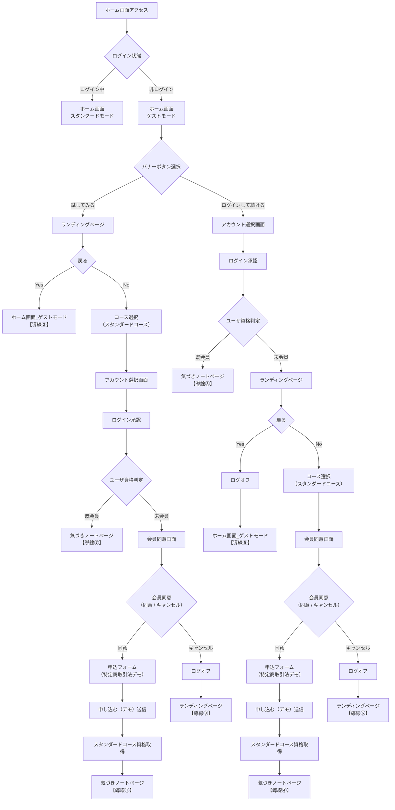

#### 導線チェックリスト_2　ゲスト→スタンダード

| 導線No | シーケンス | 結果 | 備考 |
|:---:|:---|:---:|:---|
| 導線① | 試してみる → スタンダードコース選択 → 同意画面 → 会員同意 → **申込フォーム** → **申し込む（デモ）送信** → 気づきノートページ |OK | `/apply?plan=standard` |
| 導線② | 試してみる → ランディングページ表示 → 戻る → ホーム画面 |OK| |
| 導線③ | 試してみる → スタンダードコース選択 → 同意画面 → キャンセル → ログオフ → ランディング（ゲスト） |OK| 申込前 |
| 導線④ | ログインして続ける → ログイン → ランディングページ → スタンダードコース選択 → 会員同意 → **申込フォーム** → **申し込む（デモ）送信** → 気づきノートページ |OK| `/apply?plan=standard` |
| 導線⑤ | ログインして続ける → ログイン → ランディングページ → 戻る → ログオフ → ゲストホーム |OK| |
| 導線⑥ | ログインして続ける → ログイン → ランディングページ → スタンダードコース選択 → 会員同意 → キャンセル → ログオフ → ランディング（ゲスト） |OK| |
| 導線⑦ | 既会員（スタンダードコース選択ユーザ）: 試してみる → スタンダードコース → アカウント選択画面 → 気づきノートページ |OK| 申込済みのため **申込画面を表示せず** `/trial_4w` 直行（`resolveOnboardingDestination`） |
| 導線⑧ | 既会員（スタンダードコース選択ユーザ）: ログインして続きから → アカウント選択画面 → ログイン → 気づきノートページ |OK| 申込スキップ。`resolvePostLoginDestination` → `/trial_4w` |

**テスト初期条件（未会員）**: `users/{uid}` 削除、IndexedDB クリア（§2.1.3 D）。
#### 申込手順（デモ）　スタンダード

**対象導線**: ①・④（未会員・会員同意後）。既会員（⑦⑧）は申込をスキップして `/trial_4w` へ。

| # | 画面 | 操作 | 期待結果 | OK |
|---|------|------|----------|-----|
| A-1 | `/apply?plan=standard` | 販売事業者情報（デモ）を表示 | 事業者名・代表・所在地・連絡先が表示される | |
| A-2 | 同上 | お申し込み内容（料金・28日お試し）を確認 | 月額・年払い・特商法リンクが表示される | |
| A-3 | 同上 | お客様情報（名前・住所・電話）を入力 | 必須項目が入力できる | |
| A-4 | 同上 | 特定商取引法チェック → **申し込む（デモ）** | **`/trial_4w` へ自動遷移**（ランディングではない） | |
| A-5 | `/trial_4w` | 気づきノート本体 | タブ（行動宣言／朝・晩／週／月）が表示・操作可能 | |
| A-6 | Firestore（任意） | 送信直後 | `enrollment.primaryCourse=kizuki`、`subscription.plan=standard`、`trialEndsAt` 未来日 | |

#### 実装 URL との対応（スタンダード・AIコーチ）

| 外部仕様のノード | 実装（代表） |
|------------------|--------------|
| ホーム画面 スタンダードモード | `/`（ログイン済・同意済み・気づき利用可） |
| コース選択（スタンダード） | ランディングで AIコーチ「やってみる」押下 |
| 会員同意（初回） | `/consent?next=/apply?plan=standard` |
| スタンダードコース資格取得 | デモ申込送信時 `applyDemoPlanEnrollment`（`kizuki`＋`plan=standard`＋`subscription.features`＋`trialEndsAt` 等） |
| 申込フォーム | `/apply?plan=standard`（特定商取引法デモ情報表示） |
| 気づきノートページ | `/trial_4w` |
| 導線① | 試してみる → AIコーチ → `/consent?next=/apply?plan=standard` → 申込 → `/trial_4w` |
| 導線④ | `needsConsent=1` ランディング → AIコーチ → `/consent?next=/apply?plan=standard` → 申込 → `/trial_4w` |
| 導線⑦ | 既会員・`login?next=/apply?plan=standard` → `post-login` で申込済み判定 → **`/trial_4w` 直行**（申込画面は出さない） |
| 導線⑧ | 既会員・`login?next=/` → `resolvePostLoginDestination` → `/trial_4w` |

詳細な分岐条件・Firestore フィールドは §2.1.2・§2.1.3 を参照。キャンセル・戻る時のログオフは §5.0 と同じ実装（`signOutAndRedirect` 等）。

---

### 5.2 画面遷移（導線フロー）_3　ゲスト→プレミアム会員

外部仕様の「**状態変化フロー_3　ゲスト→プレミアム会員**」。各**最終分岐**に **導線No**（①〜⑧）。フリー（§5.0）・スタンダード（§5.1）と同型で、コース選択は **プレミアム（パーソナルコーチ）**、**未会員の初回入会**は **会員同意 → デモ申込 → 気づきノート（プレミアム）**（`/trial_4w`）の順。

**初期条件**: ホーム画面アクセス時に非ログインの場合、**未会員** または **ログオフした既会員（プレミアムコース選択済み）** のどちらか。

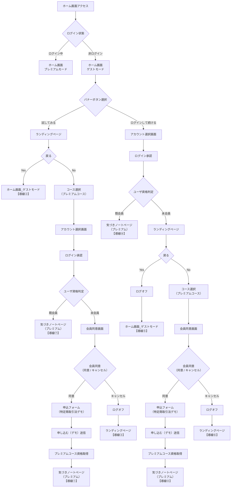

#### 導線チェックリスト_3　ゲスト→プレミアム

**テスト実施日: 2026年6月5日**（導線①〜⑧・申込手順 A-1〜A-7 **すべて OK**）

| 導線No | シーケンス | 結果 | 備考 |
|---|---|---|---|
| 導線① | 試してみる → プレミアムコース選択 → 同意画面 → 会員同意 → **申込フォーム** → **申し込む（デモ）送信** → 気づきノートページ |OK | `/apply?plan=premium` |
| 導線② | 試してみる → ランディングページ表示 → 戻る → ホーム画面 |OK| |
| 導線③ | 試してみる → プレミアムコース選択 → 同意画面 → キャンセル |OK| 申込前。ログオフ → ランディング（ゲスト） |
| 導線④ | ログインして続ける → ログイン → ランディングページ → プレミアムコース選択 → 会員同意 → **申込フォーム** → **申し込む（デモ）送信** → 気づきノート |OK| `/apply?plan=premium` |
| 導線⑤ | ログインして続ける → ログイン → ランディングページ → 戻る |OK| ログオフ → ゲストホーム |
| 導線⑥ | ログインして続ける → ログイン → ランディングページ → プレミアムコース選択 → 会員同意 → キャンセル |OK| ログオフ → ランディング（ゲスト） |
| 導線⑦ | 既会員（プレミアムコース選択ユーザ）: 試してみる → プレミアムコース → アカウント選択画面 → 気づきノートページ |OK| 申込済みのため **申込画面を表示せず** `/trial_4w` 直行 |
| 導線⑧ | 既会員（プレミアムコース選択ユーザ）: ログインして続きから → アカウント選択画面 → ログイン → 気づきノートページ |OK| 申込スキップ。`resolvePostLoginDestination` → `/trial_4w` |

**テスト初期条件（未会員）**: `users/{uid}` 削除、IndexedDB クリア（§2.1.3 D）。


#### 申込手順（デモ）　プレミアム

**対象導線**: ①・④（未会員・会員同意後）。既会員（⑦⑧）は申込をスキップして `/trial_4w` へ。

| # | 画面 | 操作 | 期待結果 | OK |
|---|------|------|----------|-----|
| A-1 | `/apply?plan=premium` | 販売事業者情報（デモ）を表示 | 事業者名・代表・所在地・連絡先が表示される | OK |
| A-2 | 同上 | お申し込み内容（料金・28日お試し・セッション）を確認 | 月額・特商法リンクが表示される | OK |
| A-3 | 同上 | お客様情報（名前・住所・電話）を入力 | 必須項目が入力できる | OK |
| A-4 | 同上 | 特定商取引法チェック → **申し込む（デモ）** | **`/trial_4w` へ自動遷移**（ランディングではない） | OK |
| A-5 | `/trial_4w` | 気づきノート本体（プレミアム） | タブ表示・操作可能 | OK |
| A-5a | `/trial_4w` → **月** タブ | **コーチ共有** チェック | 有効（見出し右上。`subscription.features.coachComments=true` または `plan=premium`） | OK |
| A-5b | `/trial_4w` → **週** タブ | **コーチ共有** チェック | 有効（見出し右上。閲覧共有のみ。質問・回答は月タブ） | OK |
| A-5c | `/trial_4w` → **行動宣言** タブ | **コーチ共有** チェック | **発行済みテーマを「表示」選択後**にタイトルバーへ表示（プレミアムのみ） | OK |
| A-5d | `/communication` | メッセージボード | プレミアムでタブ有効（`resolveEntitlements`） | OK |
| A-6 | Firestore（任意） | 送信直後 | `enrollment.primaryCourse=kizuki`、`subscription.plan=premium`、`subscription.features.coachComments=true`、`trialEndsAt` 未来日 | OK |
| A-7 | Firestore（任意） | **週**タブで共有 ON 後 | `users/{uid}/journal_weekly/{weekStartKey}.sharedWithCoach=true` および `coachDailySummaryByDate`（記号・満足度サマリ） | OK |

#### 実装 URL との対応（プレミアム・パーソナルコーチ）

| 外部仕様のノード | 実装（代表） |
|------------------|--------------|
| ホーム画面 プレミアムモード | `/`（ログイン済・同意済み・`plan=premium`） |
| コース選択（プレミアム） | ランディングでパーソナルコーチ「**申し込む**」押下 |
| 会員同意（初回） | `/consent?next=/apply?plan=premium` |
| プレミアムコース資格取得 | デモ申込送信時 `applyDemoPlanEnrollment`（`kizuki`＋`plan=premium`＋**`subscription.features`（`coachComments` 等）**＋`trialEndsAt` 等） |
| 申込フォーム | `/apply?plan=premium` |
| 気づきノートページ（プレミアム） | `/trial_4w`（`plan=premium` で MB 等が有効） |
| 導線① | 試してみる → 申し込む → `/consent?next=/apply?plan=premium` → 申込 → `/trial_4w` |
| 導線④ | `needsConsent=1` ランディング → 申し込む → `/consent?next=/apply?plan=premium` → 申込 → `/trial_4w` |
| 導線⑦ | 既会員・`login?next=/apply?plan=premium` → `post-login` で申込済み判定 → **`/trial_4w` 直行**（申込画面は出さない） |
| 導線⑧ | 既会員・`login?next=/` → `resolvePostLoginDestination` → `/trial_4w`（`plan=premium` / `hasAiCoachOrPremiumSignup`） |

詳細な分岐条件・Firestore フィールドは §2.1.2・§2.1.3 を参照。キャンセル・戻る時のログオフは §5.0 と同じ実装（`signOutAndRedirect` 等）。

---

### 5.3 画面遷移（導線フロー）_4　フリー会員→ゲスト

外部仕様の「**状態変化フロー_4　フリー会員→ゲスト**」。各**最終到達**に **導線No**（①〜③）。いずれも **ログオフ後はゲストのホーム画面**（`/`）へ遷移する。

**初期条件**: **フリーコース選択済み**の既会員（`enrollment.primaryCourse=start7d`、`subscription.plan=free`、会員同意済み）。**ログオフ**はヘッダーの**ログインアイコン**（アバター）→ メニューから行う（`signOutAndRedirect` → `/`）。

```mermaid
flowchart TD
  subgraph R1["経路① ホーム"]
    HOME_FREE["ホーム画面<br/>フリーモード"] --> ICON1["ログインアイコン選択"]
    ICON1 --> LOGOFF1["ログオフ"]
    LOGOFF1 --> GUEST1["ホーム画面_ゲスト画面<br/>【導線①】"]
  end

  subgraph R2["経路② スタート"]
    START_PG["スタートページ"] --> ICON2["ログインアイコン選択"]
    ICON2 --> LOGOFF2["ログオフ"]
    LOGOFF2 --> GUEST2["ホーム画面_ゲスト画面<br/>【導線②】"]
  end

  subgraph R3["経路③ コミュニケーション"]
    COMM_PG["コミュニケーションページ"] --> ICON3["ログインアイコン選択"]
    ICON3 --> LOGOFF3["ログオフ"]
    LOGOFF3 --> GUEST3["ホーム画面_ゲスト画面<br/>【導線③】"]
  end
```

#### 導線チェックリスト_4　フリー会員→ゲスト

| 導線No | シーケンス | 結果 | 備考 |
|---|---|---|---|
| 導線① | ホーム画面 → ログインアイコン → ログオフ → ホーム画面（ゲスト） |OK| `/` フリーモードから。遷移先は **`/`**（ランディングではない） |
| 導線② | スタートページ → ログインアイコン → ログオフ → ホーム画面（ゲスト） |OK| `/start-program` から |
| 導線③ | コミュニケーションページ → ログインアイコン → ログオフ → ホーム画面（ゲスト） |OK| `/communication` から |

**テスト初期条件**: 導線チェックリスト_1 完了済みの **start7d のみ** UID（`plan=free`、`consents` 済み）。IndexedDB にセッションが残っている場合はログアウト後にゲスト表示を確認。

#### ログオフ後の UI 確認（代表）

| 項目 | ゲスト（`/`）での期待 |
|------|----------------------|
| ヘッダー | 人型アイコンのみ（**クリック不可**。ログインリンクなし） |
| ホーム バナー① | 「試してみる」→ `/trial_4w/landing` |
| ホーム バナー② | 「ログインして続きから」 |
| サイドバー「スタート」 | **無効** |
| サイドバー「ノート」 | **無効** |
| Firestore `users/{uid}` | **削除されない**（次回ログインで同一 UID・会員状態を復元） |

#### 実装 URL との対応（フリー → ゲスト）

| 外部仕様のノード | 実装（代表） |
|------------------|--------------|
| ホーム画面 フリーモード | `/`（ログイン済・`start7d` のみ・`plan=free`） |
| スタートページ | `/start-program` |
| コミュニケーションページ | `/communication` |
| ログインアイコン選択 | ヘッダーアバター → メニュー |
| ログオフ | `signOutAndRedirect(signOut, router, '/')`（`ProtoHeader`） |
| ホーム画面 ゲスト画面 | `/`（未ログイン） |
| 導線① | `/` → ログアウト → `/` |
| 導線② | `/start-program` → ログアウト → `/` |
| 導線③ | `/communication` → ログアウト → `/` |

**注意**: 同意キャンセル等の **意図的ログオフ**（`CONSENT_CANCEL_LANDING` → `/trial_4w/landing`）とは別経路。本 §5.3 は **通常のヘッダーログアウト** のみ。

---

### 5.4 画面遷移（導線フロー）_5　フリー会員→スタンダード会員

外部仕様の「**状態変化フロー_5　フリー会員→スタンダード会員**」。各**最終到達**に **導線No**（①〜③）。

**初期条件**: **フリー会員**（`enrollment.primaryCourse=start7d`、`subscription.plan=free`、**会員同意済み**）。**導線①**は起点 **ホーム／スタート／コミュニケーション** のいずれかからヘッダー**ログインアイコン** → **コース変更**。**導線③**は **スタートページ**（`/start-program`）から。**アップグレード時は再同意なし**（§2.1）。

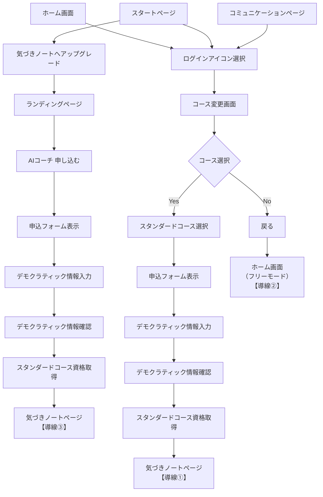

#### スタート画面からのアップグレード（UI）

| 項目 | 内容 |
|------|------|
| 表示条件 | `enrollment.primaryCourse=start7d` かつ `subscription.plan=free` |
| リード文 | 自分を変える気づきノートにトライをしてみる → |
| CTA | **気づきノートへアップグレード** → `/trial_4w/landing` |
| ランディング（`start7d` 利用中） | 7日間＝**利用中**、AIコーチ＝**申し込む** → `/apply?plan=standard` |
| 実装 | `src/app/start-program/page.tsx`、`src/app/trial_4w/landing/page.tsx` |

#### コース変更・選択画面（UI）

| 項目 | 内容 |
|------|------|
| 画面タイトル | **コース変更・選択画面** |
| URL | `/courses/change` |
| 3プラン列 | フリー／スタンダード／プレミアム（**オープン期間限定価格**・28日トライアル等はランディング同型） |
| 現プラン | **選択中**（お試し中は「選択中（お試し付き）」） |
| 他プラン | **選択する** → 申込（STD/PRE）またはダウングレード確認（デモ） |
| 下部 | 機能・サービス一覧表（○／—） |
| 右上 **戻る**（ランディング同型ボタン） | 導線②: **`/` へ遷移・ログイン維持**（ログオフしない） |

**実装**: `CourseChangePanel` ＋ `courseSelectionCatalog.ts`

#### 導線チェックリスト_5　フリー会員→スタンダード

| 導線No | シーケンス | 結果 | 備考 |
|:---:|:---|:---:|:---|
| 導線① | ログインアイコン → コース変更・選択画面 → スタンダード **選択する** → 申込フォーム → スタンダード資格取得 → 気づきノート |OK | **会員同意は経由しない**。起点は `/`・`/start-program`・`/communication` いずれも可 |
| 導線② | ログインアイコン → コース変更・選択画面 → **戻る** → ホーム（**ログイン維持**） |OK | **`signOut` しない**。フリーモードのまま `/` |
| 導線③ | スタートページ → **気づきノートへアップグレード** → ランディング → AIコーチ **申し込む** → 申込フォーム → スタンダード資格取得 → 気づきノート |OK | **コース変更を経由しない**。**会員同意スキップ**（7日間同意済み） |

**テスト初期条件**（§5.4 フリー会員）:

| フィールド | 期待値 | 備考 |
|------------|--------|------|
| `subscription.plan` | `free` | |
| `enrollment.primaryCourse` | `start7d` | 7日間会員同意（`next=/start-program`）保存時に設定。**修正前データ**で無い場合は `/start-program` を1回開くか、7日間導線①を再実施 |
| `consents` | 同意済み | |

**今回の確認（修正前）**: ② `primaryCourse` が無かった → **仕様上 NG**（7日間フリー会員の望ましい初期値ではない）。§5.4 導線自体は `primaryCourse` 無しでも動作した。

**変更後のデータ内容(firestore):**
- スタンダード会員変更後;
subscription.plan = standard
enrollment.primaryCourse = kizuki
consents = 同意済み


#### 申込手順（デモ）　フリー→スタンダード（アップグレード）

**対象導線**: **①**（コース変更経由）・**③**（スタート画面経由）。同意済みのため `/consent` は**スキップ**。

| # | 画面 | 操作 | 期待結果 | OK |
|---|------|------|----------|-----|
| B-1 | `/courses/change` | スタンダード「**選択する**」 | `/apply?plan=standard` へ | |
| B-2 | `/apply?plan=standard` | デモ事業者情報・料金を確認 | 表示される | |
| B-3 | 同上 | お客様情報入力・特商法チェック → **申し込む（デモ）** | **`/trial_4w` へ自動遷移** | |
| B-4 | `/trial_4w` | 気づきノート本体 | タブ操作可能。サイドバー「ノート」有効 | |
| B-5 | Firestore（任意） | 送信直後 | `plan=standard`、`enrollment.primaryCourse=kizuki`、`trialEndsAt` 未来日 | |

**導線③専用（B の代わりに C 列で確認可）**

| # | 画面 | 操作 | 期待結果 | OK |
|---|------|------|----------|-----|
| C-1 | `/start-program` | **気づきノートへアップグレード** | `/trial_4w/landing` へ | |
| C-2 | `/trial_4w/landing` | 7日間＝**利用中**、AIコーチ **申し込む** | `/apply?plan=standard` へ（**`/consent` なし**） | |
| C-3〜C-5 | 同上 | B-2〜B-5 と同様 | B-2〜B-5 と同期待 | |

#### アップグレード後の UI 確認（代表）

| 項目 | スタンダード到達後の期待 |
|------|--------------------------|
| サイドバー「ノート」 | **有効** → `/trial_4w` |
| ホーム バナー② | 「**気づきノートを続ける**」→ `/trial_4w` |
| コース変更画面 | スタンダード列 **選択中（お試し付き）** |
| コミュニケーション MB | **無効**（プレミアムのみ） |

#### 実装 URL との対応（フリー → スタンダード）

| 外部仕様のノード | 実装（代表） |
|------------------|--------------|
| スタートページ → アップグレード | `/start-program`「**気づきノートへアップグレード**」→ `/trial_4w/landing` |
| ランディング（`start7d`） | 7日間＝利用中、AIコーチ **申し込む** → `/apply?plan=standard` |
| ログインアイコン → コース変更 | ヘッダーアバター → 「コース変更」→ `/courses/change` |
| スタンダードコース選択 | `CourseChangePanel`「**選択する**」→ `/apply?plan=standard` |
| 申込フォーム | `/apply?plan=standard` — `ApplyFormPanel` → `applyDemoPlanEnrollment` |
| スタンダード資格取得 | 申込送信時 `kizuki`＋`plan=standard`＋`features`＋`trialEndsAt` |
| 気づきノートページ | `/trial_4w` |
| 導線① | `/courses/change` → 申込 → `/trial_4w`（**同意スキップ**） |
| 導線② | `/courses/change` → **戻る** → `/`（**ログイン維持**） |
| 導線③ | `/start-program` → ランディング → 申込 → `/trial_4w`（**同意スキップ**） |

**外部仕様フロー図との差**: 初期版フロー図は導線②を「戻る→ログオフ→ゲスト」としていたが、**実装・運用上は「戻る」→ `/`（ログイン維持）** を正とする（2026-06-05 確定）。

---

### 5.5 画面遷移（導線フロー）_6　フリー会員→プレミアム会員

外部仕様の「**状態変化フロー_6　フリー会員→プレミアム会員**」。各**最終到達**に **導線No**（①〜③）。

**初期条件**: **フリー会員**（`enrollment.primaryCourse=start7d`、`subscription.plan=free`、**会員同意済み**）。起点は **ホーム／スタート／コミュニケーション** のいずれか。**導線①**はヘッダー**ログインアイコン** → **コース変更**。**導線③**は **スタートページ**（`/start-program`）から（外部フロー図はホーム起点も示すが、`start7d` 利用中のホームは §4 のとおり **7日間スタート案内** が主）。**アップグレード時は再同意なし**（§2.1）。

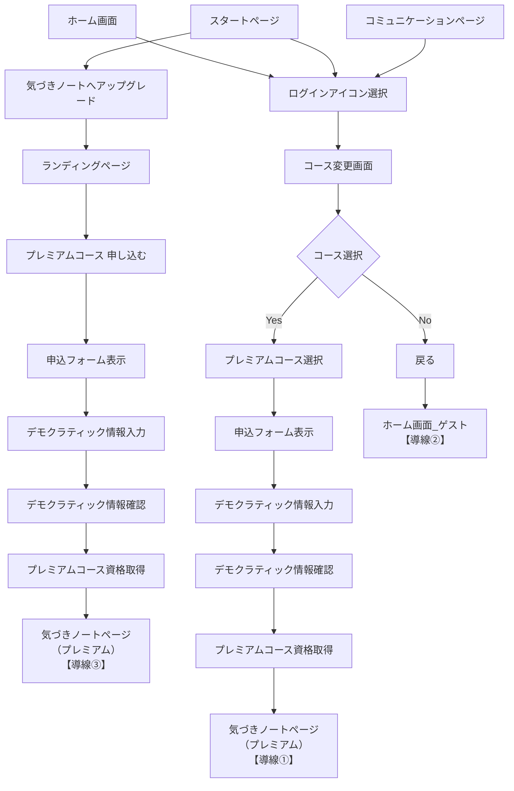

#### スタート画面からのアップグレード（UI）

| 項目 | 内容 |
|------|------|
| 表示条件 | `enrollment.primaryCourse=start7d` かつ `subscription.plan=free` |
| CTA | **気づきノートへアップグレード** → `/trial_4w/landing` |
| ランディング（`start7d` 利用中） | 7日間＝**利用中**、パーソナルコーチ＝**申し込む** → `/apply?plan=premium` |
| 実装 | `src/app/start-program/page.tsx`、`src/app/trial_4w/landing/page.tsx`（`renderPremiumCta`） |

#### コース変更・選択画面（UI）

§5.4 と同型（`/courses/change`）。プレミアム列 **選択する** → `/apply?plan=premium`。

#### 導線チェックリスト_6　フリー会員→プレミアム

| 導線No | シーケンス | 結果 | 備考 |
|:---:|:---|:---:|:---|
| 導線① | ログインアイコン → コース変更・選択画面 → プレミアム **選択する** → 申込フォーム → プレミアム資格取得 → 気づきノート |OK| **会員同意は経由しない**。起点は `/`・`/start-program`・`/communication` いずれも可 |
| 導線② | ログインアイコン → コース変更・選択画面 → **戻る** → ホーム画面_ゲスト |OK| 外部フロー図表記。**実装は §5.4 導線②と同型**（`/courses/change`「戻る」→ `/`、**ログイン維持**・`signOut` しない） |
| 導線③ | スタートページ → **気づきノートへアップグレード** → ランディング → プレミアム **申し込む** → 申込フォーム → プレミアム資格取得 → 気づきノート |OK| **コース変更を経由しない**。**会員同意スキップ**（7日間同意済み） |

**テスト初期条件**（§5.5 フリー会員）: §5.4 と同型（`plan=free`、`primaryCourse=start7d`、`consents` 同意済み）。

**変更後のデータ内容（Firestore・代表）**

| フィールド | 期待値 |
|------------|--------|
| `subscription.plan` | `premium` |
| `enrollment.primaryCourse` | `kizuki` |
| `subscription.features.coachComments` 等 | プレミアム相当（`featuresForPlan('premium')`） |
| `subscription.trialEndsAt` | 未来日（未設定時 +28日） |
| `consents` | 同意済み（再同意なし） |

#### 申込手順（デモ）　フリー→プレミアム（アップグレード）

**対象導線**: **①**（コース変更経由）・**③**（スタート画面経由）。同意済みのため `/consent` は**スキップ**。

| # | 画面 | 操作 | 期待結果 | OK |
|---|------|------|----------|-----|
| D-1 | `/courses/change` | プレミアム「**選択する**」 | `/apply?plan=premium` へ | |
| D-2 | `/apply?plan=premium` | デモ事業者情報・料金を確認 | 表示される | |
| D-3 | 同上 | お客様情報入力・特商法チェック → **申し込む（デモ）** | **`/trial_4w` へ自動遷移** | |
| D-4 | `/trial_4w` | 気づきノート本体（プレミアム） | タブ操作可能。サイドバー「ノート」有効 | |
| D-5 | `/communication` | メッセージボード | **有効**（プレミアムのみ） | |
| D-6 | Firestore（任意） | 送信直後 | `plan=premium`、`primaryCourse=kizuki`、`features` 更新、`trialEndsAt` 未来日 | |

**導線③専用（D の代わりに E 列で確認可）**

| # | 画面 | 操作 | 期待結果 | OK |
|---|------|------|----------|-----|
| E-1 | `/start-program` | **気づきノートへアップグレード** | `/trial_4w/landing` へ | |
| E-2 | `/trial_4w/landing` | 7日間＝**利用中**、パーソナルコーチ **申し込む** | `/apply?plan=premium` へ（**`/consent` なし**） | |
| E-3〜E-6 | 同上 | D-2〜D-6 と同様 | D-2〜D-6 と同期待 | |

#### アップグレード後の UI 確認（代表）

| 項目 | プレミアム到達後の期待 |
|------|------------------------|
| サイドバー「ノート」 | **有効** → `/trial_4w` |
| ホーム バナー② | 「**気づきノートを続ける**」→ `/trial_4w` |
| コース変更画面 | プレミアム列 **選択中（お試し付き）** |
| コミュニケーション MB | **有効** |
| ノート 週・月・行動宣言 | **コーチと共有** 有効 |

#### 実装 URL との対応（フリー → プレミアム）

| 外部仕様のノード | 実装（代表） |
|------------------|--------------|
| スタートページ → アップグレード | `/start-program`「**気づきノートへアップグレード**」→ `/trial_4w/landing` |
| ランディング（`start7d`） | 7日間＝利用中、パーソナルコーチ **申し込む** → `/apply?plan=premium` |
| ログインアイコン → コース変更 | ヘッダーアバター → 「コース変更」→ `/courses/change` |
| プレミアムコース選択 | `CourseChangePanel`「**選択する**」→ `/apply?plan=premium` |
| 申込フォーム | `/apply?plan=premium` — `ApplyFormPanel` → `applyDemoPlanEnrollment` |
| プレミアム資格取得 | 申込送信時 `kizuki`＋`plan=premium`＋`features`＋`trialEndsAt` |
| 気づきノートページ | `/trial_4w` |
| 導線① | `/courses/change` → 申込 → `/trial_4w`（**同意スキップ**） |
| 導線② | 外部図: 戻る → ゲスト。**実装**: `/courses/change` → **戻る** → `/`（**ログイン維持**） |
| 導線③ | `/start-program` → ランディング → 申込 → `/trial_4w`（**同意スキップ**） |

**外部仕様フロー図との差**: 導線②はフロー図上「ホーム画面_ゲスト」だが、**§5.4 と同様**コース変更画面の「戻る」は **`signOut` せず `/` へ**（2026-06-05 確定）。

#### コース復帰（スタンダード → フリー → プレミアム）

§5.7 でスタンダード→フリーにダウングレードしたあと、**§5.5 導線①／③** でプレミアムへ戻す経路。共通ルールは **§5.12**。

| 項目 | 仕様 |
|------|------|
| ダウングレード | §5.7 導線① |
| 復帰 | §5.5 導線①（コース変更）または 導線③（スタート経由）→ `/apply?plan=premium` |
| お試し | **再付与なし**（`trialConsumedAt` 維持） |
| UI | **おかえりなさい**・`applyBilling`・「**再開する（デモ）**」 |

**復帰テスト手順（STD→Free→PRE）**

| # | 操作 | 期待 |
|---|------|------|
| R-SFP1 | §5.7 導線①でフリーへ | `plan=free`、`start7d` |
| R-SFP2 | §5.5 導線①でプレミアム再申込 | **おかえりなさい**・`applyBilling` 表示 |
| R-SFP3 | 「再開する（デモ）」 | `plan=premium`、**`trialEndsAt` 無し** |
| R-SFP4 | `/trial_4w`・`/communication` | おかえりバナー。**MB 有効** |

---

### 5.6 画面遷移（導線フロー）_7　スタンダード会員→ゲスト

外部仕様の「**状態変化フロー_7　スタンダード会員→ゲスト**」。各**最終到達**に **導線No**（①〜④）。いずれも **ログオフ後はゲストのホーム画面**（`/`）へ遷移する。

**初期条件**: **スタンダード会員**（`subscription.plan=standard`、`enrollment.primaryCourse=kizuki`、会員同意済み想定）。**ログオフ**はヘッダーの**ログインアイコン**（アバター）→ メニューから行う（`signOutAndRedirect` → `/`）。§5.3（フリー→ゲスト）と同型だが、起点に **ノートページ**（`/trial_4w`）が加わる。

```mermaid
flowchart TD
  subgraph R1["経路① ホーム"]
    HOME_STD["ホーム画面<br/>スタンダードモード"] --> ICON1["ログインアイコン選択"]
    ICON1 --> LOGOFF1["ログオフ"]
    LOGOFF1 --> GUEST1["ホーム画面_ゲスト<br/>【導線①】"]
  end

  subgraph R2["経路② スタート"]
    START_PG["スタートページ"] --> ICON2["ログインアイコン選択"]
    ICON2 --> LOGOFF2["ログオフ"]
    LOGOFF2 --> GUEST2["ホーム画面_ゲスト<br/>【導線②】"]
  end

  subgraph R3["経路③ コミュニケーション"]
    COMM_PG["コミュニケーションページ"] --> ICON3["ログインアイコン選択"]
    ICON3 --> LOGOFF3["ログオフ"]
    LOGOFF3 --> GUEST3["ホーム画面_ゲスト<br/>【導線③】"]
  end

  subgraph R4["経路④ ノート"]
    NOTE_PG["ノートページ"] --> ICON4["ログインアイコン選択"]
    ICON4 --> LOGOFF4["ログオフ"]
    LOGOFF4 --> GUEST4["ホーム画面_ゲスト<br/>【導線④】"]
  end
```

#### 導線チェックリスト_7　スタンダード会員→ゲスト

| 導線No | シーケンス | 結果 | 備考 |
|:---:|:---|:---:|:---|
| 導線① | ホーム画面 → ログインアイコン → ログオフ → ホーム画面（ゲスト） |OK | `/` スタンダードモードから |
| 導線② | スタートページ → ログインアイコン → ログオフ → ホーム画面（ゲスト） |OK | `/start-program` から |
| 導線③ | コミュニケーションページ → ログインアイコン → ログオフ → ホーム画面（ゲスト） |OK | `/communication` から |
| 導線④ | ノートページ → ログインアイコン → ログオフ → ホーム画面（ゲスト） |OK | `/trial_4w` から。意図的ログアウト時はランディングへ飛ばさない（`shouldRedirectUnauthenticatedToLogin`） |

**テスト初期条件**: §5.4 導線①完了済みの **スタンダード** UID（`plan=standard`、`primaryCourse=kizuki`、`consents` 済み、`trialEndsAt` 未来日可）。

#### ログオフ後の UI 確認（代表）

§5.3 と同型。加えてログイン前は **サイドバー「ノート」無効**・**マネジメント情報無効**・ホーム バナー②「ログインして続きから」。

#### 実装 URL との対応（スタンダード → ゲスト）

| 外部仕様のノード | 実装（代表） |
|------------------|--------------|
| ホーム画面 スタンダードモード | `/`（`plan=standard`） |
| スタートページ | `/start-program` |
| コミュニケーションページ | `/communication` |
| ノートページ | `/trial_4w` |
| ログオフ | `signOutAndRedirect(signOut, router, '/')`（`ProtoHeader`） |
| 導線①〜④ | 各起点 → ログアウト → `/`（未ログイン） |

---

### 5.7 画面遷移（導線フロー）_8　スタンダード会員→フリー会員

外部仕様の「**状態変化フロー_8　スタンダード会員→フリー会員**」。各**最終到達**に **導線No**（①〜②）。

**初期条件**: **スタンダード会員**。起点は **ホーム／スタート／コミュニケーション／ノート** のいずれか。ヘッダー**ログインアイコン** → **コース変更**（`/courses/change`）。

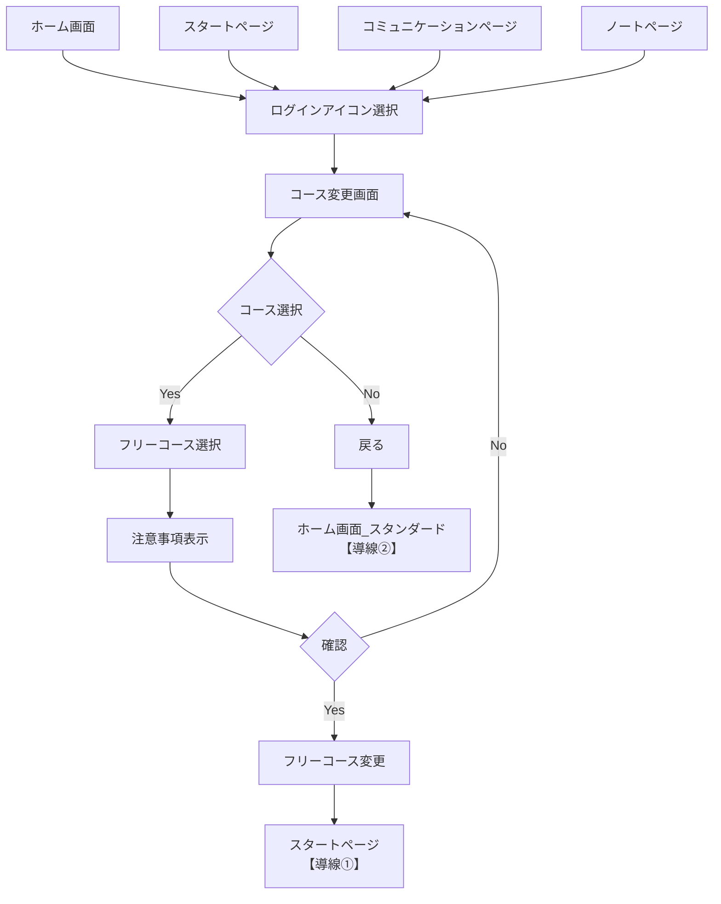

#### コース変更・ダウングレード（UI）

| 項目 | 内容 |
|------|------|
| 操作 | フリー列 **選択する** |
| 注意事項 | 90日データ保存メッセージ（`DATA_RETENTION_MSG`） |
| 確認 | ブラウザ `confirm`（お試し中は **28日お試し終了** の追記あり）→ OK で Firestore 更新 |
| 到達先 | **`/start-program`**（`?downgraded=free` でアナウンス表示） |
| 実装 | `applyDemoDowngradeToFree`（`CourseChangePanel`） |

#### ダウングレード時の Firestore 更新（デモ）

| フィールド | 更新内容 |
|------------|----------|
| `subscription.plan` | `free` |
| `subscription.features` | `featuresForPlan('free')` |
| `subscription.trialEndsAt` | **削除**（`deleteField`） |
| `subscription.dataRetentionEndsAt` | 変更日 **+90日** |
| `enrollment.primaryCourse` | `start7d` |

#### 導線チェックリスト_8　スタンダード会員→フリー会員

| 導線No | シーケンス | 結果 | 備考 |
|:---:|:---|:---:|:---|
| 導線① | ログインアイコン → コース変更画面 → コース選択 → **フリーコース選択** → 注意事項 → 確認 → フリーコース変更 → **スタートページ** |OK| **再同意なし**。一覧表の「スタンダードコース選択」は **誤記**（フロー図どおり **フリーコース**） |
| 導線② | ログインアイコン → コース変更画面 → コース選択 → **戻る** → ホーム画面_スタンダード |OK| **§5.4 導線②同型**（`/courses/change`「戻る」→ `/`、**ログイン維持**・`plan=standard` のまま） |

**テスト初期条件**: §5.6 と同型（スタンダード会員 UID）。

**変更後のデータ内容（Firestore）**

| フィールド | 期待値 |
|------------|--------|
| `subscription.plan` | `free` |
| `enrollment.primaryCourse` | `start7d` |
| `subscription.trialEndsAt` | **無し**（削除） |
| `subscription.dataRetentionEndsAt` | 変更日 +90日（未来日） |
| ノート nav | **無効** |

#### ダウングレード手順（デモ）　スタンダード→フリー

| # | 画面 | 操作 | 期待結果 | OK |
|---|------|------|----------|-----|
| G-1 | `/courses/change` | フリー「**選択する**」 | 注意事項 `confirm`（お試し中は28日終了の追記） |OK|
| G-2 | 同上 | OK | Firestore 更新 → **`/start-program?downgraded=free`** |OK |
| G-3 | `/start-program` | 画面上部アナウンス | フリー変更・データ90日保持の案内 |OK |
| G-4 | Firestore（任意） | 直後 | 上表の期待値 |OK |
| G-5 | `/` | ホーム | 7日間スタート案内。サイドバー「ノート」**無効** |OK |

#### 実装 URL との対応（スタンダード → フリー）

| 外部仕様のノード | 実装（代表） |
|------------------|--------------|
| コース変更画面 | `/courses/change` — フリー「**選択する**」 |
| フリーコース変更 | `applyDemoDowngradeToFree` |
| 導線① | 確認 OK → `/start-program?downgraded=free` |
| 導線② | `/courses/change` → **戻る** → `/`（**スタンダード維持**） |

#### コース復帰（例: スタンダード → フリー → スタンダード）

ダウングレード（§5.7）後の再アップグレードは **§5.4 と同型**（再同意なし）。**横断一覧は §5.12**。以下を追加で適用する。

| 項目 | 仕様・実装 |
|------|------------|
| 会員同意 | **スキップ**（`consents` 維持） |
| お試し 28日 | **再付与なし**（`trialConsumedAt` 記録済みなら `trialEndsAt` を付けない） |
| お客様情報 | `users/{uid}.applyBilling` に前回保存。**申込画面で表示・編集可** |
| UI（申込） | **おかえりなさい** メッセージ＋「前回情報を表示」案内。送信ボタン「**再開する（デモ）**」 |
| UI（ノート） | 到達時 `/trial_4w?welcomeBack=1` で **おかえりなさい** バナー（閉じる可） |
| データ | サブコレクションは **90日以内なら保持**（ダウングレード時 `dataRetentionEndsAt` 設定）。復帰時に `dataRetentionEndsAt` **クリア** |
| Firestore 復帰後 | `plan=standard`（または `premium`）、`primaryCourse=kizuki`、`trialConsumedAt` **維持**、`trialEndsAt` **無し**（再付与なし時） |

**復帰テスト手順（STD→Free→STD）**

| # | 操作 | 期待 |
|---|------|------|
| R-1 | §5.7 導線①でフリーへダウングレード | `start7d`、`dataRetentionEndsAt` +90日 |
| R-2 | §5.4 導線①でスタンダード再申込 | 申込に **おかえりなさい**・前回 `applyBilling` 表示 |
| R-3 | 情報を一部修正して「再開する（デモ）」 | `applyBilling` 更新、`plan=standard`、**`trialEndsAt` 無し** |
| R-4 | `/trial_4w` | **おかえりなさい** バナー。既存ノートデータが閲覧可能（90日以内） |


### Firestoreへのデータ入力変化

| フィールド | 初回申込 | 確認 | ダウングレード | 確認 | 復帰申込 | 確認 | 
| --- | --- | --- | --- | --- | --- | --- | 
| applyBilling | 新規保存（氏名・住所等） |OK  | 維持 |OK  | 更新可 |OK  | 
| trialConsumedAt | 設定（お試し付与時） |OK  | 維持 |OK  | 維持（再付与判定） |OK  | 
| trialEndsAt | +28日 |OK  | 削除 |OK  | 付けない（復帰時） |OK  | 
| dataRetentionEndsAt | — |OK  | +90日 |OK | クリア | OK | 
| plan / primaryCourse | standard / kizuki |OK | free / start7d |OK | standard / kizuki | OK | 

§5.4の導線③についても確認済。

---

### 5.8 画面遷移（導線フロー）_9　スタンダード会員→プレミアム会員

外部仕様の「**状態変化フロー_9　スタンダード会員→プレミアム会員**」。各**最終到達**に **導線No**（①〜②）。

**初期条件**: **スタンダード会員**。起点は **ホーム／スタート／コミュニケーション／ノート** のいずれか。ヘッダー**ログインアイコン** → **コース変更**。**アップグレード時は再同意なし**（§2.1）。

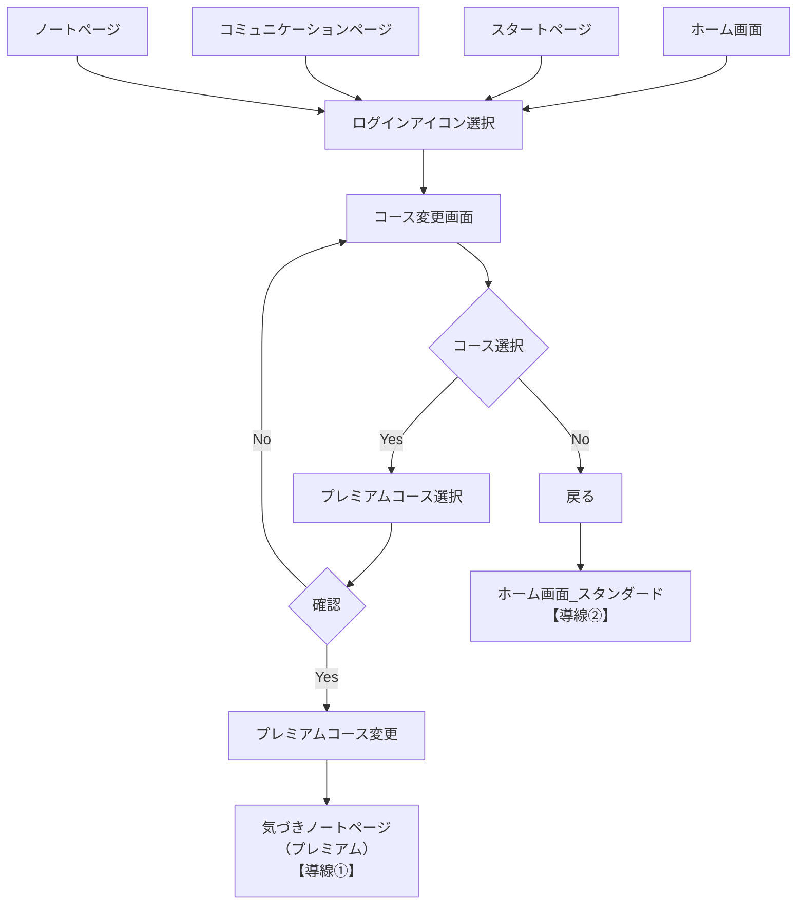

#### コース変更・アップグレード（UI）

| 項目 | 内容 |
|------|------|
| 操作 | プレミアム列 **選択する** |
| 外部仕様 | 確認 → **プレミアムコース変更** → 気づきノート（プレミアム） |
| 実装（デモ） | **`/apply?plan=premium`** へ遷移 → 申込フォーム → `applyDemoPlanEnrollment` → `/trial_4w`（§5.5 導線①と同型の申込 UI を経由） |

#### 導線チェックリスト_9　スタンダード会員→プレミアム会員

| 導線No | シーケンス | 結果 | 備考 |
|:---:|:---|:---:|:---|
| 導線① | ログインアイコン → コース変更画面 → コース選択 → プレミアム **選択する** → プレミアム資格取得 → 気づきノート（プレミアム） | | **再同意なし**。デモでは **申込フォーム**（`/apply?plan=premium`）を経由 |
| 導線② | ログインアイコン → コース変更画面 → コース選択 → **戻る** → ホーム画面_スタンダード | | **§5.4 導線②同型**（ログイン維持・`plan=standard` のまま） |

**テスト初期条件**: §5.6 と同型（スタンダード会員 UID）。

**変更後のデータ内容（Firestore・代表）**

| フィールド | 期待値 |
|------------|--------|
| `subscription.plan` | `premium` |
| `enrollment.primaryCourse` | `kizuki` |
| `subscription.features.coachComments` 等 | プレミアム相当 |
| コミュニケーション MB | **有効** |

#### 申込手順（デモ）　スタンダード→プレミアム（アップグレード）

**対象導線**: ①のみ。

| # | 画面 | 操作 | 期待結果 | OK |
|---|------|------|----------|-----|
| F-1 | `/courses/change` | プレミアム「**選択する**」 | `/apply?plan=premium` へ | |
| F-2 | `/apply?plan=premium` | デモ事業者情報・料金を確認 | 表示される | |
| F-3 | 同上 | お客様情報入力・特商法チェック → **申し込む（デモ）** | **`/trial_4w` へ自動遷移** | |
| F-4 | `/trial_4w` | 気づきノート（プレミアム） | 週・月・行動宣言 **コーチと共有** 有効 | |
| F-5 | `/communication` | メッセージボード | **有効** | |
| F-6 | Firestore（任意） | 送信直後 | `plan=premium`、`features` 更新 | |

#### 実装 URL との対応（スタンダード → プレミアム）

| 外部仕様のノード | 実装（代表） |
|------------------|--------------|
| プレミアムコース選択 | `CourseChangePanel`「**選択する**」→ `/apply?plan=premium` |
| プレミアム資格取得 | 申込送信時 `applyDemoPlanEnrollment('premium')` |
| 気づきノート（プレミアム） | `/trial_4w` |
| 導線① | `/courses/change` → 申込 → `/trial_4w` |
| 導線② | `/courses/change` → **戻る** → `/`（**スタンダード維持**） |

**外部仕様フロー図との差**: 導線①は図上「確認→プレミアムコース変更」のみだが、**デモ実装は申込フォーム経由**（§5.5 と同様）。導線②の「戻る」は **ログオフしない**（§5.4 確定と同型）。

#### コース復帰（スタンダード → プレミアム）

**スタンダード会員からプレミアムへ戻す**経路は次の2種。いずれも §2.1・§5.12 の共通ルールに従う。

| パターン | 経路 | 詳細 |
|----------|------|------|
| **STD→Free→PRE** | §5.7 フリー化 → §5.5 申込 | §5.5「コース復帰」 |
| **PRE→STD→PRE** | §5.11 STD化 → §5.8 申込 | 以下 |

##### PRE→STD→PRE（プレミアム → スタンダード → プレミアム）

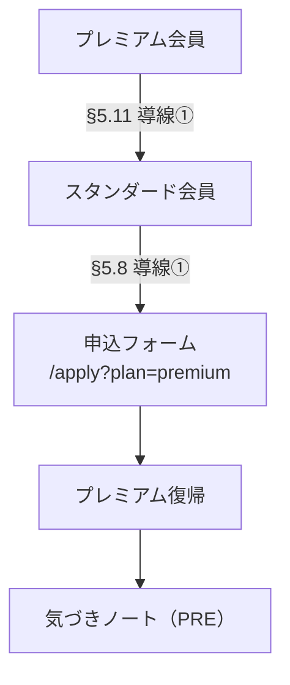

| 項目 | 仕様・実装 |
|------|------------|
| ダウングレード | §5.11 導線①（**実装待ち**の場合は Console で `plan=standard` に手動設定して復帰のみ検証可） |
| 再アップグレード | §5.8 導線① — コース変更 → プレミアム **選択する** → `/apply?plan=premium` |
| 会員同意 | **スキップ** |
| お試し 28日 | **再付与なし**（`trialConsumedAt` 維持） |
| お客様情報 | `applyBilling` **表示・更新**。「**再開する（デモ）**」 |
| UI | 申込・ノートとも **おかえりなさい**（§5.7 同型） |
| データ | ノート本体は **継続利用**（STD 中も nav 有効）。MB は STD 中 **無効** → PRE 復帰で **再有効** |
| Firestore 復帰後 | `plan=premium`、`features` PRE 相当、`trialConsumedAt` 維持、`trialEndsAt` 無し |

**復帰テスト手順（PRE→STD→PRE）**

| # | 操作 | 期待 |
|---|------|------|
| R-PSP1 | §5.11 導線①でスタンダードへ（または手動 `plan=standard`） | `plan=standard`、ノート nav **有効**、MB **無効** |
| R-PSP2 | §5.8 導線①でプレミアム再申込 | **おかえりなさい**・`applyBilling` 表示 |
| R-PSP3 | 「再開する（デモ）」 | `plan=premium`、`features.coachComments` 等 true |
| R-PSP4 | `/trial_4w`・`/communication` | おかえりバナー。**MB 再有効**。ノートデータ継続 |

**Firestore 変化（PRE→STD→PRE 代表）**

| フィールド | プレミアム | STD ダウングレード後 | PRE 復帰後 |
|------------|-----------|---------------------|-----------|
| `plan` | `premium` | `standard` | `premium` |
| `primaryCourse` | `kizuki` | `kizuki` | `kizuki` |
| `trialConsumedAt` | あり | 維持 | 維持 |
| `features.coachComments` | true | false | true |
| メッセージボード | 有効 | **無効** | **有効** |

---

### 5.9 画面遷移（導線フロー）_10　プレミアム会員→ゲスト

外部仕様の「**状態変化フロー_10　プレミアム会員→ゲスト**」。各**最終到達**に **導線No**（①〜④）。いずれも **ログオフ後はゲストのホーム画面**（`/`）へ遷移する。

**初期条件**: **プレミアム会員**（`subscription.plan=premium`、`enrollment.primaryCourse=kizuki`、会員同意済み想定）。**ログオフ**はヘッダーの**ログインアイコン**（アバター）→ メニューから行う（`signOutAndRedirect` → `/`）。§5.6（スタンダード→ゲスト）と同型で、起点に **ノートページ** を含む。

```mermaid
flowchart TD
  subgraph R1["経路① ホーム"]
    HOME_PRE["ホーム画面<br/>プレミアムモード"] --> ICON1["ログインアイコン選択"]
    ICON1 --> LOGOFF1["ログオフ"]
    LOGOFF1 --> GUEST1["ホーム画面_ゲスト<br/>【導線①】"]
  end

  subgraph R2["経路② スタート"]
    START_PG["スタートページ"] --> ICON2["ログインアイコン選択"]
    ICON2 --> LOGOFF2["ログオフ"]
    LOGOFF2 --> GUEST2["ホーム画面_ゲスト<br/>【導線②】"]
  end

  subgraph R3["経路③ コミュニケーション"]
    COMM_PG["コミュニケーションページ"] --> ICON3["ログインアイコン選択"]
    ICON3 --> LOGOFF3["ログオフ"]
    LOGOFF3 --> GUEST3["ホーム画面_ゲスト<br/>【導線③】"]
  end

  subgraph R4["経路④ ノート"]
    NOTE_PG["ノートページ"] --> ICON4["ログインアイコン選択"]
    ICON4 --> LOGOFF4["ログオフ"]
    LOGOFF4 --> GUEST4["ホーム画面_ゲスト<br/>【導線④】"]
  end
```

#### 導線チェックリスト_10　プレミアム会員→ゲスト

| 導線No | シーケンス | 結果 | 備考 |
|:---:|:---|:---:|:---|
| 導線① | ホーム画面 → ログインアイコン → ログオフ → ホーム画面（ゲスト） |OK | `/` プレミアムモードから |
| 導線② | スタートページ → ログインアイコン → ログオフ → ホーム画面（ゲスト） |OK | `/start-program` から |
| 導線③ | コミュニケーションページ → ログインアイコン → ログオフ → ホーム画面（ゲスト） |OK | `/communication` から。MB 利用中でも同じ |
| 導線④ | ノートページ → ログインアイコン → ログオフ → ホーム画面（ゲスト） |OK | `/trial_4w` から |

**テスト初期条件**: §5.5 導線①完了済みの **プレミアム** UID（`plan=premium`、`primaryCourse=kizuki`、`consents` 済み）。

#### ログオフ後の UI 確認（代表）

§5.6 と同型。加えてログイン前は **メッセージボード無効**・**コーチ共有 UI 無効**。

#### 実装 URL との対応（プレミアム → ゲスト）

| 外部仕様のノード | 実装（代表） |
|------------------|--------------|
| ログオフ | `signOutAndRedirect(signOut, router, '/')`（`ProtoHeader`） |
| 導線①〜④ | 各起点 → ログアウト → `/`（未ログイン） |

**注意**: 同意キャンセル等の意図的ログオフとは別経路（§5.3 同様）。

---

### 5.10 画面遷移（導線フロー）_11　プレミアム会員→フリー会員

外部仕様の「**状態変化フロー_11　プレミアム会員→フリー会員**」。各**最終到達**に **導線No**（①〜②）。

**初期条件**: **プレミアム会員**。起点は **ホーム／スタート／コミュニケーション／ノート** のいずれか。ヘッダー**ログインアイコン** → **コース変更**（`/courses/change`）。§5.7（スタンダード→フリー）と **同型のダウングレード処理**（`applyDemoDowngradeToFree`）。

```mermaid
flowchart TD
  HOME["ホーム画面"] --> ICON["ログインアイコン選択"]
  START["スタートページ"] --> ICON
  COMM["コミュニケーションページ"] --> ICON
  NOTE["ノートページ"] --> ICON

  ICON --> CHANGE["コース変更画面"]
  CHANGE --> SEL{"コース選択"}

  SEL -->|Yes| FREE["フリーコース選択"]
  FREE --> NOTICE["注意事項表示"]
  NOTICE --> CONF{"確認"}
  CONF -->|No| CHANGE
  CONF -->|Yes| FREE_CHG["フリーコース変更"]
  FREE_CHG --> START_PG["スタートページ<br/>【導線①】"]

  SEL -->|No| BACK["戻る"]
  BACK --> HOME_PRE["ホーム画面_プレミアム<br/>【導線②】"]
```

#### コース変更・ダウングレード（UI）

§5.7 と同型。プレミアムからもフリー列 **選択する** → `applyDemoDowngradeToFree` → `/start-program?downgraded=free`。

| 項目 | プレミアム→フリー固有 |
|------|----------------------|
| メッセージボード | ダウングレード後 **即時 投稿・編集不可**（§2.5）。履歴は `dataRetentionEndsAt` まで閲覧可 |
| コーチ共有 | ノート各タブの **コーチと共有** が無効化 |

#### 導線チェックリスト_11　プレミアム会員→フリー会員

| 導線No | シーケンス | 結果 | 備考 |
|:---:|:---|:---:|:---|
| 導線① | ログインアイコン → コース変更画面 → コース選択 → **フリーコース選択** → 注意事項 → 確認 → フリーコース変更 → **スタートページ** |OK | §5.7 導線①と同実装。**再同意なし** |
| 導線② | ログインアイコン → コース変更画面 → コース選択 → **戻る** → ホーム画面_プレミアム |OK | **§5.4 導線②同型**（`/courses/change`「戻る」→ `/`、**ログイン維持**・`plan=premium` のまま） |

**テスト初期条件**: §5.5 導線①完了済みの **プレミアム** UID。

**変更後のデータ内容（Firestore）**: §5.7 と同型（`plan=free`、`start7d`、`trialEndsAt` 削除、`dataRetentionEndsAt` +90日、`trialConsumedAt` 維持）。

#### コース復帰（プレミアム → フリー → スタンダード／プレミアム）

§5.7「コース復帰」と **同型の共通ルール**（§2.1・§5.12）。ダウングレード（§5.10 導線①）後、フリー会員（`start7d`）として **§5.4 または §5.5** のアップグレード導線で戻す。

```mermaid
flowchart TD
  PRE["プレミアム会員"] -->|§5.10 導線①| FREE["フリー start7d"]
  FREE -->|§5.4 導線①| STD["スタンダード復帰"]
  FREE -->|§5.5 導線①| PRE2["プレミアム復帰"]
  FREE -->|§5.5 導線③| PRE3["プレミアム復帰<br/>（スタート経由）"]
  STD --> NOTE_STD["気づきノート（STD）"]
  PRE2 --> NOTE_PRE["気づきノート（PRE）"]
  PRE3 --> NOTE_PRE
```

| 復帰先 | 利用するアップグレード導線 | 申込 URL | 復帰後の主な差分 |
|--------|---------------------------|----------|------------------|
| **スタンダード** | §5.4 導線①（コース変更）または 導線③（スタート→ランディング→AIコーチ） | `/apply?plan=standard` | MB **無効**。コーチ共有 **無効** |
| **プレミアム** | §5.5 導線①（コース変更）または 導線③（スタート→ランディング→パーソナルコーチ） | `/apply?plan=premium` | MB **有効**。コーチ共有 **有効** |

| 項目 | 仕様・実装 |
|------|------------|
| 会員同意 | **スキップ** |
| お試し 28日 | **再付与なし** |
| お客様情報 | `applyBilling` **表示・更新可**。「**再開する（デモ）**」 |
| UI | 申込: **おかえりなさい**／ノート: `/trial_4w?welcomeBack=1` |
| データ | 90日以内のノートデータ **保持・再閲覧可**。復帰時 `dataRetentionEndsAt` **クリア** |
| PRE 固有の喪失 | フリー中は **MB・コーチ共有** 無効。復帰先プランに応じて再開 |

**復帰テスト手順（PRE→Free→PRE）**

| # | 操作 | 期待 |
|---|------|------|
| R-P1 | §5.10 導線①でフリーへダウングレード | `plan=free`、`start7d`、`trialConsumedAt` 維持 |
| R-P2 | §5.5 導線①でプレミアム再申込 | **おかえりなさい**・`applyBilling` 表示 |
| R-P3 | 「再開する（デモ）」 | `plan=premium`、`features` PRE 相当、**`trialEndsAt` 無し** |
| R-P4 | `/trial_4w` | おかえりバナー。**MB 有効**。既存ノートデータ閲覧可 |

**復帰テスト手順（PRE→Free→STD）**

| # | 操作 | 期待 |
|---|------|------|
| R-PS1 | §5.10 導線①でフリーへダウングレード | 同上 |
| R-PS2 | §5.4 導線①でスタンダード再申込 | **おかえりなさい**・`applyBilling` 表示 |
| R-PS3 | 「再開する（デモ）」 | `plan=standard`、**`trialEndsAt` 無し** |
| R-PS4 | `/trial_4w` | おかえりバナー。**MB 無効**。既存ノートデータ閲覧可 |

**Firestore 変化（PRE→Free→PRE 代表）**

| フィールド | プレミアム | 確認 | フリー化後 |確認 | プレミアム復帰後 |確認 |
|------------|-----------|----|-----------|-----|-----------------|----|
| `plan` | `premium` | OK | `free` | OK | `premium` | OK |
| `primaryCourse` | `kizuki` | OK | `start7d` | OK | `kizuki` | OK |
| `trialConsumedAt` | あり | OK | 維持 | OK | 維持 | OK |
| `trialEndsAt` | 任意 | OK | 削除 | OK | **無し** | OK |
| `dataRetentionEndsAt` | — | OK | +90日 | OK | **クリア** | OK |
| `features.coachComments` | true | OK | false | OK | true | OK |


#### ダウングレード手順（デモ）　プレミアム→フリー

§5.7 の **G-1〜G-5** と同手順（初期状態のみ `plan=premium`）。

#### 実装 URL との対応（プレミアム → フリー）

| 外部仕様のノード | 実装（代表） |
|------------------|--------------|
| フリーコース変更 | `applyDemoDowngradeToFree`（プレミアムからも呼び出し可） |
| 導線① | 確認 OK → `/start-program?downgraded=free` |
| 導線② | `/courses/change` → **戻る** → `/`（**プレミアム維持**） |

---

### 5.11 画面遷移（導線フロー）_12　プレミアム会員→スタンダード会員

外部仕様の「**状態変化フロー_12　プレミアム会員→スタンダード会員**」。各**最終到達**に **導線No**（①〜②）。

**初期条件**: **プレミアム会員**。起点は **ホーム／スタート／コミュニケーション／ノート** のいずれか。ヘッダー**ログインアイコン** → **コース変更**。**ダウングレード時は再同意なし**（§2.1）。

```mermaid
flowchart TD
  HOME["ホーム画面"] --> ICON["ログインアイコン選択"]
  START["スタートページ"] --> ICON
  COMM["コミュニケーションページ"] --> ICON
  NOTE["ノートページ"] --> ICON

  ICON --> CHANGE["コース変更画面"]
  CHANGE --> SEL{"コース選択"}

  SEL -->|Yes| STD["スタンダードコース選択"]
  STD --> NOTICE["注意事項表示"]
  NOTICE --> CONF{"確認"}
  CONF -->|No| CHANGE
  CONF -->|Yes| STD_CHG["スタンダードコース変更"]
  STD_CHG --> NOTE_STD["気づきノートページ<br/>（スタンダード）<br/>【導線①】"]

  SEL -->|No| BACK["戻る"]
  BACK --> HOME_PRE["ホーム画面_プレミアム<br/>【導線②】"]
```

#### コース変更・ダウングレード（UI）

| 項目 | 内容 |
|------|------|
| 操作 | スタンダード列 **選択する** |
| 注意事項 | `DATA_RETENTION_MSG`（90日データ保存） |
| 外部仕様 | 確認 → **スタンダードコース変更** → **気づきノート**（プランは STD・ノート継続） |
| 実装（デモ） | `applyDemoDowngradeToStandard` → `/trial_4w?downgraded=standard`（**実装済**） |
| PRE→STD 固有 | **メッセージボード即時無効**（§2.5）。気づきノート・コーチ共有（週・月）は STD 相当に |

#### 導線チェックリスト_12　プレミアム会員→スタンダード会員

| 導線No | シーケンス | 結果 | 備考 |
|:---:|:---|:---:|:---|
| 導線① | ログインアイコン → コース変更画面 → コース選択 → **スタンダードコース選択** → 注意事項 → 確認 → スタンダードコース変更 → **気づきノート** |OK| **再同意なし**。外部仕様は申込なしでノート到達 |
| 導線② | ログインアイコン → コース変更画面 → コース選択 → **戻る** → ホーム画面_プレミアム |OK | **§5.4 導線②同型**（ログイン維持・`plan=premium` のまま） |

**テスト初期条件**: §5.5 導線①完了済みの **プレミアム** UID。

**変更後のデータ内容（Firestore）**

| フィールド | 期待値 |
|------------|--------|
| `subscription.plan` | `standard` |
| `enrollment.primaryCourse` | `kizuki`（維持） |
| `subscription.features` | スタンダード相当（`coachComments` 等 **false**） |
| `subscription.dataRetentionEndsAt` | 変更日 +90日（MB 等の保持用） |
| `subscription.trialConsumedAt` | **維持**（お試し再付与なし） |
| コミュニケーション MB | **無効**（新規投稿不可・履歴閲覧可） |

#### 実装 URL との対応（プレミアム → スタンダード）

| 外部仕様のノード | 実装（代表） |
|------------------|--------------|
| コース変更画面 | `/courses/change` — スタンダード「**選択する**」→ `applyDemoDowngradeToStandard` |
| スタンダードコース変更 | `applyDemoDowngradeToStandard` → `/trial_4w?downgraded=standard` |
| 導線① | `/courses/change` → 確認 → `/trial_4w` |
| 導線② | `/courses/change` → **戻る** → `/`（**プレミアム維持**） |
| 90日保持 UI | `DataRetentionBanner`（ノート・スタート・コミュニケーション） |
| MB 履歴閲覧 | `boardRetentionReadOnly`（`CommunicationPageClient`） |

---

### 5.12 コース復帰（横断）　ダウングレード後の再アップグレード

**目的**: ダウングレード（または解約相当）後に有料コースへ戻す **復帰導線** を一覧化する。いずれも **§2.1 コース復帰** の共通ルールに従う。

#### 共通ルール（全復帰パターン）

| 項目 | 内容 |
|------|------|
| 会員同意 | **再同意なし**（`consents` 維持） |
| 申込 | `/apply?plan=standard\|premium`。`applyBilling` **事前表示・変更確認** |
| お試し | **`trialConsumedAt` ありなら再付与なし** |
| UI | 申込 **おかえりなさい**／ノート `?welcomeBack=1` |
| データ | ダウングレード時 `dataRetentionEndsAt` +90日 → 復帰時 **クリア**。サブコレクションは **90日以内保持** |
| 実装 | `applyDemoPlanEnrollment` ＋ `isReturningPaidSubscriber`（`courseReturn.ts`） |

#### 復帰パターン一覧

| パターン | ダウングレード | 復帰（再アップグレード） | 詳細 § | テスト手順 |
|----------|---------------|-------------------------|--------|-----------|
| **STD→Free→STD** | §5.7 導線① | §5.4 導線① | §5.7 | R-1〜R-4 |
| **STD→Free→PRE** | §5.7 導線① | §5.5 導線①／③ | §5.5 | R-SFP1〜R-SFP4 |
| **PRE→Free→STD** | §5.10 導線① | §5.4 導線① | §5.10 | R-PS1〜R-PS4 |
| **PRE→Free→PRE** | §5.10 導線① | §5.5 導線①／③ | §5.10 | R-P1〜R-P4 |
| **PRE→STD→PRE** | §5.11 導線① ※ | §5.8 導線① | §5.8 | R-PSP1〜R-PSP4 |

※ §5.11 ダウングレード実装 **未完了**時は Firestore 手動または実装後に R-PSP1 を実施。

#### 復帰導線フロー（代表・フリー経由）

```mermaid
flowchart LR
  PAID["有料会員<br/>STD or PRE"] -->|ダウングレード| FREE["フリー start7d"]
  FREE -->|§5.4| STD2["スタンダード"]
  FREE -->|§5.5| PRE2["プレミアム"]
  STD2 --> NOTE1["/trial_4w"]
  PRE2 --> NOTE2["/trial_4w"]
```

#### 復帰導線フロー（PRE→STD→PRE・ノート継続）

```mermaid
flowchart LR
  PRE_A["プレミアム"] -->|§5.11| STD["スタンダード<br/>ノート継続"]
  STD -->|§5.8 申込| PRE_B["プレミアム復帰"]
  PRE_B --> NOTE["/trial_4w + MB"]
```

#### 実装 URL（復帰時の代表）

| ステップ | URL・処理 |
|----------|-----------|
| 復帰判定 | `isReturningPaidSubscriber(userProfile)` |
| 申込（STD） | `/apply?plan=standard` → `applyDemoPlanEnrollment(..., billing)` |
| 申込（PRE） | `/apply?plan=premium` → 同上 |
| 到達 | `/trial_4w?welcomeBack=1` |

---

## 6. 実装マッピング（メモ）

| 仕様 | コード／データ |
|------|----------------|
| メッセージボード | `resolveEntitlements` → `communication.message_board`（`plan === 'premium'` かつ有効契約） |
| ノート nav | `isKizukiNoteNavEnabled` / `hasAiCoachOrPremiumSignup`（`enrollmentCourse.ts`） |
| 7日間のみホーム | `shouldShowStart7dHomeHint` |
| 同意 | `users.consents`、`/consent?next=...` |
| コース変更 | `/courses/change` — `CourseChangePanel`・`courseSelectionCatalog` |
| 申込フォーム（仮） | `/apply?plan=standard\|premium` — `ApplyFormPanel`、`demoMerchantInfo.ts` |
| 28日お試し | `subscription.trialEndsAt`、`trialConsumedAt` |
| 90日保持 | `subscription.dataRetentionEndsAt`、`DataRetentionBanner`、`dataRetention.ts` |

---

## 7. 実装フェーズ（案）

| 順 | 内容 | 状態 |
|----|------|------|
| 1 | 本ドキュメント確定 → 関連 doc の § 参照更新 | 進行中 |
| 2 | サイドバー（マイページ非表示）、バナー、entitlement 連動 | **マイページ非表示 実装済** |
| 3 | **コース変更・選択画面** `/courses/change` UI（Stripe 前） | **実装済**（3プラン＋機能表＋限定価格） |
| 4 | 申込フォーム `/apply?plan=...`（STD／PRE 初回） | **仮画面 実装済** |
| 5 | Stripe Phase C 連携 | 未着手 | 未着手 |

---

## 8. 参照

- [04_SUBSCRIPTION_PRODUCT_SCOPE.md](./04_SUBSCRIPTION_PRODUCT_SCOPE.md)
- [04_HOME_SCREEN_IMPLEMENTATION.md](./04_HOME_SCREEN_IMPLEMENTATION.md) §1.1〜1.3
- [04_COMMUNICATION_SCREEN_IMPLEMENTATION.md](./04_COMMUNICATION_SCREEN_IMPLEMENTATION.md)
- [04_TEST_ONBOARDING_CHECKLIST.md](./04_TEST_ONBOARDING_CHECKLIST.md)（手動テスト・**§1 初期化**）
- [03_FIRESTORE_DATABASE_STRUCTURE.md](./03_FIRESTORE_DATABASE_STRUCTURE.md) §2.1
- `src/lib/enrollmentCourse.ts`、`src/lib/subscription/resolveEntitlements.ts`

---

## 9. テスト用データ（Firebase）と初期化

状態遷移表（§5）を手動テストするとき、**Firestore のどの値が UI を決めるか**と、**初期状態（ゲスト）への戻し方**をまとめる。手順の詳細・チェック項目は [04_TEST_ONBOARDING_CHECKLIST.md](./04_TEST_ONBOARDING_CHECKLIST.md) §1 も参照。

### 9.1 「ゲスト」とは何か

| 状態 | 条件 | Firebase で触る場所 |
|------|------|---------------------|
| **ゲスト（未ログイン）** | ブラウザに **Auth セッションが無い**（`useAuth().user === null`） | **Firestore は読まれない**（UI は未認証として表示） |
| **フリー会員など（ログイン済）** | Google ログイン済み | **`users/{uid}`** の各フィールド |

**ゲストから導線チェック（フリー・スタンダード）を試すとき**

1. アプリで **ログアウト**（ヘッダーアバター → ログアウト）→ これだけで **ゲスト UI** になる。
2. 次にログインして **初回入会フローを最初から** やり直す場合は、§9.3 の Firestore リセットを **ログイン前またはログアウト中** に実施する。

シークレットウィンドウを使う場合も、Firestore のクリアは §9.3 が必要（同じ Google アカウントで再ログインすると既存プロファイルが残るため）。

### 9.2 状態遷移に関係するデータ一覧

| 保存場所 | フィールド | 役割（UI／導線への effect） | ゲスト時 | 新規プロファイル初期値（参考） |
|----------|------------|------------------------------|----------|--------------------------------|
| **Firebase Auth** | （セッション） | ログイン可否。**無ければゲスト** | なし | ログインで UID 発行 |
| `users/{uid}` | `consents` | **会員同意（A案・1回）**。未設定または版不一致 → `/consent?next=...` | ドキュメント自体なし | 未設定 |
| `consents.termsVersion` | 同意時の利用規約版（`terms.json` の `version` と一致要） | — | — |
| `consents.privacyVersion` | 同意時のプライバシー版 | — | — |
| `consents.acceptedAt` | 同意日時 | — | — |
| `users/{uid}` | `subscription.plan` | **会員種別の正本**（`free` / `standard` / `premium`）。サイドバー・MB・バナー等 | — | `free` |
| `subscription.status` | 契約状態（`active` 等） | entitlement 判定の補助 | — | `active` |
| `subscription.trialEndsAt` | **28日お試し**終了日時（STD/PRE 初回申込想定） | お試し中表示・コース変更「お試し付き」 | — | 新規作成時 +28日が入る実装あり※ |
| `subscription.trialConsumedAt` | お試し**消費済み**（再付与なし） | 再申込時のお試し可否 | — | 未設定 |
| `subscription.dataRetentionEndsAt` | 解約・ダウングレード後 **90日**でデータ削除予定 | `DataRetentionBanner`・MB履歴保持 | — | 未設定 |
| `subscription.courseId` | 論理コース（`ai_only` 等） | コーチ機能マトリクス（将来） | — | 未設定可 |
| `subscription.coaching.*` | 初回面談無料フラグ等 | プレミアム面談導線 | — | 未設定 |
| `users/{uid}` | `enrollment.primaryCourse` | **コース選択の記録**。`start7d` → 7日間のみ／ノート nav 無効、`kizuki` → 気づきノート導線 | — | 未設定 |
| `users/{uid}` | `role` | コーチ／管理者表示（状態遷移表の4列とは別軸） | — | `user` |

※ `createDefaultUserProfile` は `plan: free` でも `trialEndsAt` を +28日で入れる。**フリー会員に28日お試しは付与しない**仕様（§2.4）と実装がずれうる。テスト時は Console で `trialEndsAt` を削除してよい。

**本書の遷移表（plan 中心）に直接 effect しないが、テスト時に残るデータ**

| 保存場所 | 例 | 備考 |
|----------|-----|------|
| `users/{uid}/journal_*` 等 | 気づきノート本文 | ダウングレード・90日保持の**中身**確認用。UI 可否には `plan` / `enrollment` が優先 |
| `users/{uid}` | `weekStartsOn`, `trialAffirmationMeta` 等 | ノート UI 設定。コース遷移の可否には通常無関係 |
| 旧フィールド | `startProgram7dConsents` | **A案で廃止**。残っていてもアプリは参照しない |

**派生物（Firestore に保存しない）**

| 名称 | 入力 | 用途 |
|------|------|------|
| `resolveEntitlements(...)` | `UserProfile` | メッセージボード等の機能可否（`plan === 'premium'` 等） |

### 9.3 初期化パターン（何をクリアするか）

| 目的 | 操作 | 足りるか |
|------|------|----------|
| **画面をゲスト表示にする** | アプリ **ログアウト**（またはシークレット＋未ログイン） | ◎ **Firestore 変更不要** |
| **同じ UID で入会フロー（同意）だけやり直す** | Firestore: **`consents` フィールドを削除** → ログアウト → 再ログイン | ◎ 表1〜3 の「会員同意」行を再テスト |
| **コース選択・プランも含めて最初から** | Firestore: **`users/{uid}` ドキュメントごと削除** → ログアウト → 再ログイン | ◎ 次回 `createDefaultUserProfile` で `plan: free`・`consents` 無し |
| **完全に別人として試す** | 別 Google アカウント、または Auth ユーザ削除後に再登録 | ◎ |
| **プランだけ STD/PRE にしたい（Stripe 前）** | Console で `subscription.plan` を `standard` / `premium` に手動変更 | △ 表5以降の定常状態確認用 |

**ドキュメント削除時の注意**: `users/{uid}` を消すと **`journal_*` 等のサブコレクションも消える**（Console の削除範囲に注意）。

**推奨（表1 ゲスト→フリーから）**

```
1. ヘッダー → ログアウト（ゲスト UI を確認）
2. Firebase Console → Firestore → users → {テスト uid}
3. ドキュメントごと削除（または consents + enrollment + subscription を初期化）
4. ホーム「試してみる」→ ランディング → 7日間「やってみる」→ ログイン
```

**フィールド単位で戻す場合（ドキュメントは残す）**

| フィールド | 削除／初期値 | 効果 |
|------------|--------------|------|
| `consents` | **削除** | 再ログイン後 `/consent` が再表示 |
| `enrollment` または `enrollment.primaryCourse` | **削除** | 7日間／気づきノートの「選択中」がリセット |
| `subscription.plan` | `free` | フリー会員 UI に戻す |
| `subscription.trialEndsAt` | **削除** | お試し表示を消す（フリー想定テスト） |
| `subscription.trialConsumedAt` | **削除** | お試し消費フラグリセット |
| `subscription.dataRetentionEndsAt` | **削除** | 90日保持オーバーレイを消す |

### 9.4 関連ドキュメント（既存の記載場所）

| 内容 | 所在 |
|------|------|
| テストアカウント初期化手順（パターン A/B/C） | [04_TEST_ONBOARDING_CHECKLIST.md](./04_TEST_ONBOARDING_CHECKLIST.md) **§1** |
| `users/{uid}` フィールド定義（全般） | [03_FIRESTORE_DATABASE_STRUCTURE.md](./03_FIRESTORE_DATABASE_STRUCTURE.md) **§2.1** |
| 会員種別と `plan` の対応（概要） | 本書 **§1.3** |
| `plan` × `primaryCourse` | 本書 **§4** |
| コード ↔ データの対応（短いメモ） | 本書 **§6** |

---

## 更新履歴

| 日付 | 内容 |
|------|------|
| 2026-06-24 | 表6〜12（旧 UI 項目別・参照用）を削除。§5.5〜§5.11 の導線フロー＋チェックリストを正本とする |
| 2026-06-05 | §5.11: **PRE→STD ダウングレード実装**（`applyDemoDowngradeToStandard`・`DataRetentionBanner`・MB閲覧専用） |
| 2026-06-05 | §5.12 追加: コース復帰横断一覧。**PRE→Free→STD/PRE**（§5.10）、**STD→Free→PRE**（§5.5）、**PRE→STD→PRE**（§5.8）の復帰導線・テスト手順 |
| 2026-06-05 | §5.9〜5.11: 表10/11/12（PRE→ゲスト/フリー/STD）を **導線フロー_10〜12＋導線チェックリスト_10〜12** に差し替え |
| 2026-06-05 | コース復帰: `trialConsumedAt`・`applyBilling`・おかえりなさい UI・お試し再付与なしを実装（§5.4／§5.7 参照） |
| 2026-06-05 | §5.7: スタンダード→フリー **ダウングレード実装**（`applyDemoDowngradeToFree`・`dataRetentionEndsAt`・`/start-program` 遷移・アナウンス） |
| 2026-06-05 | §5.6〜5.8: 表9/7/8 を **導線フロー_7〜9＋導線チェックリスト_7〜9** に差し替え（STD→ゲスト/フリー/PRE） |
| 2026-06-05 | §5.5: 表6（フリー→プレミアム）を **導線フロー_6＋導線チェックリスト_6** に差し替え（導線①〜③） |
| 2026-06-05 | §5.4: **導線③**（スタート画面 → ランディング → スタンダード申込）を追加。導線フロー・チェックリスト・申込手順 C 列 |
| 2026-06-05 | §5.4: 7日間同意（`next=/start-program`）保存時に `enrollment.primaryCourse=start7d` を設定。コース変更画面「戻る」をランディング同型ボタンに統一 |
| 2026-06-05 | §5.4 実装: コース変更・選択画面（3プラン＋機能表＋オープン限定価格）。導線②＝戻る（ログイン維持） |
| 2026-06-05 | §5.4: 表5（フリー→スタンダード）を **導線フロー_5＋導線チェックリスト_5** に差し替え |
| 2026-06-05 | §5.3: 表4（フリー→ゲスト）を **導線フロー_4＋導線チェックリスト_4** に差し替え |
| 2026-06-05 | 導線チェックリスト_3（ゲスト→プレミアム）導線①〜⑧・申込手順 A-1〜A-7 **すべて OK**。週・月タブのコーチ共有を見出し右上に表示 |
| 2026-06-16 | 週タブ: `journal_weekly.sharedWithCoach` ＋ UI「コーチ共有」（閲覧のみ。質問は月次） |
| 2026-07-06 | 週タブ UI: 「今週の自分へのねぎらいの言葉」→「他に残しておきたいこと」に改称し「来週の行動」の前へ配置。`coachDailySummaryByDate` で記号・満足度をコーチ共有（週次共有 ON 連動） |
| 2026-06-16 | プレミアム導線① NG 修正: デモ申込 `applyDemoPlanEnrollment` が `plan` のみ更新していたため `features.coachComments` が false のまま → `planDefaults` で features も同期 |
| 2026-06-16 | 気づきノート（`/trial_4w`）ログアウト時: ランディングへ飛ばないよう `shouldRedirectUnauthenticatedToLogin` を適用（ヘッダー logout → `/`） |
| 2026-06-16 | 導線⑦: 申込済み既会員が申込画面をチラ見せしないよう `resolveOnboardingDestination` を追加（`post-login`／`consent`／`ApplyFormPanel`） |
| 2026-06-16 | §5.1・§5.2: 導線フロー・チェックリストに **申込手順（デモ）** を追加。Mermaid に申込フォームノードを挿入 |
| 2026-06-16 | デモ申込: `applyDemoPlanEnrollment` 追加。送信後 `/trial_4w` へ自動遷移。スタンダードも `/apply?plan=standard`（特定商取引法デモ情報）経由に統一 |
| 2026-06-05 | §5.2: 表3（ゲスト→プレミアム）を **導線フロー_3＋導線チェックリスト_3** に差し替え |
| 2026-06-14 | §5.0・§5.1: 表1・表2 を **導線フロー＋チェックリスト** に差し替え（フリー①〜⑧ OK、スタンダード checklist 追加） |
| 2026-05-25 | 初版草案: 定常状態一覧、plan×primaryCourse、遷移表1〜12、全体方針、実装マッピング |
| 2026-05-25 | §3・§5 全行展開＋OK欄。コース変更・申込仮画面 |
| 2026-05-25 | §9 テスト用データ（Firebase）と初期化 |
