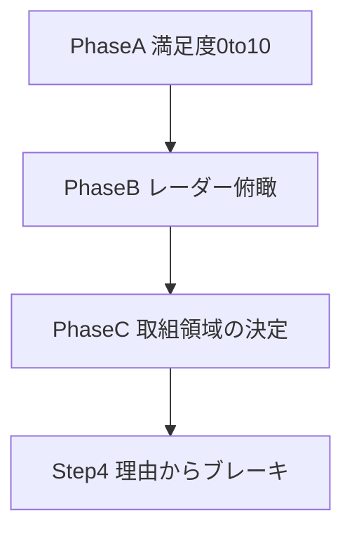

# Step3 満足度〜取組領域決定 仕様

最終更新: 2026-09-21

本ドキュメントはデジタル **Step3** の正本仕様です。  
紙では WS6（満足度）・WS5（実行領域）が Step4 寄りですが、デジタルでは **満足度 → レーダー → 取組領域決定** を Step3 にまとめ、**理由・こころのブレーキは Step4** に送ります。

関連:

- [04_START_PROGRAM_SEVEN_STEPS_SPEC.md](./04_START_PROGRAM_SEVEN_STEPS_SPEC.md)
- 紙ベース: [paper_based_tools/01_ワーキングシート_v0.62.txt](./paper_based_tools/01_ワーキングシート_v0.62.txt)（WS6 / WS5）
- 領域定義: [`src/lib/startProgram/mandalaConstants.ts`](../../src/lib/startProgram/mandalaConstants.ts)

---

## 1. 位置づけ（確定）

| デジタル | 内容 | 紙資料 |
|---------|------|--------|
| **Step3（本仕様）** | 満足度採点 → レーダー俯瞰 → **取組領域を1つ決める** | WS6＋WS5（領域選定まで） |
| **Step4** | 選んだ領域の「理由／現状」から **こころのブレーキ** を探る | 旧 Step3 / WS4 系 |
| その後 | テーマ具体化・Be-Do-Have 等 | 旧 Step4〜5 の続き |

ナビタイトル（案）: **満足度をみて、取組む領域を決める**  
URL 基点: `/start-program/seven-steps/step/3`  
サブ画面: `?pane=worksheet&phase=score|radar|focus`



---

## 2. Phase A — 満足度をつける

### 2.1 UI

- Step1 と同じ 3×3 曼荼羅（カード表示）。願望テキストは **編集しない**（プレビュー可）。
- カードタップ → モーダル:
  - Step1 当該領域の願望（読取専用）
  - **満足度 0〜10**（チップ）。未選択は `null`
  - **理由入力は置かない**（Step4 へ）
- 中央セル: Step1「人生の中心目標」参照 ＋「評価済み x/8」
- 評価バッジ: 未評価 / `N/10`

### 2.2 完了・遷移

- Step 間ナビは従来どおり必須なし（ソフト）。
- Phase B（レーダー）へ進む条件: **8領域すべてに score が入っている**（ソフトブロック推奨。未達時は案内）。

---

## 3. Phase B — レーダーチャートで俯瞰

### 3.1 チャート

- 8軸レーダー。各軸 = 領域の満足度（0〜10）。
- ライブラリ: 既存の **`recharts`**。実装: `Step03RadarChartBlock`（`Step03RadarPhase.tsx`）。Phase C 上部でも同じ部品を使う。
- 描画パラメータ:

| 項目 | 値 |
|------|-----|
| `outerRadius` 係数 | `0.38` × min(幅, 高さ) |
| 角度ラベル `fontSize` | `13` |
| 半径目盛 `fontSize` | `11` |
| チャート高さ | `340` |
| 描画最小幅 | `400` px |

- 表示幅が 400px 未満のときはラベル切れを避けるため **横スクロール**（`.step03-radar-chart-wrap` の `overflow-x: auto`）。

### 3.2 パターンガイド（紙準拠）

| パターン | 見え方 | おすすめの向き |
|---------|--------|----------------|
| **A 偏り型** | 一部が高く、他が凹む | **低い領域**を整えると全体が楽になる |
| **B 全体低型** | ほぼ5点以下 | **自分らしさを高めやすい領域**（Step2アクセルと接続可） |
| **C 全体高・一部低** | 全体は高いが一部だけ凹む | **凹みにフォーカス**すると統合感が出る |
| **mixed**（UI:「バランスを見てみましょう」） | A/B/C のいずれにも当てはまりにくい | 気になる凹みや、整うと軽くなりそうな領域から候補を |

UI:

- 判定結果カード（文言＋右側イラストを同一の薄緑枠内）。画像: `public/start-program/seven-steps/step03/illustrations/radar.png`
- A/B/C の一覧は **アコーディオン**（「補足（クリックで表示）」）。常時展開しない
- 見え方文言に特定領域名（例: 仕事・お金）を括弧書きしない（限定して見えるため）

パターン表示は **ガイド・ヒント**であり、Phase C の選定を強制しない。

#### 3.2.1 自動判定ロジック（実装）

実装: `detectRadarPattern`（[`src/lib/startProgram/step03Constants.ts`](../../src/lib/startProgram/step03Constants.ts)）。  
紙の「見え方」を、8領域スコアの **平均・最大・最小・ばらつき** で近似する。領域名（仕事・お金など）の組み合わせは見ない。

前提変数（8領域すべてに 0〜10 の整数があるときのみ判定。未充足は `mixed`）:

- `avg` = 8スコアの平均
- `min` / `max` = 最小・最大
- `spread` = `max − min`

**上から順に**最初に当てはまったものを採用:

| 優先 | 条件 | 結果 |
|------|------|------|
| 1 | `avg ≤ 5` かつ `max ≤ 6` | **B** 全体低型 |
| 2 | `avg ≥ 6.5` かつ `spread ≥ 3` かつ `min ≤ avg − 2` | **C** 全体高・一部低 |
| 3 | `spread ≥ 4` | **A** 偏り型 |
| それ以外 | — | **mixed** |

補足:

- A は「高低差が 4 以上」かつ B/C に該当しない、という意味。特定領域が高いことは条件に含めない。
- UI では該当パターンを強調表示し、A/B/C の一覧はアコーディオンの補足として示す。

### 3.3 気づきメモ（任意）

紙 Q1 相当。いずれも **任意・短文**:

1. どこが膨らみ／凹んでいるか  
2. バランスを乱していると感じる領域  
3. 「ここが整うと人生が軽くなる」領域  

---

## 4. Phase C — 取組領域を決める

### 4.1 選定原則（紙 → デジタル）

「満足度が低く、改善すると人生のバランスが整う領域」を優先。同時には変えられないので **最優先は1つ**。後から変更可。

画面上部に **Phase B と同じレーダーチャート**（ヒントカード・気づきメモは再掲しない）を表示し、形を見ながら表で優先順位を決める。

| 優先度 | 基準 | UI |
|--------|------|-----|
| 1 | レーダー上の凹み（低満足） | 候補のデフォルト提案（低満足トップ3ハイライト） |
| 2 | パターン A/B/C | ガイド文言 |
| 3 | 重要度・ワクワク・変化可能性の合計最大 | 最終決定の数値化 |
| 4 | Step2「自分らしさ」（特に B/C） | ヒント表示（任意） |

選ばない方がよい例（ガイド）:

- すでに高い領域をさらに伸ばすだけ（偏り型で仕事・お金偏重など）
- 「やらねば」だけでワクワク・変化可能性が極端に低い領域

### 4.2 C-1 候補（最大 N・設定可）

- 全8領域を **満足度の昇順（低い順）** で表に並べる（未採点は末尾）。
- ユーザーが取り組みたい領域を **最大 N 個** チェック選択。
- **N は全体設定 `/settings` で変更可**（範囲 **1〜8**、**既定 4**）。保存先: localStorage `startProgram.appSettings.v1`。
- 上限を下げたとき、既存の選択が上限を超えていれば先頭から切り詰める。
- 補助（強制しない）: 満足度の低い順トップ3ハイライト、パターンヒント。

### 4.3 C-2 三点評価（紙 Q2）

候補それぞれに 0〜10。UI はチップボタンではなく **表セルへの数値入力**:

| 列 | 内容 |
|----|------|
| 選択 | 候補チェック（最大 N。設定の上限） |
| 人生の領域 | 領域名 |
| 満足度 | Phase A の点数（読取専用） |
| 重要度 | 人生にとって大切か（入力・選択行のみ） |
| ワクワク度 | その領域の満足度が上がると、どのくらいワクワクするか |
| 変化可能性 | いまの自分に取り組めそうか |
| 合計 | 重要度 + ワクワク度 + 変化可能性（最大30） |

- **合計最大の領域を「最初に取り組む領域」`focusDomainId` とする**
- 同点時はユーザーが明示選択
- ガイドとして4視点（バランス／重要度／ワクワク／変化可能性）を常時表示可（バランスはレーダー側で既出）
- 狭幅では表を横スクロール

### 4.4 C-3 Step1 照合

- **ここでは願望の選択・ピックは行わない**
- 領域（`focusDomainId`）の確定で **Step3 完了**
- 決めた領域の Step1 願望を参照表示する程度は可（選択 UI は置かない）

---

## 5. データモデル（local）

Storage key: `startProgram.sevenSteps.step03.satisfaction`（必要なら `step03` に統合して version 上げ）

```typescript
type RadarNotes = {
  bulge?: string;      // 膨らみ／凹み
  imbalance?: string;  // バランスを乱す領域
  lighten?: string;    // 整うと軽くなる領域
};

type FocusCriteria = {
  importance: number;   // 0..10
  excitement: number;   // 0..10
  feasibility: number;  // 0..10
};

type Step03Store = {
  version: 2;
  domains: Record<MandalaDomainId, { score: number | null }>;
  radarNotes?: RadarNotes;
  candidateDomainIds: MandalaDomainId[]; // 最大 N（設定。既定 4）
  /** 候補ごとの三点。key = domainId */
  criteriaByDomain: Partial<Record<MandalaDomainId, FocusCriteria>>;
  focusDomainId: MandalaDomainId | null;
};
```

Step4 へ渡す完了物:

```typescript
{
  scores: Record<MandalaDomainId, number>; // 0..10
  focusDomainId: MandalaDomainId;
  candidateDomainIds: MandalaDomainId[];
  criteriaByDomain: Partial<Record<MandalaDomainId, FocusCriteria>>;
  radarNotes?: RadarNotes;
}
```

（`pickedWishEntryId` は持たない。）

Step1 は `useMandalaLocalStore` を参照のみ。

---

## 6. 画面 IA

| phase | 内容 | 次へ進む目安 |
|-------|------|----------------|
| `score` | 曼荼羅＋点数のみ | 8領域に点数 |
| `radar` | チャート＋パターン＋任意メモ | 常に focus へ可（点数充足後） |
| `focus` | 上部レーダー＋表（満足度昇順）で候補≤N（設定・既定4）→ 三点セル入力 → 1領域確定 | `focusDomainId` 確定 |

下部ナビ: 「レーダーへ」「領域を決めるへ」は前段条件を満たしたら有効化。

---

## 7. Step4 との境界

Step3 完了後、Step4 は `focusDomainId` を受け取り:

1. なぜこの領域の満足度がこの点数か（理由を複数）
2. 自分から変えられるかの仕分け → もち方／なし方／あり方タグ
3. （別紙）AI 動的質問でこころのブレーキを探索

草案: [09_STEP04_BRAKE_EXPLORATION_SPEC.md](./09_STEP04_BRAKE_EXPLORATION_SPEC.md)

---

## 8. 現行実装からの移行

| 現行 | 改訂後 |
|------|--------|
| モーダルに理由リスト | **削除**（Step4へ） |
| レーダーなし | Phase B 追加（recharts） |
| 領域決定なし | Phase C（候補≤N・三点合計・1領域。上部にレーダー） |
| タイトル「いまの満足度を見直す」 | 「満足度をみて、取組む領域を決める」等へ更新可 |
| store `reasons` / version 1 | version 2・理由フィールド廃止 |

---

## 9. 受け入れ基準（Step3）

- [x] 8領域に 0〜10 を付けられ、理由 UI はない
- [x] 8点そろったあとレーダーが表示される（recharts）
- [x] パターンガイド（薄緑カード内イラスト・補足アコーディオン）と任意の気づき3メモがある
- [x] 候補最大 N（`/settings`・1〜8・既定4）→ 三点評価（表セル入力・満足度昇順）→ 合計最大（同点は明示）で focus 1領域が決まる
- [x] 取組領域画面の上部にレーダーがある
- [x] Step1 願望のピック UI はない
- [x] localStorage から復元できる
- [x] Step4 用に `focusDomainId` 等が残る

---

## 変更履歴

| 日付 | 内容 |
|------|------|
| 2026-09-21 | §3.2.1 に `detectRadarPattern` の閾値・優先順を追記。Phase B UI: チャート余白/フォント、横スクロール、ヒントイラスト、補足アコーディオン、A 見え方から領域名括弧を削除。Phase C: チップ評価を表セル入力＋満足度昇順に変更。取組領域画面の上部にレーダーを表示。候補上限を `/settings` で 1〜8（既定4）に変更可能に |
| 2026-09-20 | 改訂確定: Phase A/B/C、理由は Step4、願望ピックなし、候補≤4・三点で1領域、気づき任意、recharts |
| 2026-09-18 | 初版（満足度＋理由のみ） |
