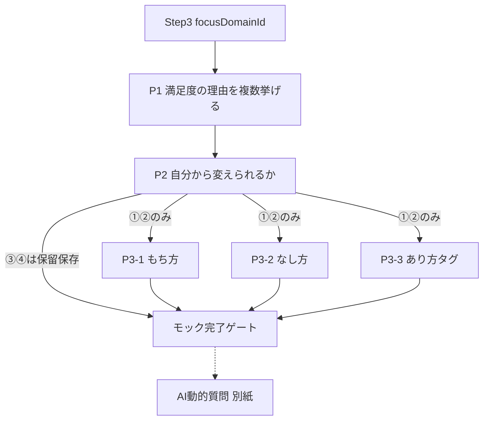

# Step4 こころのブレーキ探索 — 設計仕様（モック：AI質問前まで）

**ステータス**: D1〜D6 決定済み・モック実装済み（AI 質問前まで・localStorage）。  
最終更新: 2026-09-27

本ドキュメントはデジタル **Step4** のうち、**選択式プロセス（理由 → 変えやすさ → もち方／なし方／あり方タグ）** までの正本草案です。  
続く **AI による動的質問** は本紙の範囲外とし、別仕様で扱う。

関連:

- Step3 正本: [08_STEP03_SATISFACTION_SPEC.md](./08_STEP03_SATISFACTION_SPEC.md)（`focusDomainId`・満足度・三点評価を受け取る）
- 7つのステップ: [04_START_PROGRAM_SEVEN_STEPS_SPEC.md](./04_START_PROGRAM_SEVEN_STEPS_SPEC.md)
- 紙ベース: [paper_based_tools/01_ワーキングシート_v0.62.txt](./paper_based_tools/01_ワーキングシート_v0.62.txt)（旧 Step3／WS4「こころのブレーキを探る」）
- 領域定義: [`src/lib/startProgram/mandalaConstants.ts`](../../src/lib/startProgram/mandalaConstants.ts)

要求書要約の出典: プロダクト側「こころのブレーキ探索UI設計・要求書まとめ」（2026-09）

---

## 1. 目的と扱い方（確定方針）

### 1.1 「こころのブレーキ」の定義（本ワークでの扱い）

単なる悪い思考や欠点ではなく、

> **自分を不安・失敗・拒絶・傷つきなどから守ろうとする心の働きが、現在では少し強く働きすぎている状態**

として扱う。

### 1.2 ワークの目的

> 「あなたの考え方が悪い」と診断することではなく、  
> **満足度を下げている現象から、自分でも気づいていない心の働きを発見すること**

本紙の選択式パートは、その発見のための **入口整理**（外部／条件／行動／あり方の仕分け）である。  
ブレーキ本体の特定は **AI探索以降** で行う。

### 1.3 禁止・避ける表現

| 避ける | 代わりに |
|--------|----------|
| 考え方が悪い／認知の歪み（断定） | 受け止め方・見方・付き合い方 |
| 欠点・悪いクセの診断 | 守ってきた働きが強く出ている可能性 |
| あり方だけに原因を寄せる | もち方・なし方・あり方を順に見る |

---

## 2. 基本思想 — Have / Do / Be

こころ道場では次の3層を扱う。

| 層 | 呼び名 | 問いの焦点 |
|----|--------|------------|
| **Have（もち方）** | 何を持っているか・何があるか | 条件・資源・環境 |
| **Do（なし方）** | 何をしているか・どのように行動しているか | 行動・習慣・やり方 |
| **Be（あり方）** | どのように受け止め、自分や他者を捉えているか | 見方・受け止め・「べき」 |

満足度の低さをすべて Be の問題にせず、

> 外部環境なのか → 条件・資源なのか → 行動なのか → あり方なのか

を **順に整理する**。本紙プロセスはその仕分け UI である。

---

## 3. 位置づけ（デジタル Step との関係）

| デジタル | 内容 | 紙資料との対応（目安） |
|---------|------|------------------------|
| **Step3** | 満足度 → レーダー → **取組領域を1つ決める** | WS6＋WS5（領域選定まで） |
| **Step4（本仕様の前半）** | 取組領域の「なぜこの満足度か」→ 変えやすさ → Have/Do/Be タグ | 旧 Step3／WS4 の入口部分を再設計 |
| **Step4（後半・別紙）** | AI 動的質問でこころのブレーキを探索 | WS4 深掘り・思い込み特定相当 |
| **その後（Step5〜）** | テーマ具体化・Be-Do-Have の目標等 | 旧 Step4〜 の続き |

紙 WS4 の「行動と結果を10個リスト」入口は、デジタルでは **Step3 で決めた取組領域の満足度理由** に置き換える（プロダクト確定方針）。

ナビタイトル（案）: **満足度の理由から、こころのブレーキの入口を探る**  
URL 基点（案）: `/start-program/seven-steps/step/4`  
サブ画面（案）: `?pane=worksheet&phase=reasons|changeability|layers|summary`



---

## 4. Step3 からの入力（前提）

Step4 開始時に参照する（編集しない／参照表示）:

| 項目 | 出典 | 用途 |
|------|------|------|
| `focusDomainId` | Step3 | 取組領域（必須）。未設定なら Step3 へ誘導 |
| 当該領域の満足度 `score` | Step3 | 「なぜこの点数か」の文脈 |
| 三点評価（重要度・ワクワク・変化可能性） | Step3 | ガイド表示（任意） |
| Step1 当該領域の願望テキスト | Step1 | 参照表示のみ（ピック UI なし） |
| レーダーパターン（A/B/C） | Step3 | ヒント表示（任意） |

**原則**: Step3 で領域を決めたあと、Step4 で領域を選び直す UI は置かない（変更したい場合は Step3 に戻る）。

---

## 5. プロセス定義（モック範囲）

### 5.1 プロセス1 — 満足度の理由を挙げる

**問い（案）**:

> いま選んだ領域（例: キャリア・仕事）の満足度がこの点数になっているのは、なぜだと思いますか？  
> 思いつく理由を複数挙げてください。

| 項目 | 方針（草案） |
|------|----------------|
| 入力形式 | 短文カード。1理由＝1エントリ |
| 下限 | **未決**（案: 1以上で次へ可／推奨2以上） |
| 上限 | **未決**（案: 5〜8。紙 WS4 の10は上限参考） |
| 追加・編集・削除 | 可 |
| プリセット候補 | **未決**（領域別サジェスト vs 完全フリーテキスト） |

完了条件（案）: 理由が1件以上ある。

---

### 5.2 プロセス2 — 自分から変えられるか

挙げた **理由ごと** に問う。

**問い（案）**:

> この理由について、自分から変えられることはありますか？

| 選択 | ID（案） | 扱い |
|------|----------|------|
| ① 自分で変えられそう | `can_change` | **次へ**（P3） |
| ② 自分から働きかけることはできそう | `can_influence` | **次へ**（P3） |
| ③ 今の自分では変えるのが難しそう | `hard_now` | **一旦保留** |
| ④ 分からない | `unsure` | **一旦保留** |

#### 確定方針（要求書より）

- **現段階では ③④ の再評価ループを作らない**（UX・実装を簡潔に）。
- ③④は **データとして残す**。後の「目標設定」「あり方の再検討」等で必要に応じて取り上げる。
- ①②のみがプロセス3（Have/Do/Be）の対象。

#### 分岐ルール（草案）

| 状況 | 挙動 |
|------|------|
| ①②が1件以上 | P3 へ進める |
| すべて③④ | P3 をスキップし、**保留サマリ**を見せたうえでモック完了（AI探索の扱い・別紙／未決） |
| 理由の一部だけ未回答 | 全理由に分類が付くまで次へ不可（案） |

---

### 5.3 プロセス3 — 自分の何が変わればよい？

対象: P2 で ①または②の理由。

**上位問い（案）**:

> 自分の何が変われば、今より満足度が上がりそうですか？  
> 「もち方・なし方・あり方」の3方向から見てみましょう。

実施単位（**要検討・§9**）:

- **案A**: ①②の理由 **それぞれ** に Have/Do/Be を付ける  
- **案B**: ①②をまとめたうえで、領域単位で Have/Do/Be を一度ずつ  
- **案C**: Have → Do → Be のウィザードを理由横断で1パス（タグは理由に紐づけ）

モックでは **案A または案C** を推奨候補とする（仕分けの粒度が残るため）。

#### 5.3.1 プロセス3-1 もち方（Have）

**問い**:

> 今より何かが増えたり、手に入ったりすると、満足度は上がりそうですか？

| ID（案） | 選択肢 | 例 |
|----------|--------|-----|
| `have_resource` | ① お金・時間などの使える資源 | 収入、貯蓄、時間、設備、物 |
| `have_skill` | ② 知識・能力・経験 | 知識、技術、資格、経験 |
| `have_support` | ③ 人とのつながり・支援 | 家族、仲間、相談相手、人脈 |
| `have_vitality` | ④ 健康・体力・心の余裕 | 健康、休息、体力、安心感 |
| `have_context` | ⑤ 環境・立場・機会 | 職場、住環境、役割、権限、機会 |
| `have_other` | ⑥ その他 | 自由入力 |

- **複数選択可**（草案。単一選択は要検討）  
- ⑥選択時は短文必須  
- ここまでで「必要な条件・資源」として記録し、**Have としては完結**（深掘りループなし）

「該当なし／いまは思い浮かばない」の明示選択肢を置くかは **要検討**。

#### 5.3.2 プロセス3-2 なし方（Do）

**問い**:

> 今の自分の行動ややり方を少し変えるとしたら、どのあたりが関係しそうですか？

| ID（案） | 選択肢 | 例 |
|----------|--------|-----|
| `do_habit` | ① 日々の行動・習慣 | 始める、続ける、やめる、休む |
| `do_plan` | ② 時間・計画・段取り | 優先順位、準備、時間の使い方 |
| `do_relate` | ③ 人との関わり・伝え方 | 話す、聴く、頼る、任せる、断る |
| `do_decide` | ④ 選択・決断の仕方 | 決める、選ぶ、手放す、優先する |
| `do_improve` | ⑤ 挑戦・工夫・改善の仕方 | 試す、工夫する、改善する |
| `do_other` | ⑥ その他 | 自由入力 |

- 現段階では「変えたい行動・やり方」として記録し **一旦完了**  
- 複数選択・その他必須ルールは Have に揃える（要検討）

#### 5.3.3 プロセス3-3 あり方（Be）— ブレーキ探索の入口

**問い**:

> 同じ状況でも、自分自身や周りのことを少し違う角度から受け止められたら、感じ方は変わりそうですか？

「考え方が悪い」という表現は使わない。

| ID（案） | 選択肢 | 例 |
|----------|--------|-----|
| `be_self` | ① 自分自身への見方 | 自信、自己評価、自分に求める基準 |
| `be_relation` | ② 人との関係の受け止め方 | 相手への期待、頼ること、嫌われること |
| `be_outcome` | ③ 成功・失敗・結果の受け止め方 | 間違い、失敗、完璧さ、成果 |
| `be_compare` | ④ 周囲の評価・比較との向き合い方 | 人の目、承認、競争、比較 |
| `be_should` | ⑤ 不安・変化・「こうあるべき」との付き合い方 | 不安、未知、責任、べき思考 |
| `be_other` | ⑥ その他 | 自由入力 |

- **この段階ではブレーキを特定しない**  
- 選択は次の AI 探索に渡す **入口タグ** として扱う  
- Have/Do と同様、複数選択・その他ルールは要検討

---

## 6. 画面 IA（モック案）

### 6.1 フェーズ分割（案）

| phase | 内容 | 次へ |
|-------|------|------|
| `reasons` | 理由リストの追加・編集 | 1件以上 |
| `changeability` | 理由ごとの①〜④ | 全理由に分類あり |
| `layers` | ①②理由について Have → Do → Be（タブ or 縦スクロール） | 必須ルールは要検討 |
| `summary` | 整理結果の一覧（保留③④含む） | モック完了／AIへ（別紙） |

ガイドペイン: Step0〜3 と同様に `public/start-program/seven-steps/step04/guide.md`（案）。

### 6.2 常時表示したい文脈

- 取組領域名  
- 満足度スコア  
- （任意）Step1 願望の要約  
- （任意）「こころのブレーキ＝守ってきた働き」の短い説明  

### 6.3 UI パターン案（ビジー回避）

Step3 でチップ多ボタンがビジーになった知見を踏まえ:

| 箇所 | 推奨 |
|------|------|
| P2 ①〜④ | 理由カード内の **ラジオ4択**（横並びはスマホで折り返し） |
| P3 カテゴリ | **チェックリスト（最大N）** or カード選択。0〜10チップは使わない |
| その他 | 選択時のみテキストエリア展開 |

---

## 7. データモデル（草案・local）

Storage key（案）: `startProgram.sevenSteps.step04.brakeExplore`  
`version: 1`

```typescript
type Changeability =
  | 'can_change'
  | 'can_influence'
  | 'hard_now'
  | 'unsure';

type HaveTagId =
  | 'have_resource'
  | 'have_skill'
  | 'have_support'
  | 'have_vitality'
  | 'have_context'
  | 'have_other';

type DoTagId =
  | 'do_habit'
  | 'do_plan'
  | 'do_relate'
  | 'do_decide'
  | 'do_improve'
  | 'do_other';

type BeTagId =
  | 'be_self'
  | 'be_relation'
  | 'be_outcome'
  | 'be_compare'
  | 'be_should'
  | 'be_other';

type ReasonEntry = {
  id: string;
  text: string;
  changeability: Changeability | null;
  /** P2 が ①②のときのみ埋める */
  haveTagIds: HaveTagId[];
  haveOtherText?: string;
  doTagIds: DoTagId[];
  doOtherText?: string;
  beTagIds: BeTagId[];
  beOtherText?: string;
};

type Step04Store = {
  version: 1;
  focusDomainId: MandalaDomainId; // Step3 と整合。乖離時は Step3 を正とする
  reasons: ReasonEntry[];
  /** モック範囲の完了フラグ（AI前） */
  selectionPhaseCompletedAt?: string; // ISO
};
```

### 7.1 AI探索（別紙）へ渡す想定ペイロード

```typescript
type Step04SelectionHandoff = {
  focusDomainId: MandalaDomainId;
  satisfactionScore: number;
  reasons: Array<{
    id: string;
    text: string;
    changeability: Changeability;
    haveTagIds: HaveTagId[];
    doTagIds: DoTagId[];
    beTagIds: BeTagId[]; // 入口タグ（ブレーキ未特定）
    otherTexts?: { have?: string; do?: string; be?: string };
  }>;
  /** ③④のみ。AI初回では使わない想定も可 */
  deferredReasons: Array<{ id: string; text: string; changeability: 'hard_now' | 'unsure' }>;
};
```

---

## 8. 本紙の範囲外（明示）

以下は **別仕様**（未作成）:

1. AI 動的質問のターン設計・プロンプト・停止条件  
2. 「こころのブレーキ」文言の確定・反論の言葉（紙 Step7／気づきノートとの関係）  
3. ③④保留の再評価 UI・目標設定への接続  
4. Firestore 永続化・コーチ共有  
5. Step5 以降（テーマ決定等）への正式ハンドオフ  

モックでは、summary 画面に「ここから AI 探索（準備中）」プレースホルダでよい。

---

## 9. 検討事項（決定が必要）

モック設計を進めるうえで、優先度つきで提案する。

### 9.1 必須に近い（**決定済み 2026-09-27**）

| # | 論点 | 決定 | 実装での扱い |
|---|------|------|--------------|
| D1 | P3 の実施単位 | **理由ごと**に作成 | 「何が変わればよい？」で課題タブ（課題1, 課題2…）を切り替え、1件ずつ Have/Do/Be を選ぶ |
| D2 | 理由の下限・上限 | **設定値**とする。初期値 下限 **3**・上限 **10** | `/settings` で 1〜20 から選択（上限は下限以上に自動補正）。`startProgram.appSettings.v1` の `step04ReasonMin` / `step04ReasonMax` |
| D3 | Have/Do/Be の必須度 | プロセス2以降（①②の理由）は **どれか1層に記入があれば可** | `reasonLayersDone`。「その他」のみ選択時は自由記述が必要 |
| D4 | 複数選択 vs 単一 | **複数可** | 各層チェックボックス（マルチ） |
| D5 | すべて③④のとき | **回避サイクルあり** | 「①②でできることをリストアップしてみましょう」パネルで ①/② 付きの項目を追加（`origin: 'rescue'`、理由上限の対象外）。1件以上で次へ進める。③④の再評価ループはなし |
| D6 | Step3未完了時 | **プレビュー可**。Step4 内で対象領域を決めれば進める。**複数領域**を選んでも進められ、今回のテーマの次に別テーマを実施できる | 「課題の明確化」上部の選択領域カード →「テーマを切り替える」モーダルで8領域から選択（Step3 取組領域→候補→その他の順）。初回は Step3 の取組領域を自動選択、未決定なら「テーマ領域が選択されていません」を表示。領域ごとにセッションを保持し、再開・完了切替が可能 |

### 9.2 モック中に詰められる

| # | 論点 | メモ |
|---|------|------|
| D7 | 理由のプリセット | 領域別チップ vs 完全フリー。プリセットは「誘導しすぎ」リスク |
| D8 | 「該当なし」選択肢 | Have/Do/Be 各層に置くか |
| D9 | ①と②の差のユーザー説明 | 一文ヘルプの要否（実装は同じ次工程でも文言差は残す） |
| D10 | ガイド文言のトーン | 守ってきた働き／診断しない、を常に短く出すか |
| D11 | 戻る編集 | P3後にP1の理由文を変えたときタグをリセットするか残すか |
| D12 | 進捗表示 | 理由×層のマトリクス vs 線形ウィザード |

### 9.3 AI接続・後工程（本紙外だが早期に方針だけ）

| # | 論点 | メモ |
|---|------|------|
| D13 | AIに渡す最小セット | Beタグ必須？ Have/Doも渡す？ ③④は初回除外？ |
| D14 | ブレーキ特定後の保存形 | Step7・気づきノート `eveningBrake` 系との関係（現状ノート側はAI入力から廃止経緯あり） |
| D15 | 永続化 | 当面 localStorage（Step1〜3踏襲）でよいか |
| D16 | 紙 WS4「行動と結果10個」との説明 | デジタルでは満足度理由入口、とユーザー向けに一言あるとよい |

### 9.4 文言・アクセシビリティ

| # | 論点 |
|---|------|
| D17 | 正式ナビタイトル・guide.md 見出し |
| D18 | 「あり方」が抽象的すぎないか（サブコピーの固定） |
| D19 | スマホでの理由カード＋ラジオの密度 |

---

## 10. 受け入れ基準（モック：AI前）

- [x] Step3 の取組領域・満足度を文脈表示できる（Step3 未完了でもテーマ選択で進める）  
- [x] 理由を複数追加・編集・削除できる（下限・上限は設定値）  
- [x] 理由ごとに①〜④を選べる  
- [x] ③④は一覧に残り、P3の対象にならない（再評価ループなし）  
- [x] すべて③④のとき、①②でできることを挙げる回避サイクルで進める  
- [x] ①②について Have / Do / Be のカテゴリ（複数・＋その他）を記録できる  
- [x] Be の時点でブレーキ文言の確定 UI がない（まとめでは「入口」タグとして集計表示のみ）  
- [x] summary で整理結果を確認できる  
- [x] 複数テーマ（領域）を並行・順次で扱える  
- [x] localStorage に下書き復元できる  

---

## 11. 実装メモ（モック実装済み）

| 種類 | パス |
|------|------|
| ワークシート本体 | `src/components/start-program/step04/Step04WorksheetPane.tsx`（`?pane=worksheet&phase=reasons\|changeability\|layers\|summary`） |
| フェーズ | `Step04ReasonsPhase`（課題の明確化：選択領域＋理由） / `Step04ChangeabilityPhase`（回避パネル含む） / `Step04LayersPhase` / `Step04SummaryPhase` / `Step04PhaseNav` / `Step04ThemeModal`（領域選択モーダル） |
| 定数・タグ定義・進捗判定 | `src/lib/startProgram/step04Constants.ts`（`step04Progress`・`reasonLayersDone` など） |
| store | `src/hooks/useStep04BrakeExploreStore.ts`（キー `startProgram.sevenSteps.step04.brakeExplore`、`themes[domainId]` + `activeDomainId` + `themeOrder`） |
| 設定 | `src/lib/startProgram/appSettings.ts`・`src/hooks/useStartProgramAppSettings.ts`・`/settings` 画面 |
| guide | `public/start-program/seven-steps/step04/guide.md` |
| ダミーデータ | `public/start-program/seven-steps/step03/dummy/*-step03-04.json`（裕子さん・康太さん）。Step3 ワークシート上部のボタンで Step1 願望・Step3・Step4 を一括投入（`src/lib/startProgram/step03Dummy.ts`） |
| SevenSteps 配線 | `SevenStepsProgram.tsx` の Step index 4、`sevenStepsConstants.ts` のタイトル「満足度の理由から、こころのブレーキの入口を探る」 |

### 11.1 フェーズの解放条件

| フェーズ | 解放条件 |
|----------|----------|
| 課題の明確化 | 常に可（テーマ未選択時は選択領域カードのみ表示し、理由入力は選択後に表示） |
| 変えられるか | テーマ選択済みで、初期理由（回避項目を除く）が下限以上 |
| 何が変わればよい？ | 全理由に①〜④が付き、①②が1件以上 |
| まとめ | ①②の全理由で Have/Do/Be のどれかに記入 |

URL で未解放フェーズを直接開いた場合は、解放済みの最も先のフェーズへ移動する。入力を編集するとテーマの完了状態は解除される。

### 11.2 画面表記（2026-09-29 モック検証反映）

- プロセス2以降は、書き出した理由を **「課題」** と呼ぶ（課題1、課題2…）
- プロセス2の問い：「現在の状況（課題）を自分で変えることはできそうですか？」＋「課題ごとに一番近いものを選んでください。」
- 層の見出し：**持ち方：持っている資源**／**なし方：行動のしかた**／**あり方：ものごとの捉え方**

---

## 12. 次のアクション

1. モックを触って文言・密度（D7〜D12・D17〜D19）を詰める  
2. AI探索仕様を別紙起票（本紙 §7.1 ハンドオフを入力契約にする。まとめ画面の「準備中」枠が接続点）  

---

## 変更履歴

| 日付 | 内容 |
|------|------|
| 2026-09-24 | 初版。要求書に基づくモック範囲（AI前）の設計草案・検討事項 |
| 2026-09-27 | D1〜D6 を決定。モック実装（テーマ選択・複数テーマ・回避サイクル・理由数の設定値）を反映 |
| 2026-09-29 | モック検証反映：テーマ画面を「課題の明確化」に統合し領域切替をモーダル化、「課題」表記・持ち方/なし方/あり方の説明併記、プロセス2の問いを変更 |
