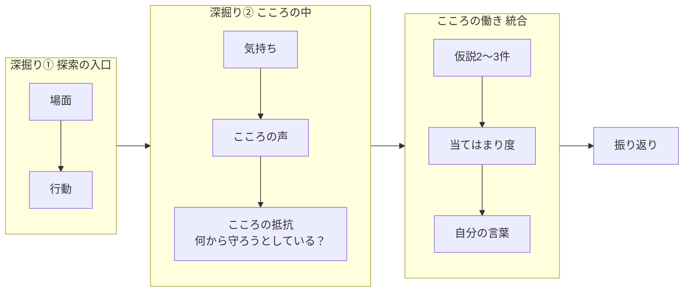
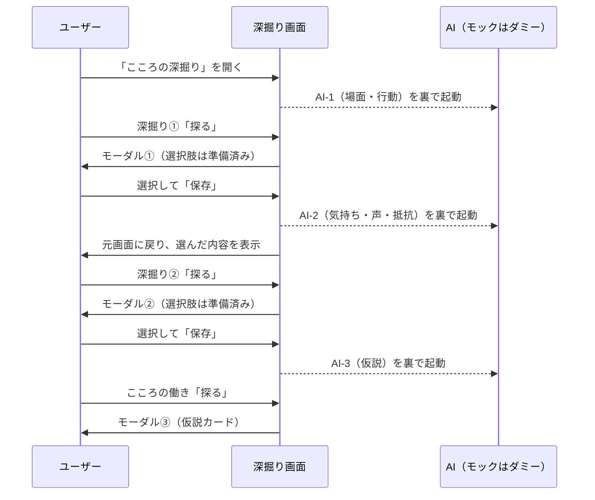

# Step4 こころの深掘り — 設計仕様（まとめ以降）

**ステータス**: 設計草案（モック設計用）。AI はダミー応答で先行実装し、AI 組込は最終工程。  
最終更新: 2026-10-06

本ドキュメントは Step4 の **旧「まとめ」以降**（＝「こころの深掘り」）の正本草案です。  
前段（課題の明確化 → 変えられるか → 何が変わればよい？）は [09_STEP04_BRAKE_EXPLORATION_SPEC.md](./09_STEP04_BRAKE_EXPLORATION_SPEC.md) を参照。

関連:

- 前段の正本: [09_STEP04_BRAKE_EXPLORATION_SPEC.md](./09_STEP04_BRAKE_EXPLORATION_SPEC.md)（§7.1 ハンドオフが本紙の入力）
- 7つのステップ: [04_START_PROGRAM_SEVEN_STEPS_SPEC.md](./04_START_PROGRAM_SEVEN_STEPS_SPEC.md)
- 画面イメージ（プロダクト側作成・2026-10）:
  - `Step04-5_まとめ画面初期状態.png`
  - `Step04-6_深掘り①モーダル画面.png`
  - `Step04-5_まとめ画面深掘り①終了状態.png`

---

## 1. 目的と基本方針

### 1.1 目的

「何が変わればよい？」で **あり方（ものごとの捉え方）** を選んだ課題について、問いに答えながら一段ずつ下りていき、最終的に **「こころのブレーキ」を自分の言葉として作成・認識する**。

### 1.2 基本方針

| 方針 | 内容 |
|------|------|
| フォーカス | 対象は **課題 ＋ あり方** に絞る。持ち方・なし方はこの画面では扱わない |
| 一段ずつ下りる | 場面 → 行動 → 気持ち → こころの声 → 何から守ろうとしているか、の順。**前半では原因を尋ねない** |
| 選ぶ → 選ぶ → 少し考えて書く | 前半は選択肢中心で負担を軽く、核心（こころの声・自分の言葉）では自由記述を用意する |
| 断定しない | AI の仮説は **2〜3件** 提示し、1つに決めつけない。**最終判断者は本人** |
| 本人の言葉を優先 | 本人が書いた「自分の言葉」を最終保存値として優先する |
| リズムを崩さない | AI 実行は **課題ごとに3回**。次の質問はユーザーが答えている間に裏で準備し、待ち時間を感じさせない |

---

## 2. フェーズ構成の変更

| 変更前 | 変更後 |
|--------|--------|
| 課題の明確化 / 変えられるか / 何が変わればよい？ / **まとめ** | 課題の明確化 / 変えられるか / 何が変わればよい？ / **こころの深掘り** |

- 旧「まとめ」は廃止し、**「こころの深掘り」** に置き換える（URL の `phase=summary` は `phase=deepdive` に変更。旧 URL は読み替え）
- 旧まとめにあった「持ち方・なし方の一覧」「保留した課題（③④）の一覧」は本画面から外す（扱いは §11 D4）
- 解放条件は旧まとめと同じ（①②の全課題で Have/Do/Be のどれかに記入）

---

## 3. 対象となる課題

- **対象**: 変えられるか ①② かつ、「あり方」タグが1つ以上ある課題
- 表示順: 課題の番号順（課題の明確化での順）
- 「あり方」タグのない①②課題、③④の課題は対象外（扱いは §11 D3）
- 対象が0件のとき: 「今回は『あり方』を選んだ課題がありません。『何が変わればよい？』に戻って、あり方も見てみましょう。」と案内し、戻るボタンを表示

---

## 4. 深掘りの全体プロセス

課題ごとに、次の3段階で進める。



| 段階 | AI への入力 | 生成する選択肢・内容 | 画面 |
|------|-------------|----------------------|------|
| 深掘り①（探索の入口） | 課題 ＋ あり方タグ | 場面の選択肢 ／ 行動の選択肢 | モーダル①（S4-06・S4-07） |
| 深掘り②（こころの中） | 課題 ＋ 選ばれた場面 ＋ 行動 | 気持ち ／ こころの声 ／ 何から守ろうとしているか | モーダル②（S4-08・S4-09） |
| こころの働き（統合） | ここまでの全回答 | 「こころの働き」の仮説 2〜3件（説明・回答とのつながり付き） | モーダル③（S4-10・S4-11） |
| 振り返り | 全回答 ＋ 選んだ仮説 ＋ 自分の言葉 | AI なし（テンプレート組み立て） | 振り返り表示（S4-12） |

> 用語対応: プロセス上の「感情／思考／守りたい・避けたいこと」は、画面上では **「気持ち」「こころの声」「こころの抵抗」** と表記する。

---

## 5. AI の実行タイミング（3回・先読み）

ユーザーが「探る」を押した時点で選択肢が **すでに用意されている** ことを原則とする。

| # | 起動タイミング | 生成内容 | 使われる画面 |
|---|----------------|----------|--------------|
| AI-1 | 「こころの深掘り」画面の **初期表示時**（裏で起動） | 深掘り①の選択肢（場面・行動） | モーダル① |
| AI-2 | モーダル①で **「保存」して元画面に戻るとき** | 深掘り②の選択肢（気持ち・こころの声・こころの抵抗） | モーダル② |
| AI-3 | モーダル②で **「保存」して元画面に戻るとき** | こころの働きの仮説 2〜3件 | モーダル③ |



### 5.1 準備が間に合わないとき

- 「探る」押下時に生成中なら、モーダルを開いたうえで選択肢エリアに **「質問を準備しています…」**（スケルトン表示）を出し、届き次第そのまま表示する（モーダルを開くまで待たせない）
- 失敗時は選択肢エリアに「うまく準備できませんでした」＋「もう一度」ボタン。あわせて **共通の基本選択肢**（§6 の例）を表示し、先に進めるようにする

### 5.2 「Ai更新」ボタン

- モーダル①②に配置。現在の入力で選択肢を作り直す（例: 選択肢がしっくりこないとき）
- 作り直しても **選択済みの項目は残す**（新しい選択肢に無い場合も「選択中」として残す）
- 回数制限は §11 D7

### 5.3 前の回答を変えたとき

- 深掘り①の回答を変えて保存し直した場合、深掘り②の選択肢を作り直す（AI-2 再実行）。深掘り②の既存回答は残し、「回答が変わったので選択肢を更新しました」と表示
- 深掘り①②どちらかを変えたら、こころの働きの仮説も作り直し対象（AI-3 再実行）。当てはまり度・自分の言葉は残す（扱いは §11 D6）

### 5.4 複数課題があるとき

- AI-1 は **対象課題すべて** について画面表示時にまとめて起動する（1回の呼び出しで複数課題分を返す想定）
- AI-2・AI-3 は課題ごとに、その課題のモーダル保存時に起動

---

## 6. 画面仕様

### 6.1 こころの深掘り画面（元画面）

添付「Step04-5_まとめ画面初期状態」「…深掘り①終了状態」を正とする。

**上部**
- フェーズナビ: 課題の明確化 ✓ / 変えられるか ✓ / 何が変わればよい？ ✓ / **こころの深掘り**
- テーマの文脈バー（既存と同じ。テーマ・満足度・Step1 の「こうなりたい」・テーマを切り替える）
- 見出し: 「整理した結果から、『あり方:ものごとの捉え方』についてさらに深掘りしてみましょう。」
- 補足: 「『あり方』を選んだ次の課題から、幾つかの質問に答えながら探っていきます。」
- 小見出し: 「自分から変えられそうな課題」

**課題カード（対象課題ごとに1枚）**

| ブロック | 表示項目 | 未回答時 | 回答後 |
|----------|----------|----------|--------|
| ヘッダー | 番号・課題文・「あり方」タグ（例: 自分自身への見方／成功・失敗・結果の受け止め方） | — | — |
| 深掘り① | 場面: ／ 行動: | ラベルのみ（空欄） | 選んだ項目をピルで表示 |
| 深掘り② | 気持ち: ／ こころの声: ／ こころの抵抗: | 同上 | 同上（自分の言葉で書いたこころの声は引用表示） |
| こころの働き | 選んだ仮説・自分の言葉 | 空欄 | 「とても当てはまる」「少し当てはまる」の仮説タイトル ＋ 自分の言葉 |

**「探る」ボタン（各ブロック右下）**

| 状態 | 表示 | 押せるか |
|------|------|----------|
| 前のブロックが未完了 | 探る（淡色） | 不可（ツールチップ「深掘り①を先に進めてください」） |
| 押せる・選択肢準備済み | 探る | 可 |
| 押せる・選択肢準備中 | 探る（小さなスピナー） | 可（§5.1） |
| 完了 | 探る ✓ | 可（再編集） |

- 深掘り①完了で深掘り②の「探る」が有効になり、ボタンに軽い強調（フェードイン・パルス1回）を入れて「次はここ」と分かるようにする
- 全ブロック完了で、カード下に **「振り返りを見る」** ボタンを表示（§6.5）

### 6.2 モーダル① こころの深掘り その①（場面・行動）

添付「Step04-6_深掘り①モーダル画面」を正とする。

| 要素 | 内容 |
|------|------|
| タイトル | こころの深掘り その① |
| 課題① | 課題文（読み取り専用） |
| 場面による深掘り質問 | 「『{課題の要旨}』と特に感じるのは、どんな時ですか？」 |
| 補足 | 以下の選択肢から選んでみてください（複数回答可） |
| 選択肢 | AI 生成のピル（6〜8件）＋「＋これら以外の時」 |
| 行動による深掘り質問 | 「そんな時、実際にはどんな行動をとることが多いでしょうか？」 |
| 選択肢 | AI 生成のピル（6〜8件）＋「＋これら以外の時」 |
| ボタン | キャンセル ／ Ai更新 ／ 保存 |

- ピルはタップで選択／解除（選択中は濃い緑）
- 「＋これら以外の時」を押すと、その場に1行入力が開く。入力して確定するとピルとして追加・選択状態になる
- 保存の条件: 場面・行動それぞれ **1つ以上選択**（§11 D5）
- キャンセル: 変更を破棄して閉じる（変更がある場合は確認）
- 保存: 回答を確定 → **AI-2 を裏で起動** → モーダルを閉じて元画面に戻り、選んだ内容を表示

**選択肢の例**（ダミー・AI 失敗時の基本選択肢として使用）

場面（例: 課題「今の自分に何ができるのか自信がない」）
- 求人を見ている時 ／ やってみたい仕事を見つけた時 ／ 応募しようと考えた時 ／ 自分の経験や能力を考えた時 ／ 他の人の働き方を見た時 ／ 失敗した場合を想像した時

行動（S4-07「その時、どうしていますか？」）
- 考えるだけで行動に移せない ／ 情報収集ばかりしてしまう ／ 先延ばしにする ／ 人に相談できない ／ 自分には難しいと思ってやめる ／ 十分準備できるまで始めない ／ 周囲を優先して自分のことを後回しにする

> この段階ではまだ「原因」を尋ねない。**出来事・場面 → 行動** と一段ずつ下りる。

### 6.3 モーダル② こころの深掘り その②（気持ち・こころの声・こころの抵抗）

モーダル①と同じレイアウトで3ブロック。上部に「課題」と「深掘り①で選んだ場面・行動」を読み取り専用で表示し、文脈を保つ。

**気持ち（S4-08）**
- 質問: 「その時、どんな気持ちになりますか？」
- 例: 不安 ／ 怖い ／ 焦る ／ 自信がなくなる ／ 恥ずかしい ／ 申し訳ない ／ 面倒に感じる ／ 諦めたくなる ／ ＋その他

**こころの声（S4-08）**
- 質問: 「その時、頭の中ではどんな言葉が浮かんでいますか？」
- 例: 「私には無理かもしれない」 ／ 「失敗したらどうしよう」 ／ 「もっと準備してからでないと」 ／ 「今さら始めても遅い」 ／ 「ちゃんとできなければ意味がない」 ／ 「人に迷惑をかけたくない」 ／ 「家族を優先すべき」 ／ ＋その他
- **［自分の言葉で書いてみる］** 欄を用意（任意・100字程度）

**こころの抵抗（S4-09・Step4 で最も重要な問い）**
- 質問（強調表示）:
  > もし、その考えや行動が「あなたを守るため」に起きていたとしたら、何から守ろうとしていたのでしょう？
- 例: 失敗して傷つくこと ／ 人から否定されること ／ 嫌われること ／ 自分に力がないと感じること ／ 間違えること ／ 人に迷惑をかけること ／ 期待を裏切ること ／ 弱い自分を見せること ／ 先が分からないことへの不安 ／ よく分からない ／ ＋その他
- 「守っているものは何ですか？」ではなく **「何から守ろうとしている？」** と問う

- 保存: 回答を確定 → **AI-3 を裏で起動** → 元画面に戻る

### 6.4 モーダル③ こころの働き（S4-10・S4-11）

**冒頭文**
> 今回見えてきた「こころの働き」  
> お答えいただいた内容から、次のような心の働きが関係している可能性があります。  
> 正解を決めるものではありません。「自分に近いかな？」という視点で読んでみてください。

**仮説カード（2〜3枚）**

| 要素 | 例（カードA） |
|------|---------------|
| タイトル | 失敗して傷つくことから自分を守ろうとする働き |
| 説明 | 新しいことに挑戦したい気持ちがある一方で、「もし失敗したら、自分にはできないということが分かってしまう」という不安から、始める前に慎重になっている可能性があります。 |
| 今回の回答とのつながり | `自分には無理かもしれない` `考えるだけで行動できない` `失敗するのが怖い`（ユーザーの回答から引用したタグ） |
| 当てはまり度 | ◎ とても当てはまる ／ ○ 少し当てはまる ／ △ あまり当てはまらない ／ ？ 分からない（単一選択） |

その他の例:
- カードB「十分にできない自分を見せないようにする働き」—「やるなら、ある程度きちんとできなければならない」という思いが、始める前のハードルを高くしている可能性があります。
- カードC「周囲に迷惑をかけないようにする働き」— 家族や周囲を大切にする気持ちが強いからこそ、自分の希望を後回しにしている部分があるかもしれません。

**自分の言葉**
- 質問: 「あなた自身の言葉にすると、どんな心の働きだと思いますか？」
- 自由記述（150字程度）。例: 「また失敗して自信をなくしたくないんだと思う」
- 入力補助: ◎○を付けたカードのタイトルを下書きとして挿入するボタン（任意）

- 保存の条件: 全カードに当てはまり度を選択、かつ自分の言葉を入力（§11 D5）
- **本人の言葉を最終保存値として優先**する。仮説は参考情報として保持

### 6.5 振り返り（S4-12）

分析結果ではなく **本人の気づき** としてまとめる。課題カードの「振り返りを見る」から表示（表示形式は §11 D2）。AI は使わず、回答からテンプレートで組み立てる。

> **今回の気づき**
>
> **取り上げた課題**  
> 子育てでブランクが10年あり、今の自分に何ができるのか自信がない
>
> **その時に起きやすいこと**  
> 求人を見ている時（場面）  
> ↓  
> 「自分にはできないかもしれない」と不安になる（こころの声・気持ち）  
> ↓  
> 情報収集だけで止まってしまう（行動）
>
> **見えてきた心の働き**  
> 「失敗して、さらに自信をなくすことから自分を守ろうとしているのかもしれない」（◎の仮説。複数なら列挙）
>
> **あなたの言葉**  
> 「失敗が怖いというより、また自分はダメだと思うのが怖いのだと思う」
>
> この心の働きは、これまであなたを守る役割を果たしてきたものかもしれません。

- 「その時に起きやすいこと」は 場面 → こころの声（なければ気持ち）→ 行動 の順で、各1件目を使う
- 下部: 「別の課題を深掘りする」「Step5 へ進む」（Step5 は未実装のため当面は非活性）

---

## 7. UI 設計 — リズムよく進めるための工夫

| 工夫 | 内容 |
|------|------|
| 先読み | §5 の AI 3回を「答えている間」に実行。「探る」を押したら即表示 |
| 段階的な解放 | 次の「探る」だけが有効になり、軽く強調。迷わず次に進める |
| 文脈の持ち越し | モーダル上部に、前の段階で選んだ内容を小さく表示 |
| 結果の即時反映 | モーダルを閉じたら、元画面のカードに選んだピルがふわっと入る |
| 待ち時間の見せ方 | 間に合わない場合のみスケルトン表示。全画面ローディングは使わない |
| 選択の手軽さ | 1タップで選択／解除。自由記述は「＋これら以外」「自分の言葉で書いてみる」に限定 |
| スマホ | モーダルは全画面シート表示。ピルは折り返し、ボタンは下部固定 |

---

## 8. モック実装方針（AI 組込前）

- AI 呼び出しは **ダミー関数** で置き換える（同じ入出力の型で、後で差し替えられるようにする）
- ダミーは 0.8〜1.5 秒の遅延を入れて返す（先読みとリズムの検証のため）
- ダミーの中身:
  - 基本は §6 の例の選択肢
  - Step3 ダミー（裕子さん・康太さん）を読み込んでいる場合は、課題文に対応した選択肢を JSON から返す（`public/start-program/seven-steps/step03/dummy/*-step03-04.json` に `deepDive` を追加）
- 仮説カードもダミー JSON から返す。「今回の回答とのつながり」は実際に選んだ回答から3件程度を抜き出して表示
- 「Ai更新」は、ダミーでは選択肢の並び替え＋1〜2件の入れ替えで「作り直した」ことが分かるようにする

### 8.1 AI 差し替え用のインターフェース（案）

```typescript
type DeepDiveContext = {
  domainId: MandalaDomainId;
  reasonId: string;
  reasonText: string;
  beTags: { id: BeTagId; label: string }[];
  beOtherText?: string;
};

/** AI-1 */
generateEntryOptions(ctx: DeepDiveContext[]): Promise<
  Record<string, { sceneQuestion: string; scenes: string[]; actions: string[] }>
>;

/** AI-2 */
generateInnerOptions(ctx: DeepDiveContext, entry: { scenes: string[]; actions: string[] }): Promise<{
  feelings: string[];
  voices: string[];
  protections: string[];
}>;

/** AI-3 */
generateWorkingHypotheses(ctx: DeepDiveContext, answers: DeepDiveAnswers): Promise<
  { id: string; title: string; body: string; links: string[] }[]
>;
```

---

## 9. データモデル（案・local）

Step4 の既存ストア（`startProgram.sevenSteps.step04.brakeExplore`）のテーマに `deepDive` を追加する。

```typescript
type AiSlot<T> = {
  status: 'idle' | 'loading' | 'ready' | 'error';
  data: T | null;
  /** 生成に使った入力のハッシュ。前の回答が変わったら作り直し判定に使う */
  inputKey: string | null;
};

type PickAnswer = { selected: string[]; custom: string[] };

type DeepDiveEntry = {
  reasonId: string;
  entry: {
    options: AiSlot<{ sceneQuestion: string; scenes: string[]; actions: string[] }>;
    scene: PickAnswer;
    action: PickAnswer;
    savedAt: number | null;
  };
  inner: {
    options: AiSlot<{ feelings: string[]; voices: string[]; protections: string[] }>;
    feeling: PickAnswer;
    voice: PickAnswer;
    voiceOwnWords: string;
    protection: PickAnswer;
    savedAt: number | null;
  };
  working: {
    hypotheses: AiSlot<{ id: string; title: string; body: string; links: string[] }[]>;
    ratings: Record<string, 'strong' | 'some' | 'weak' | 'unknown'>;
    ownWords: string;
    savedAt: number | null;
  };
};

type Step04Theme = {
  // …既存項目…
  deepDive: Record<string /* reasonId */, DeepDiveEntry>;
};
```

- 課題文や「あり方」タグを前段で変えた場合、その課題の深掘りは「前提が変わりました」と表示し、AI-1 から作り直し対象にする（回答は残す）
- 課題を削除した場合、その課題の `deepDive` も削除

---

## 10. 受け入れ基準（モック）

- [ ] フェーズ名が「こころの深掘り」になり、対象（①②かつあり方あり）の課題カードが並ぶ
- [ ] 画面表示時に深掘り①の選択肢が裏で準備され、「探る」でモーダル①が即表示される
- [ ] モーダル①で場面・行動を複数選択・「＋これら以外」で追加でき、保存で元画面に選んだ内容が表示される
- [ ] モーダル①保存時に深掘り②の選択肢が裏で準備され、深掘り②の「探る」で即表示される
- [ ] モーダル②で気持ち・こころの声（自分の言葉含む）・こころの抵抗を回答できる
- [ ] モーダル③で仮説2〜3件に当てはまり度を付け、自分の言葉を保存できる
- [ ] 振り返りで「課題 → 起きやすいこと → 心の働き → あなたの言葉」が表示される
- [ ] 「Ai更新」で選択肢が作り直され、選択済み項目は残る
- [ ] 準備が間に合わない・失敗した場合も、基本選択肢で先に進める
- [ ] localStorage に保存され、再訪時に続きから再開できる

---

## 11. 検討事項（決定済み）

| # | 論点 | 推奨案 | 決定 |
|---|------|--------|------|
| D1 | 「こころの抵抗」の表記 | 画面ラベルは「こころの抵抗」、モーダルの問いは S4-09 の文言 | 現行文言のまま。モック確認後に内容を見ながら修正する |
| D2 | 振り返りの表示形式 | 課題カード内に展開 | 課題カード内。カードはモーダルで選んだ内容を表示し、深掘りが進むと内容が増える |
| D3 | あり方なしの①②課題の扱い | 折りたたみで一覧＋戻るリンク | 深掘りでは表示しない（Step5 で課題として使う）。あり方が1つもない場合は先へ進めず、何かを選んでもらう（§11.1） |
| D4 | 旧まとめの持ち方・なし方・③④一覧 | 折りたたみで残す | 削除 |
| D5 | 保存の必須条件 | 一部任意 | 各問1つ以上・複数回答可（こころの声は「自分の言葉」入力でも可） |
| D6 | 前の回答を変えたときの後段の回答 | 残して「選択肢を更新しました」 | 推奨案どおり |
| D7 | 「Ai更新」の回数制限 | 1段階につき3回 | 推奨案どおり |
| D8 | 複数課題の進め方 | 1つ以上完了で Step4 完了 | 推奨案どおり |
| D9 | Step4 の完了条件 | 「この気づきを保存する」ボタン | 推奨案どおり |
| D10 | 自分の言葉の保存先・後工程 | Step4 に保存 → Step7 へ引き継ぎ | 推奨案どおり |
| D11 | AI 失敗時の基本選択肢 | モックは固定例 | 推奨案どおり |
| D12 | 自由記述の安全配慮 | AI 組込時に別途 | 推奨案どおり |

### 11.1 あり方が1つもないときの仕掛け（D3・モック実装済み）

- 「何が変わればよい？」で全課題が記入済みでも、あり方が1つもなければ「こころの深掘りへ」は押せない
- 画面下部に案内パネルを表示：「ぴったりでなくても大丈夫。**強いて言えば**近いものを、どれか1つの課題で選んでください（あとで変更できます）」
- 選ぶきっかけになるヒント質問を3つ表示（取りかかる前によぎる言葉／うまくいかなかった時に自分にかける言葉／親しい人が同じ状況なら「〇〇と思い込んでいるのかも」と言えそうなこと）
- 「課題nのあり方を選ぶ」ボタンで該当課題に切り替え、あり方の欄へスクロールし枠を強調する
- 将来案（未実装）：AI が課題文からあり方の候補を1〜2個提案する／「よく分からない」選択肢を用意し、深掘り①の入口で場面から探る

### 11.2 モック実装メモ

- AI はダミー（0.8〜1.5秒の遅延、`src/lib/startProgram/step04DeepDiveAi.ts`）。各段階の入力から作るキー（inputKey）と保存済みキーを比べ、違うときだけ裏で再生成する（＝先読みと D6 の再生成を同じ仕組みで扱う）
- 生成失敗時は固定の基本選択肢で回答でき、「もう一度試す」で再生成
- 前段の回答を変更すると、その課題の「この気づきを保存する」は未保存に戻る
- 保存先：`startProgram.sevenSteps.step04.brakeExplore` の各テーマ `deepDive[reasonId]`

---

## 12. 次のアクション

1. モック確認 → D1 の文言調整
2. ダミー JSON（裕子さん・康太さん）に `deepDive` を追加
3. AI 組込仕様（プロンプト・出力形式・失敗時の扱い・安全配慮）を別途作成

---

## 変更履歴

| 日付 | 内容 |
|------|------|
| 2026-10-06 | 初版。まとめ →「こころの深掘り」への変更、3段階プロセス、AI 3回先読み、モーダル①〜③・振り返りの画面仕様、検討事項 |
| 2026-10-06 | D1〜D12 決定を反映。あり方なし時の仕掛け（§11.1）、モック実装メモ（§11.2） |
