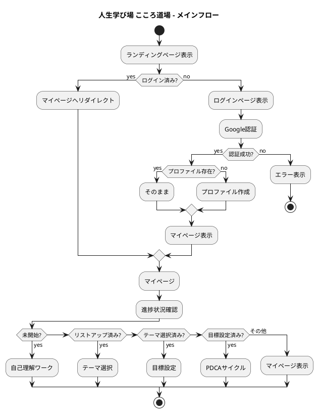
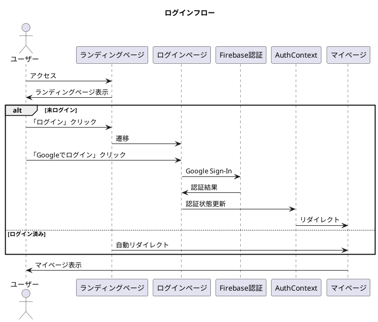
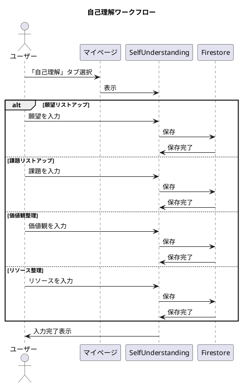
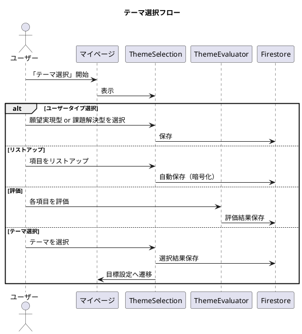
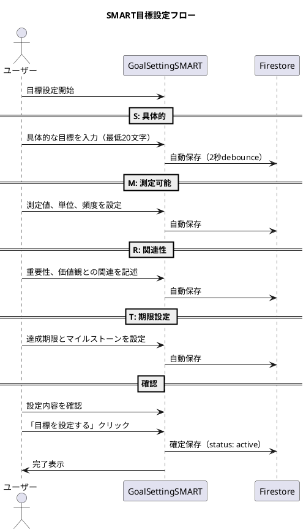
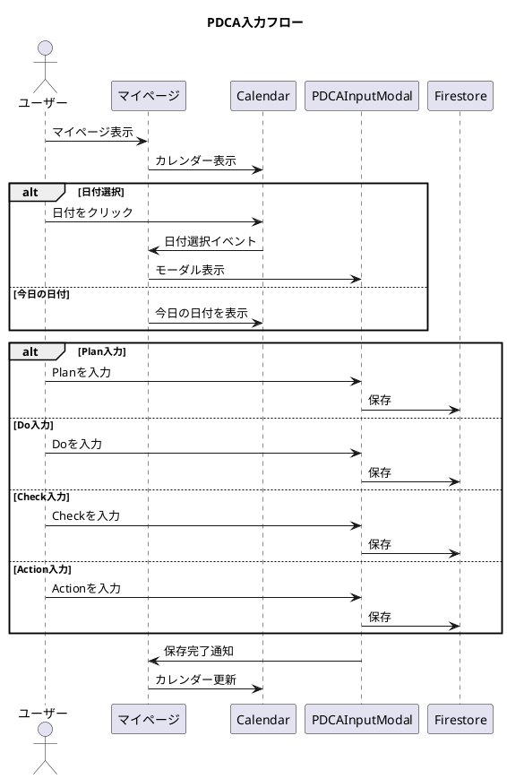
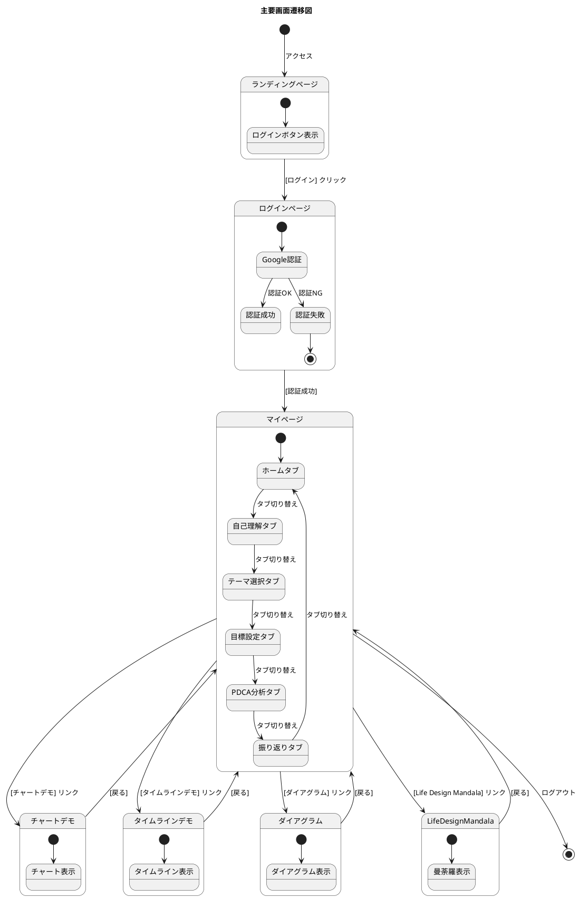
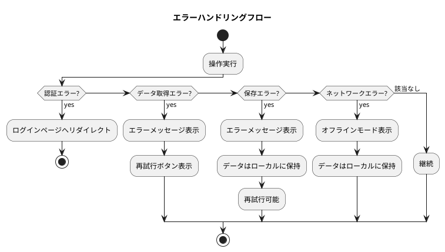

# ユーザーフロー（UML図）

## 📋 ドキュメント情報

| 項目 | 内容 |
|------|------|
| **文書名** | ユーザーフロー（UML図） |
| **バージョン** | 1.1.2 |
| **作成日** | 2024年12月27日 |
| **最終更新日** | 2025年12月27日 |

---

## 1. 全体フロー

### 1.1 メインフロー

---

## 2. 認証フロー

### 2.1 ログインフロー

---

## 3. 自己理解フロー

### 3.1 自己理解ワークフロー

---

## 4. テーマ選択フロー

### 4.1 テーマ選択プロセス

---

## 5. 目標設定フロー

### 5.1 SMART目標設定フロー

---

## 6. PDCAサイクルフロー

### 6.1 PDCA入力フロー

---

## 7. 画面遷移図

### 7.1 主要画面遷移

---

## 8. エラーフロー

### 8.1 エラーハンドリング

---

## 9. 変更履歴

| バージョン | 日付 | 変更内容 |
|-----------|------|---------|
| 1.1.2 | 2025-12-27 | シーケンス図の`endif`を`end`に修正（2.1、3.1、4.1、6.1）、1.1メインフローの進捗状況確認の条件式を修正 |
| 1.1.1 | 2025-12-27 | 1.1メインフロー・8.1エラーハンドリングのPlantUML構文修正（`else`→`elseif`、`if`/`then`にラベル追加、`alt`→`if`） |
| 1.1.0 | 2025-12-27 | 7.1主要画面遷移図をPlantUMLステート図に変換、ファイル名をUSER_FLOW_UML.mdに変更 |
| 1.0.0 | 2024-12-27 | 初版作成 |
